# 纠结于 JavaScript 中的承诺？

> 原文：<https://javascript.plainenglish.io/struggling-with-promises-in-javascript-7808ec1303cc?source=collection_archive---------2----------------------->

## 结束你的痛苦。了解如何在现有代码库中使用承诺。帮助你把握承诺的真实例子。

[📷](https://www.pexels.com/@mhmd-sedky-1725307?utm_content=attributionCopyText&utm_medium=referral&utm_source=pexels)

我见过人们在承诺中挣扎。这篇文章旨在帮助个人理解这个令人惊奇的话题。我们将努力通过现实生活中的例子来获得一个合适的关于承诺的心智模型。

> 你越是努力去理解，越是不理解任何问题。要理解，头脑必须安静。
> 
> —吉杜·克里希那穆提

你喜欢做饭吗？我不知道你怎么样，但是我喜欢烹饪。我通常自己做饭，尽管我不反对有人帮忙。

很多时候，你会发现自己在做饭的时候需要一些东西，而那该死的东西不在你的房子里，你不得不在做饭的时候让别人帮你拿。同时，你继续做你的工作！

你可能熟悉这种做事方式——在编程语言中——我们称之为 ***异步。***

在编程中我们经常异步地做事情。也就是说，我们启动了某件事，甚至在它完成之前，我们启动了另一项任务。

在 JavaScript 中，我们很大程度上依赖于异步操作——其结果我们现在还不知道，但以后会知道。

JavaScript 本身不是异步的，但是它支持异步编程。

ES6 引入了一个让处理异步任务更容易的想法: ***承诺*** 。

承诺是一个对象——最终结果的占位符。

以前并不是我们不能做异步操作。我们做到了。

我们所要做的就是以某种方式利用回调！当我们的行动失败时，当我们需要完成一项任务时，这样做是一种折磨。

承诺规范了处理 ***异步事件*** 和 ***回调*** 的方式。

# 让我们用这个小故事来理解承诺

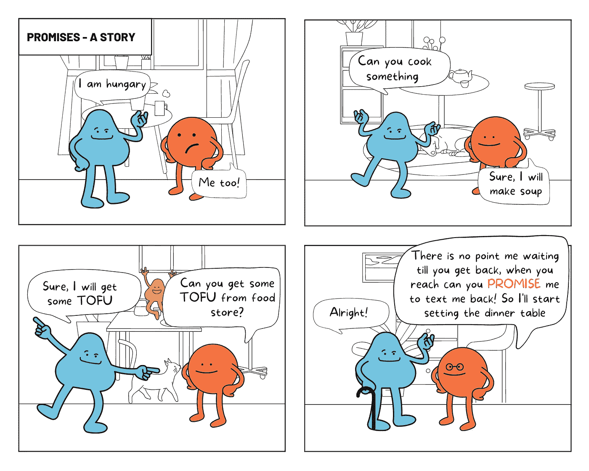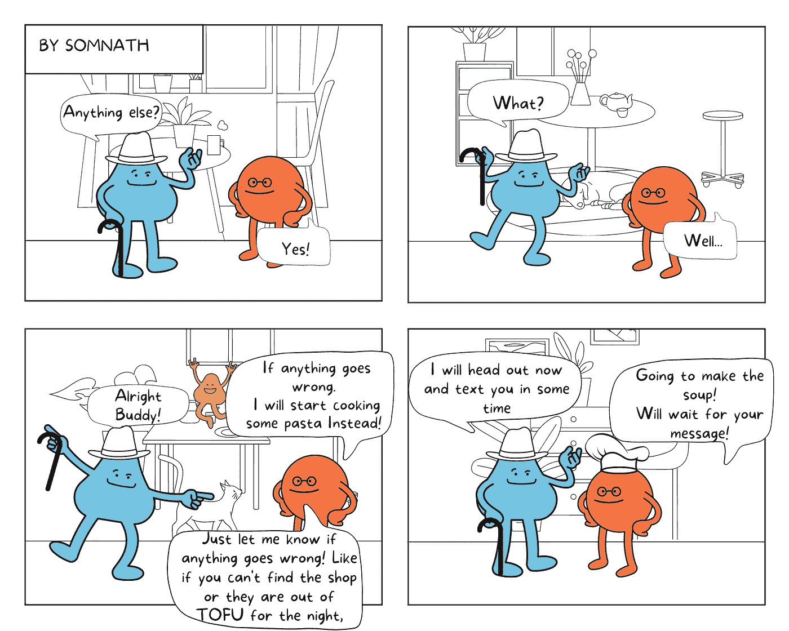

我还不是一个讲故事的大师！然而，前面的场景包含了帮助您理解承诺概念的所有必要信息。

## 让我们从中提取要点，并将其应用于 JavaScript 世界。

我们需要一个关于承诺的标准描述——没有比 MDN 更好的了。

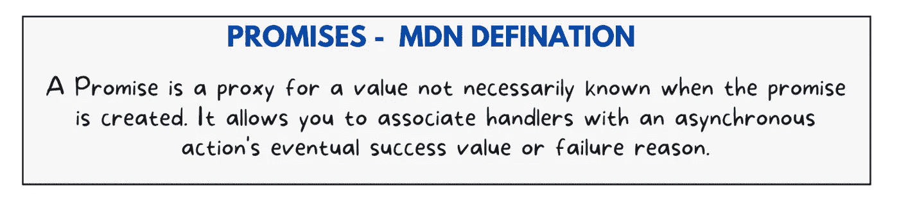

让我们看看，这个定义和我们的故事有什么关系。

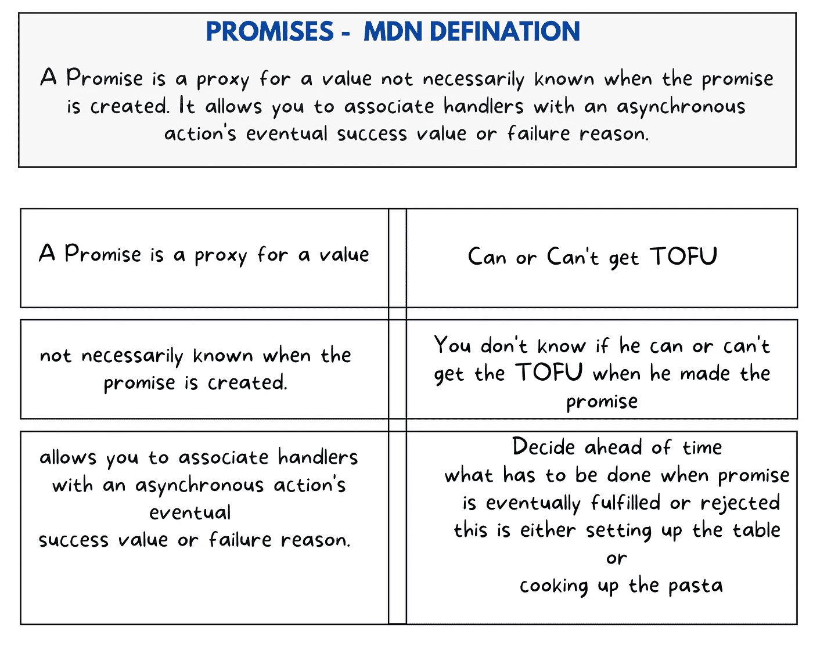

这个定义现在更有意义了！

在 JavaScript 中，一个 ***承诺*** 只是一个对象。它是一个 ***占位符*** ，代表一个我们现在没有但以后会有的值。它确保我们最终会知道异步操作的结果。

# 环境并不重要——重要的是你的存在状态——你选择了什么样的存在状态？

承诺只不过是一个对象，对象通常会保持一种状态。通过修改状态，我们在编程中完成许多复杂的任务。

承诺总是处于三种状态之一:

*   **未决:**这是初始状态——既不被满足也不被拒绝。
*   **完成:**表示操作成功完成。
*   **拒绝:**表示操作失败。

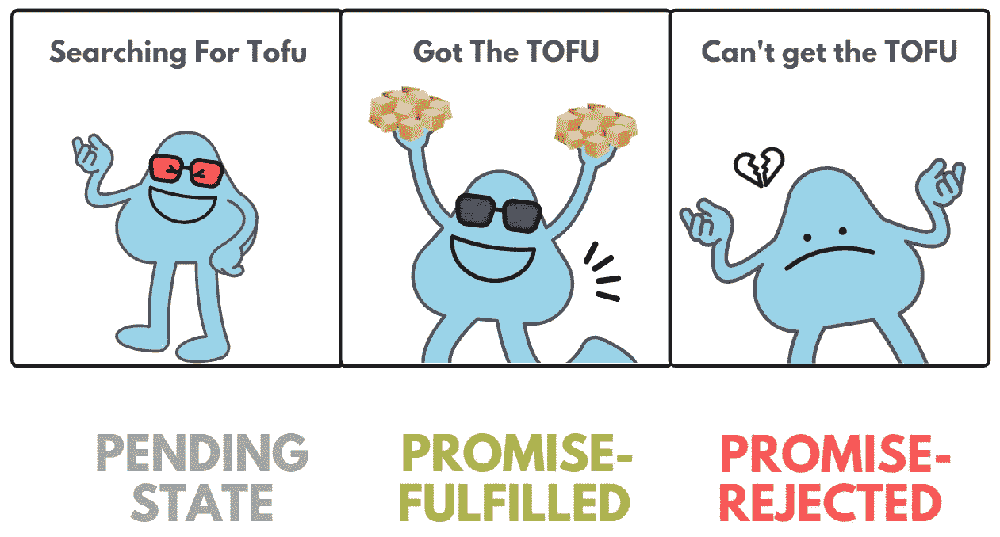

让我们在深入研究代码之前，通过将潜在的*原则与我们的故事*联系起来，建立一个强大的心智模型。

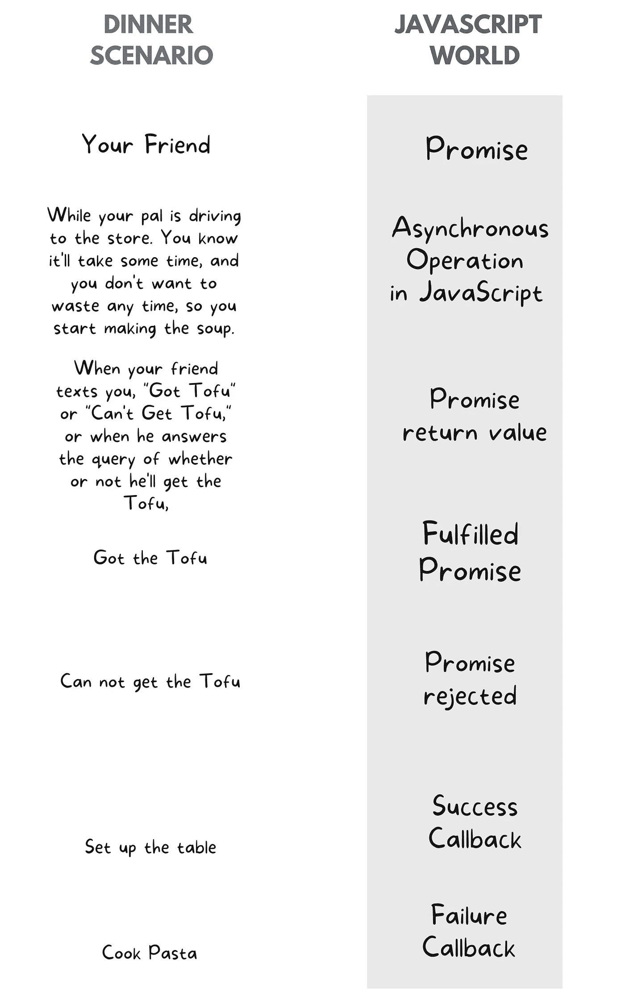

# 如何兑现承诺？

如果我们想在代码中使用 promise，那么我们必须首先理解这三个基本概念。

*   **如何创造承诺？**
*   **如何履行或拒绝承诺？**
*   **如何运行回叫功能—取决于承诺是*解决*还是*拒绝。***

> “启发我们的不是答案，而是问题。”
> 
> —欧仁·尤内斯库

如果你明白了这三点，处理承诺就会轻而易举。

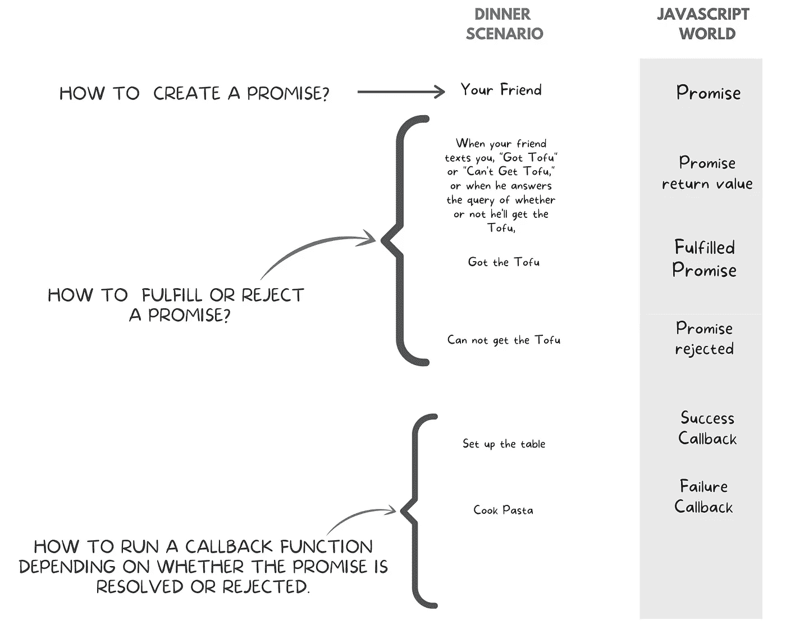

让我们分别来看看每一个。

## **如何打造**承诺**？**

我们使用带有 promise 构造函数的 [***new*** 关键字](https://miro.medium.com/max/1210/1*0wJYjMQ9uwVEYzBj89oL4A.gif)创建一个 promise 的实例。

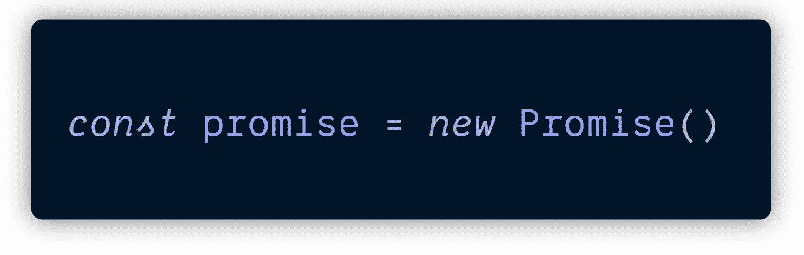

## 如何履行或拒绝承诺？

promise 构造函数接受一个函数作为它的参数——让我们传入一个箭头函数(但是我们也可以很容易地使用函数表达式)。

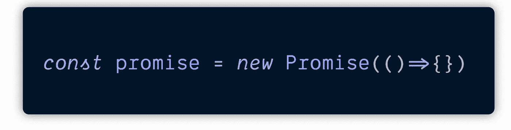

这个函数被称为 executor 函数，它自动接收两个参数`resolve`和`reject`。

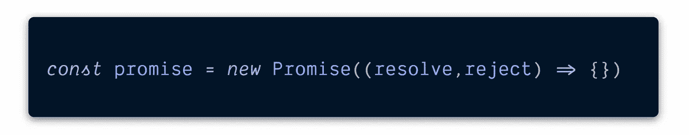

请记住— ***解决*** 和 ***拒绝*** 都是函数。

*   `resolve`是一个函数，当被调用时，将承诺的状态从待定更改为已履行。
*   `reject`是一个函数，当被调用时，将承诺的状态从待定更改为拒绝

请记住，您不能直接改变承诺的状态—您可以调用 ***resolve*** 函数来履行承诺，或者调用 ***reject*** 函数来拒绝承诺。

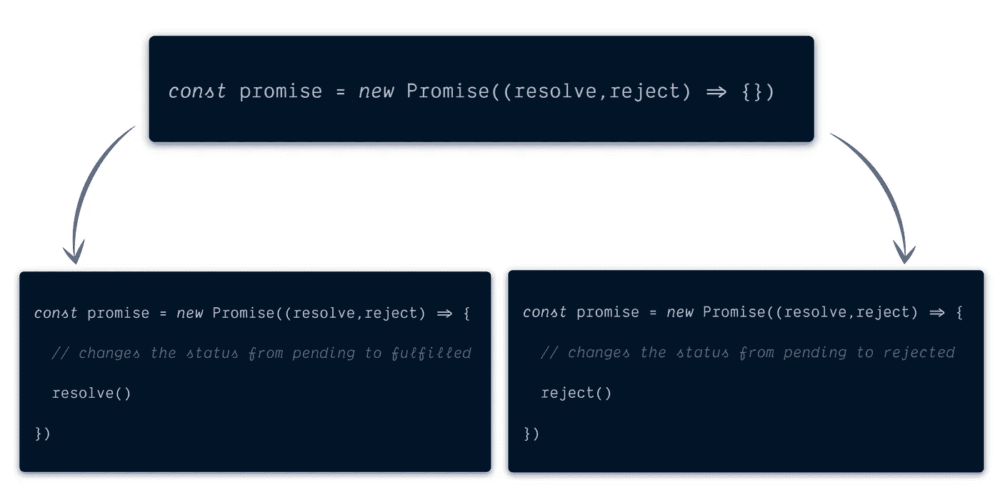

这两个函数通常在异步操作后调用。

为了简单起见，让我们用`setTimeout()`来模拟搜索豆腐所需的时间。我们假设你的朋友花了五分钟出去给你回短信。

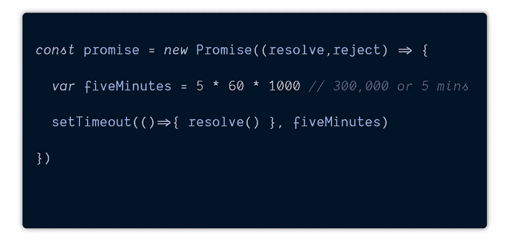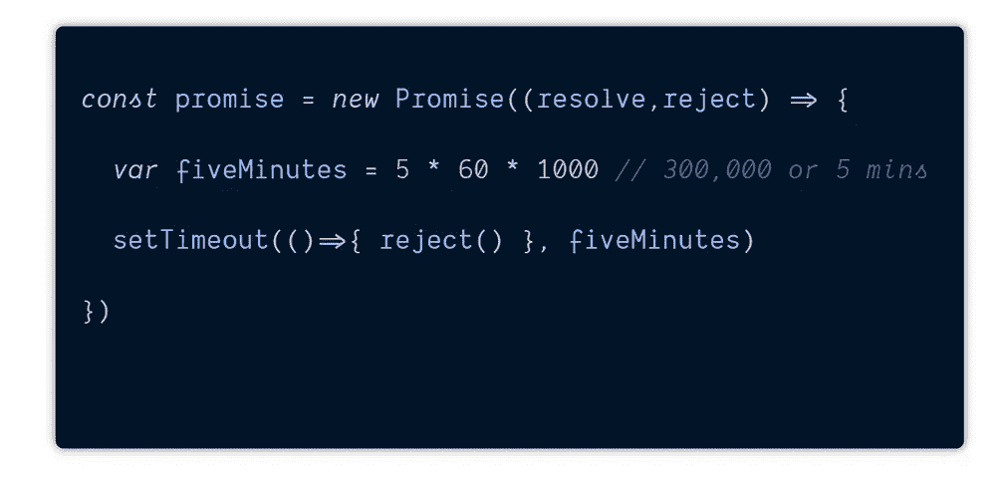

我们重构了代码，加入了`setTimeout`函数。

如果我们得到豆腐——我们会在五分钟后呼叫`resolve`,如果我们没有得到豆腐——我们会在五分钟后呼叫`reject`。

这差不多就是你履行或拒绝承诺的方式。

## **如何运行回叫功能—取决于承诺是*解决*还是*拒绝*。**

最后一步是理解如何根据承诺的状态变化执行回调函数。记住回调函数是作为参数提供给另一个函数的函数。

回调函数意味着我们将使用那个函数作为另一个函数的参数。

让我们定义两个回调函数— `onFulfilled`和`onFailure`

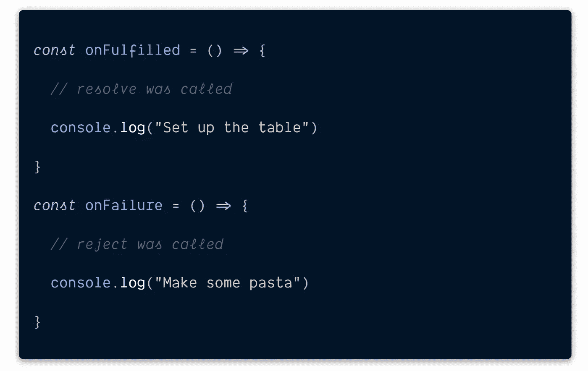

`onFulfilled()`是异步操作后调用 ***resolve*** 时要调用的函数

`onFailure()`是异步运行后调用 ***reject*** 时要调用的函数。

理想情况下，回调函数中会有更多的代码，但是我们只需登录到控制台，它就能达到目的。

回到我们的类比，如果我们找到了豆腐，那么我们的承诺就实现了——我们想摆桌子吃饭。如果他们找不到豆腐，那么我们的承诺就被拒绝了——我们必须开始煮意大利面。

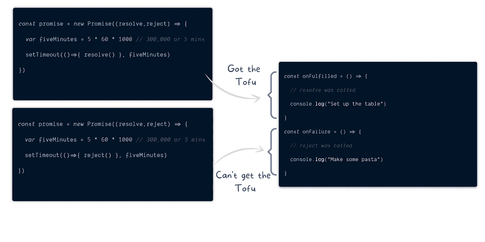

您可能想知道如何利用这两个回调函数？

当我们使用 promise 构造函数创建一个新的 promise 时，promise 对象为我们提供了两个方法— `then()`和`catch()`

我们可以用`promise.then()`和 `promise.catch()`来称呼它。

这里重要的一点是:

*   如果通过调用`resolve`函数，承诺的状态从待定变为已履行——传递给`then()`函数的函数将被自动调用
*   如果通过调用`reject`函数，承诺的状态从待定变为拒绝，则传递给`catch()`函数的函数将被自动调用

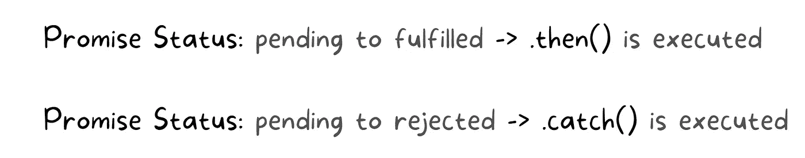

在我们的情况下，我们需要通过

*   `onFulfilled`功能至`then()`
*   `onFailure`功能至`catch()`

这两个函数都是回调函数，因为它们是作为参数提供给其他函数的。我反复提醒你这一点，因为我看到许多人害怕“回调”这个词——没什么好害怕的——它们只是常规函数。

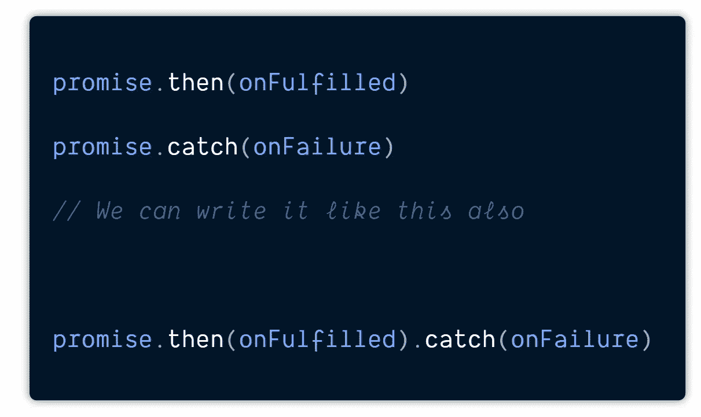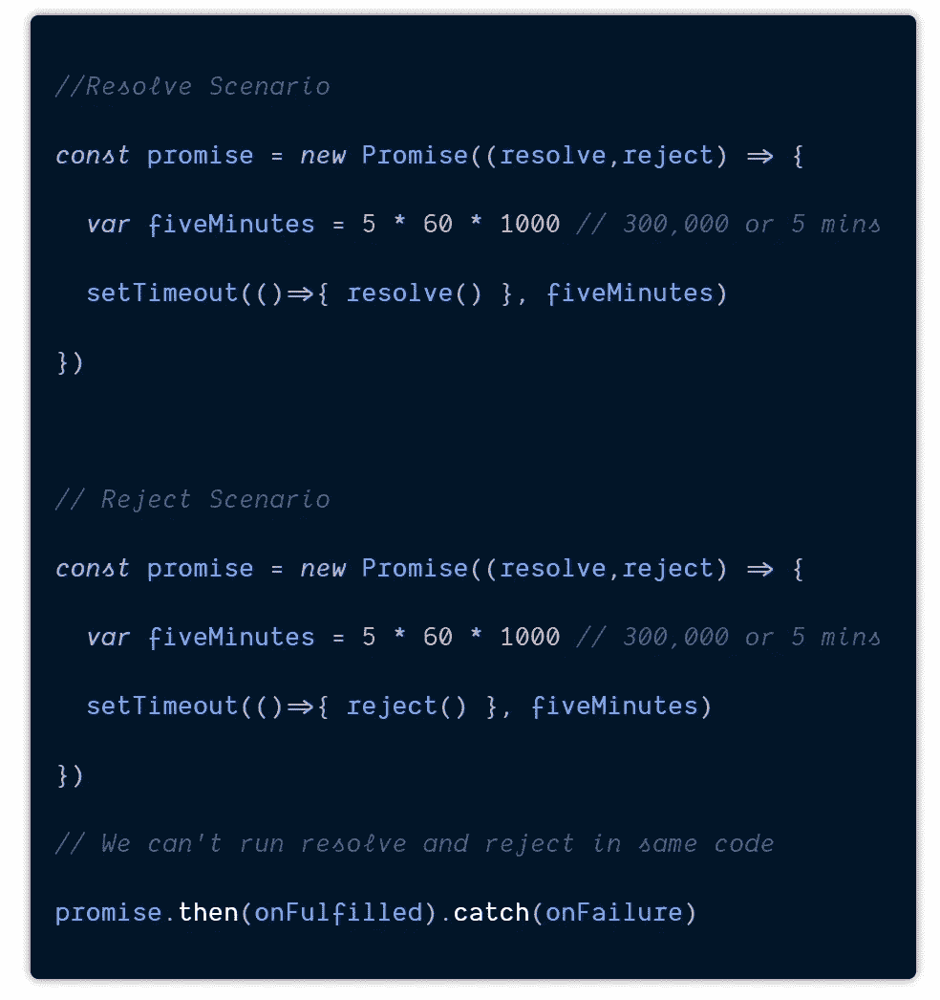

我们的 promise 代码按预期工作。但是还有提升的空间！

如果我们在 ***解析*** 或者 ***拒绝*** 一个承诺的时候想要发出一些数据怎么办？

这样，在我们的回调函数中，我们可以利用这个值做其他的事情。

事实证明，我们可以通过传递一个参数给 ***resolve*** 或 ***reject*** 来做到这一点，

*   对于 ***解析*** 函数，我们将传入一个表示`Got the Tofu`的字符串
*   对于 ***拒绝*** 函数，我们将传入一个表示 `Can’t get Tofu`的字符串

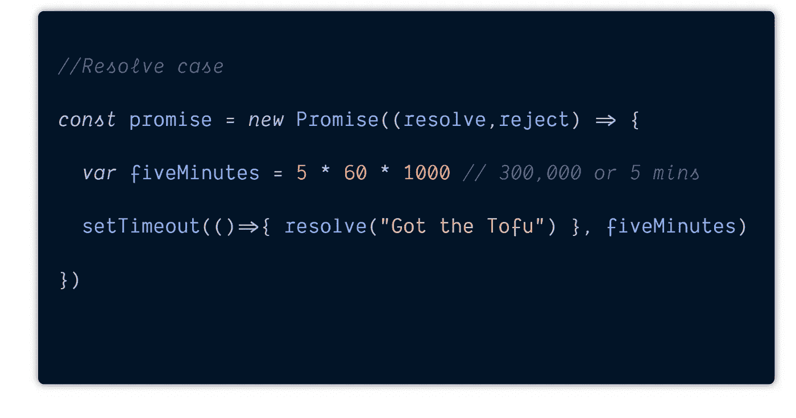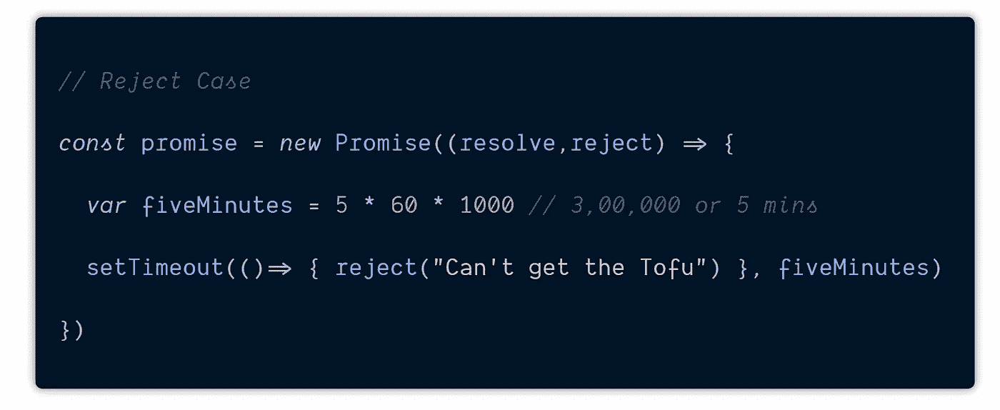

但是我们如何在回调函数中访问这些字符串呢？

好吧，承诺的伟大之处在于，它会自动将传递给 *resolve* 的参数作为`onFulfilled`回调的参数，将传递给 ***reject*** 的参数作为`onFailure`回调的参数。

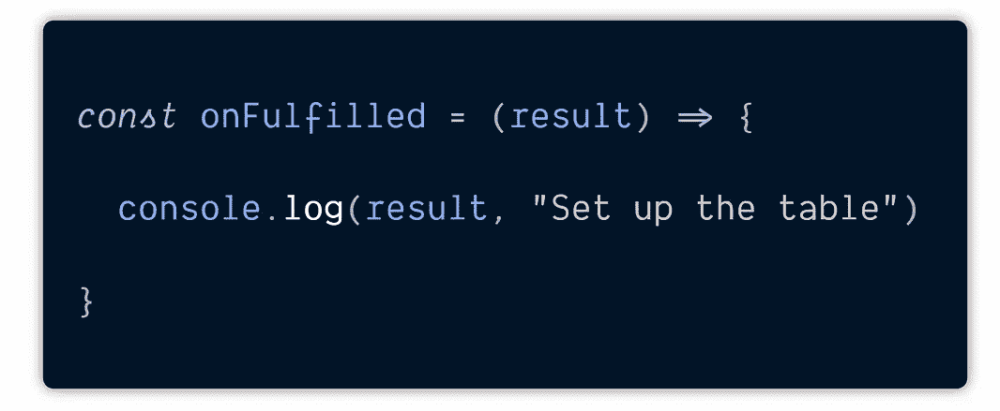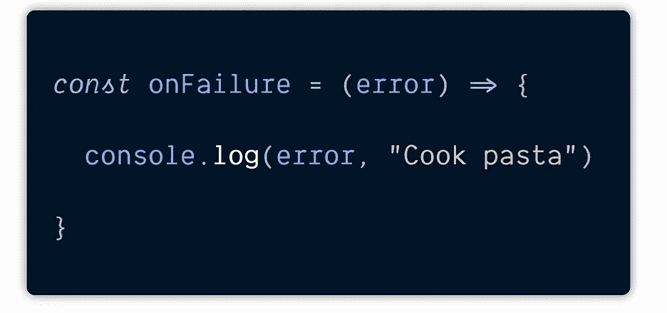

您可以看到，我在这两个回调中都包含了参数，并简单地将它们记录到控制台中。

现在，当承诺实现时，我们将看到输出`Got the Tofu Set up the table`,或者如果出现错误并因此被拒绝，我们将看到`Can't get Tofu Cook pasta.`

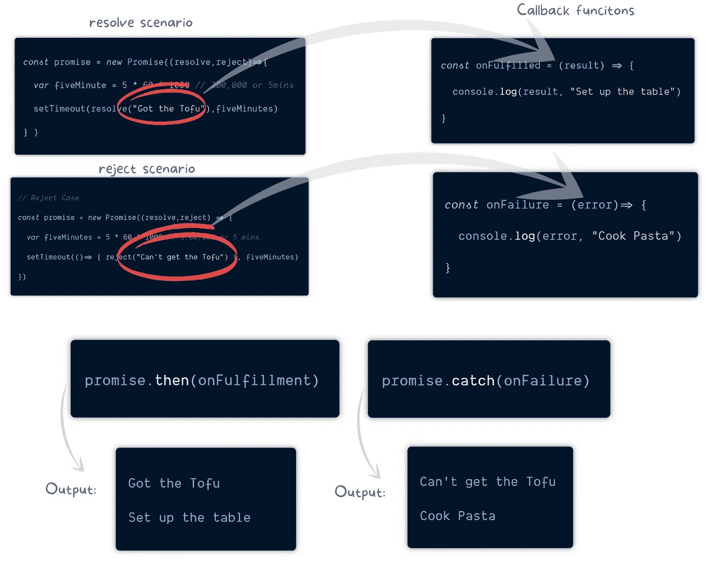

使用承诺的一个很好的例子是从服务器获取数据；我们承诺我们最终会得到数据，但总有可能会出现问题。

在实际场景中，事情会有所不同。

您的结果将是:

*   一个对象(JSON)
*   一个数组，
*   或者异步操作返回的任何其他数据类型。

这基本上是 JavaScript 中承诺的基础。我们将在下一篇文章中了解更多的细节。

> 承诺意味着一切，但一旦违背，道歉就毫无意义
> 
> —匿名

# 摘要

*   承诺是一个对象——最终结果的占位符。
*   过去，我们使用回调来执行异步操作
*   使用回调是一件痛苦的事情，尤其是当你需要处理错误的时候。
*   Promises 规范了处理异步事件和回调的方式。
*   承诺总是处于三种状态之一:待定(第一种)、履行或拒绝。
*   操作已完成，并被标记为已完成。操作被拒绝，这意味着它失败了。
*   我们使用带有承诺构造函数的 [***new*** 关键字](https://miro.medium.com/max/1210/1*0wJYjMQ9uwVEYzBj89oL4A.gif)创建一个承诺。
*   您不能直接改变承诺的状态—您可以调用 ***resolve*** 函数来履行承诺，或者调用 ***reject*** 函数来拒绝承诺。
*   我们学习了如何创建承诺，如何履行或拒绝承诺，如何运行回调函数——取决于承诺是被解决还是被拒绝。

# 感谢信

我想利用这最后的机会说声谢谢。

感谢您的光临！如果没有像你这样的人，我不可能做我现在做的事情。

我希望你能 [**加入我**](https://polymathsomnath.medium.com/subscribe) 的 [**我未来的博客文章**](https://polymathsomnath.medium.com/subscribe) 并留下来，因为我认为我们这里有一些伟大的东西。我希望在未来的许多年里，我能在你的职业生涯中帮助你！

下次见。再见！

*更多内容请看*[*plain English . io*](http://plainenglish.io/)