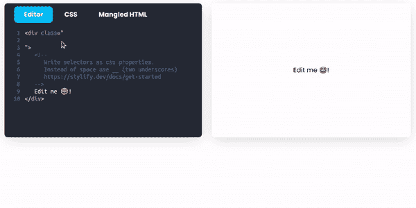
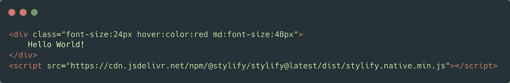
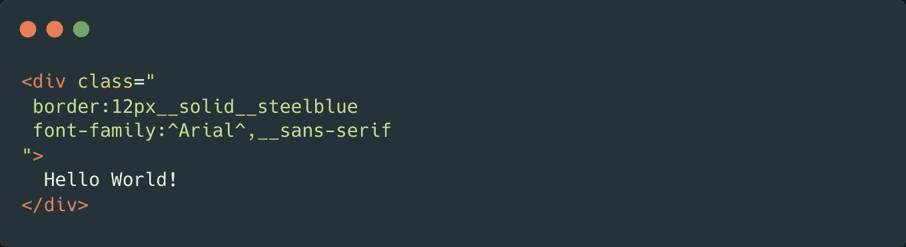
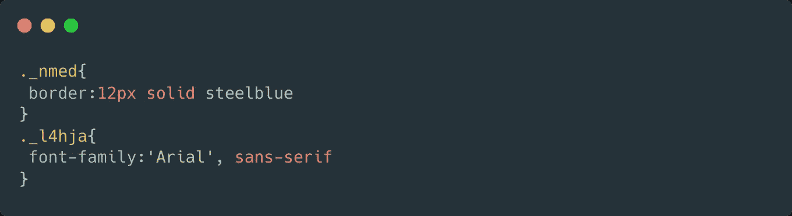

# 了解 Stylify CSS——一个用于流畅和快速 Web 开发的动态 CSS 生成器

> 原文：<https://javascript.plainenglish.io/stylify-dev-dynamic-css-generator-for-fluent-and-rapid-web-development-2d9313ff9bef?source=collection_archive---------10----------------------->

## [Stylify](https://stylifycss.com) 是一个基于你写的东西动态生成 CSS 的库。写 HTML。获取 CSS。🚀

Stylifycss.com — Live Example — CSS and Mangled HTML

# 让我给你讲个故事

最近，我一直在做多个项目。一个项目使用 Bootstrap，第二个项目使用 Tailwind，以及其他一些带有自己的实用工具和组件类的普通 CSS。

尽管这些工具很棒，方法也不“差”，但是**从头开始学习和记忆类、配置、选择器只是很烦人和费时**。窃窃私语类的 IDE 插件有时候来找我纯粹是绝望。

我问过自己很多次，**为什么没有一个框架或者库使用自然的 CSS 属性和它们的值作为选择器**，这是开发者已经知道的。是的，选择器可能会长一点，但是没有什么需要学习的。

因为我找不到，所以我创造了我自己的。

# 从想法到项目

我花了一年的时间开发，终于发布了第一个版本🎉。
[Stylify](https://stylifycss.com) 是一个自带[原生预置](https://stylifycss.com/docs/stylify/native-preset)的库，可以匹配`Chrome, Mozilla, Opera, Safari and Edge`的 **678(可能是全部)** CSS 属性。大小小于**的 28 kB** 。

语法很简单:`cssProperty:value`如果你需要屏幕和伪类`screen:pseudoClass:property:value`。

实际上，Stylify 的用法如下:

Stylify CSS — Usage example

因为一些值可以包含空格和引号，所以我决定添加一个特殊的语法。当编写一个选择器时，它的值应该包含一个空格，你可以使用`__`(两个下划线)和引号`^`(帽子)。

这允许您像这样编写选择器:

Stylify CSS — Quotes and spaces example

在编译和分解时，它会生成以下 CSS:

Stylify CSS — Generated CSS

# 其他功能

*   [**动态选择器**](https://stylifycss.com/docs/stylify/compiler#macros) :定义一个宏，然后按照你想要的方式使用`width:240px`、`width:10%`、`width:30rem`。
*   [**动态屏幕**](https://stylifycss.com/docs/stylify/compiler#logical-operands-in-screens) :你可以使用`||`和`&&` = > `sm&&tolg:font-size:48px xl&&dark:color:rgba(200,200,200,0.5)`这样的逻辑操作数组合屏幕，并使用任何你想要的值`minw123px:font-size:24px`。
*   **选择器抓取** : Stylify 可以将长选择器`transition:color__0.3s__ease-in-out`转换为`_abc123`。
*   **拆分 CSS** :可以为每个文件单独生成 CSS。由于这一点，你可以分割 CSS，例如一个页面和布局。
*   [**组件**](https://stylifycss.com/docs/stylify/compiler#components) :例如定义一个`button`，带有类似`background:#000 color:#fff padding:24px`的依赖关系，并在整个项目中使用。
*   [**变量**](https://stylifycss.com/docs/stylify/compiler#variables) :为重复值定义变量。它们可以作为 CSS 变量注入到代码中。
*   [**普通选择器**](https://stylifycss.com/docs/stylify/compiler#plainselectors) :这允许你像`article > h1`一样样式化选择器。
*   [**助手**](https://stylifycss.com/docs/stylify/compiler#helpers) :可以在生成 CSS 时使用，例如重新计算单位等。

# 无缝集成

Stylify 可以轻松集成到类似 [Next.js](https://stylifycss.com/docs/integrations/nextjs) 、 [Nuxt.js](https://stylifycss.com/docs/integrations/nuxtjs) 、 [Vite.js](https://stylifycss.com/docs/integrations/vitejs) 、 [Symfony 框架](https://stylifycss.com/docs/integrations/symfony)、 [Nette 框架](https://stylifycss.com/docs/integrations/nette)、 [Laravel](https://stylifycss.com/docs/integrations/laravel) 等框架中。此外，它与 [Webpack](https://stylifycss.com/docs/integrations/webpack) 和 [Rollup.js](https://stylifycss.com/docs/integrations/rollupjs) 配合使用效果很好。

为了更容易集成，Nuxt.js 有一个 [@stylify/nuxt-module](https://stylifycss.com/docs/nuxt-module) (针对版本 2)和 [@stylify/nuxt](https://stylifycss.com/docs/nuxt) (针对版本 3+)以及一个 [@stylify/bundler](https://stylifycss.com/docs/bundler/installation-and-usage) ，可以与已经提到的 Rollup.js 和 Webpack 或任何其他工具一起使用。

当集成到现有项目中时，可以单独为每个页面生成 CSS(即使是小组件)并且[慢慢重写网站](https://stylifycss.com/docs/get-started/migrating-to-stylify)而不增加其大小或破坏任何东西。

# 让我知道你的想法！

如果你尝试 Stylify，并让我知道任何(正面和负面)的反馈或想法，让 Stylify 变得更好，从而对开发人员的下一个项目更有用，我将非常高兴🙂。

*更多内容请看*[***plain English . io***](http://plainenglish.io/)*。报名参加我们的* [***免费周报***](http://newsletter.plainenglish.io/) *。在我们的* [***社区***](https://discord.gg/GtDtUAvyhW) *获得独家获得写作机会和建议。*