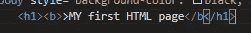

# 简单 HTML 页面的样式

> 原文：<https://javascript.plainenglish.io/styling-the-simple-html-page-b42c51b1aee2?source=collection_archive---------12----------------------->


Photo by [Florian Olivo](https://unsplash.com/@florianolv?utm_source=medium&utm_medium=referral) on [Unsplash](https://unsplash.com?utm_source=medium&utm_medium=referral)

## 在这里，我们将讨论如何让我们的 HTML 看起来更好。这包括给我们在上一篇文章[](https://medium.com/@akandeolalekantoheeb9/a-simple-html-page-for-beginners-bb22980134e3)****中处理过的 HTML 页面添加样式和其他一些属性。本文基本分为以下四个主要部分:****

*   ****HTML 样式****
*   ****HTML 格式****
*   ****HTML 语录****
*   ****HTML 注释****

**在这一部分结束时，我们应该能够使我们的 ***HTML*** 页面对访问我们页面的每个人来说都是漂亮和引人注目的。虽然要完全实现样式，我们需要 ***CSS(层叠样式表)*** 的知识，但这将在以后讨论。**

# **HTML 样式**

**一个 ***HTML*** 元素的样式可以通过使用 style 属性来完成。HTML 样式属性。HTML 样式属性具有以下语法:**

```
<tag-name style = “property : value;”>
```

**该属性是一个***CSS****p*属性。该值是一个 CSS 值。**

****注意:**使用 VS 代码编辑器，一旦输入了样式属性，就会自动显示属性和值。**

****样式属性****

**这里我们讨论样式属性的几个特性，比如:**

1.  **背景颜色**
2.  **文本颜色**
3.  **字体**
4.  **文本大小和**
5.  **文本对齐**

**更多样式属性将在后面的 CSS 中讨论。**

## ****背景色****

**背景色属性定义了一个 ***HTML 元素的背景色。*** 该属性被插入到元素的开始标记中以改变该元素的背景颜色。**

**以下是一些例子:**

****

**This changes the background color of the HTML page**

****

**This changes the background color the H1 element**

****

**output**

**在上面的例子中，style 属性被输入到要设置样式的首选元素中，结果就在它的下面。**

## **文本颜色**

*****颜色*** 属性定义了 ***HTML 元素的文本颜色。*** 像其他任何样式属性一样，它是在元素的开始标签中输入的。这里有一个例子:**

****

**Input**

****

**output**

## **元素现在在 ***红色*** 中，而< p >元素现在在 ***绿色*** 中**

## **字体**

**font-family 属性定义用于 HTML 元素的字体。文本以不同的方式出现在我们的屏幕上，因为它们被写入了一些文本属性，这些属性被嵌入到它们的各种元素的开始标签中。这里有一个例子:**

****

**input**

****

**output**

**请注意第二行和第三行之间的字体差异。**

## **字体大小**

***属性定义了一个 ***HTML 元素的文本大小。*** 与文字的增减有关。它由许多值定义，如百分比值(%)、像素(px)等等。这里有一个例子:***

******

***Input***

******

***Output***

***请注意本页文本大小的变化***

## ***文本对齐***

******text-align*** 属性定义了 ***HTML 元素的文本位置。*** 它主要用于改变文本的位置。默认位置是左，因此该属性用于将位置更改为居中或向右。这里有一个例子:***

******

***Input***

******

***Output***

***注意位置的变化。***

*****注意:*****text-align***属性除了左右值还有其他值。它们将在 ***CSS*** 方面充分讨论。***

# ***HTML 格式***

***格式化元素用于定义具有特殊含义的文本。浏览器将文本显示为重要。在这里，我将解释一些元素的含义以及它们是如何被使用的。***

*   *****-粗体文本*****
*   *****-重要文本*****
*   ****-斜体文本****
*   ****-强调文本****
*   ***-标记文本***
*   ***-小文字***
*   ***~~-删除文本~~***

*   ***[-下标文本]***
*   ***^(-上标文字)***

*****上述格式元素的应用*****

*   *****粗体文本** - HTML < b >元素定义粗体文本，没有任何强重要性。***

***示例:***

******

***we can see the <b> element has been added to the text “My first HTML page”***

******

***we can see from the output that the text is now bold***

*   *****重要文本** - HTML < strong >元素定义了强文本，具有很强的重要性。该应用程序就像上面的粗体文本示例一样，但是使用了< strong >元素，而不是带有所需文本的< b >元素。***
*   *****斜体文本** - HTML < i >元素定义斜体文本，没有任何强/额外的重要性。该应用程序就像上面的粗体文本示例一样，但是使用了< i >元素，而不是带有所需文本的< b >元素。***
*   *****强调文本** - HTML < em >元素定义强调文本，具有重要性。该应用程序就像上面的粗体文本示例一样，但是使用了< em >元素而不是< b >元素来显示您想要的文本。***

*****注**:浏览器将< strong >显示为< b >，将< em >显示为< i >，但如上所述，它们具有不同的含义***

*   *****标记文本** -这也意味着高亮文本。HTML < mark >元素定义了被标记的文本。该应用程序就像上面的粗体文本示例一样，但是使用了<标记>元素，而不是带有所需文本的< b >元素。***
*   ***小文本-HTML<小>元素定义了更小的文本。该应用程序就像上面的粗体文本示例一样，但是使用了小的<元素，而不是带有所需文本的< b >元素。***
*   *****删除文本** -这也意味着删除文本。元素定义了被删除的文本。该应用程序就像上面的粗体文本示例一样，但是使用了< del >元素，而不是< b >元素来显示您想要的文本。***
*   *****插入文本** -这也意味着添加文本。HTML < ins >元素定义插入文本。该应用程序就像上面的粗体文本示例一样，但是使用了< ins >元素，而不是带有您想要的文本的< b >元素。***
*   ***下标文本 - HTML < sub >元素定义了下标文本。该应用程序就像上面的粗体文本示例一样，但是使用了< sub >元素，而不是带有所需文本的< b >元素。***
*   ***元素定义了上标文本。该应用程序就像上面的粗体文本示例一样，但是使用了^(元素而不是**元素来显示您想要的文本。**)***

# ***HTML 报价***

***这用于标记元素。 ***HTML < q >元素*** 定义了一个短引号。浏览器通常会在< q >元素周围标明引号。***

***示例:***

******

***input***

******

***output***

***HTML 引用在使用时可以分为四个基本方面。这些是:-***

*   ***引用***
*   ***缩写***
*   ***联系信息***
*   ***双向超越***

# ***HTML 块引用***

******HTML<block quote>***定义了一个从另一个源引用的引用。浏览器会自动缩进 blockquote 元素的文本。例子:_***

******

***input***

******

***output***

***文本会自动缩进。***

# ***HTML 缩写***

******HTML <缩写>*** 用于缩写或首字母缩写词。它也用于为浏览器、翻译系统和搜索引擎提供有用的信息。示例:***

******

***input***

******

***output***

***缩写下面有一条虚线，它的意思嵌在标题部分。这给了浏览器更多关于缩写的信息。***

# ***HTML 联系信息***

******HTML<address>***元素定义了一个文档或一篇文章的联系信息(作者/所有者)，就像互联网上大多数页面的底部所指示的那样。它通常以斜体显示。在每一个有意义的内容输入之前和之后添加一个换行符。参见示例-***

******

***input***

******

***output***

## ***研究这个例子，看看它是如何工作的***

# ***双向超越***

***元素的作用是实现文本输入的双向覆盖。使用 ***< bdo >*** 功能，可以将默认从左向右书写的文本更改为从右向左书写。示例:-***

******

***input***

******

***output***

*****注:*****dir = " RTL "***表示方向=从右向左。***

# ***HTML 注释***

***使用以下语法将注释添加到 ***HTML*** 源中:***

******！———在这里写下你的评论———>******

***注意:***

***1.有一个惊叹号 ***(!)在开始标记中，*、**却不在结束标记中。***

***2.浏览器不显示注释，但是注释可以帮助文档化 ***HTML 源代码。******

***3.注释也用于在您的 ***HTML 中放置通知和提醒。******

***示例:***

******

***input***

******

***output***

***注释对于调试 ***HTML*** *也很有用，因为你可以一次注释掉* **HTML 行代码、** *行代码来查找错误。****

***这是关于如何设计一个简单的 ***HTML 页面的样式。*** 更多的将在我们的***【CSS(层叠样式表)*** 部分进行强调。***

***感谢阅读。***

***请随时在以下社交媒体上联系我:[推特](https://mobile.twitter.com/AkandeO08920463)、[脸书](https://www.facebook.com/akande.olalekan.1238)、 [Instagram](https://www.instagram.com/muh_toyyib_0/) 或 [WhatsApp](https://wa.me/message/BUW6NXAJ2A3HA1) 。***

****更多内容请看*[***plain English . io***](http://plainenglish.io/)*。报名参加我们的* [***免费每周简讯***](http://newsletter.plainenglish.io/) *。在我们的* [***社区不和谐***](https://discord.gg/GtDtUAvyhW) *获得独家获得写作机会和建议。****