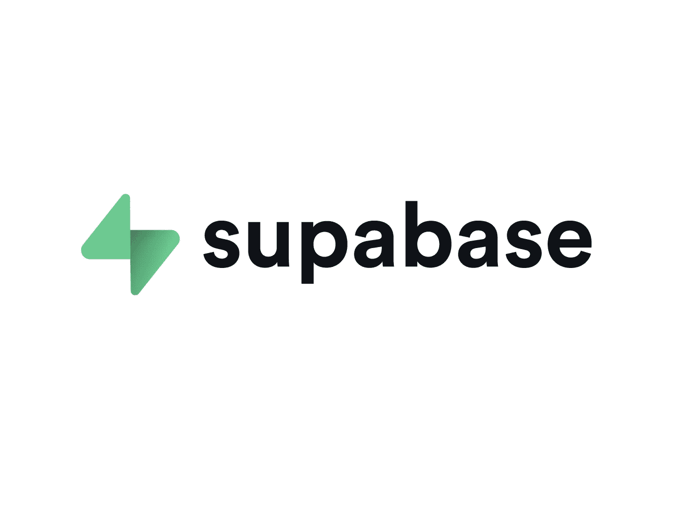
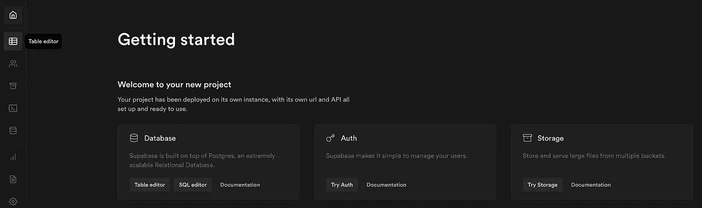
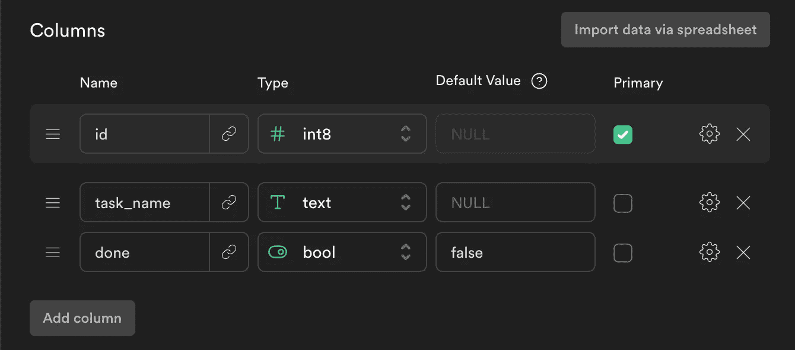
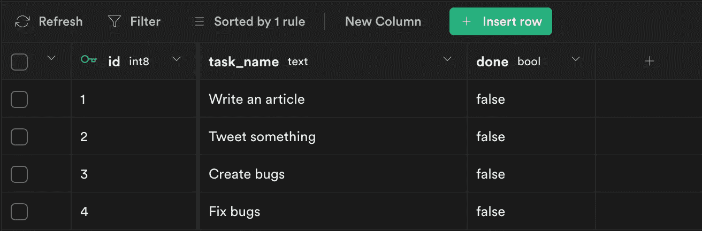

# 用简单的 Firebase 替代品 Supabase 构建待办事项数据库

> 原文：<https://javascript.plainenglish.io/supabase-database-96e047b13bd1?source=collection_archive---------3----------------------->

## 对于浏览器或 Node.js



像 Firebase 这样的开发平台越来越受欢迎。通过提供无服务器托管、可扩展的数据库和其他功能(如身份验证),开发应用程序变得更加容易。虽然 Firebase 在市场上占有很大的份额，但替代产品也在不断增加。其中一个:Supabase(不，我没打错)。

该平台声称是 Firebase 的替代品。实际上，到目前为止我很喜欢。虽然它提供的功能不如 Firebase 多，但它已经提供了一些重要的功能:存储、认证和数据库(这是我最喜欢的)。

我们将使用 Node.js 构建一个小型待办事项列表数据库示例。重点不是创建一个完整的应用程序，而是构建基本的功能—获取数据、添加数据和更新数据。因为老实说，这就是你在这里的原因。

当然，这个数据库是由 Supabase 托管的，并且在幕后使用 Postgres。您也可以为浏览器构建此示例；Supabase 支持这两种选项。此外，你不需要创建一个付费账户。让我们看看 Supabase 能做什么。

## Supabase 入门

第一步是创建一个账户——我在 [supabase.io](https://supabase.io/) 上连接了我的 GitHub 账户。然后，您可以创建一个新项目。应该要求您输入名称、数据库密码和要选择的地区。一旦您选择了这些数据，您将被带到包含您的 API 密钥和项目 URL 的页面。

对于我们的项目，我们只需要公共 API 键(向您显示的第一个可见键)和页面末尾“Config”部分中的 URL。URL 应该类似于`xyz.supabase.co`。

当你把两个值都保存在某个地方，我们就可以进入下一个点。初始化完成后，您可以选择页面上可见的“表格编辑器”。

或者，您可以通过左侧的图标导航到该位置，下图中突出显示了该图标。



我们将在那里摆桌子。

创建表格非常简单。如果您想知道默认字段在哪里，我已经删除了它们。我添加了两列，“done”，这是一个布尔值，和“task_name”，这是一个数据类型“text”。此外,“done”列包含一个默认值。就像这样复制设置你的表:



一旦表被初始化，我们可以手动添加条目。默认情况下，在创建表之后，您应该被发送到表编辑器。现在，我插入了一些行(通过点击“插入行”):



现在，让我们开始用代码接触这个数据库。首先，确保在 Node.js 或浏览器中安装必要的包:

```
npm install @supabase/supabase-js
```

正如我在开始时告诉你的，你需要你的 API 密匙和你的项目 URL。

```
const { createClient } = require('@supabase/supabase-js')const supabase = createClient(
  '<Your-Project-URL>',
  '<Your-API-Key>'
)
```

因为我在 Node.js 中，所以我使用 require-语法来导入包。该包还支持在浏览器中使用——当使用 bundler 时，将 require-语法转换为 import-语法。

## 从数据库获取数据

一旦 Supabase 客户端运行并且实例保存在`supabase`变量中，我们就可以开始了。因为我们的表被命名为“todos ”,所以让我们从获取它的所有条目开始:

结果，我们在控制台中得到一个对象数组。这个数组包含了我们所有的待办事项，这在处理待办事项列表时是不必要的。实际上，我们只对 todos 感兴趣，这些还没有完成。因为默认情况下，我们所有的 todo 都没有完成(在 DB 中“done”是假的)，所以让我们将一个 todo 设置为 done。这就要求我们，更新一个字段。

## 更新数据库中的字段

我再次为此创建了一个函数。它返回一个承诺，允许我们访问包含更新值的字段。如你所见，Supabase 允许我们将 SQL 代码组织成函数调用。选择表后，我们运行 UPDATE 语句，默认情况下，该语句针对所有表行。然后，我们运行 MATCH 语句，将 task_name 为“Create bugs”的条目作为目标。

**重要提示:**如果您的数据库中没有任何匹配项，即使您提供了实际的 task_name，也可能是因为空格。不知何故，当在 Supabase 编辑器中将数据填充到行中时，一些字符串在末尾插入了空格。这可能就是问题所在。

## 基于标准选择数据

现在，我们更新了一个待办事项。因为我们只关心那些还没有完成的任务，所以我们来过滤一下。通过 SELECT，我们指定我们想要的列——我们只关心任务的名称。然后，我们用 EQUALS 语句将所有带有“done”的条目设为“false”。

## 插入新的待办事项

同样，异步函数——控制台日志为我们提供了控制台中插入的字段。

因为表中唯一的非默认列是“done ”,但是有一个默认值，所以我们只定义任务名称的值。

这就是与 Supabase 合作有多容易。

感谢您的阅读！
您是否喜欢我只展示重要功能而不是构建一个完整的应用程序的选择？我希望听到您的反馈！

## [在 Twitter 上与我联系，了解最新消息](https://twitter.com/louispetrik)

*更多内容请看*[***plain English . io***](http://plainenglish.io/)