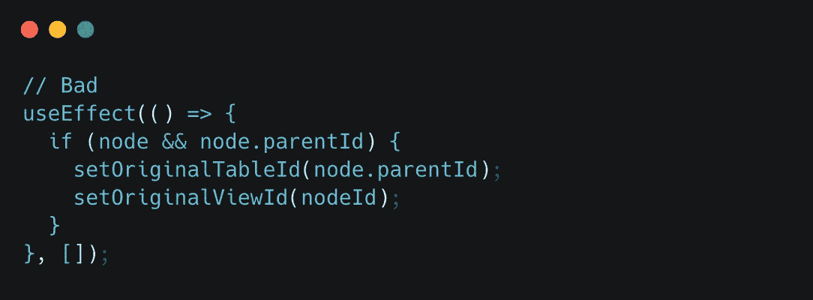
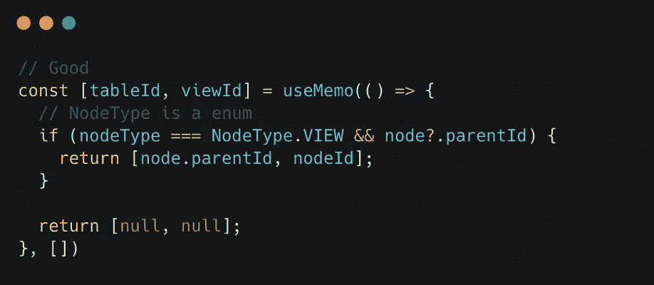
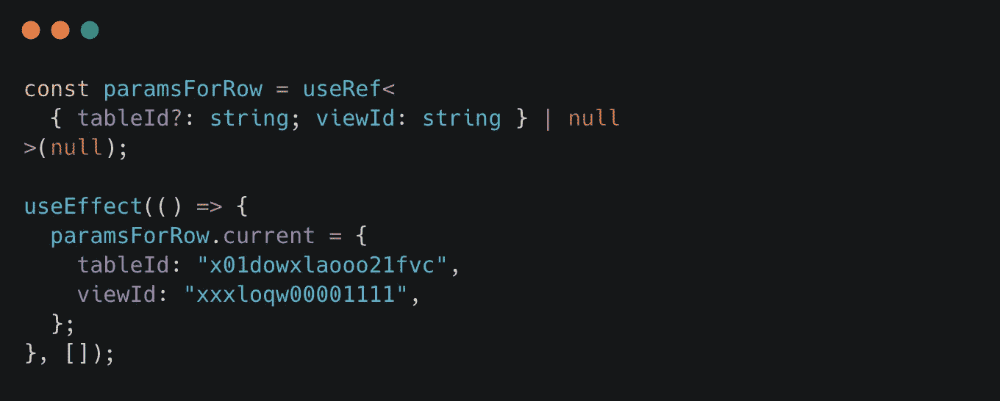

# 极其有用的打字和反应技能

> 原文：<https://javascript.plainenglish.io/super-useful-typescript-skills-eb35d049fdbd?source=collection_archive---------5----------------------->

涉及 React 性能优化、堆栈溢出、钩子使用规范等。

Photo by [Lautaro Andreani](https://unsplash.com/@lautaroandreani?utm_source=medium&utm_medium=referral) on [Unsplash](https://unsplash.com?utm_source=medium&utm_medium=referral)

# **1。正确定义用户类型**

# **2。从外部库获得未曝光的道具**

我们在第三方组件库中经常会遇到这样的场景。幸运的是，React 提供了一种类型来处理这种情况。

# 3.针对一次性状态进行优化

如果某个状态只使用一次，可以使用 [useMemo](https://reactjs.org/docs/hooks-reference.html#usememo) 进行优化，以节省无用的重新渲染

Compare two ways

> 或者你也可以使用 [useRef](https://reactjs.org/docs/hooks-reference.html#useref) ，同上

using useRef to save useless re-render

# 4.使用效果清理工作

*   清理*设置超时/设置间隔*

> 清除卸载组件时未停止的异步请求所导致的内存泄漏。
> 
> 这里有两种更好的方法可以实现

1.  使用 Axios 的 CancelToken 属性

2.使用 AbortController(不支持 IE)，*`***AbortController***`*接口代表一个控制器对象，允许您在需要时中止一个或多个 Web 请求。(引用自*[*MDN*](https://developer.mozilla.org/en-US/docs/Web/API/AbortController)*)**

*   *更改 DOM 后重置它*

## *了解更多信息*

* [## abort controller-Web API | MDN

### AbortController 接口代表一个控制器对象，它允许您中止一个或多个 Web 请求，如和…

developer.mozilla.org](https://developer.mozilla.org/en-US/docs/Web/API/AbortController) 

*更多内容请看* [***说白了就是***](http://plainenglish.io/) *。报名参加我们的* [***免费每周简讯***](http://newsletter.plainenglish.io/) *。在我们的* [***社区不和谐***](https://discord.gg/GtDtUAvyhW) *获取独家写作机会和建议。**