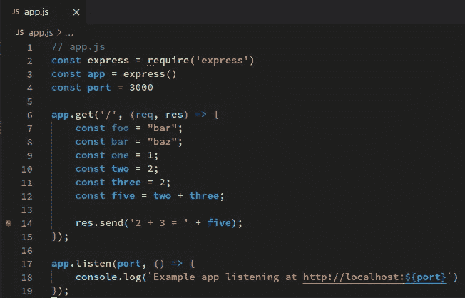
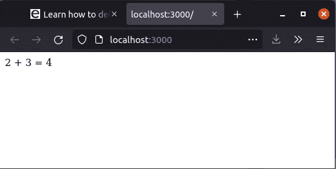
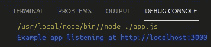
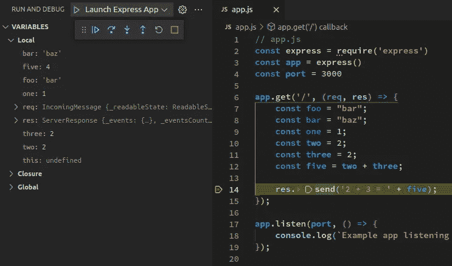
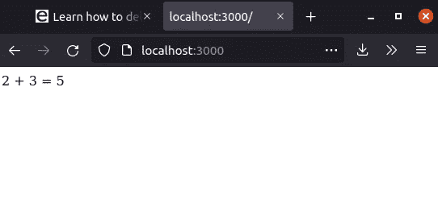
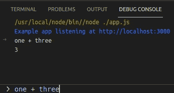

# 通过调试提高 Node.js 的生产力

> 原文：<https://javascript.plainenglish.io/supercharge-your-node-productivity-with-debugging-781686ac830f?source=collection_archive---------7----------------------->



*By* [*罗比*](https://expose.sh/blog/2021/11/17/learn-how-to-debug-node-express-with-vscode/#)*| 2021 年 11 月 17 日*

## 介绍

本教程将向您展示如何使用 Visual Studio 代码调试 Node.js Express 应用程序。您不需要成为节点专家来进行调试，只需要初级水平的知识即可。

## 为什么你应该使用真正的调试器而不是`console.log()`

当我还是一名中级工程师时，学习如何使用调试器大大提高了我的工作效率。我可以在几个小时内完成可能需要一天才能完成的工作。修复 bug 和增加功能要容易得多。

我发现在探索不是我写的不熟悉的代码库时，调试特别有用。你可以很容易地看到用奇怪的方式编写的最复杂的逻辑的结果。当您可以一行一行地运行它并观察事情如何变化时，推理出复杂、令人费解的逻辑会容易得多。

如果您曾经使用过`console.log()`将一个值打印到控制台，您可能会知道如果您试图调试一些复杂的东西，它会变得多么乏味。它一次打印一个值，你需要为你想看到的每个值写一个新的`console.log()`语句。如果您正在查看的值发生变化，您需要再次`console.log()`它。有点像蒙着眼睛或者在黑暗中瞎逛。

对于真正的调试器来说，这些都是不必要的。在代码中设置断点，然后运行应用程序。当您的应用程序到达您设置断点的那一行时，您将能够在 debug 选项卡中看到范围内的所有变量。只需一个操作，您现在就可以看到所有内容，而不是一次只看到一个值。

我开始只是调试我自己的应用程序代码，但随着时间的推移，我变得更资深，我发现我可以通过调试框架代码(如`Express`本身的代码)获得很大的洞察力。我能够找到文档中没有列出的问题的答案。

## 先决条件

对于本指南，您需要安装 [Visual Studio 代码](https://code.visualstudio.com)和 [Node.js](https://nodejs.org) 。如果你想用一个公共 URL 运行和调试你的应用，而不仅仅是用`localhost`，你还需要 [expose.sh](https://expose.sh/install?utm_source=expose.sh&utm_campaign=debugNodeExpressVscode) 。

## 快速应用示例

我推荐使用我的 Express example 应用程序，完整的代码如下所示

```
// app.js
const express = require('express');
const app = express();
const port = 3000;app.get('/', (req, res) => {
    const foo = "bar";
    const bar = "baz";
    const one = 1;
    const two = 2;
    const three = 2;
    const five = two + three; res.send('2 + 3 = ' + five);
});app.listen(port, () => {
    console.log(`Example app listening at http://localhost:${port}`)
});
```

在您的设备上创建一个新文件夹，然后将这段代码复制并粘贴到一个名为`app.js`的文件中。

使用`npm init`设置您的项目，然后按照提示进行操作。

然后运行`npm install --save express`来安装`Express`依赖项。

你可以用`node app.js`运行代码。在浏览器中点击 [http://localhost:3000](http://localhost:3000) ，您会立即看到这段代码有一个错误，因为输出不正确。



但是先别修。你可以看看这些数字，然后在心里想出问题出在哪里。相反，我们将使用调试来使发现问题变得非常容易，从而节省您的大脑。

首先，您需要设置 Visual Studio Code (VSCode)，这是微软的一个开源 IDE。如果你还没有，从 code.visualstudio.com 那里拿一本免费的。有针对 Linux、Mac 和 Windows 的版本。

## 设置 VSCode

VSCode 是最容易设置调试的 ide 之一，因为它由一个简单的配置文件控制。这意味着您可以像这样从一个指南中复制并粘贴配置，而不需要手动设置或像在其他 ide 中那样点击许多设置。

创建名为`.vscode`的文件夹

然后创建文件`.vscode/launch.json`并粘贴这些内容:

```
// .vscode/launch.json
{
    "version": "0.2.0",
    "configurations": [
        {
            "name": "Launch Express App",
            "program": "${workspaceFolder}/app.js",
            "request": "launch",
            "skipFiles": [
                "<node_internals>/**"
            ],
            "type": "pwa-node"
        }
    ]
}
```

## 设置断点

断点是您在代码中设置的希望应用程序暂停的位置，这样您就可以检查局部变量和应用程序的一般状态。在 VSCode 中，断点由您希望应用程序暂停的行号左侧的红点表示。只需单击行号左侧的区域即可设置断点。

我们可以看到有些数字添加错误，所以通过点击行号左侧的区域，在`res.send('2 + 3 = ' + five)`行设置一个断点。在你点击的地方应该会出现一个红点，就像下面第 14 行的红点一样:


我们想弄清楚为什么`five`的值是`4`而不是`5`，就像它应该的那样。

## 通过调试启动应用程序

单击 VSCode 窗口左侧的调试图标，打开“运行和调试”窗格。看起来是这样的:


你会明白的


在左窗格的顶部。

单击“启动快速应用程序”左侧的绿色小箭头图标。

您的 Express 应用程序现在将在 VSCode 中启动，并提供全面的调试支持。在 VSCode 窗口底部的“调试控制台”窗格中，您会看到它启动了:



该应用程序现在正在 VSCode 中运行，并提供调试支持。

## 触发您的断点

当应用程序在 VSCode 中运行时，在浏览器中进入 [http://localhost:3000](http://localhost:3000) (或者点击该链接)。

然后将命中该断点。它看起来会像这样:



这里发生了一些事情，下面我们来解释一下。

在左边的`RUN AND DEBUG`下，你会看到局部变量列表。`req`是表达`request`的对象，`res`是表达`response`的对象。如果您想查看发布到您的应用程序的查询参数和数据，这些是很有用的。

您可以在断点所在的行上看到所有局部变量及其值。要使用`console.log()`查看所有这些信息，您必须逐个记录每个变量。有了调试器和断点，你可以立即看到一切。

在`res.send`线以上，我做了一些基本的算术。你会在局部变量列表中看到结果。例如`two`的值是`2`。

现在看看`three`的值。明明应该是`3`而不是`2`，于是就有了 bug。将`three`的值更新为`3`，然后停止并重启应用程序，输出将是正确的。



## 使用公共 URL 调试

你已经学会了用一个`localhost` URL 进行调试，这个 URL 只能从你的电脑上访问。使用`expose`，通过一个简单的终端命令，你可以给你本地运行的 Express 应用一个公共的 HTTPS URL，你可以和其他人分享。到该公共 URL 的所有流量将通过安全隧道自动路由到`localhost`。

你为什么想这么做？假设您正在为一个应用程序构建一个 API，并且您正在与一个前端(例如，React)开发人员合作，该开发人员将集成您的 API。这是`Express`非常常见的用例。

您可以设置一个断点，然后让 React 开发人员触发他的应用程序来调用您的 API。然后，您可以检查请求并更新您的 API 来处理它。

其他用途是 Webhooks。如果您必须进行 webhook 集成，您可以使用 webhook 提供程序配置您的公共 URL，并触发它们向您本地运行的应用程序发出请求，您正在 VSCode 中调试该应用程序。

你现在可以清楚地看到你的 webhook 提供者正在发送什么，你甚至不需要阅读(或者理解)他们的文档。现在，您确切地知道了应该编写什么代码来利用这个请求。不管他们的文档是好是坏，你现在知道该怎么做了。

要安装`expose`，请转到[安装页面](https://expose.sh/install?utm_source=expose.sh&utm_campaign=debugNodeExpressVscode)并遵循所示说明。这是一个用于 Linux 和 Mac 的复制粘贴安装。可下载的`exe`适用于 Windows。

运行`expose 3000`，您应该会看到如下输出:

```
$ expose 3000
http://mofgjp.expose.sh is forwarding to localhost:3000
https://mofgjp.expose.sh is forwarding to localhost:3000
```

现在，断点仍然设置，应用程序在 VSCode 中运行，转到浏览器中显示的 HTTPS URL。

断点将被命中，就像您刚刚向`localhost`发出请求一样。如果你想玩花样，试着从另一台电脑或你的手机点击这个 URL，断点仍然会被点击。

你现在可以与你正在集成的其他开发者、webhook 提供者和其他你想与之分享的人分享这个 URL。

## 使用调试控制台

VSCode 调试器的一个很好的小功能是调试控制台。当您在标题为`DEBUG CONSOLE`的窗格中开始调试时，它会在窗口底部打开。如果您曾经在 devtools 中为您最喜欢的 web 浏览器使用过控制台，除了后端 Node.js 代码之外，这几乎是同样的事情。

有时，您可能希望在不修改代码的情况下尝试一个表达式。在调试控制台中，尝试键入`one + three`。结果`4`会出现在控制台上:



您可以在调试控制台中运行任何 JavaScript 代码。也可以运行函数。假设你调用的一个函数没有做你期望它做的事情。您可以尝试在调试控制台中用不同的参数运行它，直到您得到您想要的行为，然后相应地更新您的代码。

## 跳到下一行

在第`const foo = "bar"`行设置一个新的断点。在 VSCode 中启动您的 Express 应用程序，然后在浏览器中点击 URL。

断点将被命中。调试器的一个有用的特性是能够运行到下一行，所以你可以有效地逐行运行你的应用程序。

要跳到下一行，请单击“跳过”图标，如下所示:


.

如果你一直点击它，你的应用就会一直运行到下一行，直到当前方法没有更多行可以运行。

## 结论

作为 Node.js 开发人员，调试可以大大提高您的工作效率。您将能够更快地修复错误，花更少的时间来找出不熟悉的代码。与使用`console.log`逐个记录值不同，使用调试，您现在可以一次看到所有内容。

一旦你学会了调试，你就再也不需要使用`console.log`来调试了。

编码快乐！