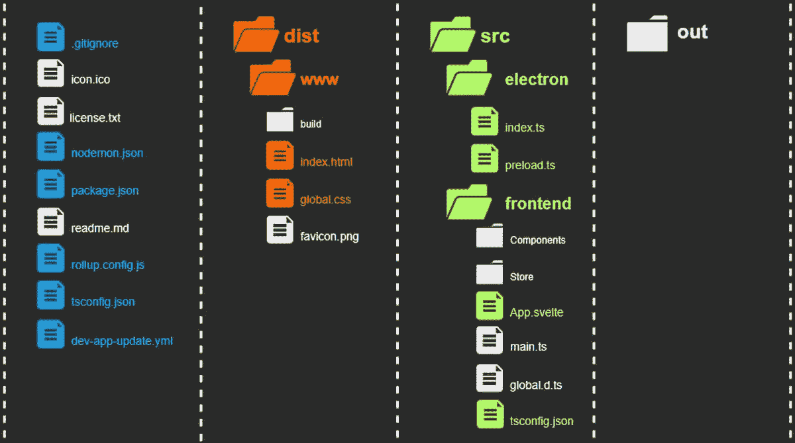
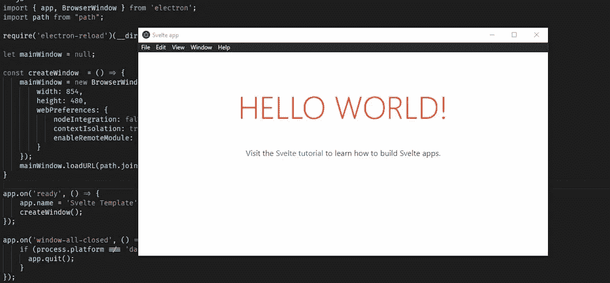
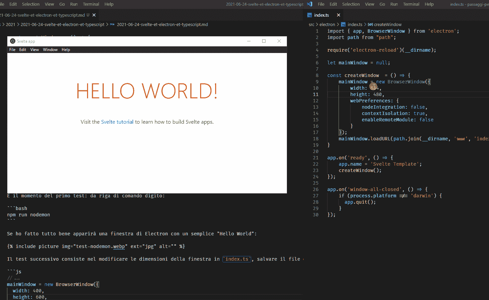
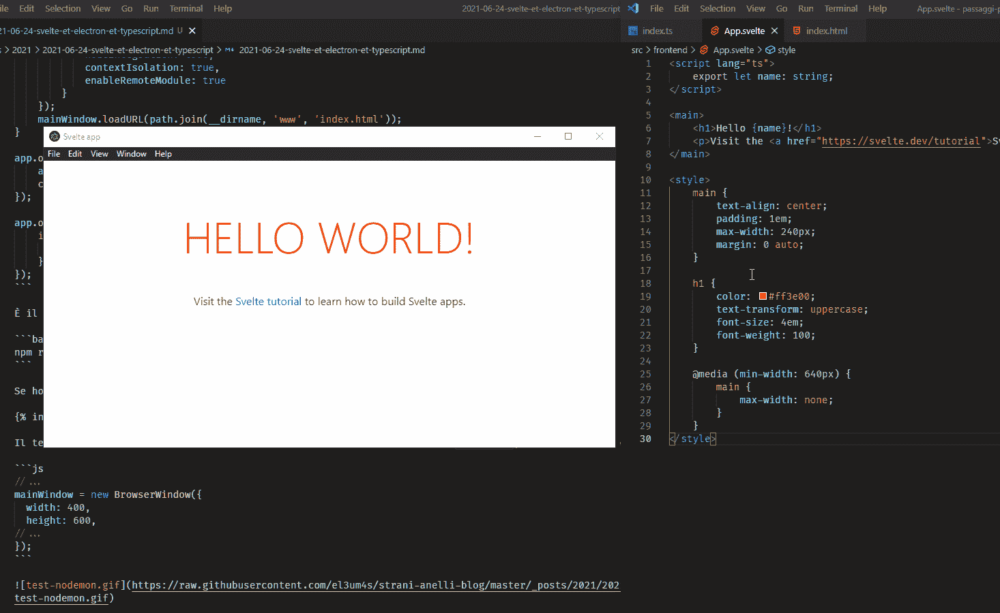
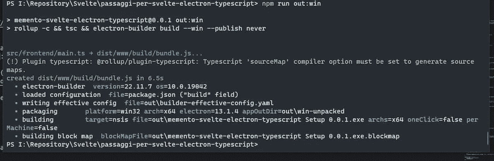
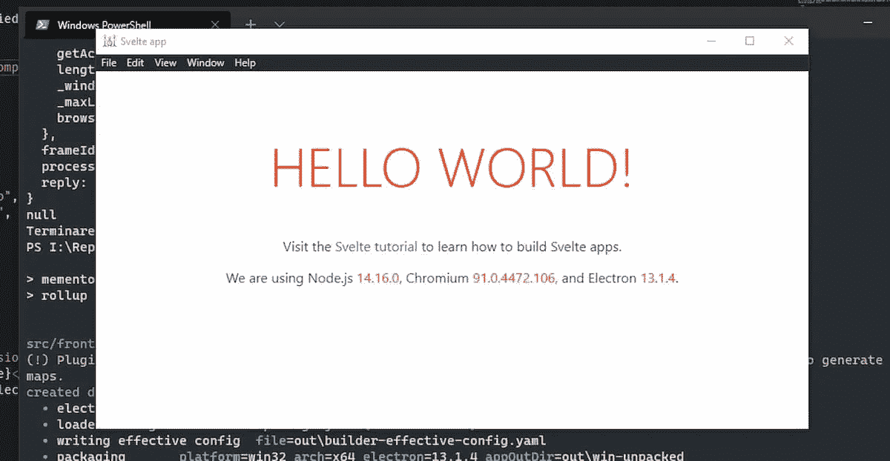
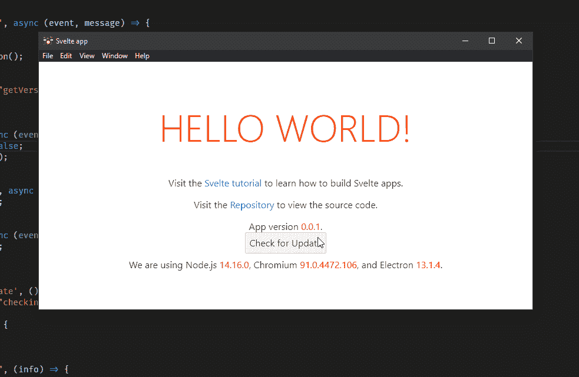

# 如何用电子和打字稿来减肥

> 原文：<https://javascript.plainenglish.io/svelte-electron-typescript-daf35537e9f8?source=collection_archive---------4----------------------->


Photo by [AltumCode](https://unsplash.com/@altumcode?utm_source=medium&utm_medium=referral) on [Unsplash](https://unsplash.com?utm_source=medium&utm_medium=referral)

我继续探索苗条的世界。每天我都在增加一点我的知识，每天我都在和自己的极限做斗争。虽然我很高兴能够找到在 GitHub 上创建静态页面的方法，但我的目标是让我更容易开发一些离线工具。与其他框架不同，Svelte 社区非常小，没有，或者至少我找不到适合我需要的模板。为此，我决定创建自己的模板来整合苗条，电子和打字稿。

我先从“*交战规则*”说起。我需要一个工具:

*   可以完全脱机工作
*   不需要安装互联网连接
*   可以离线和在线更新
*   可以使用 TypeScript 开发
*   开发和扩展相对简单

我已经创建了第一个模板，没有打字稿:[纪念品——细长的&电子](https://github.com/el3um4s/memento-svelte-electron)。从这里开始，我将实现第二个版本，我将称之为[MEMENTO——svelite，electronic&TypeScript](https://github.com/el3um4s/memento-svelte-electron-typescript)(我对名字有很多想象，嗯？).

这篇文章是给我的，尤其是给未来的我的，让我记住我正在做的事情。最重要的是提醒我正在做的一些设计选择。还因为我认为我将很可能不得不开发第三个模板(最终的？也许)在其中整合也苗条的。但是最好一步一步来。

所以，首先要做的是从 Svelte 开始创建一个新项目:

```
npx degit sveltejs/template my-svelte-project
cd my-svelte-project
node scripts/setupTypeScript.js
npm install
```

我安装我需要的电子软件包

```
npm i -D electron@latest
npm i -D typescript
npm i -D electron-builder
npm i electron-updater
npm i electron-reload
```

用这种方法我得到:

*   最新版的[电子](https://www.electronjs.org/)
*   打字稿，用于电子
*   [electronic-builder](https://www.electron.build/)创建要发布的可执行文件(适用于 Windows、Linux 和 macOS)
*   [电子更新器](https://www.electron.build/auto-update)轻松将程序更新至最新版本
*   [electronic-reload](https://www.npmjs.com/package/electron-reload)在应用开发期间更新 electronic“浏览器窗口”的内容

然后我安装 [nodemon](https://nodemon.io/) 来自动重启任何源代码变更的电子。我也认为这在开发应用程序时很有用

```
npm i -D nodemon
```

安装完所有需要的东西后，是时候去修复项目的结构了。目前有两个文件夹

*   `public`，Svelte 的编译文件在哪里
*   `src`，那里是苗条的源文件

但是这种结构不太好用。不仅仅是因为电子文件不见了，还因为我以后会遇到问题。所以我用另一种方式重新整理文件:



首先，我创建一个`dist`文件夹:它将被用来存放编译好的文件。我把苗条的文件(那些自动创建的)移到`dist\www`。

然后我开始编辑`src`文件夹。我在里面创建了两个额外的文件夹:`electron`和`frontend`。首先，我插入使电子工作所必需的文件(目前只有`index.ts`和`preload.ts`)。我用`frontend`代替所有和苗条有关的东西。但是我添加了`tsconfig.json`文件。

我还在项目的根目录下添加了一些文件:`icon.ico`、`license.txt`、`nodemon.json`。在 PC 上安装应用程序时，将需要图标文件和许可证文件。我将在开发程序时使用 nodemon 配置文件。

我还没有写一行代码。但是是时候把手放到键盘上，开始整理一些文件了。第一个要更改的文件是`dist\www\index.html`。我必须做一个非常简单的改变，修改导入文件的引用。事情是这样的:

对此

基本上，我删除了所有 URL 的第一个斜杠，并添加了一些 [CSP 设置](https://developer.mozilla.org/en-US/docs/Web/HTTP/CSP)。

现在我转到专用于前端源文件的部分。这里我创建了一个文件`src\frontend\tsconfig.json`:它的目的是让你用不同于 Electron 的编译方式来编译 Svelte 的 TypeScript 文件(参见 [Stack Overflow:如何在 vs-code 中使用多个 tsconfig 文件？](https://stackoverflow.com/questions/37579969/how-to-use-multiple-tsconfig-files-in-vs-code))。Inserisco 问题代码:

稍后我会回到`src\electron`。现在我修改与 TypeScript 配置相关的另一个文件:位于项目根目录的`tsconfig.json`文件。我写道:

然后，我通过在文件中输入以下内容来配置`nodemon.json`:

通过这种方式，我拦截了对电子文件的所有更改，并且可以自动重启电子文件。

另一个要修复的文件是`rollup.config.js`。通常，自动创建的文件是好的，但是在这种情况下，我改变了文件结构:我必须确保各种命令指向正确的文件夹。

还有最后一个文件需要配置，`package.json`。我从一般信息开始:

然后我定义程序的入口点。我决定把所有编译好的文件都放在`dist`里，所以我给`package.json`加了一行:

```
{
  "main": "dist/index.js",
}
```

显然，我省略了报告各种依赖关系，它们是在我从`npm`导入库时自己添加的。我转而讨论专用于`scripts`的部分。我需要一些东西来运行`nodemon`。

当然，我还需要确保我可以用编译好的 typescript 文件运行 Electron:

然后我需要一些东西来构建可执行文件并直接在 GitHub 上发布它们:

最后，我必须配置专用于创建要分发的文件的部分:

一旦配置完成，我就可以开始写代码了。我从简单的事情开始:我使用`src\electron\index.ts`创建一个简单的窗口，在其中显示一个简单的 HTML 文件(由 Svelte 创建)。所以，我从:

第一次测试的时间到了；在命令行中，我键入:

```
npm run nodemon
```

如果我一切都做对了，一个电子窗口将会出现一个简单的“Hello World”:



下一个测试是改变`index.ts`中的窗口大小，保存文件，看看会发生什么:



Nodemon 重新启动 Electron 并将更改应用到窗口。但如果我只改变苗条的部分，那么 Nodemon 不会做任何事情。这是`electron-reload`的任务:



如果我对电子方面的工作不感兴趣，我可以使用:

```
npm run dev
```

这样我只监控用 Svelte 编译的文件的变化。

下一个测试是关于创建一个可执行文件的可能性。所以我从命令行运行:

```
npm run out:win
```



我在`out`目录中得到`memento-svelte-electron-typescript Setup 0.0.1.exe`文件。

要在 GitHub 上发布应用程序，我可以使用以下命令

```
npm run publish:win
```

现在是时候开始研究如何将电子与苗条更紧密地结合起来了。是时候去编辑`src\preload.ts`文件了。我需要一个与电子通信的机制，从苗条开始:我启用一些入站和出站通信通道。

作为测试，我向 Electron 询问 Chrome、Node 和 Electron 的版本号。然后，我在自定义组件中使用这些信息。我在`src\electron\index.ts`上加了一个函数:

这样，当我向组件请求`requestSystemInfo`时，电子将获得我需要的信息，并在`getSystemInfo`通道上用消息发回。

所以我创建了`src\frontend\Components\InfoElectron.svelte`组件:

我明白了。



然而，我承认我还没有很好地探索这种模式(以及如何使用 TypeScript 创建电子输入文件):我还推荐阅读 [LogRocket](https://blog.logrocket.com/) 的[electronic IPC Response/Request architecture with TypeScript](https://blog.logrocket.com/electron-ipc-response-request-architecture-with-typescript/)。

最后要修复的是自动更新。为了管理它，我从电子公司进口`Notification`和从`electron-updater`进口`autoUpdater`

要检查更新，只需使用

```
autoUpdater.checkForUpdates();
```

这个命令生成了一些我可以拦截的事件。目前我需要这个 2:

这允许我在有可用更新时弹出系统通知。如果你决定安装它，只需点击通知开始下载。之后，当下载完成时，点击通知开始安装程序。



然后我创建了`dev-app-update.yml`文件。该文件用于测试开发中的自动更新。我插入了对我托管项目的 GitHub 存储库的引用:

今天到此为止。

感谢阅读！敬请关注更多内容。

***不要错过我的下一篇文章—报名参加我的*** [***中邮箱列表***](https://medium.com/subscribe/@el3um4s)

[](https://el3um4s.medium.com/membership) [## 通过我的推荐链接加入 Medium—Samuele

### 阅读萨缪尔的每一个故事(以及媒体上成千上万的其他作家)。不是中等会员？在这里加入一块…

el3um4s.medium.com](https://el3um4s.medium.com/membership) [](https://github.com/el3um4s/memento-svelte-electron-typescript) [## GitHub-El 3um 4s/memento-svelte-electronic-typescript:使用 Svelte 创建桌面应用程序的模板…

### 模板创建一个桌面应用程序与苗条，TailwindCSS，电子和打字稿(与电子更新…

github.com](https://github.com/el3um4s/memento-svelte-electron-typescript) 

*原载于 2021 年 6 月 26 日*[*https://blog.stranianelli.com*](https://blog.stranianelli.com/svelte-et-electron-et-typescript-english/)*。*

*更多内容看* [***说白了. io***](http://plainenglish.io/) ***。*** *报名参加我们的* [***免费每周简讯点击这里***](http://newsletter.plainenglish.io/) ***。***