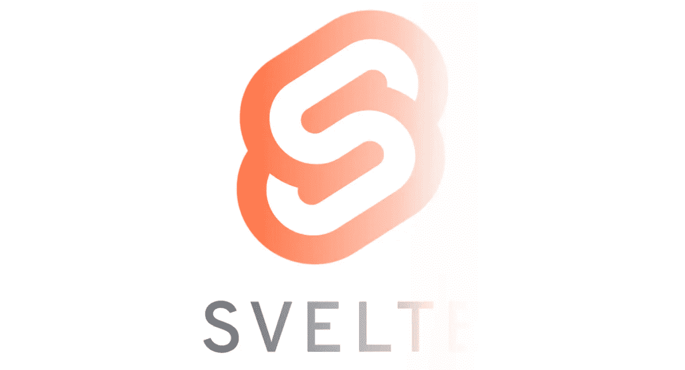

# 作为一名 React 开发者，我尝试过苗条:这很奇怪，但很有趣

> 原文：<https://javascript.plainenglish.io/svelte-from-a-react-perspective-its-weird-but-fun-d9cc9ba242d7?source=collection_archive---------7----------------------->

## “消失的框架”到底是什么意思？



说到技术，我想我可能有注意力缺陷障碍(ADD)。代码的部分乐趣在于发现新概念、新框架。所有令人兴奋的东西都是由某人创造的，并且以新的迷人的方式工作。我喜欢学习新事物。

话虽这么说，我从来没有被学习 Vue.js 吸引过，为什么？因为我已经用了 React 和 Angular。Vue.js 感觉像是一家的堂弟。我可能不*知道*它，但我没有在那里看到任何引发我好奇心的东西。

另一方面，苗条则完全是另一回事。乍一看，它使用了完全不同的概念，这让我想了解它们是如何工作的。运气好的话，还能帮助其他人理解。

我通过做来学习，所以我通常从安装开始。然后我看着例子，修修补补，试图理解发生了什么。如果我真的在挣扎，我会看医生的。所以我安装了 Svelte(和 Sveltekit)，尝试了基本的例子，在这里和那里改变了一些东西，然后…这是一个巨大的失败。我不明白这个国家是如何运转的，它是如何自我更新的。所以我读了文档和教程，试图理解什么是苗条。这是我的发现

# 什么是苗条？

根据登录页面，Svelte 不使用虚拟 DOM，而是“将组件编译成普通的 Javascript”。不像 React 或 Vue 把框架嵌入页面。这是什么意思？

## Svelte 没有明确的状态管理

我花了一段时间才弄明白这意味着什么，并理解其背后的原理是什么。在 Svelte 中没有显式的 setState，没有报告“这是一个状态”的地方，只有一个简单的:

```
<script>
let counter = 1;
</script>
```

我认为这会在输出的某个地方以`let counter = 1`结束。但是真正的输出更奇怪，也更有趣。

在阅读文件和视频的时候，我有一个“啊哈时刻”，伴随着天使唱诗班的签名和从天堂照耀下来的光线。然而一切都已经在“Svelte 编译组件”这句话中陈述过了。说实话，苗条是*而不是*一个框架。至少不是主要的，不是在我们把它用于 Vue 和 Angular 和 React 的意义上。

最重要的是，Svelte 是一个*编译器*。

而这个编译器*作弊*。当然，它做得非常巧妙。但是它给我的印象是我在用 JavaScript 编码，而这根本不是真的。

## 苗条的编译器作弊

Svelte 通过重载=操作符，给它添加副作用来作弊。它添加了一个函数，该函数在变量被使用的地方更新变量。同样，Svelte 在构建时解析 HTML，找到这个变量的依赖关系。

这就是缺少虚拟 DOM 的原因。React 将状态和组件树保存在内存中。并存储组件 CSS 类、样式及其属性值。在下一帧，它比较所有的参数(样式、类、属性等。)如果其中一个发生了微小的变化，所有依赖于它的子组件都需要重新计算。每次迭代，引擎都会一对一地比较组件树的所有元素。这最终可能会非常昂贵。

另一方面，Svelte 只是通过重载=赋值操作符将变量直接插入 HTML。

## 纤细且可观察到的依赖性

Svelte 走得更远，还重载了一个未被充分利用但有效的 JavaScript 特性([JS 标签](https://developer.mozilla.org/en-US/docs/Web/JavaScript/Reference/Statements/label))，以创建变量之间的依赖关系。标签上使用了“$”，让人联想到可观察到的事物。让我们来看看这个苗条的例子:

```
<script>let firstName = ‘world’;
let greeting;$: greeting = ‘Hello ‘ + firstName;
firstName = ‘Bob’;</script><h1> {greeting}!</h1>
```

如果我们使用 vanilla JS 运行脚本部分并记录`greeting`变量的最终值，我们会看到它包含“Hello world”，因为`firstName`(“Bob”)上的第二个赋值发生在 *greeting* 变量的赋值之后。

但是在这个例子中，Svelte 输出“你好，鲍勃”，好像`greeting`和`firstName`变量之间的联系不仅仅是短暂的关系，而是持久的关系。婚礼而不是一夜情。

如果我们记录下正在发生的事情，我们会得到一个更清晰的画面。

```
<script>let firstName = ‘world’;
let greeting;
$: greeting = ‘Hello ‘ + firstName;
firstName = ‘Bob’;
console.log(greeting);</script><h1> {greeting}!</h1>
```

这会在控制台中输出一个`undefined` ——当我们到达日志时，标签`$`处的代码还没有被调用。但是标签语法有一个有趣的特性:你可以在其中放一段代码。让我们添加 do so 并添加一个日志:

```
<script>let firstName = ‘world’;
let greeting$: {
  greeting = ‘Hello ‘ + firstName;
  console.log(greeting);
}firstName = ‘Bob’;
console.log(greeting);</script><h1> {greeting}!</h1>
```

在这种情况下，控制台打印输出显示“未定义”，*然后是*“你好 Bob”。所以一旦脚本块被执行，标签就会被调用。

现在，我们实际上可以把几个标记块放在那里。如果我们打乱顺序，在赋值之前将 greeting 变量的值记录在一个块中，会发生什么情况？

```
<script>let firstName = ‘world’;
let greeting;$: console.log(1, greeting);$: {
  greeting = ‘Hello ‘ + firstName;
  console.log(2, greeting);
}firstName = ‘Bob’;
console.log(3, greeting);</script><h1> {greeting}!</h1>
```

在这里，您可能希望标签按照声明的顺序执行(特别是如果您已经受到 React 的钩子不变顺序规则的限制)。只不过他们不是。

在控制台中，我们首先看到 3(带有“未定义”)，然后是 2，*然后是* 1。Svelte 似乎建立了一个依赖图:有 2 号日志的块依赖于`firstName`，并更新了`greeting`变量。1 号日志依赖于`greeting`变量，因此一旦`greeting` 变量被改变，它就会被执行。Svelte 管理这些依赖关系，并按照依赖关系规定的顺序执行这些块，而不是按照声明的顺序。

由于我有一种扭曲的幽默感，我立即试图创造一种循环依赖:

```
let firstName = ‘world’;
let greeting$: firstName = greeting + ‘hum’;
$ :greeting = ‘Hello ‘ + firstName;firstName = ‘Bob’;
```

但是编译器检测到了并给出了一个错误，所以一切正常。

# 最后

现在，显然还有比我在这里提到的更多的东西:组件、模板、存储、上下文等等。但是这些都在 Svelte 的文档中有详细的描述。

对我来说，在这个初尝之后，有两个问题:第一，我要不要继续学习这个框架？还有适合我在工作中介绍吗？

Svelte 的独创性和它在基本 JavaScript 语法中引入新行为的方式激起了我的兴趣。但是以同样的标准来衡量，我对把这个交给初级开发人员持谨慎态度，他们可能最终会认为 Svelte 是 javascript 在野外实际工作的方式。

# 其他资源:

[纤细的文档](https://svelte.dev/docs)

[苗条教程](https://svelte.dev/tutorial/basics)

苗条的[例子](https://svelte.dev/examples)

*更多内容看* [***说白了. io***](http://plainenglish.io/)