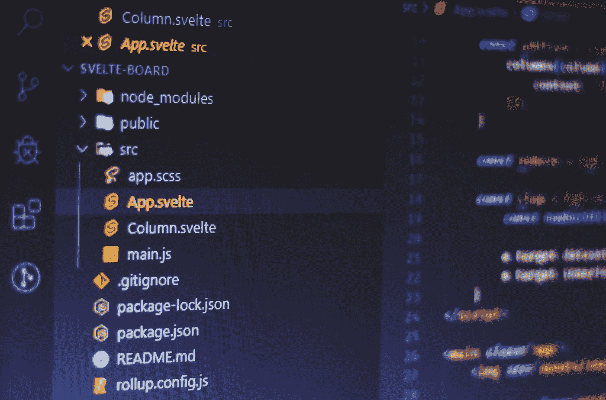

# 如何用 Svelte 和 GitHub 创建静态网站

> 原文：<https://javascript.plainenglish.io/svelte-github-pages-english-ff3edd02d48?source=collection_archive---------15----------------------->



Photo by [Ferenc Almasi](https://unsplash.com/@flowforfrank?utm_source=unsplash&utm_medium=referral&utm_content=creditCopyText) on [Unsplash](https://unsplash.com/@flowforfrank?utm_source=unsplash&utm_medium=referral&utm_content=creditCopyText)

这是一个简单的提醒帖。在过去的几周里，我一直在尝试如何将一个静态网站上传到 GitHub。我没有找到很多指南和教程。所以我决定记录下要采取的步骤。首先为了未来的我。

## 那么我们该怎么办呢？

首先，我们决定上传网站的存储库。让我们在存储库中创建一个`gh-pages`分支。我注意到最好将页面加载到主分支之外的单独分支上。通过这种方式，用于开发的代码与站点的可见页面保持分离。选择`gh-pages`还允许我们使用特定的 npm 包(名为 gh-pages)。

这样做之后，我们创建了网站。先说最简单的，一个没有野心的站点。我们在终端上写道:

```
npx degit sveltejs/template my-fantastic-site
```

所以让我们进入`my-fantastic-site`文件夹

```
cd my-fantastic-site
```

如果我们愿意，我们也可以使用 TypeScript，但这不是强制性的:

```
node scripts/setupTypeScript.js
```

在这之后，我们用命令安装软件包

```
npm install
```

现在我们可以简单地使用

```
npm run dev
```

我省略了创建网站本身:这将是一个太大的话题，这不是我现在想谈的。然后，我们通过执行以下命令来创建编译后的文件:

```
npm run build
```

运行这个命令后，我们有一个`public`文件夹，其中包含准备上传到 GitHub 的编译代码。如果我们愿意，我们可以用手做任何事情。不过用起来比较方便。所以我们跑:

```
npm install gh-pages --save-dev
```

所以让我们在`package.json`文件中添加一个脚本:

```
"scripts": {
    "deploy": "node ./gh-pages.js"
  }
```

然后我们创建`gh-pages.js`文件:

或者，我们也可以使用:

```
import { publish } from 'gh-pages';

publish(
  // ...
);
```

现在有一些细节需要修正。首先，我们需要确保`.gitignore`文件没有排除`public`目录。只需注释掉相应的行。

```
/node_modules/
# /public/build/
```

第二件事与 GitHub Pages 的工作方式有关:它通过 Jekyll 工作。一般来说，它不会给出特别的问题，但是我注意到它不能正确读取以下划线字符(`_`)开头的目录。因此，通过创建一个名为`.nojekyll`的空文件来禁用它是很方便的。我们也把这个文件放在`public`文件夹中。

最后是站点的域。当我们部署站点时，我们将自动覆盖`gh-pages`分支的所有内容，包括`CNAME`文件。如果我们对使用特定的域感兴趣，那么最好将文件添加到`public`文件夹中。

好了，在这一切之后，我们准备加载网站。所以，首先，我们编译它

```
npm run build
```

然后我们将编译好的代码上传到资源库。我对 GitHub 的桌面版本很满意，但也可以从命令行完成:

```
git add .
git commit -m "commit description"
git push origin gh-pages
```

加载存储库后，我们可以运行

```
npm run deploy
```

或者如果我们喜欢:

```
node ./gh-pages.js
```

还有一件事要说。如果我们用[Svelte kit](https://kit.svelte.dev/)创建一个网站，而不是用 svelite，我们必须对这个程序做一些修改。

首先我们需要安装正确的[适配器](https://kit.svelte.dev/docs#adapters)。这种情况下是 [@sveltejs/adapter-static](https://github.com/sveltejs/kit/tree/master/packages/adapter-static) :

```
npm i -D @sveltejs/adapter-static@next
```

然后我们更新`svelte.config.js`文件

好了，暂时就这些了。

感谢阅读！敬请关注更多内容。

***不要错过我的下一篇文章—报名参加我的*** [***中邮箱列表***](https://medium.com/subscribe/@el3um4s)

[](https://el3um4s.medium.com/membership) [## 通过我的推荐链接加入 Medium—Samuele

### 阅读萨缪尔的每一个故事(以及媒体上成千上万的其他作家)。不是中等会员？在这里加入一块…

el3um4s.medium.com](https://el3um4s.medium.com/membership) 

*原载于 2021 年 6 月 9 日*[*https://blog.stranianelli.com*](https://blog.stranianelli.com/svelte-et-github-english/)*。*

*更多内容请看*[***plain English . io***](http://plainenglish.io/)