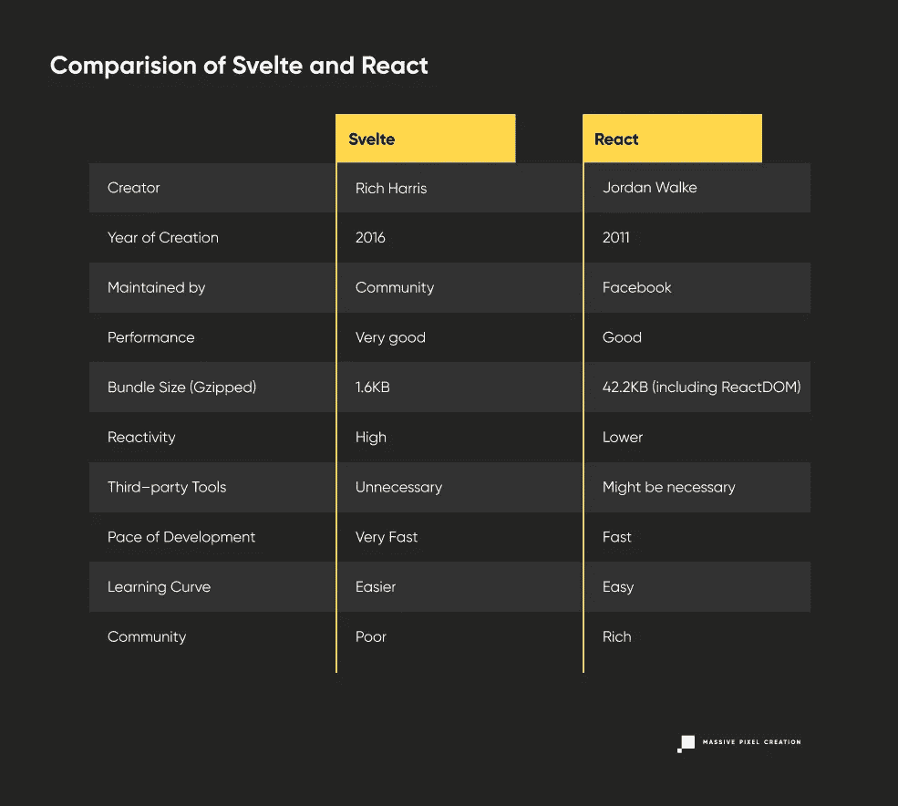

# 苗条 vs 反应:结束辩论

> 原文：<https://javascript.plainenglish.io/svelte-vs-react-ending-the-debate-799996360561?source=collection_archive---------0----------------------->

在苗条和反应的辩论中，你是否保持中立？你不是唯一一个。

如今，选择最好的工具是一个挑战，尤其是在互联网上所有相互冲突的声音都在尖叫的情况下。我们不断受到头条新闻的攻击，比如:

**反应过来就死了。**

**Svelte 还没发育就死了。**

然后我们看到:

React 将塑造未来。

**苗条的*是*未来。**

在这篇文章中，我们不想偏袒任何一方。相反，我们想展示这些工具什么时候适用，什么情况下让它们像钻石一样闪闪发光。

请记住，到目前为止，还没有可以解决所有问题的通用工具。所以不要选择时髦的技术:选择能以最有效的方式解决你的问题的技术。

# 反应

React 是 MPC 非常青睐的技术，已经讨论过几次了。我们已经解释了[什么是 React](https://massivepixel.io/blog/what-is-react/) ，[为什么 React 是一个好的选择](https://massivepixel.io/blog/why-react/)，以及它与 [React Native](https://massivepixel.io/blog/react-vs-react-native/) 有何不同。但是让我给你一个小小的提醒:

[React](https://reactjs.org/) 是一个专用于前端开发的 **JavaScript 库**，专门用于**构建由可重用组件构成的用户界面**。它是由脸书(原作者:[乔丹·沃克](https://twitter.com/jordwalke?lang=en))在 2011 年创建的，供他们自己使用，并由他们维护至今。两年后，它被开源并迅速流行起来。它以相当容易学习、开发速度极快以及一个庞大的乐于助人的开发人员社区而闻名。它最著名的功能之一是虚拟 DOM，它增强了 React 应用程序的性能。

# 苗条的

## 这是什么？

苗条女孩是这个街区最新的孩子之一。它于 2016 年发布，特别是在分析了它的前辈——React 和 [Vue](https://vuejs.org/) 之后。它由 [Rich Harris](https://twitter.com/Rich_Harris) 创建，目前由苗条的核心成员维护。它被以下公司使用:《纽约时报》、Avast、Spotify、Semrush 和 Chess。

在其官方网站上，Svelte 被描述为一个[组件框架](https://svelte.dev/blog/svelte-3-rethinking-reactivity)，但它类似于一个编译器。它生成尽可能小的普通 JavaScript 代码，使苗条的应用程序小而快。它还确保了适当的优化。

就受欢迎程度而言，Svelte 做得相当不错。在 JS 2020 调查的[状态中， **86%的开发者对与 Svelte 合作表示满意**。在最近由 2021 年](https://2020.stateofjs.com/en-US/technologies/front-end-frameworks/)[Stack Overflow](https://insights.stackoverflow.com/survey/2021#technology-most-loved-dreaded-and-wanted)准备的调查中，Svelte 被 71.42%的受访者选为**最受喜爱的框架——超过 React (69.28%)和 Vue (64.41%)。但是总的来说， [Svelte 比其他框架更少使用](https://insights.stackoverflow.com/survey/2021#technology-most-popular-technologies)，所以在查看这些数字时要记住这一点。**

## 为什么被创造出来？

Rich Harris 是 Ractive 的创建者，这是一个模板驱动的 UI 库，开发时考虑到了高度互动的应用。它最初是为[守护者](https://www.theguardian.com/)创造的。

但是哈里斯对这个产品并不满意。它没有解决一个至关重要的问题——运输 Javascript 的高成本，这严重影响了移动用户。为了解决这个问题，Harris 想出了一个类似于**框架的编译器的主意，**它减少了苗条应用程序所需的开销代码。

# React 和 Svelte 的对比

## 1.苗条更有表现力

在这点上，苗条的**不仅控制了过度反应，还控制了角度和 Vue** 。在所有的测试中——[，包括速度测试、启动测试和记忆测试](https://krausest.github.io/js-framework-benchmark/2020/table_chrome_84.0.4147.89.html)——Svelte 是一个明显的赢家。那种超快的性能从何而来？

给予 Svelte 如此显著的优势是它**在编译时解释应用程序代码，而不是在运行时。**此外，因为 HTML、CSS 和 JavaScript 被编译成微小的、高度优化的包，所以这个苗条的应用只接收业务逻辑。其他框架被迫发布额外的框架代码，并迫使浏览器做繁重的工作，这降低了速度。

令人惊讶的是，虚拟 DOM 的缺乏也提高了性能。

## 2.Svelte 不使用虚拟 DOM 差分

虚拟 DOM 是 React 的制胜法宝，也是它最重要的特性之一，负责提高性能。这是如此之好，它极大地鼓舞了 Vue。

**这就是为什么斯韦利扔掉它是非常大胆的。**

但是首先，什么是虚拟 DOM？

它是文档对象模型的虚拟表示，为用户界面带来的所有变化充当**临时内存存储**。

对于真正的 DOM，每一个变化都会触发一次更新，从而降低 web 应用程序的速度。另一方面，虚拟 DOM 会延迟这一过程，直到它找到更新和呈现真实 DOM 的最有效方式——这也被称为**协调过程**或**区分**。

Svelte [不同意只有使用虚拟 DOM 才能获得出色的性能](https://svelte.dev/blog/virtual-dom-is-pure-overhead)，它成功地证明了这一点。差异，虽然可能是有效的，但仍然需要大量的工作。所以斯维尔特决定跳过这一步。

DOM 什么时候更新为 Svelte？例如，每当 web 应用程序的状态由于用户的输入而改变时。这是一个自动化的过程，让苗条变得真正有活力。

## 3.苗条更有反应…或者是吗？

React 并不是完全反应式的，尽管它试图做到这一点。毫无疑问，**是声明性的**，这意味着**开发人员只需要描述结果，而不是描述每个步骤来达到某个结果。** React 处理剩下的。

但是如果值有任何变化，它们不会自动反映在 DOM 中。 [React 根据时间表](https://reactjs.org/docs/design-principles.html#scheduling)更新组件。不使用 this.setState 或者钩子，React 就不会…嗯，*正确反应*。

事情是这样的，[斯韦特也做了类似的事情](https://dev.to/this-is-learning/how-react-isn-t-reactive-and-why-you-shouldn-t-care-152m)。一旦组件的阶段改变，它就会更新 DOM，但是只有当它被赋值触发**时。**在此之前，所有的变更都是批量处理的。听起来差不多？

但是还有**反应声明**和**变量**要考虑。反应式声明负责在每次更新期间自动重新计算逻辑。反应变量一旦被声明和改变，就会触发其他变量改变，如果它们相关的话。这也简单得可笑——只需添加一个美元符号。

那么苗条真的是反应性的吗？大概和无服务器没有任何服务器一样多吧。与 React 相比，reactive 更容易实现，但两种技术都可以实现类似的事情。

## 4.细长组件的处理方式略有不同

Svelte 使用组件的方式(通过 making 在 Svelte 中创建。苗条的文件)也不同于 React。

首先，**您不必做任何事情来** **导出组件**——Svelte 自动地自己导出它们。使用 React，您必须手动完成这项工作。

同样，Svelte 提供了灵活的样式，这是可能的，因为**组件在其样式标签中被限定了范围。**你也不必费心编写独特的类，因为 [Svelte 会在编译步骤](https://css-tricks.com/what-i-like-about-writing-styles-with-svelte/)中生成它们。所以不用再担心冲突了。

也有一些相似之处——例如，**将数据传递给子组件，并将数据发送回父组件**可能看起来很熟悉。

## 5.Svelte 不需要那么多第三方工具

React 是一个非常轻量级的库，只专注于视图层，需要第三方工具来进行状态管理或创建令人惊叹的动画。这并不一定是一件坏事——对于没有什么特色的小项目来说，它实际上可能是完美的。

不过，值得注意的是，Svelte 有**内置的效果、过渡和动画**不会增加你的应用程序的大小——这是代码编译的直接结果。Svelte 只装载需要的部分。

苗条的人也有几种处理 [**状态管理**](https://blog.devgenius.io/state-management-in-svelte-b045213c9138) 的方法。您可以使用:

*   **Context API:** 当你的组件需要通信和传递数据的时候，
*   **苗条商店:**当你的组件需要在不传递太多数据的情况下进行通信时
*   **可写存储:**当你想让对象可以被不同的组件访问时，
*   **可读存储:**当你不希望用户操作数据时。

## 6.苗条更轻盈

React 的 gzip 版本为[**42.2 kb**](https://bundlephobia.com/package/react@17.0.2)**(包括 [ReactDOM](https://bundlephobia.com/package/react-dom@17.0.2) )。**

**苗条版的 GZipped 是*[***1.6 kb***](https://bundlephobia.com/package/svelte@3.43.2)***。******

***在这方面，Svelte 是不可否认的赢家。由于其规模，web 应用程序加载速度更快，响应能力完美无瑕，带宽成本也更低。***

## ***7.Svelte 提供更快的网络开发***

***React 的开发速度很快。*真快。速度太快，有时很难跟上，这经常被认为是它的缺点之一。****

***Svelte 的开发过程*甚至更快*。这怎么可能呢？***

***生成的代码比 React 的可读性更好，更简单，也更短。您可以用更少的代码获得类似的结果，而不用担心会影响质量。这反过来意味着项目易于维护，甚至更易于调试。如果有任何新的团队成员加入到苗条项目中，他们可以迅速了解发生了什么，并立即开始工作。***

## ***8.苗条(稍微)更容易学***

***这两种技术的学习曲线被认为是相当容易的。它们都需要 HTML、CSS 和 JavaScript 的知识。但是 Svelte 再一次成功地战胜了 React。***

***在 React 中，障碍之一是 **JSX，一种用于构建用户界面的 JavaScript 的类似 XML 的语法。Svelte 使用更简单的语法，它有自己的模板语言，很容易掌握。*****

# ***那么苗条比反应好吗？***

***Svelte 可能看起来很棒——它很容易，使开发体验变得轻而易举——但在受欢迎程度和使用方面，它仍然落后于 React。苗条的最大缺点是:***

## ***1.苗条的人没有富裕的社区***

***因为 React 是如此受欢迎，正如 React 应用程序**、**的涌入所证明的那样，它拥有**一个由充满激情的开发者组成的庞大社区**，他们制作各种教程和指南(通常是免费的)，并且随时可以参加头脑风暴会议。还有大量的工具来促进开发过程，如 [React Developer Tools](https://chrome.google.com/webstore/detail/react-developer-tools/fmkadmapgofadopljbjfkapdkoienihi?hl=en) 或 [Redux DevTools](https://chrome.google.com/webstore/detail/redux-devtools/lmhkpmbekcpmknklioeibfkpmmfibljd?hl=en) ，它们与 [Redux](https://redux.js.org/) 齐头并进。***

***苗条不能指望同样水平的社区支持。缺乏插件、集成和 IDE 支持尤其令人烦恼。很少有固定的最佳实践可以作为指南。如果你偶然发现一个问题，小用户群可能无法帮你解决。***

## ***2.公司不支持苗条身材***

***似乎没什么大不了的？嗯，有可能。***

***React 由脸书支持和维护，并为自己的目的使用它。他们有必要的资金继续工作。此外，不用担心脸书会突然转向谷歌支持的 Angular。这使得 React 几乎不受未来的影响。***

***Svelte 的未来并不明朗。它由社区维护，但谁知道他们的热情能持续多久。苗条身材可能会激发另一种新技术来取代它。***

## ***3.苗条在大规模网络中并不常用***

***纤薄的 [**刚刚成熟到足以满足企业级应用的**](https://twitter.com/Rich_Harris/status/1433057805477552132) 。***

***这意味着在野外没有太多苗条的用例。直到最近，法兰西电台才把 Svelte 加入他们的技术堆栈，就像 Scott Tolinski 把它用于他的[升级教程](https://leveluptutorials.com/)平台。到目前为止，其他技术更受有影响力的玩家的青睐，因此 Svelte 仍有待于战斗考验。它的未来虽然充满希望，但仍然未知。***

# ***结论***

***苗条提供了很多。**Svelte 因其尺寸、高效的命令式代码以及超快的性能而受到称赞，**它看起来可能是 React 或 Angular 等技术的有力竞争对手。***

***可惜，Svelte 还有很长的路要走。到目前为止，最好是为那些互联网连接较弱的人或简单的个人网站(如博客或作品集)构建单页应用程序。它肯定不会取代大公司技术堆栈中的其他框架，而且对苗条开发者的需求也很少。***

***尽管有诸多优势，Svelte 大放异彩的时刻还没有到来。小心，反应过来！但是不用担心。现在，你的王冠还在。***

## ***关键要点***

******

****最初发布于*[*https://massie pixel . io*](https://massivepixel.io/blog/svelte-vs-react/)*。****