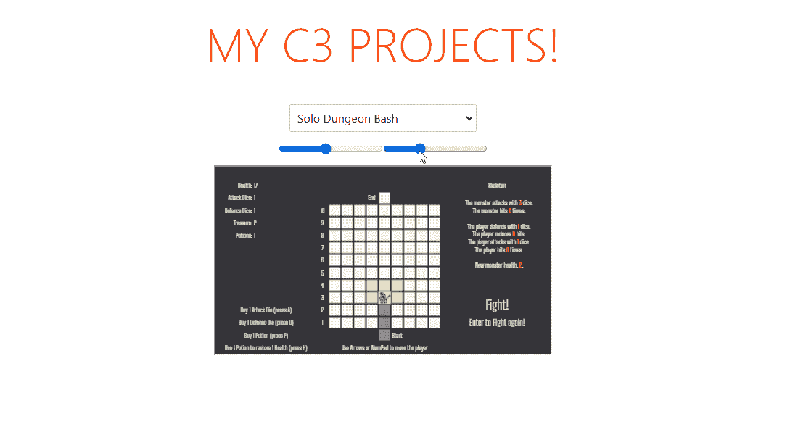
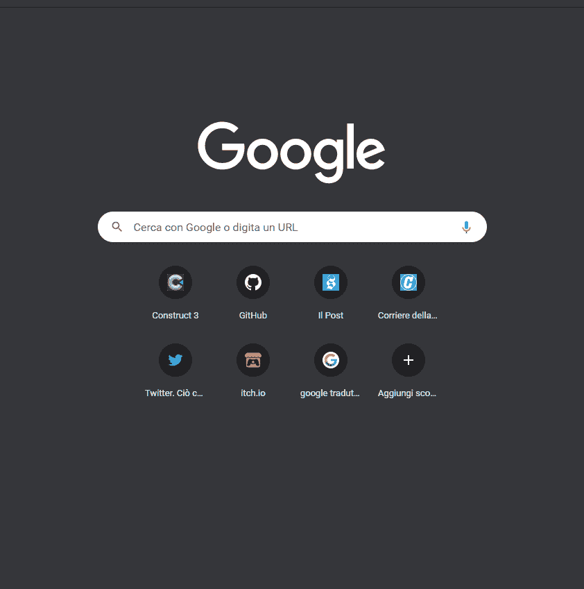
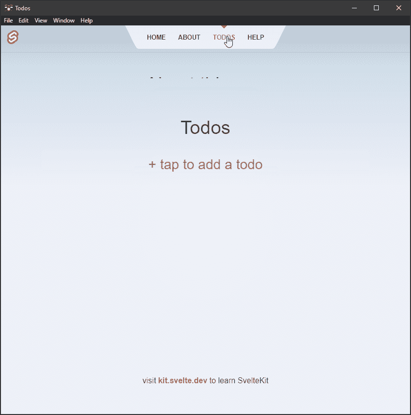
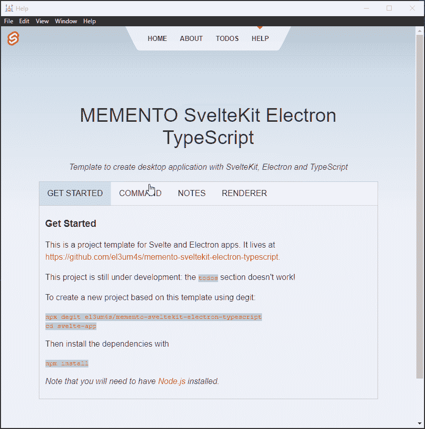
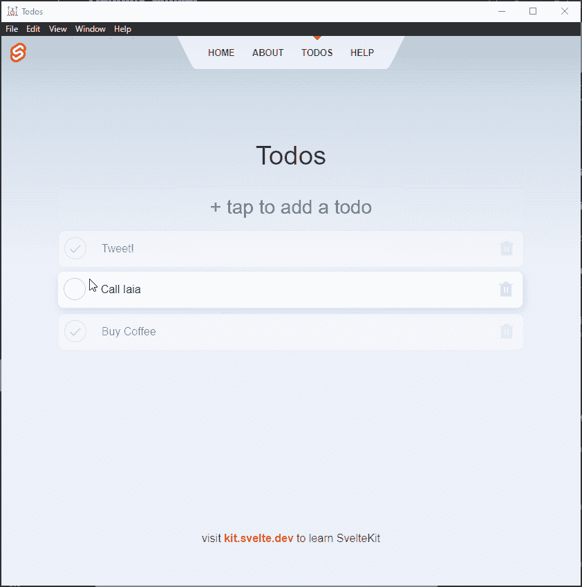

# 如何使用 SvelteKit 与电子

> 原文：<https://javascript.plainenglish.io/sveltekit-electron-d1fc80065fbf?source=collection_archive---------0----------------------->


Photo by [fabio](https://unsplash.com/@fabioha?utm_source=unsplash&utm_medium=referral&utm_content=creditCopyText) on [Unsplash](https://unsplash.com/@fabioha?utm_source=unsplash&utm_medium=referral&utm_content=creditCopyText)

我几乎已经完成了我的想法，为苗条和电子创建 3 个模板。还有一些细节需要修正，但主要方面还可以。第三个也是最后一个模板涉及 [SvelteKit](https://kit.svelte.dev/) ，电子和打字稿。与其他两个模板不同，这个模板有一个更具体的用途。为什么？

因为没有必要使用带电子的 SvelteKit。我可以用苗条的身材得到同样的结果，而且并发症更少。我的意图略有不同。我想让我的博客更吸引人一点，尤其是 c3demo.stranianelli.com 部分。我想使用相同的代码创建一个离线应用程序来在 itchio 上发布。我觉得 SvelteKit 适合这个用途。



但这关乎未来。今天我想写下一些关于如何将 SvelteKit 与电子和打字稿整合的事情。我从文件结构开始，它不同于其他模板:

```
root
├──electron
│   ├──IPC
│   │   └──...
│   ├──index.ts
│   ├──mainWindow.ts
│   ├──preload.ts
│   └──configureDev.ts
├──svelte
│   ├──src
│   │   ├──lib
│   │   │   ├──components
│   │   │   │   └──...
│   │   │   ├──header
│   │   │   │   └──...
│   │   │   └──...
│   │   ├──routes
│   │   │   ├──help
│   │   │   │   └──...
│   │   │   ├──todos
│   │   │   │   └──...
│   │   │   ├──__layout.svelte
│   │   │   ├──about.svelte
│   │   │   └──index.svelte
│   │   ├──app.css
│   │   ├──app.html
│   │   └──global.d.ts
│   ├──static
│   │   ├──favicon.png
│   │   └──loading.html
│   ├──svelte.config.js
│   └──tsconfig.json
├──package.json
├──tsconfig.json
├──nodemon.json
├──icon.ico
└──dev-app-update.yml
```

当然，主要的区别是与苗条有关。我发现的最快最简单的方法是在一个单独的文件夹中创建一个“SvelteKit 项目”。我在 shell 中创建了`Svelte`文件夹:

```
npm init svelte@next
npm install
```

这样我就把前端开发和电子开发分开了。另一方面，电子实际上与以前的设计相同。唯一的区别是增加了启动时闪屏的功能:



另一个变化是添加了`configureDev.ts`类来简化应用程序开发。我可以将下面的代码添加到`index.ts`文件中:

通过修改各种选项，我可以使用命令`nodemon`在各种场景中使用模板。

为了使用 SvelteKit 生成的文件，我必须使用一个技巧。不使用`win.loadURL('file://...')`，我决定使用[电子发球](https://www.npmjs.com/package/electron-serve):

```
const loadURL = serve({ directory: "dist/www" });
loadURL(mainWindow)
```



我可以直接调用 SvelteKit 生成的各种 HTML 页面。或者我也可以使用某种定制的迷你路由器。就`[<svelte:component>](https://svelte.dev/docs#svelte_component)`:

```
import PageA from "./pageA.svelte";
import PageB from "./pageB.svelte";
import PageC from "../others/pageC.svelte";

let page = PageA
```

在 HTML 中

```
<button on:click="{() => page=PageB}">Go to PageB</button>
<svelte:component this={page} />
```



最后，我增加了将“待办事项”部分的项目直接保存到磁盘的可能性。这不是一个基本的方面，但我需要记住如何使用 [NodeJs fs API](https://blog.stranianelli.com/sveltekit-and-electron-english/(https://nodejs.org/api/fs.html)) 。



我知道这篇文章没有前几篇那么专业，但是所有的代码都可以在 GitHub 上找到:

[](https://github.com/el3um4s/memento-sveltekit-electron-typescript) [## GitHub-El 3um 4s/memento-sveltekit-electronic-typescript:创建桌面应用程序的模板

### 模板创建一个桌面应用程序与 SvelteKit，电子和打字稿(与电子更新，电子重新加载和…

github.com](https://github.com/el3um4s/memento-sveltekit-electron-typescript) 

感谢阅读！敬请关注更多内容。

***不要错过我的下一篇文章—报名参加我的*** [***中邮箱列表***](https://medium.com/subscribe/@el3um4s)

[](https://el3um4s.medium.com/membership) [## 通过我的推荐链接加入 Medium—Samuele

### 阅读萨缪尔的每一个故事(以及媒体上成千上万的其他作家)。不是中等会员？在这里加入一块…

el3um4s.medium.com](https://el3um4s.medium.com/membership) [](https://differ.plainenglish.io/p/stylify-css-code-your-sveltekit-website-faster-with-csslike-utilities-ly2ujg9f) [## 风格化 CSS:用类似 CSS 的工具更快地编写你的 SvelteKit 网站

### Stylify + SvelteKit。使用 Stylify 更快地设计您的 SvelteKit 网站。不要研究选择器和语法。使用纯 CSS…

different . plain English . io](https://differ.plainenglish.io/p/stylify-css-code-your-sveltekit-website-faster-with-csslike-utilities-ly2ujg9f) 

*原载于 2021 年 7 月 18 日 https://blog.stranianelli.com*[](https://blog.stranianelli.com/sveltekit-and-electron-english/)**。**

**更多内容请看*[*plain English . io*](http://plainenglish.io/)*。报名参加我们的* [*免费每周简讯*](http://newsletter.plainenglish.io/) *。在我们的* [*社区不和谐*](https://discord.gg/GtDtUAvyhW) *获得独家获得写作机会和建议。**