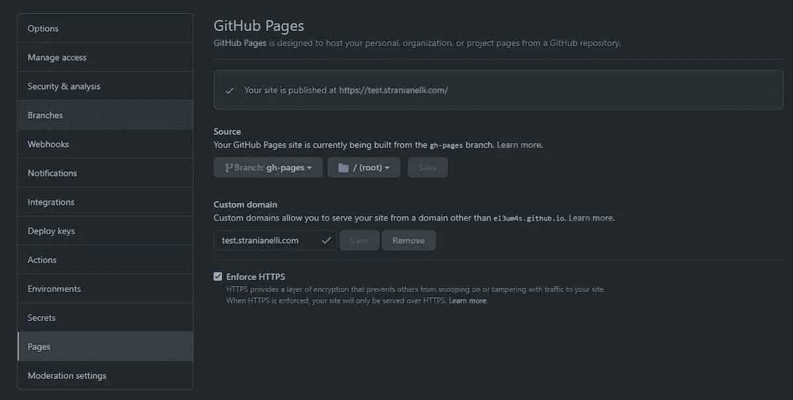

# 如何在 GitHub 页面中使用 SvelteKit

> 原文：<https://javascript.plainenglish.io/sveltekit-github-pages-4fe2844773de?source=collection_archive---------1----------------------->


我等了几个星期才写了一篇关于如何在 GitHub 页面上使用 Svelte 的新文章。今天我对测试 SvelteKit 感兴趣。这篇文章将采取日志的形式:我报告我做的各个步骤。它们是笔记，而不是指南。

# 苗条套装

首先，我基于 [SvelteKit](https://kit.svelte.dev/) 创建一个新项目，输入:

```
npm init svelte@next my-app
```

我安装了各种依赖项

```
npm i
```

为了简化在 GitHub 页面上的发布，我再次使用了 [gh-pages](https://www.npmjs.com/package/gh-pages) :

```
npm install gh-pages --save-dev
```

我在`package.json`上添加脚本:

然后我创建了`gh-pages.js`文件:

要在 GitHub 上发布，我需要[静态适配器](https://www.npmjs.com/package/@sveltejs/adapter-static):

```
npm i -D @sveltejs/adapter-static@next
```

所以，我更新了`svelte.config.js`文件

如果我运行这个命令

```
npm run build
```

我会在项目的根目录下得到一个`build`文件夹。这将是上传到 GitHub 页面的文件夹。但是首先我必须配置存储库。



我将`gh-pages`分支设置为站点原点，并且为了以防万一，我设置了一个自定义域。

然后我还需要两个文件，都在`static`文件夹中:

*   `.nojekyll`:阻止 Jekyll 管理页面(参见[在 GitHub 页面上绕过 Jekyll](https://github.blog/2009-12-29-bypassing-jekyll-on-github-pages/))
*   `CNAME`:允许 GitHub 页面使用我设置的自定义域。

`.nojekyll`是一个空文件。创建它，不要在里面写任何东西。

`CNAME`只包含一行:域名，格式如下:

```
test.stranianelli.com
```

现在我可以用`npm run build`重新编译网站，然后使用

```
npm run deploy
```

上传到网上。

在开发过程中，我可以使用命令

```
npm run dev -- --open
```

实时查看对代码所做的更改。

为了添加一个新页面(`about.svelte`)，我在`src\routes`文件夹中创建了一个新组件。

# 如何用 SvelteKit 创建博客

这对于静态站点来说是不错的。如果你想创建一个类似博客的东西呢？

从现在开始事情变得复杂了。我在网上找到了一些帖子和视频:

*   [苗条博客](https://svelteland.github.io/svelte-kit-blog-demo)——谢谢你约翰！
*   [Sveltekit Markdown 博客](https://www.youtube.com/playlist?list=PLm_Qt4aKpfKgonq1zwaCS6kOD-nbOKx7V)
*   [如何用 SvelteKit 和 Strapi 创建博客](https://strapi.io/blog/how-to-create-a-blog-with-svelte-kit-strapi)
*   [如何用 SvelteKit 和 dev.to API 创建博客](https://dev.to/ladvace/how-to-create-a-blog-with-sveltekit-and-dev-to-api-5h7e)

和其他人。我对任何提议的解决方案都不满意。但是我还没有我的提议。我特别感谢 [WebJeda](https://blog.webjeda.com/) 的视频和帖子。

我需要一些其他的工具。首先，我需要在每个`npm run build`命令之前用 [trash-cli](https://github.com/sindresorhus/trash-cli) 清理`build`目录。

```
npm i -D trash-cli
```

我给`package.json`添加了一个新的脚本，并更新了`build`:

然后我将 [mdsvex](https://mdsvex.pngwn.io/) 导入到项目中

```
npm i -D mdsvex
```

接下来我使用[svelet-add/MDS vex](https://github.com/svelte-add/mdsvex):

```
npx svelte-add@latest mdsvex
```

`mdsvex`允许我像使用苗条组件一样使用减价页面。也作为一个苗条路由器的页面。有一个配置文件，`mdsvex.config.js`:

我改变`svelte.config.js`来处理降价:

作为测试，我拿几篇假博文。我创建了`src/routes/blog`文件夹并插入了一些`.md`。里面有文件。

```
---
file: hello-world.md
title: Hello World
---

Hi!
```

再次运行`npm run dev`后，我可以在`[http://localhost:3000/blog/hello-world](http://localhost:3000/blog/hello-world)`看到结果

有趣的是，你可以在文件中使用 Svelte。例如，我可以用以下内容设置页面标题:

```
**# {title}**
```

我可以使用其他地方定义的组件:

图像管理有点复杂。我还是不知道哪种方法最好。有人计划将所有图像放在静态文件夹中，然后从那里调用它们:

否则，我可以将它们放在`lib`内的文件夹中，然后将它们作为组件导入:

# 创建帖子索引

创建博客时要记住的另一个方面是主页。我可以通过创建一个`src/routes/blog/index.svelte`组件并使用 [load()](https://kit.svelte.dev/docs#loading) 函数得到一些好东西。

我首先导入一个引用文件夹中所有`.md`文件的数组:

我从数组中提取我需要的信息:

*   `path`是文件的位置
*   `metadata`是 YAML 文件本身的内容。

最后，我将创建索引所需的内容传递给组件:

组件的其余部分非常简单:

# 苗条套装和布局

[布局](https://kit.svelte.dev/docs#layouts)是一种有趣的可能性。例如，我可以创建一个组件`src/routes/blog/__layout.svelte`:

在每个博客页面上方插入菜单。

# 突出

另一个需要解决的问题是代码。或者更确切地说，代码看起来如何。`mdsvx`具有运用风格的能力。在这一点上，我没有发现许多明确的迹象。我从 [prismjs](https://prismjs.com/) 下载了一个样式，效果不错。然后我把 css 文件(我命名为`prism.css`)复制到`static`文件夹。最后，我添加了一个样式表引用到`src\app.html`:

或者我可以在布局中插入:

# 配置 path.base

当我上传博客时，可能会出现另一个问题。如果我把它上传到一个域，比如说在`test.stranianelli.com`上，那么我就可以通过访问`test.stranianelli/blog/first-post`这样的地址来访问不同的页面。

但是如果我把所有东西都上传到一个非根文件夹，事情就不一样了。为了让一切正常工作，我必须更改文件`svelte.config.js`:

这使我可以更好地配置链接，例如:

# 在页面之间添加过渡

一个很好的方法是在转帖时添加一个过渡。为此，请遵循埃文·温特的建议。

我创建了一个`PageTransition.svelte`组件:

然后我在布局中使用它:

今天到此为止。该代码可在 GitHub 上获得:

[](https://github.com/el3um4s/memento-sveltekit-and-github-pages) [## GitHub-el3um 4s/memento-sveltekit-and-GitHub-pages

### 在 github 上创建一个帐户，为 el3um 4s/memento-sveltekit-and-GitHub-pages 的开发做出贡献。

github.com](https://github.com/el3um4s/memento-sveltekit-and-github-pages) 

博客地址:[el3um4s.github.io/memento-sveltekit-and-github-pages](https://el3um4s.github.io/memento-sveltekit-and-github-pages/)可见。

# 2022 年 1 月更新

SvelteKit 的最新更新之一改变了传递给函数 [load()](https://kit.svelte.dev/docs#loading) 的参数。WebJeda 上传了一个很好的视频，解释了后果:

总之，它是关于通过用`url`和`params`中的一个替换`page`来固定所有的`load`功能。

或者

SvelteKit 仍处于测试阶段，因此预计会有一些破坏性的变化。在此阅读更多[，在此](https://svelte.dev/blog/sveltekit-beta)追踪向 1.0 [的进展。](https://github.com/sveltejs/kit/issues?q=is%3Aopen+is%3Aissue+milestone%3A1.0)

# 2022 年 6 月更新

最近几个月，SvelteKit 改变了很多。我没有时间跟进所有的更新，因此我在等待稳定版本的发布。尽管如此，还是有人向我咨询如何纠正模板中出现的各种错误信息。我更新了代码，使其与 SvelteKit 的最新版本保持一致。

首先我更改了 **src/app.html** 文件:

*   我用*% sveletekit . head %*替换*% sveletehead %*
*   我用`<div>%sveltekit.body%</div>`代替`<div id="svelte">%svelte.body%</div>`

这样，文件就变成了:

```
<!DOCTYPE html>
<html lang="en">
  <head>
    <meta charset="utf-8" />
    <link rel="icon" href="favicon.png" />
    <meta name="viewport" content="width=device-width, initial-scale=1" />
    %sveltekit.head%
  </head>
  <body>
    <div>%sveltekit.body%</div>
  </body>
</html>
```

然后我修改了 **tsconfig.json** 文件，添加了:

```
"extends": "./.svelte-kit/tsconfig.json",
```

在 **svelte.config.js** 中，我删除了`kit.target ='#svelte'`并添加了一个`prerender`:

```
kit: {
 prerender: {
   crawl: true,
   enabled: true,
   onError: 'continue',
   default: true
  },
}
```

我从`**src\routes[slug].svelte**`中删除`export const ssr = false;`。

所以我创建了 **src/hooks.js** 文件:

```
/** @type {import('@sveltejs/kit').Handle} */export async function handle({ event, resolve }) {
  const response = await resolve(event, {
    ssr: false,
  });
  return response;
}
```

最后，我用`npx npm-check-updates -u`更新了项目的所有依赖项。

感谢阅读！敬请关注更多内容。

***不要错过我的下一篇文章—报名参加我的*** [***中邮箱列表***](https://medium.com/subscribe/@el3um4s)

[](https://el3um4s.medium.com/membership) [## 通过我的推荐链接加入 Medium—Samuele

### 阅读萨缪尔的每一个故事(以及媒体上成千上万的其他作家)。不是中等会员？在这里加入一块…

el3um4s.medium.com](https://el3um4s.medium.com/membership) 

*原载于 2021 年 7 月 23 日 https://blog.stranianelli.com**T42*[。](https://blog.stranianelli.com/sveltekit-et-github-pages-english/)

*更多内容看*[***plain English . io***](http://plainenglish.io/)