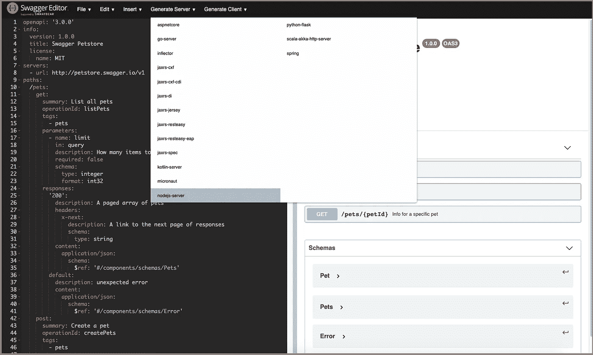
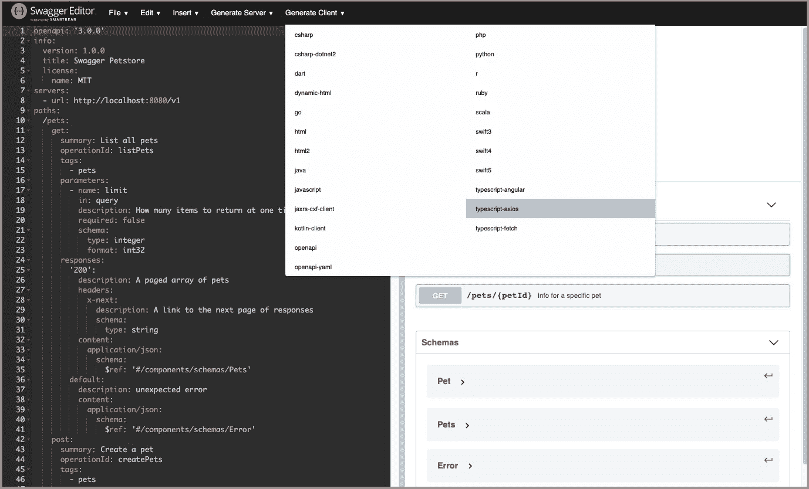
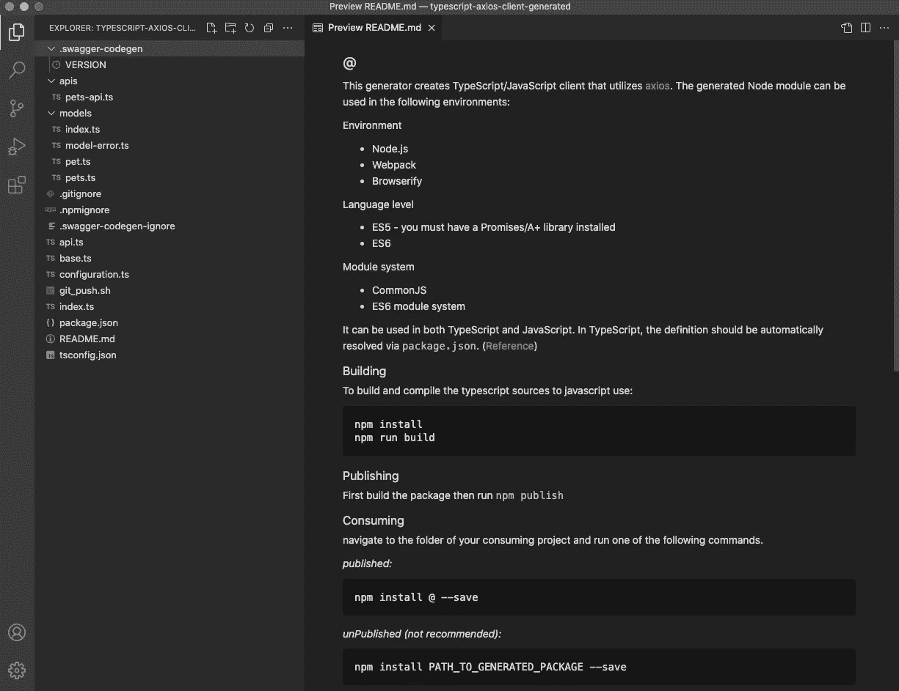
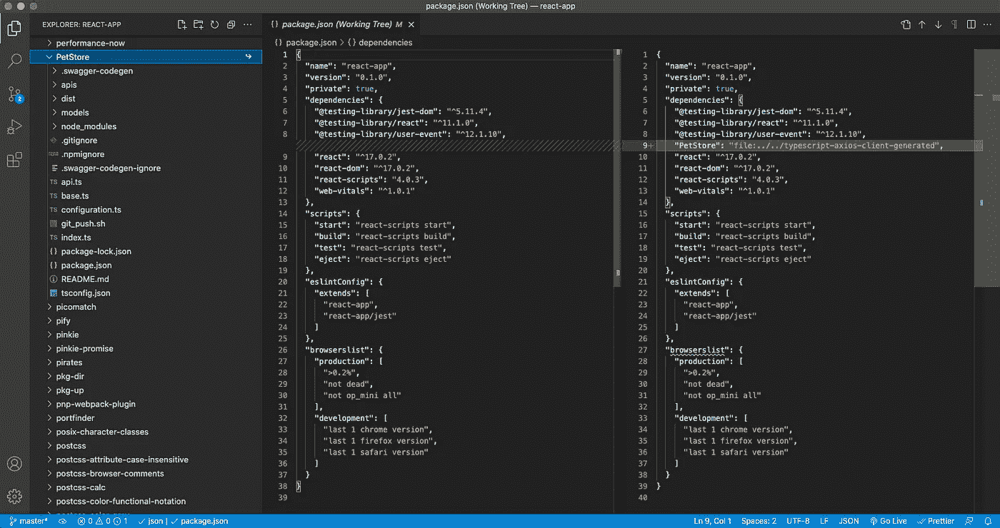
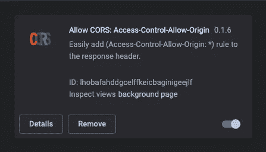
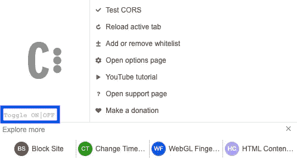
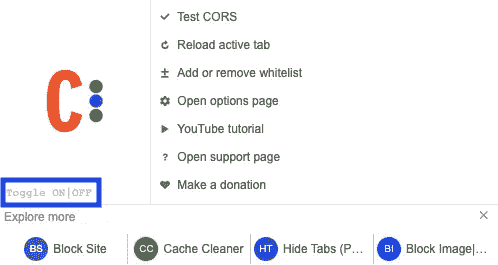
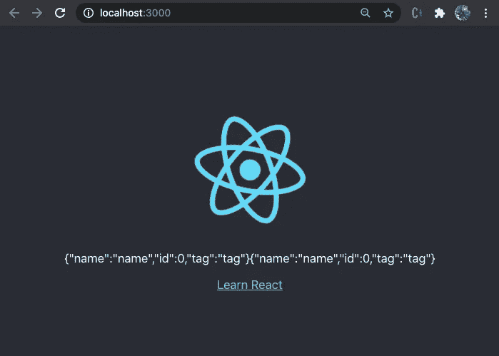

# Swagger Codegen:从服务器到客户端

> 原文：<https://javascript.plainenglish.io/swagger-codegen-from-server-to-client-d6a13910ed1f?source=collection_archive---------4----------------------->

OpenAPI 规范是服务器和客户端的标准。


Image credit: Author

[OpenAPI 规范](https://swagger.io/specification/) (OAS)是机器可读接口文件的规范，用于描述、生产、消费和可视化 RESTful web 服务。它是服务器和客户机的标准。开发人员不需要编写、维护或担心自动生成的代码的一致性。此外，Swagger UI 生成漂亮的文档，并充当 API 端点的测试环境。

除了[open API 规范、Swagger 编辑器和 Swagger UI](https://betterprogramming.pub/should-ui-developers-learn-swagger-d3890c4fdbe8) 之外，Swagger Codegen 还执行以下两个操作:

*   生成服务器存根。
*   生成客户端 SDK。

在本文中，我们将展示它是如何从服务器到客户端工作的。

# OpenAPI 规范

OpenAPI 规范为 HTTP APIs 定义了一个标准的、与语言无关的接口。在整篇文章中，我们将使用下面的 [YAML](https://betterprogramming.pub/is-yaml-ready-for-javascript-b501c7a087c6) 对宠物店的定义。这是 OpenAPI 规范 3.0 中的一个官方例子。

复制粘贴到 web 上的 Swagger 编辑器:`[https://editor.swagger.io/](https://editor.swagger.io/)`。

# 服务器存根的代码生成

Codegen 采用设计优先的方法。它从一个 YAML 或 JSON 文件开始，然后为进一步的编码生成服务器存根。设计优先方法和代码优先方法各有利弊。一般来说，Swagger 社区推荐设计优先的方法。

在[之前的文章](https://medium.com/codex/exploring-swagger-codegen-and-swagger-plugins-a8d507b9fd5e)中，我们已经描述了如何使用 Swagger 编辑器生成服务器存根。点击 Swagger 编辑器的菜单，`Generate Server`，里面显示了很多服务器/框架的选择，比如 Go server、Java server、Scala server、[节点](https://betterprogramming.pub/whats-new-in-node-js-15-fc24e87e2590)服务器。



我们选择`nodejs-server`作为例子。点击`nodejs-server`后，`nodejs-server-server-generated.zip`作为节点/JavaScript 项目下载。它充当 CRUD 操作的简单服务器。

可以在[服务器仓库](https://github.com/JenniferFuBook/nodejs-server-server-generated)获取服务器代码。

# 客户端 SDK 的 Codegen

相同的 Swagger 编辑器可以用于生成客户端 SDK。通常，这些 API 由前端调用来创建用户界面。

点击`Generate Client`菜单，显示 C#、Dart、Go、Java、JavaScript、TypeScript 等多种语言选择。



选择您构建前端的语言。我们选择`typescript-axios`作为例子。点击`typescript-axios`后，在`Downloads`文件夹中生成`typescript-axios-client-generated.zip`。

打开 zip 文件，在 [VS 代码](https://betterprogramming.pub/10-useful-plugins-for-visual-studio-code-6ab62c0b14ee)中显示这个 TypeScript/Axios 项目。



`apis/pets-api.ts`是处理`createPets`(第 51 行)、`listPets`(第 62 行)和`showPetById`(第 73 行)的客户端 SDK。

[上述代码](https://github.com/JenniferFuBook/typescript-axios-client-generated/blob/main/apis/pets-api.ts)的完整版本可在[客户端回购](https://github.com/JenniferFuBook/typescript-axios-client-generated)获取。

`models`文件夹捕获 API 数据结构。

`models/pet.ts`定义了`Pet`接口:

`models/pets.ts`将`Pets`接口定义为`Pet`的数组:

添加第 1 行是为了修复一个编译错误。由于 Swagger 支持如此多的语言，它可能不会对每个版本的所有用例进行全面测试。

按照`README`中的说明构建包。

```
npm install
npm run build
```

首先，我们必须通过添加第 1 行来修复`models/pets.ts`。否则，`npm install`失败。

```
$ npm install
npm WARN deprecated axios@0.19.2: Critical security vulnerability fixed in v0.21.1\. For more information, see [https://github.com/axios/axios/pull/3410](https://github.com/axios/axios/pull/3410)
npm notice created a lockfile as package-lock.json. You should commit this file.
npm WARN typescript-axios-client-generated No repository field.added 6 packages from 45 contributors and audited 6 packages in 5.767s
found 1 high severity vulnerability
  run `npm audit fix` to fix them, or `npm audit` for details
jenniferfu@Jennifers-MBP typescript-axios-client-generated % npm run build> @ build /Users/jenniferfu/typescript-axios-client-generated
> tsc --outDir dist/models/pets.ts:19:37 - error TS2304: Cannot find name 'Pet'.19 export interface Pets extends Array<Pet> {
                                       ~~~models/pets.ts:19:37 - error TS4022: 'extends' clause of exported interface 'Pets' has or is using private name 'Pet'.19 export interface Pets extends Array<Pet> {
                                       ~~~Found 2 errors.npm ERR! code ELIFECYCLE
npm ERR! errno 1
npm ERR! @ build: `tsc --outDir dist/`
npm ERR! Exit status 1
npm ERR! 
npm ERR! Failed at the @ build script.
npm ERR! This is probably not a problem with npm. There is likely additional logging output above.npm ERR! A complete log of this run can be found in:
npm ERR!     /Users/jenniferfu/.npm/_logs/2021-05-16T05_05_14_045Z-debug.log
```

通过修复，我们能够制作软件包:

```
$ npm run build> @ build /Users/jenniferfu/typescript-axios-client-generated
> tsc --outDir dist/
```

有两种方法可以使用这个 SDK:发布软件包或将其用作未发布的软件包。

对于已发布的包，执行`npm install @ —-save`。

对于未发布的包，执行`npm install PATH_TO_GENERATED_PACKAGE —-save`。

发布包是官方途径。但是我们将通过一个未发布的包走捷径。

我们需要解决未发布包的两个问题。

1.`package.json`错过一个包名:

```
$ npm install ~/typescript-axios-client-generated/
npm ERR! Can't install /Users/jenniferfu/typescript-axios-client-generated/: Missing package namenpm ERR! A complete log of this run can be found in:
npm ERR!     /Users/jenniferfu/.npm/_logs/2021-05-16T05_16_42_020Z-debug.log
```

2.`package.json`缺少版本号:

```
$ npm install ~/typescript-axios-client-generated/
npm ERR! Can't install /Users/jenniferfu/typescript-axios-client-generated/: Missing package versionnpm ERR! A complete log of this run can be found in:
npm ERR!     /Users/jenniferfu/.npm/_logs/2021-05-16T05_18_34_562Z-debug.log
```

以下是固定的`package.json`:

此时，生成的客户端 SDK 就可以使用了。

客户代码可在[客户回购](https://github.com/JenniferFuBook/typescript-axios-client-generated)获取。

# 端到端示例

我们使用 [Create React App](https://betterprogramming.pub/upgrade-create-react-app-based-projects-to-version-4-cra-4-d7962aee11a6) 来试用客户端 SDK。

```
npx create-react-app react-app
cd react-app
```

安装未发布的软件包:

```
npm install PATH_TO_GENERATED_PACKAGE —-save
```

在我们的例子中，`PATH_TO_GENERATED_PACKAGE`就是`~/typescript-axios-client-generated`。

这个新包是`package.json`中`[dependencies](https://betterprogramming.pub/package-jsons-dependencies-in-depth-a1f0637a3129)`的一部分(下图，右)。`PetStore`安装在`node_modules`中(左下)，随时可以使用。



以下是改编后的`src/App.js`:

第 1 行导入了`PetStore`API。

第 9–19 行调用`listPets`来检索宠物列表。

第 25 行显示了宠物列表。

确保节点/JavaScript 服务器项目正在运行。在`nodejs-server-server-generated`处，在`localhost:8080`处运行`npm start`。

确保 TypeScript/Axios 项目已经构建并可在`typescript-axios-client-generated`访问。

在修改后的 Create React 应用程序中，在`localhost:3000`处运行`npm start`。

我们同时运行服务器和客户端。为什么我们会在浏览器控制台上看到以下错误？

```
Access to XMLHttpRequest at '[http://localhost:8080/v1/pets'](http://localhost:8080/v1/pets') from origin '[http://localhost:3000'](http://localhost:3000') has been blocked by CORS policy: No 'Access-Control-Allow-Origin' header is present on the requested resource.
```

[同源策略](https://developer.mozilla.org/en-US/docs/Web/Security/Same-origin_policy)是一种关键的安全机制，它限制从一个源加载的文档或脚本如何与另一个源的资源交互。如果两个 URL 的协议、端口和主机相同，则这两个 URL 具有相同的来源。`localhost:8080`和`localhost:3000`端口不同。因此，浏览器限制客户端获取数据。

[跨源资源共享](https://en.wikipedia.org/wiki/Cross-origin_resource_sharing) (CORS)是一种机制，允许从提供第一资源的域之外的另一个域请求网页上的受限资源。

有许多方法可以设置 CORS。我们使用一个 Chrome 扩展，`Allow CORS: Access-Control-Allow-Origin`。



它可以打开或关闭 CROS。



通常情况下，CROS 因网络安全而关闭。当它打开时，C 图标变成红色作为警告。



当 CORS 选项打开时，控制台上的访问错误消失。我们在用户界面上看到检索到的宠物列表。



端到端的例子有效！

# Codegen CLI 命令

我们使用图形用户界面来生成服务器存根和客户端 SDK。Codegen 提供了 CLI 命令来完成同样的事情。CLI 命令要求系统上安装 Java。

```
sudo apt install default-jdk
```

`swagger-codegen-cli`可以从[jar 下载页面](https://jar-download.com/?search_box=swagger-codegen-cli)下载。目前，最新版本是`swagger-codegen-cli-3.0.25.jar`。它支持以下语言和 web/应用服务器:

```
dart, aspnetcore, csharp, csharp-dotnet2, go, go-server, dynamic-html, html, html2, java, jaxrs-cxf-client, jaxrs-cxf, inflector, jaxrs-cxf-cdi, jaxrs-spec, jaxrs-jersey, jaxrs-di, jaxrs-resteasy-eap, jaxrs-resteasy, micronaut, spring, nodejs-server, openapi, openapi-yaml, kotlin-client, kotlin-server, php, python, python-flask, r, ruby, scala, scala-akka-http-server, swift3, swift4, swift5, typescript-angular, typescript-axios, typescript-fetch, javascript
```

该列表是服务器存根和客户端 SDK 的组合。它与图形用户界面选项略有不同。

Codegen CLI 有许多选项。其中，以下选项至关重要:

*   `-i`:swagger 规范的位置，如 URL 或文件(必需)
*   `-l`:生成的客户端语言(必填)
*   `-o`:生成文件的写入位置(默认为当前目录)

下面是一个从`~/petstore.yaml`中读取 YAML 文件并在`swagger-codegen-client`文件夹中生成 Java 代码的例子。

```
java -jar swagger-codegen-cli-3.0.25.jar generate -i ~/petstore.yaml -l java -o swagger-codegen-client
```

# 结论

OpenAPI 规范是服务器和客户端的标准。我们已经展示了如何使用 Swagger Codegen 从服务器到客户端生成代码。它提供了一种标准化和加速 web 应用程序开发的系统方法。

Swagger Codegen 支持主要语言和 web/app 服务器。它带有图形界面和 CLI 命令。

感谢马克西姆·库兹涅佐夫和朱利奥·卡波利诺向我展示了斯瓦格的迷人之处！

感谢阅读。我希望这有所帮助。你可以在这里看到我的其他媒体出版物。

*更多内容尽在*[plain English . io](http://plainenglish.io/)