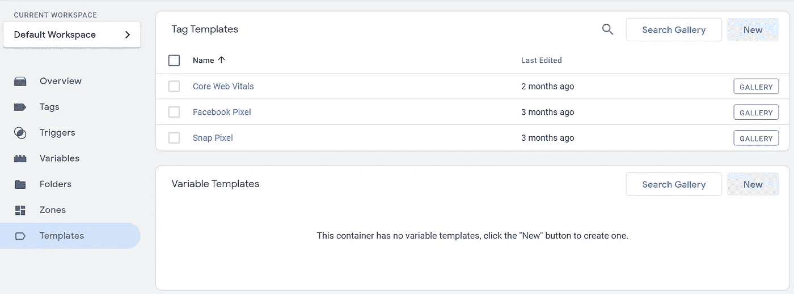
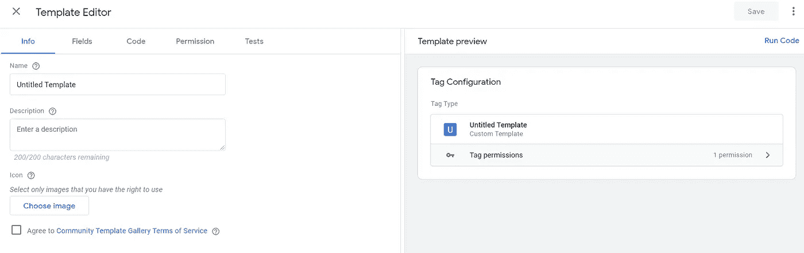
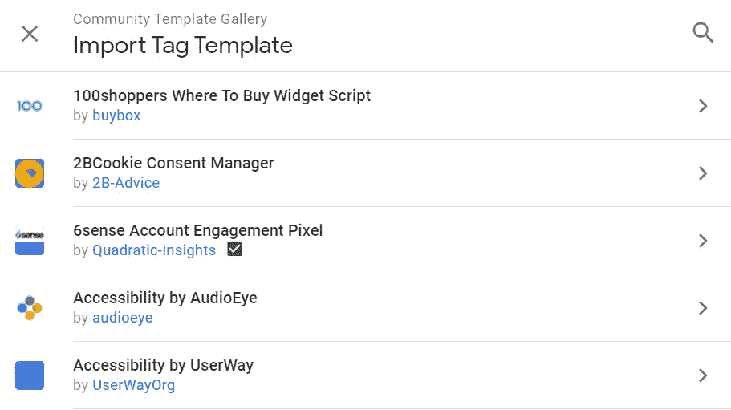

# 标签管理器服务和网站安全:使用 GTM 和 CSP

> 原文：<https://javascript.plainenglish.io/tag-manager-services-and-website-security-using-gtm-with-csp-5749a610c600?source=collection_archive---------6----------------------->


Photo by [Michał Jakubowski](https://unsplash.com/@jaqbovsky?utm_source=unsplash&utm_medium=referral&utm_content=creditCopyText) on [Unsplash](https://unsplash.com/s/photos/security?utm_source=unsplash&utm_medium=referral&utm_content=creditCopyText)

如果你想让你的网站免受[跨站脚本](https://owasp.org/www-community/attacks/xss/) (XSS)的攻击，一个主要的防御来源是[内容安全政策](https://developer.mozilla.org/en-US/docs/Web/HTTP/CSP)标题。然而，如果你使用标签管理器服务(TMS)，比如[谷歌标签管理器](https://support.google.com/tagmanager/answer/6102821?hl=en) (GTM)，你可能会遇到一些实现上的挑战。本文探讨了这些挑战，并提供了经过充分测试的解决方案。

## 什么是 GTM？

Google Tag Manager 是一个工具，它允许人们管理给定网站上的第三方脚本，而无需更改应用程序本身的代码。营销人员通常使用它来添加跟踪和广告脚本，并且可以由专业个人或组织来管理。

## CSP 是什么？

[内容安全策略](https://developer.mozilla.org/en-US/docs/Web/HTTP/CSP)是一个 HTTP 头，允许开发者将网站资源列入白名单，这样只有被批准的资源才能在给定的范围内加载和运行。它是对抗 XSS 的一个非常强大的工具，因为它可以通过允许您特别列入白名单的资源运行来防止潜在的恶意代码在您的站点上执行。[参见这里的一些实现示例](https://content-security-policy.com/examples/)。

如果你的网站有一个有效的 CSP，它将防止两个关键漏洞被利用:*不安全内联*和*不安全评估*。它们是这样工作的:

**1。不安全评估。**默认情况下，CSP 会阻止使用 JavaScript 的 *eval* 方法，该方法可以执行字符串中的代码——这是一种常见的攻击方法。通过添加 *unsafe-eval* 关键字*到 y* 我们的策略，它将允许 eval 的使用。

**2。不安全-内嵌。**同样默认情况下，CSP 将阻止任何内联脚本的执行，除非这些脚本通过 *nonce* 或 *hash* 值被允许(见下文)。通过将 *unsafe-inline* 关键字添加到您的策略中，它将允许任何内联脚本运行，不管它是如何添加的。

# GTM 和标签管理服务的问题

通过将 TMS 添加到您的站点，您可能会创建一个后门，允许人们在没有通过质量检查的情况下将代码添加到您的站点，而质量检查可能是您的应用程序生命周期过程的一部分。这可能会产生一系列问题，从覆盖全局变量到站点性能下降和安全漏洞。

关于*谁*应该拥有标签实现的争论已经超出了本文的范围，所以让我们假设所有的利益相关者都同意使用 GTM，并且你有一个很好的变更管理流程，通过它添加的每个第三方脚本在上线之前都经过了评估。

## GTM 和 CSP 的问题

GTM 本质上是在网站中编写新的脚本。一位评论员将 GTM 描述为“XSS 即服务”，这既有趣又令人不安。与 10 年前相比，在我们生活的世界中，由于客户端脚本的数量，攻击面通常很大。这意味着我们的 CSP 需要尽可能强大。

允许任何内联脚本被动态注入到您的站点或者允许使用`eval`的内容安全策略是非常脆弱的。

# 解决方案

为了配置一个有意义的 CSP，使其不会阻塞 GTM 动态添加的资源，您需要执行以下操作:

## 不安全评估

解决方案的第一部分集中在`eval`的使用上。GTM 中的定制脚本经常在运行时使用`eval`来评估字符串，所以你的 CSP 需要通过`unsafe-eval`来允许这一点，如前所述这会削弱你的策略，所以我们需要一种方法来避免这种情况。幸运的是，GTM 发布了*定制模板*，它允许您构建定制脚本，同时避免运行时字符串求值。这是通过让 GTM 在编译时而不是运行时构建模板来实现的。



GTM Custom Templates



The GTM Custom Template Editor allows you to create and test a template prior to release

请记住，自定义模板使用的 JavaScript 沙盒版本[仅限于某些 API](https://protect-eu.mimecast.com/s/z0zpC7ppxuAQ6xnT8Id_d)，可以在这里找到。其中一些 API 使用 document 对象，这意味着一些定制 JavaScript 变量的功能不能使用定制模板来复制。

自定义模板中应用了许多抑制，以避免破坏自定义模板使用的沙盒环境。也就是说，越来越多的 API 正在这个沙盒环境中逐渐变得可用。



There are a whole host of templates available in the community gallery, covering an ever increasing range of tools, technologies and platforms.

## 不安全-内嵌

我前面提到过，可以使用一个 *nonce* 或 *hash* 值将内联脚本列入白名单。哈希值更容易实现，但更难维护——如果内联脚本发生任何变化，哈希值将无效，您必须生成一个新的哈希值。由于 nonce 更加灵活，并且可以传递给动态添加的脚本，我将重点关注该解决方案，然而，这里有一个关于哈希实现的简短的[指南](https://content-security-policy.com/hash/)。

Nonce 表示一个使用过一次的数字。如果您以前没有实现这一点，那么您需要配置您的服务器，以便在每次页面加载时生成一个唯一的字符串。有很多关于如何做到这一点的资料，但这里有一些有用的链接:

*   [Nginx](https://scotthelme.co.uk/csp-nonce-support-in-nginx/)
*   [阿帕奇](https://www.freshleafmedia.co.uk/blog/apache-csp-nonce-inject-static-site)
*   [。网络](https://github.com/andrewlock/NetEscapades.AspNetCore.SecurityHeaders)

一旦工作正常，确保 nonce 值被添加到您的内联脚本中

`<script nonce="<base64-value>*"*>`

其中 *< base64-value >* 是您的服务器在 CSP 白名单中生成并输出的值，如下所示

```
Content-Security-Policy: script-src nonce-<base64-value>
```

接下来，你需要使用“nonce-aware”GTM 脚本，如 Google here[https://developers.google.com/tag-manager/web/csp](https://developers.google.com/tag-manager/web/csp)所述。这将确保标准脚本接收 nonce 值，并因此被列入您的 CSP 的白名单。

测试您的 CSP(使用*只报告*模式，如果您不希望它阻塞您的测试环境中的任何东西)，然后将 GTM 加载的资源使用的任何主机列入白名单。

如果您的 GTM 配置使用定制的 HTML 标签，您仍然会有问题，因为它不会将`nonce`传播给它们。为此，您必须首先配置您的 GTM 脚本标签:

1.  与您的任何内联脚本一样，添加`nonce`属性和值，以便将其列入白名单
2.  向 GTM 脚本标签添加一个 ID，供其引用。
3.  另外，添加一个数据属性来存储生成的随机数，例如`data-nonce="*your nonce value here*"`。GTM 将使用它来读取服务器输出的 nonce 值。在一些浏览器中，比如 Chrome，GTM 不可能直接从`nonce`属性中读取，因为它被屏蔽了。

您的内联 GTM 脚本标记现在应该如下所示:

`<script nonce=”*your nonce here*” id=”your chosen ID here” data-nonce=”*your nonce here*”>`

然后通过其门户配置 GTM

1.  创建一个捕获随机数的新变量。使用 *DOM 元素类型*，选择`data-nonce`属性
2.  更新每个自定义 HTML 脚本的脚本标记，以引用 nonce 属性并存储上述变量的 nonce 值。
3.  设置每个自定义的 HTML 标签来支持`document.write`
4.  如果在脚本中创建脚本，则创建一个单独的`nonce`属性，并按照上述变量存储 nonce 值

然后测试您的应用程序，确保 CSP 没有阻塞任何 GTM 加载的脚本。如果您没有为 GTM 设置不同的环境，我建议您这样做。

# 结论

现在应该很清楚为什么 GTM 和 CSP 默认情况下合不来，以及你可以做些什么来让它们很好地合作。

虽然上面列出的解决方案应该在大多数情况下都有效，但可能值得考虑在标准软件开发过程中管理标签，以便降低未经测试的第三方脚本带来的问题风险。

*感谢*[*rocket mill*](https://www.rocketmill.co.uk/)*的 Neil Barnes，他对本文进行了同行评审，贡献了 GTM 内容，并与我合作开发了一个工作解决方案。*

*更多内容请看*[*plain English . io*](http://plainenglish.io/)