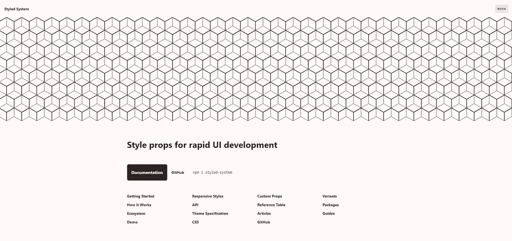
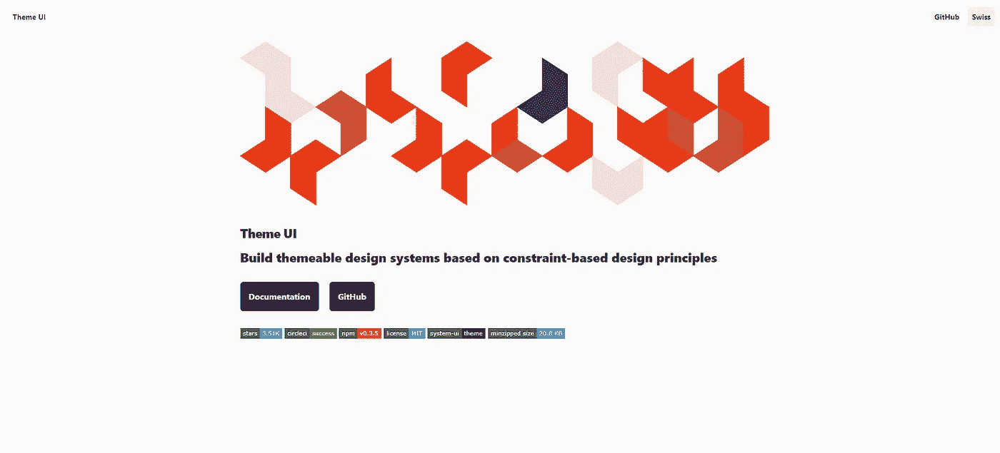
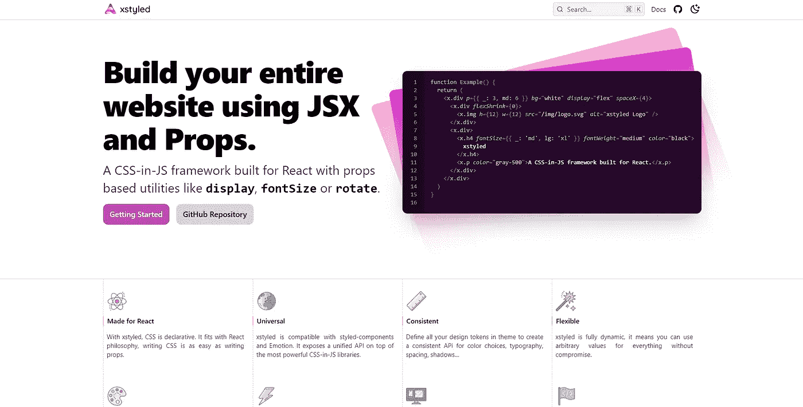
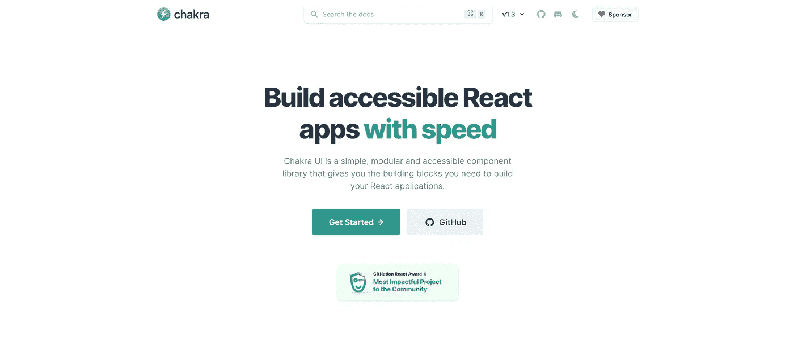

# 顺风 JSX 与班级作文

> 原文：<https://javascript.plainenglish.io/tailwind-jsx-and-class-composition-e62946f030f7?source=collection_archive---------16----------------------->

在[我初看](https://areknawo.com/my-mixed-feelings-about-tailwind-css/)在[顺风 CSS](https://tailwindcss.com/) 之后，就没怎么用过了。正如我在以前的博客中所说，我对顺风的感觉是复杂的。我欣赏实用优先、受约束的设计，但不喜欢它的类如何“膨胀”我的 HTML 代码，也不喜欢它的配置过程如何乏味。

# 顺风 2.0 版

话虽如此，我在开发我的产品时又看了一眼 Tailwind—[code write](https://codewrite.io)(开发人员的博客工具)。我用 Vue 3 构建了它，由于当时没有任何好的 UI 库，我决定用 Tailwind。

现在在 [v2.0](https://blog.tailwindcss.com/tailwindcss-v2) 中，Tailwind 没有太大变化。然而，在经历了最初的配置痛苦之后，我体验了在中等规模的代码库中使用它的感觉。老实说，这是非常好的！我通过修改我的格式配置绕过了`className`“膨胀”,并且在 **WebStorm** 中为 Tailwind 类提供了良好的自动完成功能，工作流非常流畅。

# 班级作文

然而，随着项目的发展，一个新的问题出现了，它与创建新的组件有关。

在 Vue 中，有一个很好的特性，可以自动将 DOM 属性传递给顶层组件节点，我经常使用它。这可能不是最佳实践，因为它可能对可伸缩性不利，但是如果您正确使用它，它可以创造奇迹。

也就是说，顺风并不容易。因为所有的实用程序类都是自动排序的，所以当你想改变`Button`组件的填充时，你不能覆盖“默认”类。

许多顺风用户都[知道这个实用程序类组合的问题。可悲的是，没有明确的解决方案，所有可用的都只是一堆变通办法。除非 Tailwind 的架构或 CSS 的本质发生了变化(不确定)，否则我们只能使用现有的东西。](https://github.com/tailwindlabs/tailwindcss/discussions/1446)

## 变通办法

那么，我们如何解决这个问题呢？嗯，有几种方法，从完全放弃课堂作文开始…

**弃课作文**

如果没有类组合，您将失去一些灵活性，并且不得不编写一些额外的代码。然而，它也可以引导您为您的组件创建一个更加稳定和可伸缩的基础。

那是我走的路线。我分析了改变组件以适应所有用例的所有方法，并将它们集成到基于 prop 的配置中。然后，这个配置与一个小的实用函数一起用于生成最终的`className`字符串。

**@应用指令**

另一个解决方案是使用`@apply` [指令](https://tailwindcss.com/docs/functions-and-directives#apply)提取组件的基本样式(在其他 Tailwind 类之前)。这样，您就可以随时轻松地覆盖样式。

但是，您仍然只能进行一次覆盖，这种解决方案会将您的 CSS 实用程序类从您的 HTML/JSX 剥离到外部 CSS 文件中，这可能不是您想要的。

**twin.macro**

最后，你可以使用一个名为 [*twin.macro*](https://github.com/ben-rogerson/twin.macro) 或类似的库。它*“融合了 Tailwind 的魔力和 CSS-in-JS 的灵活性*它是一个 [**Babel 宏**](https://github.com/kentcdodds/babel-plugin-macros)——一种在编译时由 Babel 处理的实用函数，其结果会直接插入到您的代码中。在这种情况下，它将 Tailwind 实用程序类处理成 CSS 字符串，可以与您选择的 CSS-in-JS 库一起使用(`emotion`、`styled-components`、`goober`)。

其工作方式是，使用 CSS 字符串，您本质上做一些类似于`@apply`指令的事情，但是在 JS-Babel 宏级别。使用生成的 CSS 字符串和 CSS-in-JS 的强大功能，您可以创建一个新的 CSS 类——一个不会与它后面的任何类发生冲突的类。

这种方法真正解决了构图问题。它确实涉及更多的运行时处理，并且需要使用 Babel 宏，但是可以为您的代码增加很多灵活性，并且没有任何其他缺点。

# 运行时顺风

所以，看起来`twin.macro`很有优势。不如我们更进一步？

显然， **CSS-in-JS** 是顺风中的类组成的解决方案。然而，`twin.macro`仅仅是抓伤了它的潜力，被巴别塔宏的可能性所限制。您必须正确地导入它(常量`import tw from 'twin.macro'`，在每个文件的顶部，没有自动插入或重新导出它的可能性)，并且自动完成是有缺陷的。当然，它节省了一些运行时性能，但是如果我们愿意牺牲它来获得更好的开发体验呢？

你对假设的*《顺风 JSX》*有什么看法？一个库，在这里你的类实用程序变成了 JSX 道具，一个与你选择的 JS 框架完美集成的库，在 TSX 时提供了强大的自动完成功能，并且由于 CSS-in-JS 的强大功能，可以很容易地编写？

“顺风 JSX”并不存在，但是有一些图书馆做着我刚刚描述的事情——让我们去看看吧！

# 风格化的系统/主题用户界面

Styled System landing page

[**Styled System**](https://styled-system.com/) 是一个利用道具进行 UI 开发的 React 库。

有点像顺风，但对 JS 来说。它允许你为“受约束的设计”定义一个主题，创建可以在整个 UI 中使用的自定义道具，并以用户熟悉的方式完成所有这些——通过**道具**和 [*样式化组件*](https://styled-components.com/) 。

可悲的是，风格化系统的开发似乎有点过时了。 [**主题 UI**](https://theme-ui.com/) 可以认为是它的“精神继承者”。

Theme UI landing page

它由同一个系统 UI 团队开发，有更多的功能，但是使用了一个`sx`道具，而不是像它的前身那样使用多个。

就我个人而言，我更喜欢风格化系统的方法，但是主题用户界面还是很不错的。

# XStyled

XStyled landing page

现在， [**XStyled**](https://xstyled.dev/) 差不多是你能得到的最接近“官方”顺风 JSX 的了。它的文档看起来很熟悉，作者[公开陈述了](https://xstyled.dev/docs/introduction/)它的顺风灵感。

XStyled 与 React 和*风格化组件*或*情感*一起作为“插件”放在它们上面。它的功能与 Tailwind 和 Styled 组件非常相似——您已经有了所有的“实用道具”,您可以在以`x`命名的元素上使用它们，并且还有一个用于约束设计的配置。

XStyled 很快引起了我的注意。它的文档很详细，打字稿自动补全功能也很有效。

然而，在使用 Tailwind 之后，有些实用程序的名称非常冗长，我无法习惯。例如，我不得不像在《顺风》中那样使用`position=”fixed”`而不是`fixed`，但这只是一个你可以忽略的吹毛求疵。

# Chakra UI

Chakra UI landing page

最后， [**Chakra UI**](https://chakra-ui.com/) 是其中最受欢迎的(至少基于 GitHub stars)——这是有原因的。它就像是前面提到的所有库的最佳组合，在它上面有一个完整的 UI 库！

Chakra UI 结合了类似于 XStyled 中看到的“实用工具-道具”(但这次用了更多的快捷键— `position = pos`)，以及 Styled 系统中的简单配置，还有额外的`sx`道具以防你需要。所有这些，还有一个现成的、可访问的、高度可配置的组件库(他们可以使用所有的实用工具)。基本上，这是一个一体化的包，包含了你想从基于运行时的 Tailwind 的最佳版本中得到的一切！

因此，您已经有了创建您可能想要的组件的所有方法，您已经有了一个现成的组件的大集合，以及一系列其他特性。TypeScript 支持非常好(甚至有一个[特殊的 CLI 工具](https://chakra-ui.com/docs/theming/advanced#theme-typings)来为不可能生成类型的地方生成类型)，我想我唯一的抱怨是它只适用于 React。

# 结论

你对所有这些基于 JSX 的运行时顺风替代品有什么看法？

就我个人而言，我认为他们真的有所发现。他们提供的开发体验只是在另一个层面上。Chakra UI 显然是最好的，但其他人都很接近。

尽管如此，顺风公司仍有很多优势。它是所有软件中最不冗长的，它的命名方案使用起来很棒，也很容易记住，它不涉及任何 JavaScript 处理，而且——对我来说最重要的是——它是独立于框架的。

因此，由于我对 Vue 3 的热爱，我将坚持使用 Tailwind 和我自己的类编写工具。我可能会考虑使用`twin.macro`或者甚至建造“我自己的脉轮 UI ”,但是对于 Vue 来说，那是遥远的未来。

此外，要了解更多的 web dev 和 Tailwind 内容，请在 [Twitter](https://twitter.com/areknawo) 、[脸书](https://www.facebook.com/areknawoblog)或通过[我的简讯](#newsletter)关注我。感谢阅读，并有一个不错的编码！