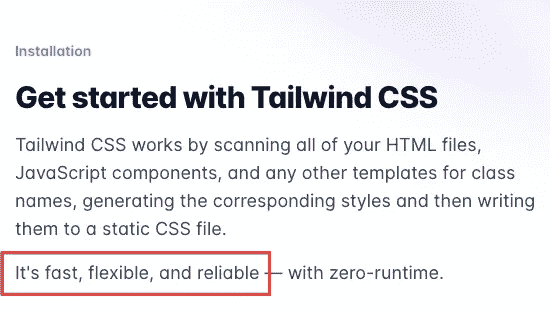

# 顺风 CSS vs Bootstrap:你该选哪个？

> 原文：<https://javascript.plainenglish.io/tailwind-vs-bootstrap-which-one-should-you-choose-8186f765e6ab?source=collection_archive---------1----------------------->

## 但首先，这是一个公平的比较吗？

If you are using VSCode, [Intellisense is a must-have extension](https://github.com/tailwindlabs/tailwindcss-intellisense) to help you with Tailwind.

当我开始开发我的第一个网站时，我正在为一个问题而挣扎，这个问题在我之前很多人都面临过，而且很多人在相当长的一段时间内还会继续面临。

我应该选择自举还是顺风？

看过几个顺风 dev 的视频，我就偏了。然而，我相信我花了一些时间寻找“正确”的答案。

我很快解决了这个疑问，决定支持顺风。但这是很多开发者都有的疑问。所以今天让我们来看看，哪一个对你来说更有意义。

剧透警告:是顺风。就用顺风吧。

# 顺风与自举并不是一个公平的比较

是的。Tailwind 和 Bootstrap 都是 CSS 框架。但是，如果你仔细想想，Bootstrap 介于 CSS 框架和 UI 工具包之间。

如果你想构建一个导航栏，或者一个按钮，甚至一个卡片，你可以在 Bootstrap 中简单地从他们的文档中复制粘贴几行代码。

Bootstrap 的文档提供了一堆可以在您的代码中使用的组件。你只要把它放进去，就大功告成了。现在，这听起来很像一个 UI 工具包，不是吗？

只要您在 Bootstrap 为其内置组件设置的参数范围内工作，您就是黄金级的。但是，当您希望对它进行任何更改时，它又回到了编写 CSS 和媒体查询的状态。

老实说，Bootstrap 所遵循的方法对网页设计来说是一件伟大的事情。我们已经见证了无数建立在这些原则之上的令人惊叹的网络平台，Bootstrap 在引领快速响应的网络设计时代方面有一些当之无愧的功劳。

但是新鲜感逐渐消失，问题越来越突出。

虽然您的网站看起来和运行起来都很棒，但是您受到了 UI 工具包设置的规则的严重限制。

您能够创建响应式设计，并以越来越少的代码包含您需要的任何和所有组件。但是，当您需要以 UI kit 规则不支持的方式定制它们时，您需要卷起袖子，开始编写自己的媒体查询和样式。

定制是一件麻烦事。但是，归根结底，我们都喜欢的 Bootstrap 的这一部分是一个 UI 工具包。因此，可以理解的是，它是在其预先定义的参数内工作的。

另一方面，顺风不会束缚你。

没有预定义的组件可言。所以，你用来赋予卡片背景颜色或边框半径的类也将被用来赋予按钮这些属性。

这意味着，虽然习惯 Tailwind 遵循的类命名约定需要一些时间，但是一旦你习惯了，开发就会变得更快。分配给 div 和按钮的类名取决于您希望分配给这些元素的可视属性，而不取决于元素的实际内容。

这一点上的不同很快使 Tailwind 成为粉丝的最爱，这就是为什么你会看到越来越多的网站和个人创业者使用它来做生意。

那好吧。抛开这些不谈，让我们来探讨一下顺风和自举之间的一些显著差异。我们甚至会回顾一些例子来说明使用 CSS 框架(tailwind)比使用 UI 工具包(*，我认为 Bootstrap 应该更准确地称为*)的优势

我们还会注意到这样一个事实，即 Tailwind 是一个相当新的框架，我们每天都会看到它的发展。

# 什么是顺风 CSS？

那么，如果我们继续下去，声称 Tailwind CSS 不是一个 UI 工具包，那么它到底是什么呢？

根据他们的官方文档，这是一个实用优先的 CSS 框架，旨在快速构建自定义用户界面。

就在那里。在那个自称的定义里，他们已经把一切都说清楚了。

顺风是:

*   构建时牢记快速原型
*   专为以极快的速度设计网站而打造
*   构建时谨记一个事实，即设计师喜欢定制组件，而不是开箱即用

如果你注意到，快速和灵活的部分。他们一再强调这一点。

> 如果你曾经在你的 html 中写过内联样式，你可以把 Tailwind 想成类似的东西…减去所有必须内联编写的 CSS。*😀*
> 
> 现在，你不用写内联 CSS，而是写内联类名。然后 tailwind 接手为你写那些 CSS。你永远不需要自己写一行 CSS 代码。

## 使用顺风有什么坏处吗？

嗯，是的！如果你习惯于使用基于"*类名*的方法来编写你的 html 文件，你可能会习惯于一个比 Tailwind 更干净的 html 文件。

由于您不断地根据您希望每个元素的外观、感觉和行为添加实用程序优先的 Tailwind 类，您最终会得到一个在纸面上看起来更加繁忙的 html 标记。

# 在顺风设计响应式网站有多容易？

就使用框架的响应特性而言，您可能会发现两者非常相似。

就个人而言，我发现 Tailwind 非常有助于响应式网页设计。基于预定义的断点，您可以随意更改任何内容。

(*你甚至可以很容易地定义自己的自定义断点，但是对于大多数开发人员和大多数用例来说，这个需求可能永远不会出现。*)

# 顺风可以根据你的喜好定制

大多数开发人员将 Tailwind 的可定制性吹捧为其最大的优势，胜过你可能认为是 CSS 框架的任何其他东西。

他们没有错。

Tailwind 让你可以根据自己的喜好定制一个全新的类，同时保留相同/相似的命名约定。

例如，虽然 Tailwind 提供了几种不同的字体大小(text-base、text-sm、text-xs、text-lg、text-xl、text-2xl 等。)，它们并不完全是我在项目中的一些需求所需要的。所以我简单地创建了两个新的变体:text-xxs 和 text-xxxs，瞧，我都准备好了。

酪正如我之前所说的，这不是你经常需要的东西，大多数时候，开箱即用的东西足以帮助你完成整个项目。

# 为什么选择 Tailwind 而不是 Bootstrap、布尔玛或其他 UI 套件？

Bootstrap 的支持者会说，你甚至可以通过用你自己定制的 CSS 覆盖框架来定制预先设计的 Bootstrap 组件。

他们是对的。这种选择肯定存在。

但是如果你这样做的次数足够多，一个非常基本的问题就会出现。

如果你在使用 UI 工具包(*或框架，取决于你想把 Bootstrap 称为什么*)之后还要写那么多自定义 CSS，那么一开始真的值得使用 UI 工具包吗？

您正在引入一个庞大的外部库，最终编写一堆定制代码，而且您甚至没有节省时间。更糟糕的是，您现在已经增加了需要担心的文件数量！

# 顺风让你改变你想要的，而不影响其他元素

如果您正在使用预定义的类，那么如果您定制该类，您可能会弄乱使用该类名的所有其他元素的外观。

因为您是为 Tailwind 中的每个元素单独定义类，所以您可以更改某个特定元素的外观，而不会导致站点范围的设计更改。

这是一把双刃剑。

这也意味着如果你想(*或者更糟，不得不*)改变一组特定元素的外观，你将需要改变所有地方的设计。

不过，如果您使用 React、Vue 之类的 javascript 框架，或者他们自己的框架 Nextjs 和 Nuxtjs，有一种更好的方法。

javascript 框架遵循组件模型。这意味着您可以定义一个按钮组件，并在任何需要放置按钮的地方使用该组件。

当你这样做时，事情就变得简单了。当你需要改变任何元素的外观时，比如说一个按钮，你需要做的就是改变组件中与它相关的类，它会在任何地方改变。

一致地。

但是它并没有真正帮助我们之前的用例，我们想改变按钮在一个地方的外观，而这种改变不会影响它在其他地方的外观。

好吧，你可以这样做，比如把那个特定属性留空，然后在使用组件的时候定义它。这样，您就有了一个组件的空白模板，该模板在使用时被赋予特定的属性。

(*当我知道我需要在设计中的不同地方使用不同大小的 svg 图标时，我最常使用这种方法。*)

# 顺风和自举哪个更容易？

如果你来自 Bootstrap 的世界，Tailwind 将需要一些时间来适应。一开始你甚至会讨厌它。我的建议？给它一些时间！

Bootstrap 基本上是基于组件的。它提供了一整套组件，此外，您还可以使用各种工具来设计您的元素。

Tailwind 没有内置组件这个简单的事实可能会被视为一个明显可笑的疏忽。它不是。

与使用 Bootstrap 相比，使用 Tailwind 与编写常规 CSS 有更多的相似之处。

如果你只想使用 Bootstrap 的预建组件，那么 bootstrap 确实非常强大。因为它是在牢记最终输出的基础上完成的，只要你不需要对你的设计进行定制化的修改，你就很少需要编写 CSS。

另一方面，当你使用 Tailwind 的时候，因为你是从零开始设计你的元素，所以对你的最终设计进行任何改变和定制会更加容易、直观和自然。

# 结论

使用 Tailwind 非常灵活，它确实使开发更加直观、快速，并且更能适应开发人员的需求。由于您使用的是一组实用程序类，所以最终的 CSS 只包含您需要的属性。

我不会详细介绍如何在项目中安装 Tailwind，或者如何定制它的内置类，或者用 CSS 类和属性扩展它，因为:

a.[他们的文档](https://tailwindcss.com/docs)很好地涵盖了所有内容。

b.定制它的内置类并用 CSS 属性扩展它是你很少需要的事情。

# 2022 年你打算成为前端开发者吗？

去年，我决定学习编码。从那以后，我设计了无数的网站，集成了各种 API 以满足不同用例的需求，并构建了不同复杂度的系统。

每个系统都不同。当他们需要时，我为他们设计后端的方式是不同的。

不过有一点是始终如一的，那就是每一款车的前端都是用 Tailwind 打造的。

我正在把我学到的东西总结成一本初学者友好的书。它遵循了我所知道的对新开发人员来说最快、最简单和最有效的方法。我知道这一点，因为我遵循了我在书中概述的完全相同的方法。

如果你想得到这本书的提前版本，请给我发一封电子邮件。这本书包含几十个后续教程，在这些教程中，我们将设计从一些最受欢迎和设计良好的网站中挑选的组件。当你读完这本书的时候，你将能够立刻设计你遇到的任何网站。

提前获得这本书会让你在最终价格上节省 50%,并获得终身更新，以及一堆其他赠品。

[抓住它。😉](mailto:pirennesalvor@gmail.com)

今天到此为止。下次再见，保重！

*更多内容看* [*说白了。报名参加我们的*](http://plainenglish.io/) [*免费周报*](http://newsletter.plainenglish.io/) *。在我们的* [*社区*](https://discord.gg/GtDtUAvyhW) *获得独家写作机会和建议。*