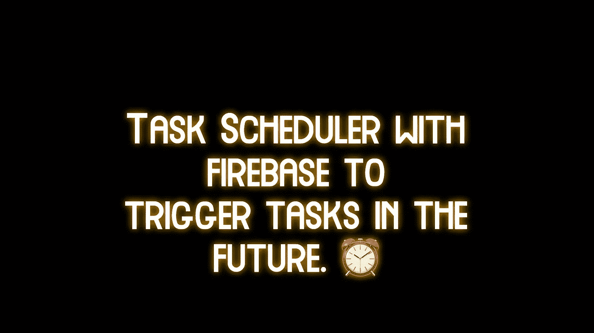
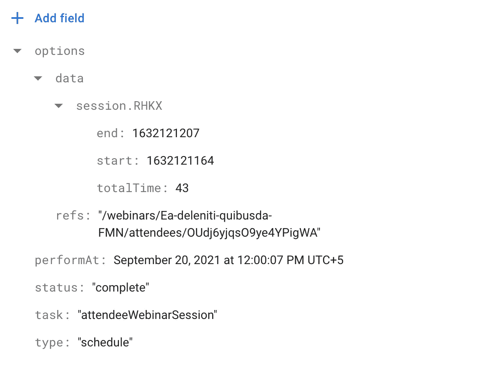
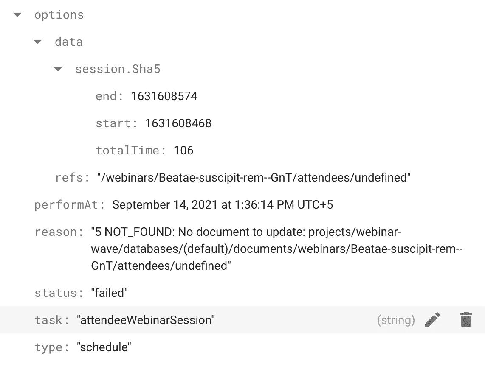

# 带有 Firebase 的任务调度程序，可触发日常任务

> 原文：<https://javascript.plainenglish.io/task-scheduler-with-firebase-to-trigger-everyday-tasks-7a2d53c26521?source=collection_archive---------14----------------------->



要详细说明什么是任务调度器，可以把它看作一个在特定时间运行并执行特定任务的核心作业。Google 实际上有一个云调度器，但这需要额外的知识，所以在这篇文章中，我将写一下如何通过使用云功能和 Firestore 来实现它。

为了给你一些你想要使用任务调度器的例子，假设你有一个图片上传功能，但是事情是这样的，为了在工作完成后节省空间，你可能想要删除文件。对吗？而不是在工作完成后，也许你想在工作完成后将它保存在你的系统中一天。你可以在工作完成后立即执行一个任务来删除图像，这将会非常完美，但是在没有交互的情况下过一段时间或一段时间后再执行是不可能的，除非你有某种 corn-job。

因此，解决这个复杂问题的秘诀是首先考虑需要完成的任务列表，一旦完成，我们可以随时将状态更改为“已完成”。

那么我们有:
- **类型**的任务。
-这是什么样的**任务**。
-其当前**状态**是什么。
-何时执行 **-执行时需要传递给什么**选项**。**

**在收集上述数据之前，假设我们有一个每分钟运行一次的云函数。让我们来看看编写一个函数的代码，这个函数将在每一分钟后运行。**

```
// The stars indicate an expression, you can look this link up [Crontab.guru - The cron schedule expression editor](https://crontab.guru/#*_*_*_*_*)exports.taskRunner = functions.pubsub.schedule('* * * * *').onRun(Firestore.taskRunner)const taskRunner = () => {
}const Firestore = {taskRunner}
```

**上面的代码声明了一个每分钟运行一次的函数，你可以通过上面给出的链接更改时间来创建另一个表达式，所以如果我每次都运行它，你可以让它每 5 分钟或每天运行一次，这完全取决于你。**

**下一步是编写一个函数来帮助我们添加任务。我们来看下面这个函数写任务的代码。**

```
exports.addATask = functions.https.onRequest(Firestore.addATask);const addATask = async (req, res) => {const { type, status, task, data, performAt } = JSON.parse(req.body);const newData = JSON.parse(data);// The 0 there is the key, which sets the date to the epoch
const de = new Date(0); 
de.setUTCSeconds(performAt);// creating a tasks colletion with a document in it, with following feilds : type, performAt, status, task, options.const d = await admin
    .firestore()
    .collection('tasks')
    .add({
      type,
      performAt: de,
      status,
      task,
      options: {
        ...newData,
      },
    });
  res.send('success');
};const Firestore = {addATask}
```

**上面的代码非常简单。我们声明了一个函数，它是一个 HTTPS 请求函数，这意味着它也可以从 HTTPS 请求中执行，在该函数中，我们以纪元格式获得 **performAt** ，我们将其转换为时间戳，然后用其余数据创建一个 Firestore 条目。**

**现在是时候编写一个 **taskRunner** 了，同样，它只是负责运行一个任务或一系列未完成的任务。所以，**

```
const taskRunner = async (context) => {
  // fetch the pending task to run.
  const now = admin.firestore.Timestamp.now();// Fetch all the task that are pending and is due, meaning the performAt time is greater than equal to the current time
 const query = admin
    .firestore()
    .collection('tasks')
    .where('performAt', '<=', now)
    .where('status', '==', 'pending');
 const tasks = await query.get();
  const jobs = [];
  tasks.forEach((snapshot) => {
    const data = snapshot.data();
    const job = Tasks[data.task](data.options)
      .then((e) => snapshot.ref.update({ status: 'complete' }))
      .catch((e) => snapshot.ref.update({ status: 'failed', reason: e.message }));
    jobs.push(job);
  });await Promise.all(jobs);
};
```

**在上面的代码中，我们只是获取所有未决的任务，我们得到了一个长度数组，然后我们对所有这些任务进行 foreach 并一个接一个地执行它们。所以上面代码中的**任务**是一个定义了一堆**类型**任务函数的对象，我们在其中传递选项。所以可能是这样的。**

```
const sendEmail = (options) => {};
const notifyUser = (options) => {};
const deleteFile = (options) => {};const Tasks = {
sendEmail, 
notifyUser, 
deleteFile
}
```

**我们不需要导出任务的功能，因为它只是服务器内部的。所有的任务都被假定为承诺，在那里解决或拒绝，我们决定它是否被完成，我们更新当前运行的任务的状态为**完成**或**失败**，如果失败，什么原因。上面的代码非常简单明了。**

**本文的目的是让您对正在发生的事情有一个概念和清晰的理解，而不是复制这里的所有代码，这样您就可以在不知道幕后发生了什么的情况下进行复制。**

**要创建一个任务，您只需触发一个 HTTP 函数。你可以用 Axios 或者 fetch，我用的是**信标。****

```
const current = Math.floor(new Date() / 1000);
window.navigator.sendBeacon(
        ADD_TASK,
        JSON.stringify({
            task: ADD_TASK_NAME,
            performAt: current,
            data: JSON.stringify({
                data,
                refs: `/meeting/${webID}/guests/${attendeeId}`,
            }),
            type: "schedule",
            status: "pending",
        })
    );
```

*   ****ADD_TASK** 是您可以从 firebase 控制台轻松获得的功能的部署 URL。**
*   ****ADD_TASK_NAME** 是后端 **Tasks** 对象中定义的任务名称。**

****

**the successfully executed task might look something like this.**

****

**The failed task will drop a reason field to easily debug**

**您还可以使用云函数日志来了解更多关于错误的信息。**

**就是这样，伙计们，我对反馈特别是纠正持开放态度，所以请随意评论。**

**— — — — — — — — — — — — — — — — — — — — — — — — — — — -**

**找自由职业者？通过 fiverr 雇佣我。**

**— — — — — — — — — — — — — — — — — — — — — — — — — — — -**

***更多内容看* [***说白了. io***](http://plainenglish.io/)**