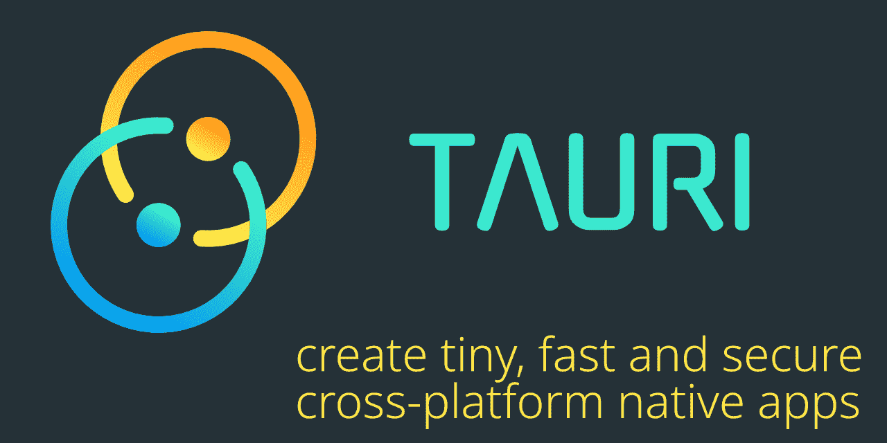
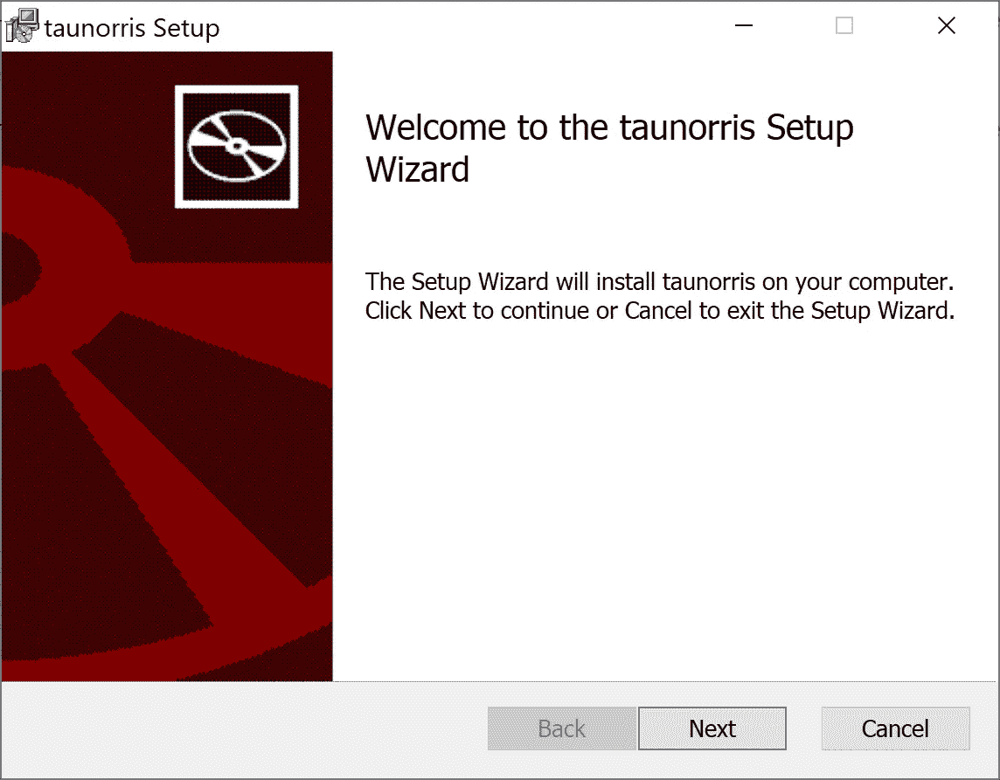
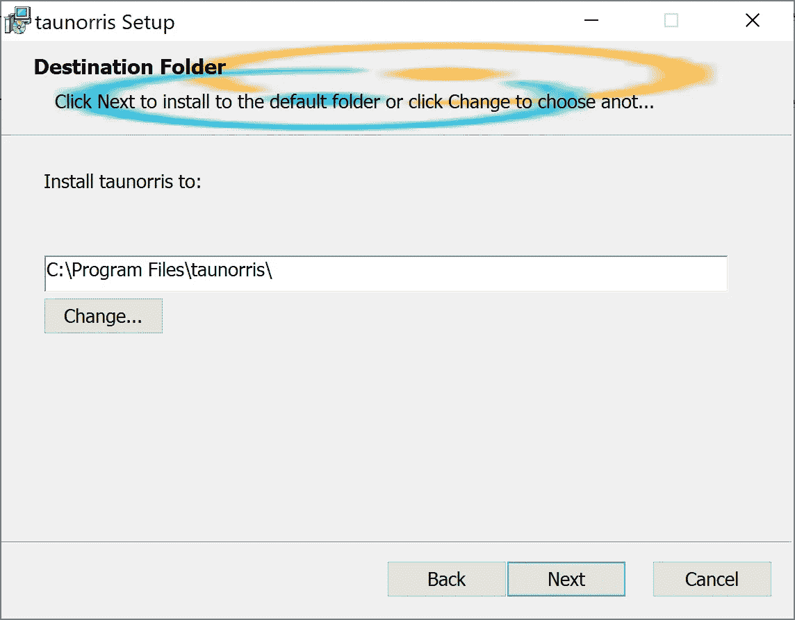
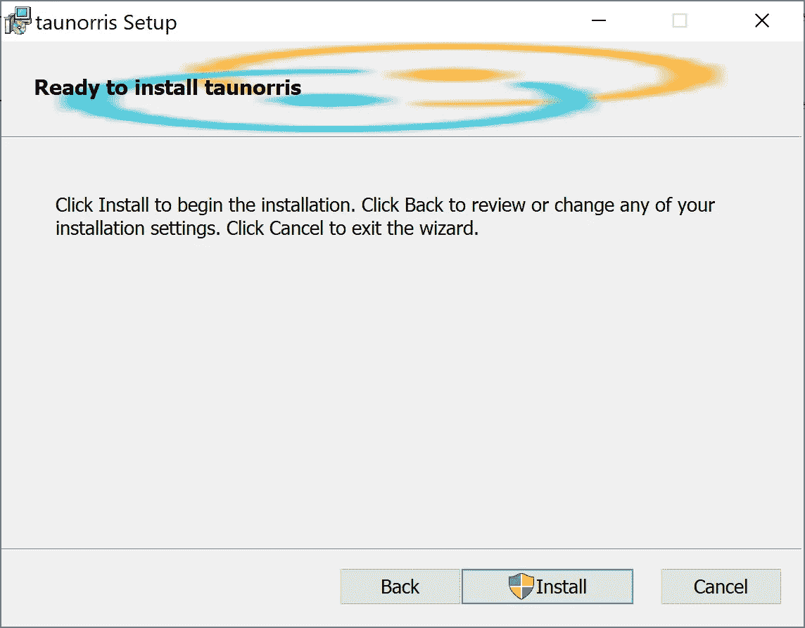
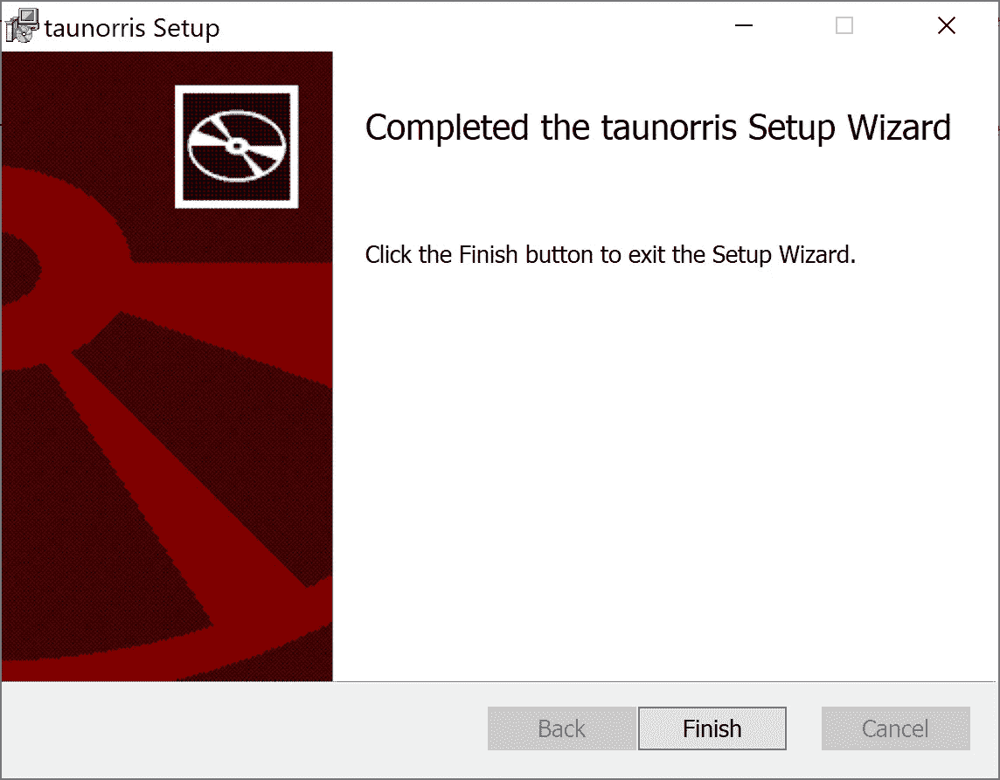
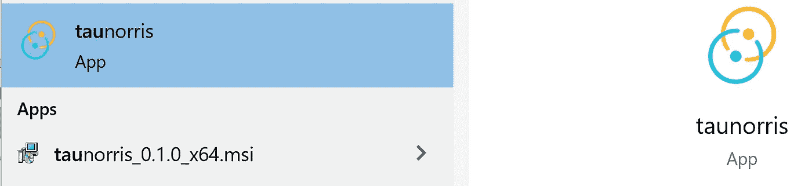
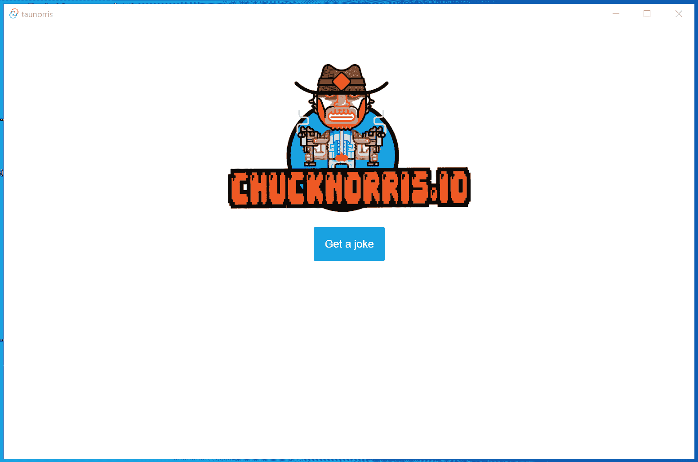
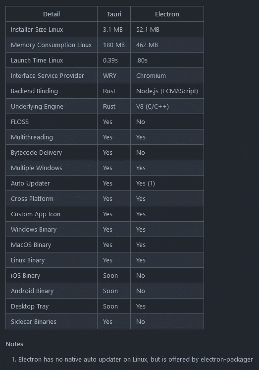

# 为什么 Tauri + Vue.js 3 很牛逼

> 原文：<https://javascript.plainenglish.io/tauri-vue-js-3-is-awesome-f2952f399244?source=collection_archive---------0----------------------->

## 轻量级桌面客户端变得简单。



[Tauri on GitHub.](https://github.com/tauri-apps/tauri)

## TL；博士；医生

Tauri 允许我们利用 web 技术开发安全的跨平台桌面应用程序(Linux、macOS 和 Windows)。 *Tauri* 比 *Electron* 安全得多，并且提供了一些额外的好处。目前， *Tauri* 允许在 *Rust* 中编写后端代码，并提供一个 *Rust API* 和一个[*JavaScript API*](https://tauri.studio/en/docs/api/js/index)，使前端代码能够与 OS 层功能交互，如与文件系统的交互。

前端部分使用 [*Vue.js 3*](https://v3.vuejs.org/) 带 [*的打字稿*](https://www.typescriptlang.org/) 时，可以超快的开发出高质量的前端代码。Tauri 应用程序的唯一运行时依赖项是一个组件，它允许应用程序通过 *webview2* 与操作系统上的 web 浏览器进行交互，从而实现轻松的应用程序部署。

## 我为什么关心这个？

我在工业领域工作，桌面应用程序是与质谱仪的离子源控制单元或工业服务器等设备交互的常见副产品。桌面应用程序相当简单。状态管理通常很容易，因为设备将状态存储为真实的单一来源。通常，几乎不需要操作系统交互。主要的应用程序复杂性存在于并需要放入设备/服务器软件的固件中，桌面应用程序的开发工作需要尽可能少。

Vue.js 3 易于学习和使用，但同时，它也是一个非常强大的 web 前端框架。如果需要管理更多的状态，例如，当连接多个设备时，Vue 的状态管理解决方案[*Vuex*](https://vuex.vuejs.org/)*完全足够。 *Vue.js 3* 支持使用*类型脚本*开发可靠且可维护的代码。 *Tauri* 允许我们将 *Vue.js 3* 应用打包成桌面应用，以便于部署。只要不使用或很少使用 *Rust/JavaScript API，Tauri**也很容易学习和使用。对于我的用例来说 *Tauri* ， *Vue.js 3* 和 *TypeScript* 是绝配！**

## **如何在 WSL2-Ubuntu 上为 Vue.js 3 应用添加 Tauri 应用支持**

**例如，根据[文档](https://tauri.studio/en/docs/getting-started/setup-linux)在 WSL2-Ubuntu 上设置 *Tauri* 。除此之外，您还需要一些额外的依赖项:**

```
**sudo apt install cargo
cargo install tauri-bundler**
```

**根据[文档](https://github.com/tauri-apps/vue-cli-plugin-tauri#steps)将`vue-cli-plugin-tauri`添加到您的 *Vue.js 3* 项目中。您只需要执行:**

```
**vue add tauri**
```

**我已经创建了一个最小的 Tauri Vue.js 3 应用程序 [TAUnorRIs](https://github.com/fkromer/taunorris) 并把它放到了 GitHub 上。与普通的 Vue.js 3 应用程序相比，它多了一个`[src-tauri](https://github.com/fkromer/taunorris/tree/main/src-tauri)`目录。**

## **如何构建 Tauri 应用程序**

**为 Ubuntu 构建一个可执行文件(这里有`npm`):**

```
**npm run tauri:build**
```

**要为 Windows 和 macOS 构建可执行文件，还必须在这些平台上设置开发环境。然而, *Tauri* 团队正计划在未来支持交叉编译。更多信息请往下看…**

**在相应的操作系统(Linux 和 Windows，我不能在 macOS 上构建)上构建之后，可以得到可执行文件:**

*   **`src-tauri/target/release/bundle/appimage/taunorris_0.1.0amd64.AppImage`和`src-tauri/target/release/bundle/appimage/taunorris_0.1.0amd64.deb`用于 Ubuntu (Linux)和**
*   **`src-tauri/target/release/bundle/msi/taunorris_0.1.0_x64.msi`针对 Windows。**

## **如何部署 Tauri 应用程序**

**要安装应用程序，请按照您的意愿为相应的操作系统部署单文件可执行文件。对于 *Ubuntu* 可执行文件(AppImage，deb 包)，webview2 运行时依赖项应该自动安装，如果它还没有安装的话。在 *Windows、*的情况下，MSI 安装程序会引导用户完成安装过程。如果 *webview2* 组件尚未安装，它将作为安装过程的一部分进行安装。**

****

**Tauri app Windows .msi installation (1/4).**

****

**Tauri app Windows .msi installation (24).**

****

**Tauri app Windows .msi installation (3/4).**

****

**Tauri app Windows .msi installation (4/4).**

**该应用程序现在已在 Windows 应用程序中注册。**

****注:**我的极简 app 还不完善。当然，你可以自定义应用图标等。用于您的应用程序。**

****

**Tauri app in the Windows Search results.**

**享受基于 web 技术的 Windows 桌面应用程序。**

****

**Taunorris app running in Windows (gif captured by the author).**

**为了升级已经安装的应用程序，可以使用[更新器](https://tauri.studio/en/docs/usage/guides/updater)功能来更新[签名的更新](https://tauri.studio/en/docs/usage/guides/updater#signing-updates)。要使用这个功能，应用程序版本当然需要放到公共服务器上。**

**[Tauri updater built-in dialog.](https://tauri.studio/en/docs/usage/guides/updater#built-in-dialog)**

## **支持的操作系统版本(WebView2 运行时依赖性)**

***WebView2* 是一个浏览器控制组件，基于微软 Edge Chromium，支持我们在 Windows 桌面应用中嵌入浏览器内容。在 Windows 上，从 Windows 7 开始支持 *WebView2* 。[点击这里查看支持的 Windows 版本的完整列表。](https://devblogs.microsoft.com/dotnet/bring-the-best-of-the-web-to-your-net-desktop-applications-with-webview2/) *WebView2* 肯定支持 macOS 和 Linux (Ubuntu 20.04)。可惜不知道具体支持哪些版本。**

## **Tauri 为什么牛逼？**

***Tauri* 是 [*电子*](https://www.electronjs.org/) 的直接竞争对手。电子是用 web 标准技术构建桌面客户机的事实上的标准。不要误会，*电子*很棒。然而，如果你深入研究一下*电子，*你会发现*电子*也有一些缺点。那里有大量的资源。Tauri 文档将这些总结如下:**

****

**[Comparison of Tauri and Electron.](https://github.com/tauri-apps/tauri#comparison-between-tauri-and-electron)**

****很多开发者把*电子*称为膨胀软件** ( *安装大小 Linux* 、*内存消耗 Linux* 、*启动时间 Linux* 、*接口服务提供者*)。比较中的指标指的是 Linux 操作系统，但也适用于所有其他操作系统。*electronic*需要将 Chromium(网络浏览器)以及整个 Node.js 运行时捆绑到特定于操作系统的文件中，这些文件与特定于应用程序的代码一起交付给客户的操作系统。当运行*电子*应用时，它们会消耗大量的 CPU 和内存资源。看看其他关于这个话题的博客帖子…有很多。**

****另外，有了*电子*app，很多人都有安全方面的顾虑。关于这个的更多信息只需在网上搜索一下…****

**下面来说说 *Tauri* 和*电子*可能最重要的区别: ***后端绑定*** 、 ***字节码交付*** 和 ***交叉编译*** (考虑下面引用的 Tauri 路线图)。**

## **后端绑定**

**在撰写本文的时候, *Tauri* 提供了一个在 *Rust* 中实现的随时可用的后端，它提供了访问文件系统等常见功能。 *Tauri* 允许通过[集成模式](https://tauri.studio/en/docs/usage/patterns/about-patterns)集成前端:**

*   **[隐士](https://tauri.studio/en/docs/usage/patterns/hermit)**
*   **[桥](https://tauri.studio/en/docs/usage/patterns/bridge)**
*   **[多云](https://tauri.studio/en/docs/usage/patterns/cloudish)**
*   **[Cloudbridge](https://tauri.studio/en/docs/usage/patterns/cloudbridge)**
*   **[锁定](https://tauri.studio/en/docs/usage/patterns/lockdown)**
*   **[多赢](https://tauri.studio/en/docs/usage/patterns/multiwin)**
*   **GLUI (尚未上市)**

**你可以在[官书](https://tauri.studio/en/docs/about/book/)的 *Tauri* 中了解更多关于应用设计的知识。请购买这本书并支持这个伟大的项目。**

**现在，独立于所使用的模式，人们必须使用 *JavaScript/TypeScript* 在 web 前端框架代码中实现应用程序逻辑，或者使用 *Rust* 在 *Tauri* 后端中实现应用程序逻辑。**

**然而，根据路线图，Tauri 团队正计划为后端逻辑开发添加对 [Deno](https://deno.land/) (TypeScript)以及其他编程语言的支持。**

****

**[Roadmap Feature Deno Binding.](https://tauri.studio/en/)**

****

**[Roadmap Feature Other Bindings.](https://tauri.studio/en/)**

> **如果 Tauri 团队能够达到这种特性状态(其他后端绑定)，我很确定采用率会突破上限。**

## **字节码交付**

**应用本身是以原生字节码交付的。这意味着无论你用什么样的后端语言来实现你的应用程序，可执行文件最终都会是完全相同的代码。唯一的运行时依赖是特定于操作系统的 webview2 组件。**

## **交叉编译**

**目前，您必须设置开发环境，以便在您想要支持的每个操作系统上构建应用程序。然而，Tauri 团队正计划增加对交叉编译的支持。这意味着您将能够在单一操作系统(例如 Ubuntu)上为所有桌面操作系统(Linux/macOS/Window)构建 Tauri 应用程序的可执行文件。**

****

**[Roadmap Feature Cross Compiler.](https://tauri.studio/en/)**

## **未完待续…**

**我很期待这个项目会如何发展。**

***多内容于* [***浅显易懂***](http://plainenglish.io/)**