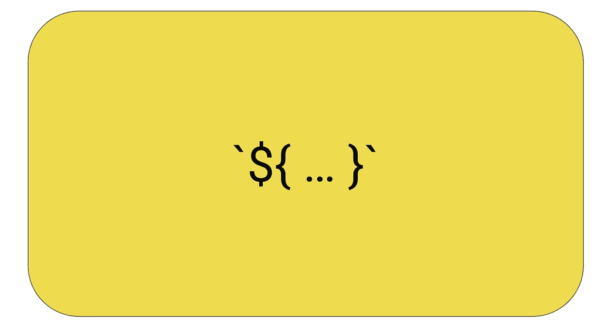
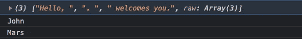

# 模板文字和标记模板在 JavaScript 中的实际应用

> 原文：<https://javascript.plainenglish.io/template-literals-and-a-practical-use-of-tagged-templates-58526d525d72?source=collection_archive---------9----------------------->

## 本文简要概述了 JavaScript 中的模板文字，最后，我们将看到如何使用带标记的模板来构建一个有效的翻译函数，当我们处理需要以多种语言呈现的静态文本时，这个函数非常有趣。



# 什么是模板文字？

它们是字符串文字，允许你做以下你不能用普通字符串做的事情。

1.  编写多行字符串文字。
2.  在字符串中嵌入表达式，并让 JavaScript 运行时为您插入它们。Interpolate 或 Interpolation 只是一个花哨的词，指的是用一堆占位符解析字符串并用它们的实际值替换占位符的过程。

让我们用例子来看看这些。

# 多行字符串

通常，如果您想用 JavaScript 构建一个只有字符串的段落，您应该这样做。

```
const paragraphSimple =
  "This is a very long paragraph. \n " +
  "It spans multiple lines.\n " +
  "But it is written in the old way which is bit lame for 2021.";console.log(paragraphSimple);
```

但是使用模板文字，您可以做到这一点。

```
const paragraphTemplate = `This is a very long paragraph.
And it spans multiple lines.
And it is written using template literals which is cool.`;console.log(paragraphTemplate);
```

# 嵌入表达式

```
const twoPlustwo = `Two plus two is ${2 + 2}`;
console.log(twoPlustwo); // "Two plus two is 4"
```

在这种情况下，JavaScript 运行时会将介于`${`和`}`之间的任何内容作为表达式进行计算，并用该表达式的结果替换它。

当然，你也可以在表达式中使用变量。

```
const averageOf5Nums = (1 + 2 + 3 + 4 + 5) / 5;
console.log(
  `Average of first 5 positive natural numbers is ${averageOf5Nums}`
);
```

正如我们已经看到的。模板文字非常适合编写数据库查询，为 API 端点构建 URL。应用程序是无止境的。

然而，模板文字还有另一个高级特性。它被称为标记模板。接下来我们将看到它的实际用法。

# 标记模板

模板文字可以传递给一个叫做标签函数的东西。tag 函数的主体就像任何其他函数一样，但它的特殊之处在于使用模板文本调用它的方式，以及 JavaScript 运行时如何将模板文本分解为不同的字符串部分，并将其作为参数传递给 tag 函数。我们举个简单的例子。

```
function myTag() {
  console.log(arguments[0]);
  console.log(arguments[1]);
  console.log(arguments[2]);
}const name = "John";
const planet = "Mars";
myTag`Hello, ${name}. ${planet} welcomes you.`;
```

这是打印的内容。



这里我们只是使用一个模板文字来调用`myTag`函数。但是运行时给了我们 3 个参数。

第一个参数是文本静态部分的数组，按照它们出现的顺序排列。所有后续参数都是计算后的表达式，它们构成了计算后的模板文本。

这是一个强大的功能。让我们看一个我们可以使用它的实际用例。

# 使用标记模板构建翻译字符串的函数

让我们假设我们必须构建一个应该支持法语和英语的应用程序。这里，我们在一个标签对象中维护所有的静态字符串及其翻译。在法语语言环境文件中，英语文本是键，法语文本是值。我们的语言环境文件可能如下所示。

```
const labelsFr = {
  "Hello {{0}}. How are you?": "Bonjour {{0}}. Comment vas-tu?"
};
```

有了标记模板，我们就可以在代码中处理英文文本，并在一个小的标记函数中拥有翻译文本的所有逻辑。让我们看看那个。

如上所述，我们只是像平常一样使用模板文本构建动态字符串，并将其传递给 tag 函数。

然后，tag 函数解析字符串的静态部分，构建将在 labels 对象中找到的标签键。最后，它用评估值替换占位符。

上面示例中的当前语言只是一个全局变量。但是在现实世界和应用程序环境中，它是一个配置。

# 包扎

因此，我们已经讨论了模板字面量的常见和基本用法，以及带有标记函数的标记模板的高级用例。

我写这篇文章是因为我已经使用模板文字很长时间了，但是从来没有编写标记函数的需要。我一直想知道为什么有人会写一本。但事实证明它们非常强大，超级有用。

*更多内容看*[***plain English . io***](http://plainenglish.io/)