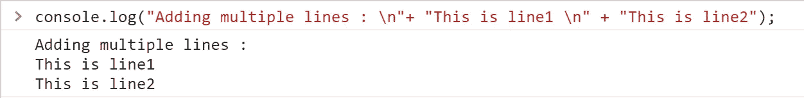
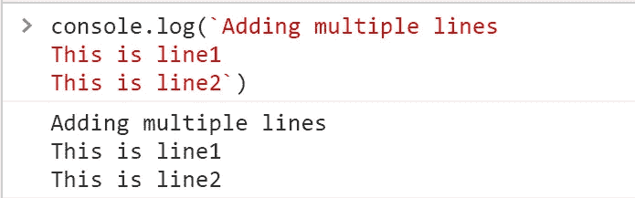
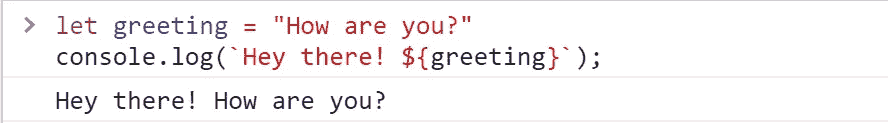
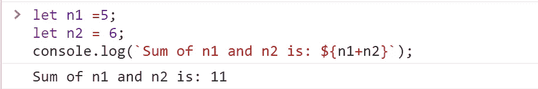
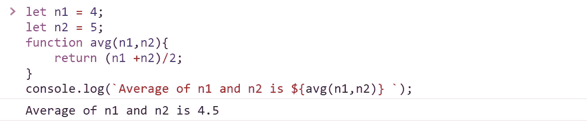
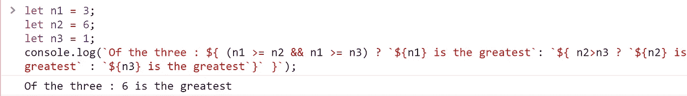
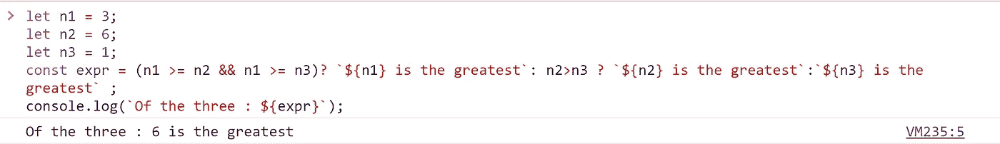
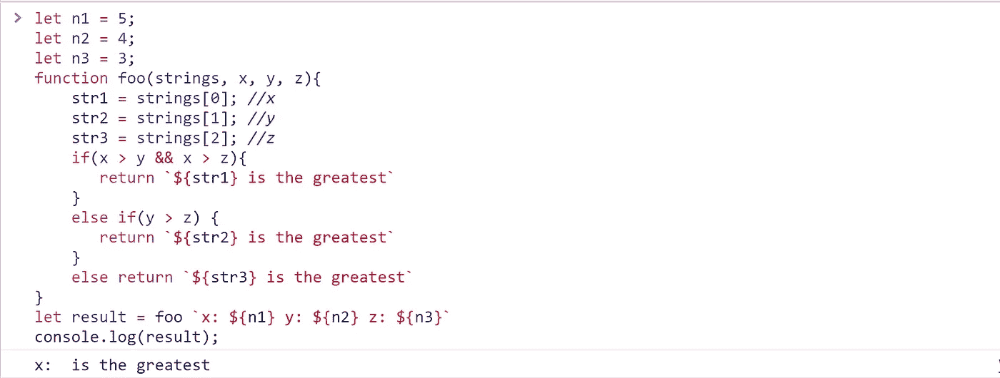

# JavaScript 中模板文字的工作方式

> 原文：<https://javascript.plainenglish.io/template-literals-in-javascript-cf536890694a?source=collection_archive---------24----------------------->


Photo by [Maxwell Nelson](https://unsplash.com/@maxcodes?utm_source=medium&utm_medium=referral) on [Unsplash](https://unsplash.com?utm_source=medium&utm_medium=referral)

## 什么是模板文字？

JavaScript 已经有了一种定义字符串的方法，使用单引号(')或双引号(" ")。那么为什么需要模板文字呢？

嗯，模板文字允许我们更容易地动态操作字符串。与常规字符串不同，模板字符串是用反斜杠(``)定义的。除了语法差异之外，它还有一些特殊的功能，使其区别于常规字符串，例如多行字符串和字符串插值功能。它帮助我们以一种清晰的代码结构，易读，易维护的方式编写字符串。

**常规字符串:**

```
let string1 = “This is a regular string”
```

**模板文字:**

```
let string2 = `This is a template literal`
```

要在模板字符串中写反斜线，请用反斜杠(\)对其进行转义，如下所示:

```
console.log(` \` `) \\Output: “ ` ”
console.log(`\${}`) \\Output: “ ${} ”
```

## **多行字符串**

在常规字符串中，要添加新行，我们使用换行符(\n)。这在模板文字中被消除了。

**例如:**

```
console.log(“Adding multiple lines : \n”+ “This is line1 \n” + “This is line2”);
```

**输出:**



使用模板文字，可以按如下方式完成:

```
console.log(`Adding multiple lines
This is line1
This is line2`)
```

**输出:**



这增加了代码的可读性。

## **表达式插值**

使用模板文字，我们可以在字符串中嵌入表达式。这些表达式被放入一个占位符中，该占位符由$符号表示，后跟花括号- ${}。然后在运行时计算这些表达式。占位符被表达式的值替换，然后连接成一个字符串。表达式的所有值都隐式转换为字符串。

**语法:**

```
`${expression}`
```

这里的表达式可以是变量，可以是运算，甚至可以是函数！

**例 1:**

```
let greeting = “How are you?”
console.log(`Hey there! ${greeting}`);
```

**输出:**



**例 2:**

```
let n1 =5;
let n2 = 6;
console.log(`Sum of n1 and n2 is: ${n1+n2}`);
```

**输出:**



**例 3:**

```
let n1 = 4;
let n2 = 5;
function avg(n1,n2){
    return (n1 +n2)/2;
}
console.log(`Average of n1 and n2 is ${avg(n1,n2)} `);
```

**输出:**



也可以通过嵌套几个模板文本来构建复杂的字符串文本。让我们以寻找 3 个数字中的最大值为例:

```
let n1 = 3;
let n2 = 6;
let n3 = 1;
console.log(`Of the three : ${ (n1 >= n2 && n1 >= n3) ? `${n1} is the greatest`: `${ n2>n3 ? `${n2} is the greatest` : `${n3} is the greatest`}` }`);
```

**输出:**



然而，为了提高代码的可读性和可维护性，对上述代码更好的方法是:

```
let n1 = 3;
let n2 = 6;
let n3 = 1;
const expr = (n1 >= n2 && n1 >= n3)? `${n1} is the greatest`: n2>n3 ? `${n2} is the greatest`:`${n3} is the greatest` ;
console.log(`Of the three : ${expr}`);
```

**输出:**



## **标记的模板文字**

这是模板文字的一种更复杂的形式。它也被称为**标记模板**。基本上，这里你用一个函数解析一个模板文字！任何以模板文字为前缀的表达式都称为标记。这里的标签是一个函数。使用它，我们可以解析模板字符串，并在返回被操作的字符串之前对其执行一些操作。使用带标签的模板，使用模板文本而不是常规方式调用函数，括号中包含函数参数。tag 函数有两个参数，一个是标记化字符串的数组，另一个是表达式。

**语法:**

```
Function tagFunction(strings, firstName, lastName){
    …
}
tagFunction`Hello ${firstName} ${lastName}!`
```

标记函数的名称可以是您选择的任何名称。

`Function tagFunction(strings, firstName, lastName` —该行与:

`Function tagFunction([‘hello’, ‘ ’, ‘!’], firstName, lastName)`

**例如:**

```
let n1 = 5;
let n2 = 4;
let n3 = 3;function foo(strings, x, y, z){
    str1 = strings[0]; //x:
    str2 = strings[1]; //y:
    str3 = strings[2]; //z:
    if(x > y && x > z){
       return `${str1} is the greatest`
    }
    else if(y > z) {
       return `${str2} is the greatest`
    }
    else return `${str3} is the greatest`
}
let result = foo `x: ${n1} y: ${n2} z: ${n3}`
console.log(result);
```

**输出:**



## 参考

[](https://developer.mozilla.org/en-US/docs/Web/JavaScript/Reference/Template_literals) [## 模板文字(模板字符串)

### 在 ES2015 规范的早期版本中，它们被称为“模板字符串”。模板文字用……括起来

developer.mozilla.org](https://developer.mozilla.org/en-US/docs/Web/JavaScript/Reference/Template_literals) 

*更多内容请看*[*plain English . io*](http://plainenglish.io/)