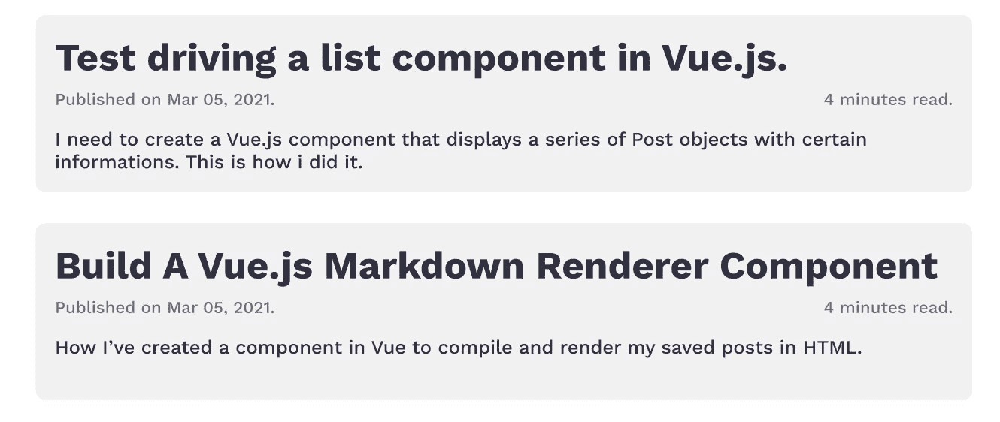
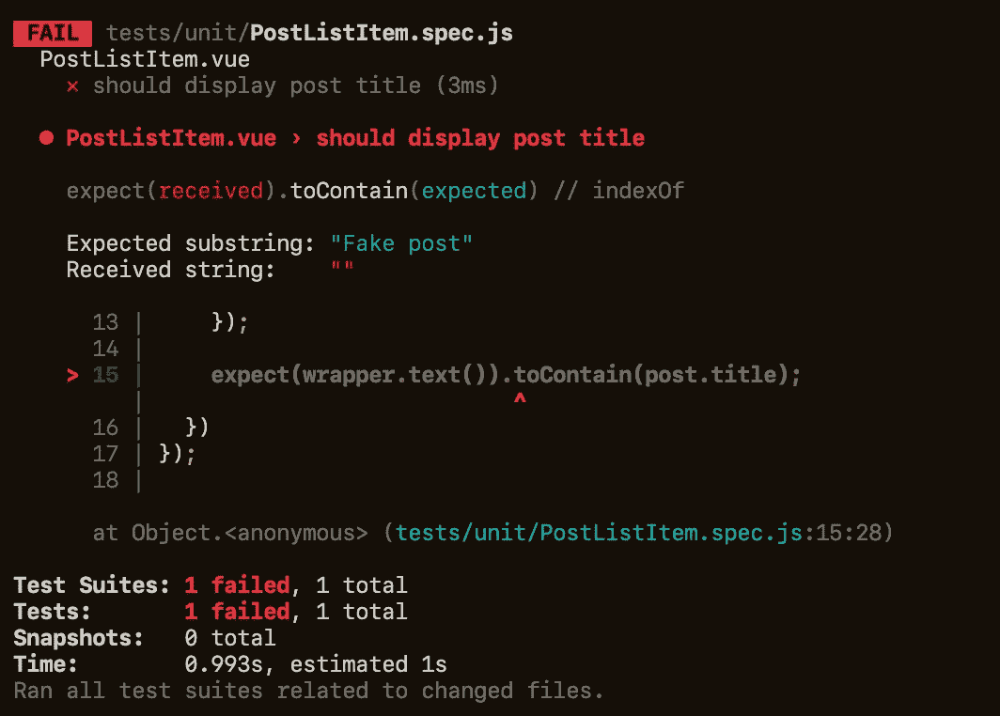
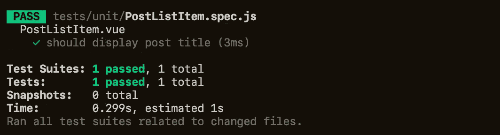

# 测试 Vue.js 中的组件

> 原文：<https://javascript.plainenglish.io/test-driving-a-list-component-in-vue-js-c162724e4fe8?source=collection_archive---------11----------------------->

## 应用 TDD 开发列表显示组件

# 语境

我需要创建一个 Vue.js 组件，显示一系列带有特定信息的`Post`对象。它是一个创建和实践 TDD 的简单组件。

我会用一个默认的 [**Vue-CLI**](https://cli.vuejs.org/) Vue 2 项目，和[**@ Vue/test-utils**](https://vue-test-utils.vuejs.org/)with[**jest**](https://jestjs.io/)**来试驾一下。与后端同事商定的职位资源结构是:**

```
const post = {
  id: 1,
  title: "Test driving a list component in Vue.js.",
  readTimeEstimate: "4 minutes read.",
  publishedAt: new Date("Mar 01 2021"),
  postContentSynopsis: "How to test drive a list component"
}
```

# **初始设置**

**我们需要添加所需的测试工具，你可以在 [**@vue/test-utils** 文档](https://vue-test-utils.vuejs.org/installation/#using-vue-test-utils-with-jest-recommended)中阅读如何安装。**

**首先，我们看一下客户提供的需求。对于帖子列表，我们只需要在一个列表中显示所有的帖子。但是对于每个帖子，我们需要:**

*   **显示发布数据**
*   **显示发布日期，格式:`mm dd, yyyy`**
*   **点击后重定向到帖子显示页面(/posts/:id)**

**我们也有一个高级模型作为参考:**

****

**High level mockup for post list components**

# **首次测试**

**遵循 TDD 过程，我开始创建`PostListItem.spec.js`和一个空的`PostListItem.vue`，以及我能想到的最简单的测试，断言组件呈现文章标题:**

**与`yarn jest`一起跑步时:**

****

**Failing test**

**我们有一个失败的测试，这很好，我们在红色州。继续进行 TDD，我们需要编写尽可能简单的代码来通过测试。在这种情况下，我们只需要用文章标题制作一个`h1`。**

**再次运行测试:**

****

**每次我在绿州的时候我都喜欢提交，因为这样我就有一个检查点可以回去了。**

# **测试其他帖子属性显示**

**我们还需要该组件来显示阅读时间，出版格式和文章摘要。我们可以使用第一个测试中的相同策略，检查组件是否包含所需的文本:**

**再次运行测试将导致失败。我们又一次站在了红色州。我们需要编写尽可能少的代码来通过测试:**

**运行测试，看到我们又回到了绿色状态，这是提交的最佳时机。请注意，我还没有格式化`published_at`日期，这不在我们刚刚编写的测试范围内。让我们扩展我们的测试套件来保证这个功能。**

# **测试已发布 _ 日期**

**为了验证组件是否显示了正确的格式化日期，我们需要用`setProps`方法传递不同的`publishedAt`属性。测试看起来会像这样:**

**通过运行测试来确认我们处于红色状态。为了让它们通过，我将创建一个计算属性，该属性将格式化日期并返回其格式化字符串。你可以使用第三方库，如`momentjs`或`date-fns`，我将只使用 Javascript 的默认`Date`包。**

**在继续之前，我们的规范中有一些重复的代码。在绿色状态的最后一次提交的支持下，我们可以尝试一些重构。我可以看到 3 种提取帮助函数的方法:**

1.  **发布对象创建**
2.  **包装创建**
3.  **格式化日期断言**

**我会让你做这个重构，但你可以在这里找到我的代码。**

**在删除了重复的代码并使断言更加清晰之后，让我们回头看看我们对 post 项的需求。我们需要确保组件在点击时重定向到 post show 页面(`/posts/:id`)。**

# **测试 href 标签**

**我们可以通过断言`href`设置正确来验证相同的行为，而不是测试组件是否在点击时重定向。对于测试，我们有:**

**为了通过测试，用带有`:href="'/post/' + post.id`的锚标签包裹组件。在继续之前，您可以像前面的测试一样删除重复的测试代码，我将让您自己完成这项重构工作。**

**你可以在这里找到重构后的代码[。](https://github.com/ps1312/simple_blog/blob/a67cc62d8ed25e976ed68815b4dd0c16e7b96c95/tests/unit/PostListItem.spec.js)**

**我认为它与`PostListItem.vue`规格都很好。现在我们只需要保证列表组件显示所提供的帖子的正确列表。**

# **测试后列表**

**让我们首先创建我们的 spec ( `PostList.spec.js`)文件以及我们的组件(`PostList.vue`)。我们应该做的第一个断言是，当提供一个空的`posts`数组时，组件应该显示一个空的状态消息，在我们的例子中是`No posts around here 🧐`。测试看起来会像这样:**

**同样，我们需要保持 TDD 只编写最少的*产品代码来通过测试，在这种情况下，我们只需要一个标签:`<span>No posts around here 🧐</span>`来再次进入绿色状态。在那之后，是做出承诺的最佳时机。***

**继续我们的测试，我们现在还有两个期望要满足:**

1.  **检查渲染的`PostListItem`数量是否正确。**
2.  **检查`PostListItem`是否收到相应的`post`作为道具。**

**为了检查第一个期望，我们可以使用`wrapper.findAllComponents()`并检查长度。对于后者，我们可以遍历已经找到的组件并检查它们的属性:**

# **使 href 测试适应路由器链路**

**我选择了 [**VueRouter**](https://router.vuejs.org/installation.html#direct-download-cdn) 处理应用程序路由，所以我需要使用`router-link`而不是`PostListItem.vue`中的`<a />`。在这个问题上,`@vue/test-utils`库提供了一个很棒的[文档。简而言之，您需要向`shallowMount`提供一个`router-link`存根，并基于`router-link`的标签`to`做出断言(例如`wrapper.find(`[to="/posts/${postId}"]`)`)。你可以在这里](https://vue-test-utils.vuejs.org/guides/using-with-vue-router.html#testing-components-that-use-router-link-or-router-view)找到我的代码[，看`assertLinkUrl()`。](https://github.com/ps1312/simple_blog/blob/main/tests/unit/PostListItem.spec.js)**

# **最终考虑**

**这是一个很好的组成部分，了解一些具体的主题✅:**

1.  **TDD 过程(例如，失败、成功、重构)**
2.  **使用`@vue/test-utils`断言文本、计算属性、属性、HTML 属性和标签。**
3.  **不同的选择器(例如`wrapper.find`和`wrapper.findAllComponents`)**
4.  **短截线组件(例如`router-link`**

**我们仍然需要将样式应用到组件中，但是这与 TDD 无关，你可以在这里找到带有样式的完整代码。**

**感谢你阅读✋**