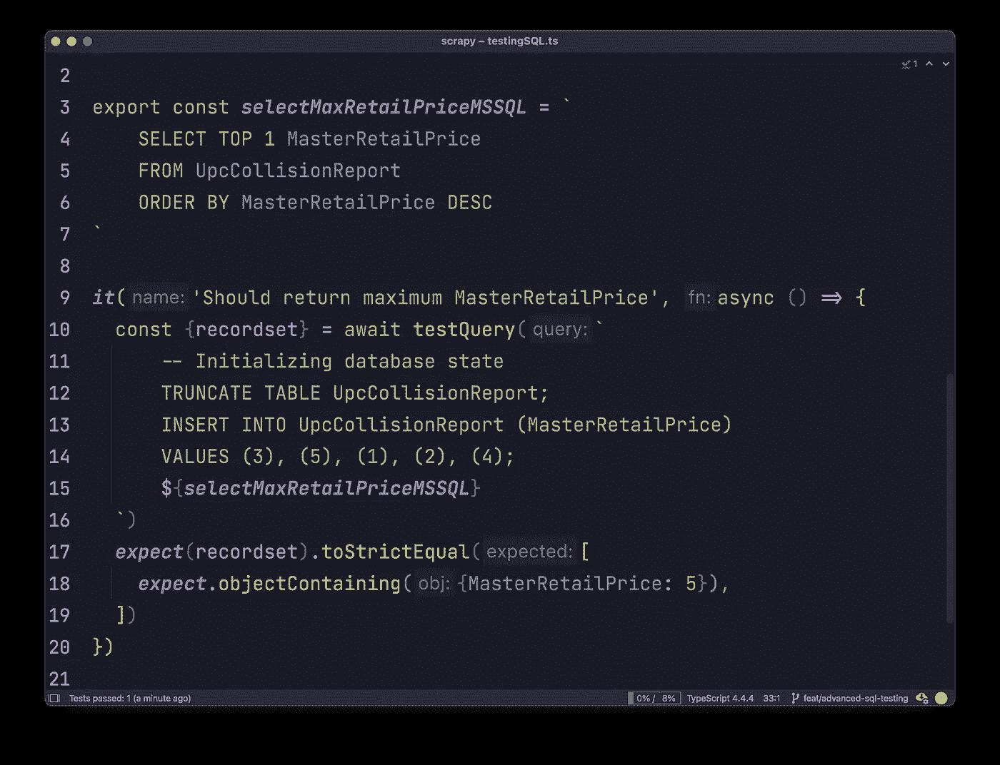

# 用 Node.js 和 Jest 测试 SQL

> 原文：<https://javascript.plainenglish.io/test-sql-with-node-js-and-jest-dde4a76213d4?source=collection_archive---------4----------------------->

## 您会喜欢在您的代码库中重构这个庞大的 SQL



This is how you test SQL with Jest

假设我们想用 Jest 测试一个 SQL 查询:

```
SELECT TOP 1 MasterRetailPrice
FROM UpcCollisionReport
ORDER BY MasterRetailPrice DESC
```

如果您只是运行查询，结果将是不可预测的。MasterRetailPrice 表可能已经有 1_000_000 条记录，并且每天都在增长。

我们可以在运行查询之前截断表并插入可预测的数据。这将修复第一个问题，但是，我们将创建另一个问题:我们所有的 1_000_000 记录将丢失。

这里的解决方案很简单:

*   我们将测试包装到一个事务中
*   截断并将初始状态插入到表中
*   运行查询并返回结果
*   回滚事务

This is how you test SQL with Jest

# 结论

要用 Jest 测试 SQL，您需要:事务→初始化状态→运行查询→回滚→检查结果。

如果你在重构期间运行这个测试，你将会确信你没有打破任何旧的业务规则。如果您为每个部署自动运行这个测试，您将确保数据库仍然有正确的表、字段、约束等。

我希望你喜欢这篇文章，你今天会觉得更有灵感。再见。

*更多内容看* [*说白了. io*](http://plainenglish.io/) *。在这里注册我们的* [*免费周报*](http://newsletter.plainenglish.io/) *。*