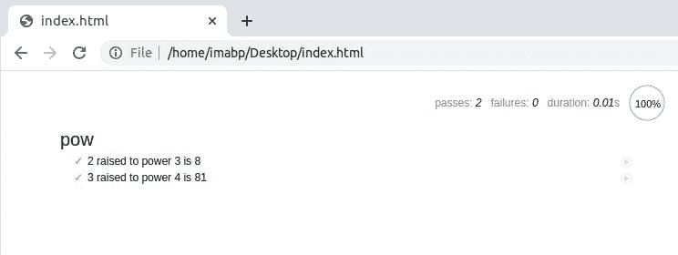

# 在 JavaScript 中测试 101

> 原文：<https://javascript.plainenglish.io/testing-101-in-javascript-720c752ecfd5?source=collection_archive---------3----------------------->

用 JavaScript 编写测试的初学者友好指南


> “您是否遇到过这样的情况，您有两个函数，`f1`和`f2`，在运行脚本时，您发现`f1`按预期工作，但是`f2`不工作？经过几分钟的调试，你终于修复了`f2`和**推送**的代码！等等，但是你在修好`f2`之后有没有重新检查`f1`，看它是否工作？”
> 
> 编辑:如果你喜欢看同样的视频，下周我会在我的 Youtube 上发布同样的视频。

显然，我们大多数人都会犯这个错误。像我们这样的初级开发人员/学生开发人员，已经从这个错误中吸取了教训，但是我们仍然这样做，但是不那么频繁了。

所以今天我将和你们讨论 JavaScript 测试，并和你们一起进行一些现场测试。不要担心，如果你刚刚开始测试。这肯定会帮助你了解测试。

你需要什么？一个浏览器和一个编辑器。


Lets taste(test)

有很多技术，为了测试，我们将使用其中一种技术，称为`Behavior Driven Development or BDD.`

简单来说，这意味着，

*   我们将会有一个函数`(we will be calling it a unit)`，并且我们将会有一个测试文件，它将会描述这个特定的`unit`的测试。
*   接下来，我们将确保测试失败，然后再次调试/重新实现`unit`。
*   最后，在调试之后，我们将验证`unit`的最新实现是否成功通过了测试。
*   (可选)对其他单元(这里作为函数)重复相同的内容。


Behavior Driven Development

编写测试文件和执行测试，也称为自动化测试，其中除了代码之外，测试是单独编写的。他们以各种方式运行我们的功能，并将结果与预期进行比较。”

因此，我们将遵循一种实用的方法来学习测试的基础知识。

我们必须创建一个函数`pow(x,n)`，它返回值`x`的`n`次方。

“在 Javascript 中，我们确实有一个操作符`**`来完成这项工作，但我们在这里是为了学习测试的基础知识，从今以后，这将是我们的例子，它确保事情对初学者友好。”

所以在为这个函数创建代码之前，我们要想象这个函数应该做什么并描述它。这种描述的写作，也称为规范或`specs`。这只是另一个花哨的词，只是我们想要描述我们的测试函数的一种方式，就像它的名字或者测试做什么一样。

下面的代码片段展示了我们的 pow 函数的规格说明。

```
describe("pow", function() {

  it("raises to n-th power", function() {
    assert.equal(pow(2, 3), 8);
  });

});
```

需要注意三点，该规范有三个基本组成部分。

*   `describe("title", function() { ... })`:我们用这个来描述我们将要测试的功能/单元。
*   `it("the-exact-use-case", function() { ... })`:如果你对这个完全陌生，`use cases`的意思是情况，或者可以是动作。这里我们的用例被提升到 n 次方。
*   `assert.equal(value1, value2)`:块`it`内的代码，如果实现正确，应该执行无误。功能`assert.*`用于检查`pow`是否按预期工作。

# 带电测试

我们将使用以下著名的 JS 库，它们为我们提供了`describe`和`it`函数。

`Mocha` -核心框架:它提供了常见的测试功能，包括“描述”和“它”以及运行测试的主要功能。

`Chai`–有很多断言的库。它允许我们使用许多不同的断言，现在，我们只需要`assert.equal`。

接下来，这将是一个文件系统。

```
--directory
      |___ index.html
      |___ test.js
```

我们将拥有一个包含所有导入的`mochajs`和`chaijs`的`index.html`文件。我们将在`test.js`进行`BDD`测试。

你的`index.html`应该是这样的。

```
<!DOCTYPE html>
<html>
<head>
  <!-- add mocha css, to show results -->
  <link rel="stylesheet" href="https://cdnjs.cloudflare.com/ajax/libs/mocha/3.2.0/mocha.css">
  <!-- add mocha framework code -->
  <script src="https://cdnjs.cloudflare.com/ajax/libs/mocha/3.2.0/mocha.js"></script>
  <script>
    mocha.setup('bdd'); // minimal setup
  </script>
  <!-- add chai -->
  <script src="https://cdnjs.cloudflare.com/ajax/libs/chai/3.5.0/chai.js"></script>
  <script>
    // chai has a lot of stuff, let's make assert global
    let assert = chai.assert;
  </script>
</head>

<body>

  <script>
    function pow(x, n) {
      /* function code is to be written, empty now */
    }
  </script>

  <!-- the script with tests (describe, it...) -->
  <script src="test.js"></script>

  <!-- the element with id="mocha" will contain test results -->
  <div id="mocha"></div>

  <!-- run tests! -->
  <script>
    mocha.run();
  </script>
</body>

</html>
```

*   在`head`标签下，我们已经导入了所需的库。
*   在`body`标签下，第一个脚本定义了我们的函数`pow`，它现在是空的。
*   接下来，我们引用我们的`test.js`文件。
*   id 为 mocha 的`div`将帮助 mochaJS 显示输出
*   最后，通过命令`mocha.run()`开始测试

如果你运行`index.html`，你会看到类似这样的东西。


# 该股的初步实施

如前所述，函数`pow`我们将调用一个单元。最初，我们是这样实现代码的。

```
function pow(x, n) {
    return 8;
}
```

并且`test.js`包含以下测试。

```
describe("pow", function() { it("raises to n-th power", function() {
    assert.equal(pow(2, 3), 8);
  });});
```

刷新浏览器，您可以看到类似如下的输出。


在这里，如果你看到，测试是成功的，我们只有一个测试用例，但 pow 函数完全是一个**欺骗**，因为它为 x 的每个值返回 8。所以我们需要改进规格，换句话说，就是`test.js`

# 改进规格

众所周知，我们在`pow`函数中做了一个欺骗。所以我们将使用`test.js`文件向我们展示失败的测试。

让我们转到`test.js`文件，将我们的规格改进为如下所示。

```
describe("pow", function() { it("2 raised to power 3 is 8", function() {
    assert.equal(pow(2, 3), 8);
  }); it("3 raised to power 4 is 81", function() {
    assert.equal(pow(3, 4), 81);
  });});
```

保存`test.js`文件，刷新你的浏览器，你肯定会得到类似这样的东西。


# 调试装置

现在该重新实现函数`pow`了。转到`index.html`，在脚本标签下，编写以下代码。

```
function pow(x, n) {
  let result = 1; for (let i = 0; i < n; i++) {
    result *= x;
  } return result;
}
```

因此，我们改进了我们的实现，让我们刷新我们的浏览器。如果所有调试都正确完成，您将会看到类似这样的内容。



是的，我们已经成功地测试了我们的代码。但是，规范中仍然有很多需要改进的地方。以下规格应该是更精确的规格。

```
describe("pow", function() { function makeTest(x) {
    let expected = x * x * x;
    it(`${x} in the power 3 is ${expected}`, function() {
      assert.equal(pow(x, 3), expected);
    });
  } for (let x = 1; x <= 5; x++) {
    makeTest(x);
  }});
```

刷新您的浏览器，您肯定会看到以下输出。


# 恭喜🎉🎉🎉

“终于，你成功了。测试是软件工程中最重要的阶段，它有助于编写好的、可维护的软件。此外，当你为各种开源组织做贡献时，事实上甚至是作为初级开发人员或软件工程实习生，你都应该为你的代码编写测试用例。”

*更多内容请看*[*plain English . io*](http://plainenglish.io/)