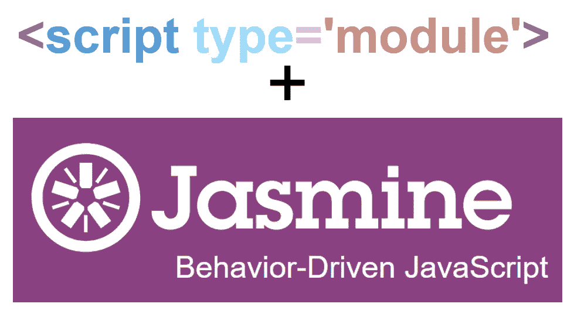

# 在浏览器中嘲笑 JavaScript 模块

> 原文：<https://javascript.plainenglish.io/testing-and-mocking-javascript-modules-in-browser-ae9fc333ee5d?source=collection_archive---------15----------------------->

## 在浏览器中测试简化了 web 应用程序的开发。但是如何在浏览器中模拟模块依赖呢？



在浏览器中测试可以节省时间，尤其是在原型开发期间。对于不复杂的模块，例如与用户界面相关的模块，可以完成代码，然后编写测试。

但是想象一个执行复杂计算的模块。例如，一个模块，它将一些复杂的统计数据转换并聚合成可以绘制在图表中的简单数据。在开发复杂的计算过程中，你无法在头脑中完成，大量的调试是不可避免的，因此频繁的测试是必不可少的。

碰巧的是，必须对模块进行模拟，以便于甚至可能对导入它们的模块进行测试。嘲笑的典型目标是从 REST 资源中获取数据的模块。他们返回的数据可能因每个请求而异。此外，根据应用程序的不同，提取的数据可能会很大，需要花费大量时间进行加载和处理。

如果被测试的代码与任何可能需要时间并引入随机性的外部资源分离，那么解释和调试测试就更容易了。在模拟模块中`fetch`调用被一些恒定的数据代替，以确保在测试期间父模块总是接收到相同的输入，该输入应该导致相同的输出。

# 用提取调用模拟模块

想象一个模块，它对庞大且难以辨认的输入数据进行难以想象的复杂计算，并产生简单的输出，最终显示给用户。在本文中，我将使用一个很小的示例模块 *userView.js.* 来模拟这样一个模块。假设它将用户配置文件数据转换为仪表板的一个组件:

```
// userView.js
import { getUser } from "shared/dataSource.js";export default async function getHomeView() {
    const user = await getUser();
    return `Hello ${user.name}`;
}
```

为了简单起见，对用户特定数据的所有想象中的复杂计算都用原始模板字符串``Hello ${user.name}``代替，而庞大的用户档案数据则用微小的 JSON `{"name": "John"}`代替。模块 *userView.js* 接收来自导入功能`getUser()`的数据。该功能从 REST 资源中获取数据:

```
// dataSource.js
export function getUser() {
    return fetch('api/user.json').then(response => response.json());
}
```

假设从 REST 资源接收到的用户特定数据随每个请求而变化，如何测试 *userView.js* 的输出？让我们从对 *userView.js* 的一个简单测试开始:

```
// userViewTest.js
import getHomeView from './userView.js';

describe("homeView", function () {
    it("returns some content, but irreproducible depending on REST resource", async function () {
        const view=await getHomeView();
       ** expect(view).toBeDefined();**
    });
});
```

由于 REST 资源的响应内容不同，因此`getHomeView()`返回的输出也不同，我只能检查模块是否产生了什么东西`expect(view).toBeDefined()`。但是我不知道到底是什么产生的。

完美的测试应该进行全面彻底的检查:

```
// userViewWithMockTest.js
import getHomeView from './userView.js';

describe("homeView", function () {
    it("expected output of complex calculations", async function() {
        const view=await getHomeView();
        **expect(view).toBe('Hello Mock');**
    });
});
```

为了使上面的完美测试可用，导入的函数`getUser()` 必须返回常量数据`{"name": "Mock"}`。为此，我编写了一个模拟模块 *dataSourceMock.js* ，它将在测试期间替代模块 *dataSource.js* 。被模仿的模块不会`fetch`，相反，它会返回一个解析为常量值的`Promise`。

```
// dataSourceMock.js
export function getUser() {
    return Promise.resolve({"name":"Mock"});
}
```

为了在测试期间用它的 mock 替换原来的模块，我添加了一个导入映射到 Jasmine 的*SpecRunner.html*中:

```
<script type="importmap">
    {
        "imports": {
            "shared/dataSource.js":"./js/shared/dataSourceMock.js"
        }
    }
</script>
```

导入映射指示浏览器如何将测试模块 *userView.js* 的语句`import { getUser } from "shared/dataSource.js";`中包含的模块名解析为实际的 URL。现在，当浏览器遇到名称`shared/dataSource.js`时，它导入[被模仿模块`dataSourceMock.js`的绑定](/live-bindings-difference-between-export-default-and-export-as-default-4541c354cdaa)。

尽管没有其他方法来模拟浏览器中的模块，但是测试并不是导入映射的主要用例。[导入地图是支持 JavaScript 模块的特性。](https://marian-caikovski.medium.com/remapping-javascript-module-names-with-import-maps-bd2bad121c1d)没有导入映射，JavaScript 模块很难在浏览器中使用，因为它们的`import`相对 URL 可能很长，并且充满了双点。至少与非原生模块系统 AMD 相比，原生模块看起来很有缺陷。

这篇文章的完整源代码可以从 [GitHub](https://github.com/marianc000/ModuleMocks) 下载，并在浏览器中执行。

*更多内容请看*[*plain English . io*](http://plainenglish.io/)