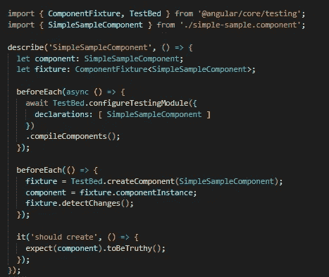
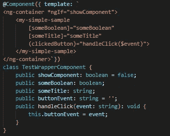
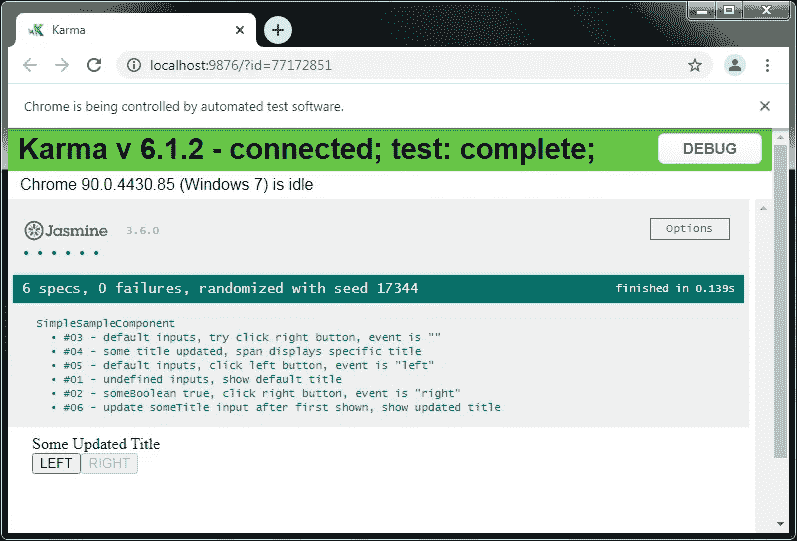
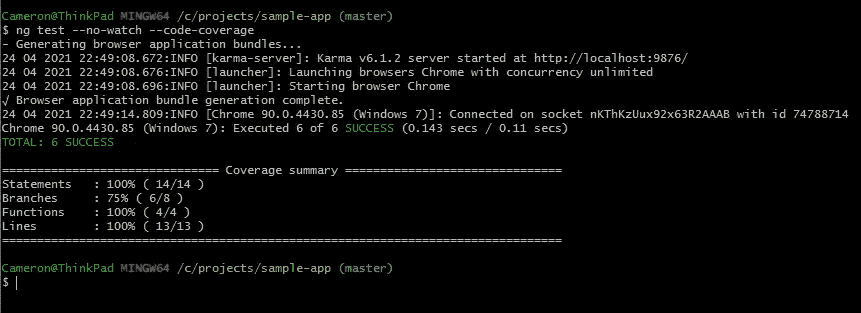

# 用 Jasmine、Karma 和测试包装模式测试有角度的组件

> 原文：<https://javascript.plainenglish.io/testing-angular-components-using-jasmine-karma-and-the-test-wrapper-pattern-f0a64a8a29ba?source=collection_archive---------5----------------------->

自动化测试已经成为保护应用程序不受新错误影响的一个好方法。让我们看一个可以用来测试组件的模式。


Photo by [Clay Banks](https://unsplash.com/@claybanks?utm_source=medium&utm_medium=referral) on [Unsplash](https://unsplash.com?utm_source=medium&utm_medium=referral)

## 先决条件/假设

您至少有一个样板角度应用程序(使用`ng new <app-name>`生成的也可以)，用 [Jasmine](https://jasmine.github.io/) 和 [Karma](https://karma-runner.github.io/latest/index.html) 设置。代码是使用 [Angular 11](https://v11.angular.io/docs) 和 Angular [CLI](https://angular.io/cli) 编写的——测试包装器模式应该可以与 Angular 的任何支持版本一起工作。我们还希望在您的机器上设置好[节点](https://nodejs.org/en/)和 [Git](https://git-scm.com/downloads) bash。

## 示例组件

第一步是使用命令`ng generate component simple-sample`生成一个简单的组件。当组件生成后，您可以删除 HTML 并生成 CSS(或任何样式文件)。不会使用 Style，模板将位于 Typescript 文件本身中。

顾名思义，这个组件很简单。它将有两个输入，一个布尔值和一个字符串，以及一个输出发射器，它将发出一个字符串。该组件将显示由输入传入的标题，并在没有输入时有一个默认标题。它还将有两个按钮，根据输入布尔值启用/禁用。当单击一个按钮时，将向父组件发出一个输出。这是组件的 Typescript 文件。

Simple component Typescript file.

## 测试包装组件

当您运行`generate`命令时，您将得到一个样板规格文件来构建测试。该文件是用一个`component`和`fixture`变量建立的。组件变量是被测试的组件。fixture 变量是一个测试工具，用于将更改应用到组件，并查看这些更改如何影响组件的状态。下面是由 generate 命令创建的规范文件的外观。



Initial test file generated.

您想要添加到规范文件的第一项内容是创建 TestWrapperComponent。包装器组件就是这样，它是一个容器，用所有的输入、处理的输出和一个标志来包装我们正在测试的组件，该标志充当显示和隐藏组件的开关(缺省值为不显示)。



TestWrapper for the SimpleSample component.

在每个测试用例的开始，show 标志默认为 false。这意味着将不会显示正在测试的组件。在每个测试用例中要做的第一件事是设置测试所需的输入值。这包括打开显示标志。一旦一切设置完毕，使用 fixture 工具调用`detectChanges()`来刷新组件。这将导致每个测试初始化被测试的组件，ngOnInit 和构造函数为每个测试用例运行。

显示/隐藏开关是这种模式的关键。它将允许被测试的组件在每个测试用例之前被重置，这样组件将运行通过生命周期功能。

## 测试案例

在开始编写实际的测试之前，应该有几个测试用例(场景)，在其中对 SimpleSampleComponent 进行测试。因为组件没有太多的东西在运行，所以没有太多的东西需要测试。

可以测试以下几个方面；组件的默认行为当包装显示测试组件时，单击按钮将发出预期的值，被单击的禁用按钮不会发出事件，并且在组件初始化后更改输入将相应地更新组件。

有了这些要测试的场景，下面是要检查的测试用例列表。

```
#01 - undefined inputs, show default title
#02 - someBoolean true, click right button, event is "right"
#03 - default inputs, try click right button, event is ""
#04 - some title updated, span displays specific title
#05 - default inputs, click left button, event is "left"
#06 - update someTitle input after first shown, show updated title
```

## 更新测试配置

现在已经有了一个 TestWrapperComponent 和一个测试用例列表，我们可以配置 spec 文件进行测试了。当 Angular 生成一个规格文件时，`component`和`fixture`变量被设置为 SimpleSampleComponent 类型。

对于测试包装器模式，我们将设置类型为 TestWrapperComponent。在每个测试用例之前调用的函数`beforeEach()`中，使用 TestBed 类重新创建夹具。还必须更新该重置以使用 TestWrapperComponent 而不是 SimpleSampleComponent。TestWrapperComponent 必须通过 TestBed `configureTestingModule()`函数在测试配置集中声明。

## 编写测试用例

一旦您设置了配置，就可以编写测试用例了。SimpleSampleComponent 基本上有两种类型的测试用例。一个测试组件中显示的标题，另一个测试基于组件状态的按钮点击所产生的事件。

在这两种情况下，fixture 的调试属性`nativeElement`用于查询包装器组件元素，以获取将在 DOM 中呈现的内容。可以使用`querySelector()`或`querySelectorAll()`函数查询`nativeElement`，就像浏览器中页面上的`document`。

当测试一个特定的标题出现在 DOM 中时，在`querySelector()`中使用一个 CSS 选择器来抓取一个元素。然后，被查询元素的`innerHTML`字符串值被修整，并对照预期值进行检查。

对于按钮测试，CSS 选择器将用于获取 ButtonElement。button 元素有一个在其上执行的`click()`，并且有一个值将由 TestWrapperComponent 发出和处理。

这里是完整的 spec 文件，带有 TestWrapperComponent、配置集和所有实现的测试用例。

Completed spec file with Test Wrapper pattern.

# 结果

## Karma 浏览器

现在可以用`npm test`命令运行测试了。从样板 Angular 项目中运行这个命令将启动 Karma test runner 并打开一个浏览器。浏览器将显示以下内容。



Karma test runner in Chrome Browser.

## 代码覆盖率

也可以使用命令`ng test --no-watch --code-coverage`检查测试的测试覆盖率。当命令在命令行中运行时，组件具有 100%的语句覆盖率。



Code coverage report for tests.

# 结论

编写单元测试是保护应用程序在重构时不引入错误的好方法。Angular 为用 Jasmine framework 和 Karma test runner 编写测试提供了一个很好的样板。在测试中使用测试包装器模式是全面测试组件生命周期的好方法，并且可以轻松测试父组件的变化将如何影响您正在测试的组件。

下次生成组件时，尝试使用该模式。祝你好运，并快乐编码！

*更多内容请看*[***plain English . io***](http://plainenglish.io)