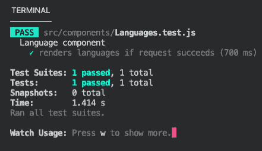

# 在 React 应用中测试异步代码

> 原文：<https://javascript.plainenglish.io/testing-async-code-in-react-apps-33bd405f25bf?source=collection_archive---------16----------------------->

## 了解如何使用 Jest 和 mock 函数，以便在 React 应用程序中有效地测试您的异步代码！

Jest

本教程不是 React 中单元测试的介绍，所以如果你正在寻找类似的东西，我不确定这是否是正确的教程。但是请继续读下去吧！

## 先决条件

如果你满足以下先决条件，你将很容易地遵循本教程:

*   React 的基础知识
*   单元测试的基本知识

# 概观

让我们先来看看我们正在测试的应用程序。最终它将只是一个基本页面，呈现一堆编程语言。这里的重点是真正的测试，而不是应用程序本身。

App.js

如您所见，我们只呈现了**语言组件**，我们现在将仔细研究它:

Languages.js

因此，在 **useEffect** 钩子中，我们从一个假的 API 中异步获取一些数据，然后在**呈现函数**中，我们简单地呈现一个带有语言名称的无序列表。很基本，对吧？但这是组件，它将运行我们的测试！

所以让我们写下测试的初稿吧！

# 编写第一个测试

我们将使用 Jest 运行我们的测试，Jest 通常包含在标准的 React 应用程序中。所以不需要安装任何外部库！

我们的**目标**是测试，如果对 API 的请求成功，语言组件**是否呈现列表项**。让我们看看如何实现这个目标。根据通常的命名惯例，我们将测试文件命名为 **Languages.test.js** 。

Languages.test.js

如你所见，我们在第 4 行创建了一个标题为“语言组件”的测试套件**。从技术上来说，如果你只在测试套件中运行一个测试，那么创建一个测试套件是没有多大意义的，但是我们仍然在这里这样做。**

与“正常”代码相比，测试异步代码的第一个区别是，我们实际上可以将异步函数传递给第 5 行**中的 **test** 函数。**在这个测试函数中，我们首先定义了我们想要呈现的**语言组件。**

在 Languages.test.js 的第 9 行你会注意到，我使用了`findAllbyRole()`来查找组件中的列表项。我们**没有**使用`getAllbyRole()`，因为这会导致**错误**。原因是`getAllbyRole()`会**立即**寻找组件中的列表项，但是由于获取数据需要几毫秒的时间，数据需要一些时间存储在状态中。`findAllbyRole()`另一方面，返回一个**承诺，**我们可以等待这个承诺，这个承诺将被重新评估几次。

由于`listItemElements`将是一组编程语言，我们简单地定义我们期望`listItemElements`在最后一行代码中的长度大于零。

但是这种方法仍然存在一个问题。你能想到一个吗？嗯，通过这段代码，我们实际上向服务器发送了请求，在这个特定的例子中，这可能没有问题。但是想象一下，我们正在运行数以千计的测试，我们不仅获取数据，还将数据写入数据库。这可能会很快失去控制。这就是**模拟功能**进入游戏的地方。

# 使用模拟函数

模拟函数是一种虚拟函数，可以在测试代码中使用。我们只需要添加几行代码来实现这些模拟功能:

通过`window.fetch = jest.fn()`，我们告诉代码**用我们自己定制的模拟函数覆盖**fetch 函数！

在**第 9 行**中，我们使用`mockResolvedValueOnce()`来设置这个获取函数在被调用时应该解析的值。所以首先我们说这个函数应该在一个 json 对象中解析。如果你看一下 **Languages.js** 这正是我们的 **getData** 函数所解决的问题。其次，我们定义这将异步发生，并且我们期望包含一个 **id** 和一个**名称的对象的**数组**。分配给 id 和 name 键的值并不重要，重要的是格式。**

其余的保持不变！现在，如果您用`npm test`运行这个测试，您应该会看到类似这样的内容:

Result of our test

# 结论

我希望我能帮助你理解如何在 React with Jest 和 mock 函数的帮助下测试异步代码。

感谢你阅读这篇文章！

*更多内容看*[***plain English . io***](http://plainenglish.io)