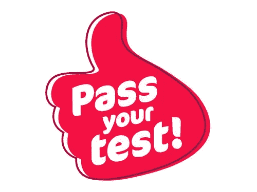

# 使用 Nightwatch.js 进行电子邮件确认测试

> 原文：<https://javascript.plainenglish.io/testing-email-confirmation-with-nightwatch-js-c0b6e6271c1f?source=collection_archive---------14----------------------->

时隔多年，我带着 Nightwatchjs 系列跟你在一起。在我之前的文章中；我分享了关于 Nightwatchjs 的 [*信息。*](https://medium.com/lucid-archive/how-to-install-nightwatch-js-first-test-with-nightwatch-js-cffd7b96f49f) 然后我继续进行 [*Nightwatchjs 设置和登录页面测试。*](https://medium.com/javascript-in-plain-english/amazon-com-login-page-testing-with-nightwatch-js-a2acd0faa2f8)

在本文中，我将重点介绍如何使用 Nightwatchjs 进行电子邮件确认测试。

让我们在 Pages 文件夹中创建一个名为 signUp.js 的新文件。现在我们将在这里写我们的 css 元素和命令。

然后让我们在测试文件夹中创建一个新文件，名为 signUp.js。现在我们将在这里编写我们的测试代码。

*   您可以查看 Signup.js，并执行必要的程序进行登录。

总之，您可以通过随机生成电子邮件来注册，验证您的电子邮件并再次登录测试。 ***(本文视频即将发布……)***

最后，你可以从[***Nightwatchjs.org***](https://nightwatchjs.org/?source=post_page---------------------------)***获得详细信息。*** 感谢阅读！

点击查看作者的其他文章:

 [## 在 VueJS 中创建组件

### 组件是为 Vue.js 应用程序编写模块化、可重用代码的一种方式。组件可以被认为是…

medium.com](https://medium.com/javascript-in-plain-english/creating-components-in-vuejs-c7a61d84430c)  [## 渐进式 JavaScript 框架:Vue.js

### Vue.js 是一个用于构建网站 ui 的 Javascript 框架。它在许多方面与角相似，也有…

medium.com](https://medium.com/javascript-in-plain-english/the-progressive-javascript-framework-vue-js-65f106080cb6)  [## 软件测试和方法

### 在我的软件测试系列中，我将尝试讨论为什么测试是必要的，这些测试是如何执行的，如何…

medium.com](https://medium.com/swlh/software-testing-and-methodologies-1fc519c98fdf) 

你也可以订阅我的 Youtube 频道:

 [## 米克塔德·奥兹蒂尔克

### Bilim、Teknoloji、yazlmüzerine Bir takm al malar。

www.youtube.com](https://www.youtube.com/miktad%C3%B6zt%C3%BCrk)