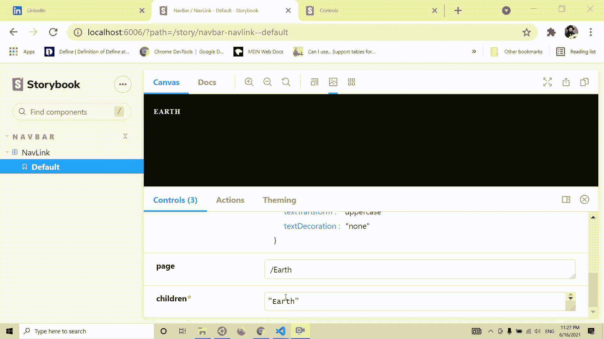
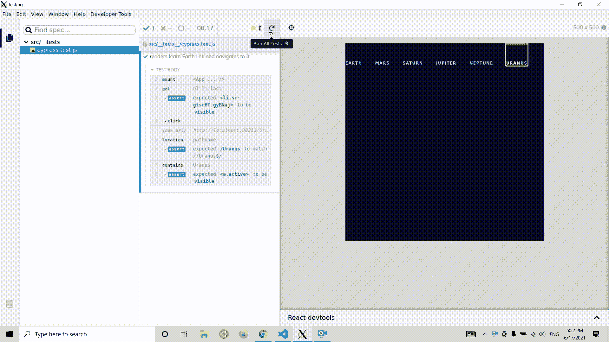

# 创建 React 应用程序时的测试流程:为什么测试如此重要

> 原文：<https://javascript.plainenglish.io/testing-flow-creating-react-app-21399ff25c7c?source=collection_archive---------8----------------------->


## 创建 React 应用程序时理解测试流程的指南

测试是编程中通常被忽视的一个领域，尤其是对初学者而言。

主要的误解是关于创建网站/应用程序时测试的必要性。开发人员对自己说，*“我可以看到它在工作，那么我为什么要测试呢？”*

首先，测试可以帮助我们识别我们看不到的东西，但是更重要的是，测试可以帮助我们将新功能集成到我们的网站中，而不会破坏已经存在的功能(或者至少知道它被及时破坏并立即修复)。

在本文中，我将向您展示我自己在构建 React 网页时的测试流程(使用 create-react-app 设置)。我们将创建一个 NavBar 组件，并展示我们必须应用于它的各种测试。

请注意——我不会教你如何设置测试环境。同样在这篇文章中，我不会教你如何做测试。我们将会看到一些简单的测试，但是这篇文章主要是关于感受不同种类的测试和工具，以及理解为什么它如此重要。

# 手动测试、视觉测试、快照测试—故事书

让我们从我最喜欢的测试工具——故事书开始。我们将用它执行三种测试——手动测试、快照测试和视觉测试。

根据故事书的官方网站，故事书是:

> Storybook 是一个开源工具，用于构建独立的 UI 组件和页面。它简化了 UI 开发、测试和文档。

简而言之，Storybook 让我们构建组件，并在屏幕上实时查看它们，而无需在完整的应用程序设置中运行它们。它也有一些测试工具，让我们记录我们的组件(例如，如果我们正在构建一个组件库)。

我们要做的第一个测试是手动测试。正如可能已经猜到的，手动测试就是要看到我们的组件，并验证它看起来像我们期望的那样。如前所述，Storybook 是关于查看我们的组件的，所以很明显它最适合这种测试。

让我们从创建我们的 NavLink 组件开始:

```
import * as React from 'react' ;
import PropTypes from 'prop-types' ;
import { NavLink as ReactRouterNavLink } from 'react-router-dom' ;
import { StyledListItem } from ' ./styles' ; const NavLink = ({ children, page, styles, activeStyles }) => {
  const [isHovering, setIsHovering] = React.useState(false);
  return (
    < StyledListItem
      onMouseEnter ={() => setIsHovering(true)}
      onMouseLeave ={() => setIsHovering(false)}
      isHovering={isHovering}
    >
      < ReactRouterNavLink style={styles} activeStyles={activeStyles} to={page}>
        {children}
      < /ReactRouterNavLink>
    < /StyledListItem>
  );
}; NavLink.propTypes = {
  children: PropTypes.string.isRequired,
  page: PropTypes.string,
  styles: PropTypes.object,
  activeStyles: PropTypes.object,
}; export default NavLink;
```

这是一个非常简单的 NavLink 组件，它从 props 对象动态接收所有属性。现在为了展示它的所有风格，我们必须创建一个父组件并传递它的所有属性。还是我们真的必须这么做？

# 人工测试

有了故事书，我们就不必这么做了！我们创建一个故事，描述我们想要传递给组件的所有道具。一个组件可以有几个故事来描述它在不同情况下的样子(不同的道具)。对于这个例子，我们将只制作一种故事。故事是这样的:

```
import React from "react" 
import NavLink from " ../components/NavLink/NavLink" export default {
  component: NavLink,
  title: "NavBar/NavLink" ,
}
const defaultStyles = {
  color: "white" ,
  fontFamily: "Spartan" ,
  fontStyle: "normal" ,
  fontWeight: "  bold" ,
  fontSize: "11px" ,
  lineHeight: "25px" ,
  letterSpacing: "1px" ,
  textTransform: "uppercase" ,
  textDecoration: "none" ,
}
const Template = args => < NavLink {...args} /> export const Default = Template.bind({})
Default.args = {
  styles: {
    ...defaultStyles,
  },
activeStyle: {
...defaultStyles,
  page: " /Earth" ,
  children: "Earth" ,
}
```

就是这样！现在我们可以使用 Storybook 预览我们的组件。故事书真正的好处是你可以随时改变道具。看下一个短视频:



关于手工测试的事情是，它都是手工完成的。这非常重要，但是想想一个有数千个组件的组件库。在实现一个新特性后，手动检查每一个特性是很累人的。这就是视觉和快照测试发挥作用的地方。

故事书里的快照测试真的是小菜一碟。你只需要激活插件-storyshots 库中的一个功能，故事书就会为你做好一切。

```
import initStoryshots from ' @storybook/addon-storyshots' ; initStoryshots();
```

在幕后，Storybook 将使用 Jest 来执行快照测试。它真正的好处是，我们对每个组件的所有故事都自动进行快照测试，所以我们不必手动编写每个测试。

这是我们组件的快照测试结果:

```
exports[`Storyshots NavBar/NavLink Default 1` ] = ` 
< li
  className="sc-bdnxRM kqHtUy" 
  onMouseEnter    ={[Function]}
  onMouseLeave    ={[Function]}
>
  < a
    href =" /Earth" 
    onClick    ={[Function]}
    style={
      Object {
        "color" : "white" ,
        "fontFamily" : "Spartan" ,
        "fontSize" : "11px" ,
        "fontStyle" : "normal" ,
        "fontWeight" : "  bold" ,
        "letterSpacing" : "1px" ,
        "lineHeight" : "25px" ,
        "textDecoration" : "none" ,
        "textTransform" : "uppercase" ,
      }
    }
  >
    Earth
  < /a>
< /li>
` ;
```

既然我们已经捕获了 DOM 元素，那么每次我们运行测试时，都会将它与新的快照进行比较。如果一切都一样，它就会通过，如果不一样，它就会失败并通知我们。失败的测试并不一定意味着我们有一个 bug。假设我们想将字体大小改为 10px。这是再次运行测试后的结果:

```
- Snapshot  - 1
    + Received  + 1
 @@ -8,11 +8,11 @@
          onClick    ={[Function]}
          style={
            Object {
              "color" : "white" ,
              "fontFamily" : "Spartan" ,
    -         "fontSize" : "11px" ,
    +         "fontSize" : "10px" ,
              "fontStyle" : "normal" ,
              "fontWeight" : "  bold" ,
              "letterSpacing" : "1px" ,
              "lineHeight" : "25px" ,

              "textDecoration" : "none" ,
```

注意双重字体大小？它告诉我们有些事情发生了变化，测试失败了。对我们来说，这很好，因为我们知道我们是故意做出这种改变的。

# 视觉测试

视觉测试不是人工进行的，并且比快照测试更不容易出错，因为它不比较 DOM 元素，而是比较元素的实际图片。

为了进行视觉测试，我们将不得不使用另一个与 Storybook 集成的工具，称为 Chromatic。它的目的是将我们的故事书库部署到一个外部网站，它还帮助我们进行持续的部署。

每次我们将代码提交到 git Chromatic 时，都会将组件之前的可视状态与当前状态进行比较。那真是太好了！

# 单元测试、集成测试— Jest

单元测试是构建 React 应用程序时最重要的测试之一。你可以像盖大楼一样去想。如果你的收缩材料的核心构件处于良好的状态，那么你的整个建筑在未来可能会做得很好。

我真的喜欢用故事书里的故事进行单元测试。这样，我可以确保组件在各种情况下都能很好地与所有的道具一起工作。

让我们来看一个针对 NavLink 组件的非常简单的单元测试:

```
import React from 'react' ;
import { BrowserRouter as Router } from 'react-router-dom' ;
import { Default } from ' ../stories/NavLink.stories' ;
import { render, screen } from ' @testing-library/react' ;
import ' @testing-library/jest-dom/extend-expect' ; it('renders the text of the button component' , () => {
  render(
    < Router>
      < Default {...Default.args} />
    < /Router>
  );
  expect(screen.getByRole('navigation' )).toHaveTextContent('Earth' );
});
```

如您所见，我们从 react 测试库中导入了我们的“默认”故事和一些辅助函数。然后，我们检查组件是否用正确的文本呈现。

# 集成测试

对于集成测试，我们将再次使用 Jest 库。集成测试是关于组件如何一起工作的。因此，为了进行这样的测试，我们必须创建一个新的组件— NavBar:

```
const activeStyles = { borderTop: 'solid 4px #d83a34'  }; const linksList = [
  'Mercury' ,
  'Venus' ,
  'Earth' ,
  'Mars' ,
  'Saturn' ,
  'Jupiter' ,
  'Neptune' ,
  'Uranus' ,
]; const NavBar = () => {
  return (
    < StyledUnorderedList>
      {linksList.map(link => (
        < NavLink
          children={link}
          key={nanoid()}
          activeStyles={activeStyles}
          styles={defaultStyles}
          page={ ` /${link}` }
        />
      ))}
    < /StyledUnorderedList>
  );
};export default NavBar;
```

我们想测试当我们点击一个导航链接时，它的 activeStyle 是否被应用。该测试将模拟点击导航链接，然后检查样式是否是预设的。看起来是这样的:

```
import React from 'react' ;
import { BrowserRouter as Router } from 'react-router-dom' ;
import NavBar from ' ../../components/NavBar/NabBar' ;
import { render, screen, fireEvent } from ' @testing-library/react' ;
import ' @testing-library/jest-dom/extend-expect' ; it('Gives the active style when clicked' , () => {
  render(
    < Router>
      < NavBar />
    < /Router>
  );
  const navLink = screen.getByRole(' /Earth' );
  fireEvent.click(navLink);
  expect(navLink).toHaveStyle('border-top: solid 4px #d83a34' );
});
```

这实际上是一个简单的测试，对于这个用例来说，它可能是多余的。我们实际上正在测试 React-Router-DOM 库中 NavLink 的功能。我们不想测试第三方库的功能，因为测试是他们的工作，不是我们的:)

无论如何，对于这个例子来说，这就足够了。

# 端到端(E2E)测试— Cypress

现在是有趣的部分了。E2E 测试意味着我们将整个应用程序作为一个整体来测试。您通常希望测试用户与 DOM 中各种元素的交互，以及应用程序与外部 API 的交互。

Cypress 测试令人愉快的部分是测试实际运行在一个真实的环境中——浏览器。您可以在浏览器中指定希望测试执行的操作，然后坐下来享受。

让我们做一个简单的测试，按下其中一个导航链接，检查它是否将我们导航到正确的页面:

```
import React from 'react';
import { mount } from '@cypress/react';
import App from '../App'; it('renders learn Earth link and navigates to it', () => {
  mount(<App />);
  cy.get('ul li:last').should('be.visible').click();
  cy.location('pathname').should('match', /\/Uranus$/);
  cy.contains('Uranus').should('be.visible');
});
```

让我们看看它在 Cypress 的图形视图中是什么样子的(仔细看，它发生得真快！):



# 摘要

在本文中，我们看到了 6 种重要的测试:

*   单元测试——使用 Jest 测试我们应用程序的核心构件。Jest 模拟了浏览器的环境，并让我们检查每个组件是否都按预期工作。
*   集成测试——我们正在测试我们的组件如何相互作用，以及它们是否能给我们预期的结果。我们还使用 Jest 进行集成测试。
*   手动测试——对于手动测试，我们使用 Storybook 来孤立地查看每个组件，并检查它是否像我们期望的那样。
*   快照测试——story book 也用于快照测试。在快照测试中，我们获取 DOM 节点的快照，每次运行测试时，我们都会将它与当前快照和上一次快照进行比较。
*   视觉测试——视觉测试与快照测试非常相似，但更准确。它们检查我们的元素的最后视觉外观是否与当前的相同。我们使用 Storybook 和 Chromatic 在每次提交和推送我们的更改到 git 时进行可视化测试。
*   E2E 测试——端到端测试是关于我们的应用程序作为一个整体是如何工作的。我们使用 Cypress，它运行在一个真实的浏览器环境中，让我们做各种各样的任务，并检查它们是否被应用。E2E 测试实际上是我们测试流程中最不重要的部分。

*更多内容看*[***plain English . io***](http://plainenglish.io/)