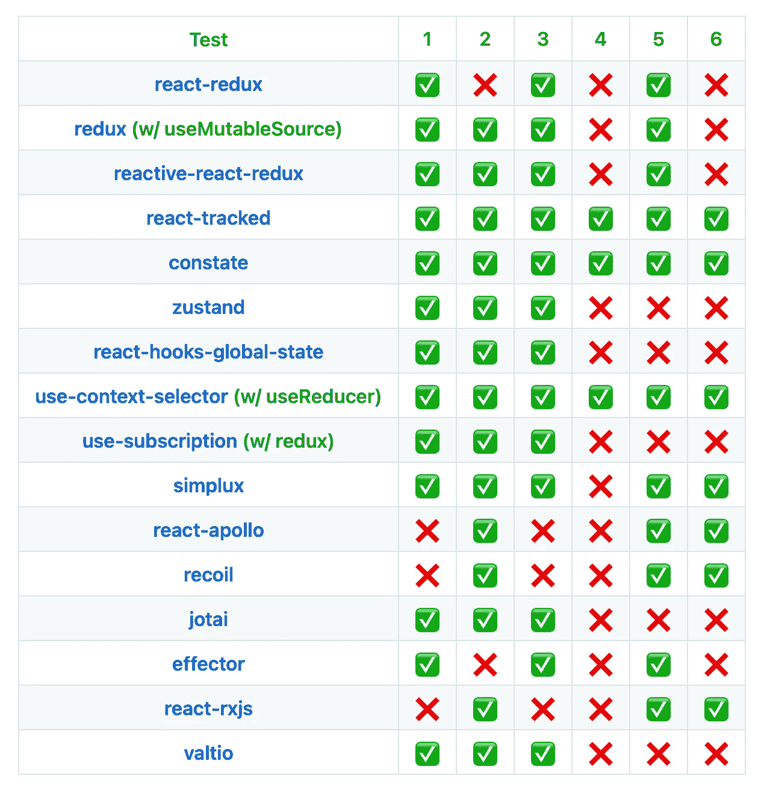

# 使用 React 18 Alpha 并发渲染测试全局状态库

> 原文：<https://javascript.plainenglish.io/testing-global-state-libraries-with-react-18-alpha-concurrent-rendering-6a070b5538fd?source=collection_archive---------19----------------------->

## 什么是撕裂和分支

# 介绍

React 团队公布了带有各种功能的 React 18 的计划[。其中，并发渲染是我的兴趣之一，因为我一直在开发各种全局状态库，并且存在称为“撕裂”和“分支”的已知问题。](https://reactjs.org/blog/2021/06/08/the-plan-for-react-18.html)

撕裂是一种不受欢迎的行为，其中两个组件为同一全局状态呈现不同的值。

分支是一种理想的行为，在这种行为中，组件在转换更新中呈现状态的旧值。

两者都是微妙的行为，在大多数适度的应用程序中不需要。

尽管如此，出于好奇，我制作了一个小实验工具来测试各种库在并发渲染中的行为。

# 工具

它被称为“这将反应全局状态工作在并发渲染？”

 [## 戴式/将此反应全局状态工作在并行渲染中

### React 并发渲染中的测试撕裂和分支 React 18 即将推出一项名为“并发……”的新功能

github.com](https://github.com/dai-shi/will-this-react-global-state-work-in-concurrent-rendering) 

它为每个库运行一个微型计数器应用程序，并测试行为。

共有 6 项测试。

*   [使用过渡]
*   测试 1:随着过渡而正确更新
*   测试 2:过渡时无撕裂
*   测试 3:中断渲染的能力
*   测试 4:带过渡的正确分支
*   [具有密集自动增量(实验)]
*   测试 5:用自动增量正确更新
*   测试 6:自动递增时无撕裂

Test 5 和 test 6 试图区分 useMutableSource 行为，但是它并没有完全像预期的那样工作。

# 结果

我们如何阅读这个表格？

测试 1 是查看是否所有计数都正确更新。三个图书馆都失败了。我认为他们有点过于积极地批量更新。

测试 2 是目标之一。有两个库失败了，但是正如您看到 redux 与 useMutableSource 通过了。我希望任何有 useMutableSource 的库都能通过这个测试。

测试三是看时间片是否有效。如果做不到这一点，就意味着无法获得并发渲染的好处。

测试 4 是另一个目标。分支只适用于 React 状态，大多数全局状态库使用模块状态，测试失败是意料之中的。

测试 5 和测试 6 是实验性的。它们显示出一些差异。目前可以说的是，React state 通过了两项测试。

# 结束语

这是一个简短的帖子，介绍我最近用 React 18 alpha 进行的实验。我认为这比用推特来解释我对结果的看法要好。请注意，它们只是写作时的结果，可能不准确。测试可能会出错。有兴趣的话，请克隆一下库，自己试试。

*原载于 2021 年 6 月 10 日*[*【https://blog.axlight.com】*](https://blog.axlight.com/posts/testing-global-state-libraries-with-react-18-alpha-concurrent-rendering/)*。*