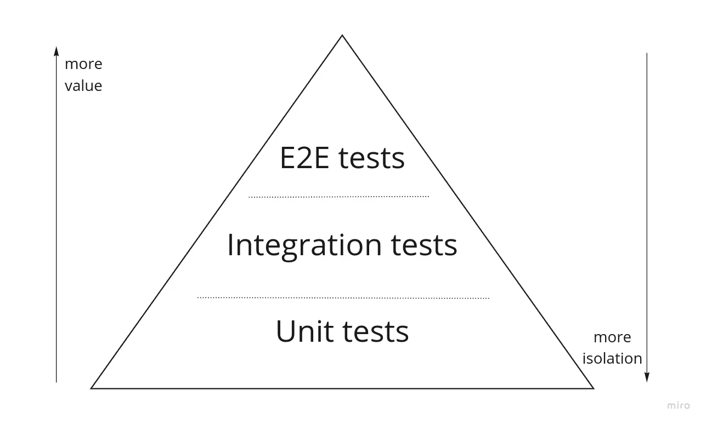
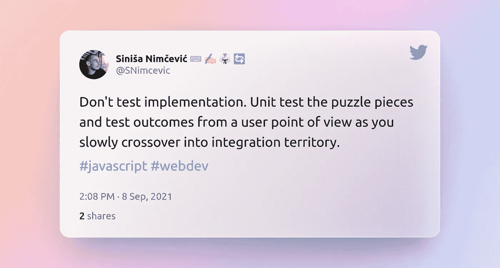
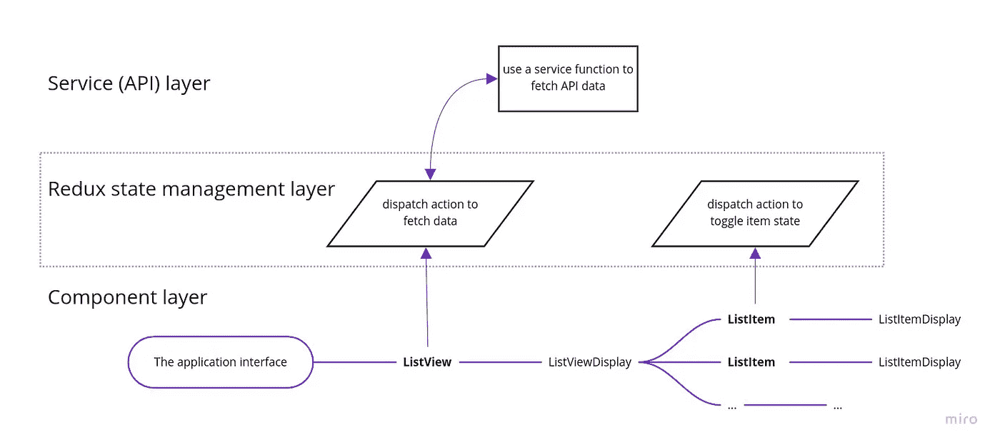
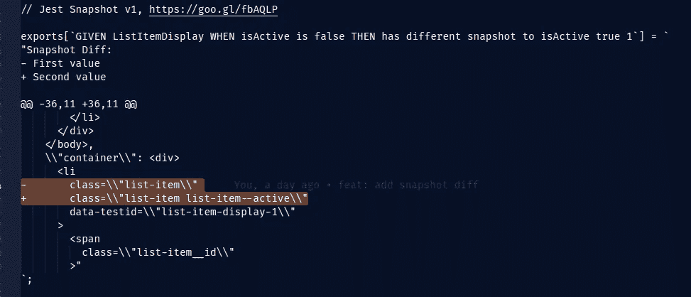

# 测试 React 应用程序:思维模式(带示例)

> 原文：<https://javascript.plainenglish.io/testing-javascript-applications-the-mindset-and-the-examples-16d30a8b278c?source=collection_archive---------4----------------------->

## 一个小型 React 应用程序测试“如何和为什么”指南

Photo by [Sieuwert Otterloo](https://unsplash.com/@sieuwert?utm_source=medium&utm_medium=referral) on [Unsplash](https://unsplash.com?utm_source=medium&utm_medium=referral)

在这篇文章中，我试图给你一个在测试代码时应该如何思考的基础，并通过一些基于 React 的例子向你展示，因为 React 是我的强项。

我认为你要么维护测试，要么事后编写测试，因为这种情况经常发生。关于为什么 TDD 是王者的文章数不胜数，然而，它的采用却很少(可能是因为学习曲线)。

还有，这只是一个大概的指导。如果你有时间，我推荐两本书，它们是这篇文章的灵感来源，分别是 Da Costa 的“[测试 Javascript 应用程序](https://www.manning.com/books/testing-javascript-applications)”和 Osherove 的“[单元测试的艺术](https://www.manning.com/books/the-art-of-unit-testing-second-edition)”。

此外，如果你熟悉这个理论，你可以跳到我开始谈论细节的部分——[**这个应用被用作示例代码库**](#393a) 。

# 测试金字塔

就像生活中的所有事情一样，如果你心中有一个既定的目标，测试会更加熟练。当开始编写测试时，你需要*始终*记住的是测试金字塔，以及你想要在所述金字塔中的什么位置。

测试金字塔表明了我们期望创建的**数量的测试**(单元测试是最常见的测试类型)，它们提供的**值**(相对于实际用户体验的准确性)和**隔离级别**(测试中有多少是实际的系统功能，有多少是为了提供隔离而被剔除和模仿的)。

The dotted lines signify that the tests fall on a spectrum and that the difference between test types is sometimes difficult to discern.

虽然我们有 3 种类型的测试，你肯定听说过——每种类型的定义似乎因开发人员/团队而异，它们之间的界限经常是模糊的。术语的一般概述对于了解何时以及编写哪些测试至关重要:

单元测试是大多数人所说的策略，每个代码文件有一个测试文件。从某种意义上来说，这很好，是的，一个文件大概相当于一个代码单元，但这不会帮助你建立正确的思维模式。一个真正的代码单元通常只是一个服务函数，而且通常是一个纯粹的函数。这应该是超级容易测试的东西，应该简洁明了。

集成测试可以说是三个术语中被误用最多的。测试一个 React 组件，理论上属于集成测试，尽管很自然地认为一个组件是一个代码单元。组件中发生的事情(大多数时候)是几个服务与标准的 React 挂钩交互。

尽管没有必要测试 React 钩子，但我们确实需要聪明地测试组件生命周期中出现的副作用是否是我们所期望的。我现在还不会详细介绍，但这里的关键是，给定服务调用和“二级逻辑”的正确的**单元测试**，以及给定正确测试的**第三方包**(包括 React)，我们剩下的这种测试的目标应该缩小到组件特定的行为。

其他的一切都最好被嘲笑/剔除，除非你想把你的测试更牢固地定位在金字塔光谱的“集成”区域。隔离会略微降低测试的价值，但是会使重叠最小化，并使测试维护变得容易。难以维护的测试违背了测试的目的。

E2E 测试也经常被误解。完整的 E2E 测试将从一个单独的存储库中运行，该存储库中有一个生产数据库的副本(最好是空白的),任何模仿都应该是最小的。E2E 测试者经常旋转浏览器，以非常直接、真实的方式模拟用户交互。为此，一个流行且易于使用的库是 [Cypress](https://www.cypress.io/) ，在本文中，我不会对它进行过多的描述。

这里有一个小提示:这里使用的术语不是一成不变的，也不是我的心血结晶。我在这里尝试设定的一个常用术语只是为了让大家理解一个观点，并介绍一个你可能会觉得有用的思维体系。

# 方法(自上而下与自下而上)

在我们开始举例之前，还有一件事你需要考虑。如果你理解了测试金字塔，你还需要决定是采用**自顶向下**的方法，还是**自底向上**的方法。

简而言之，**自顶向下的方法**严重依赖集成测试。您测试一个组件，成功的测试意味着底层服务正在完成它们的工作。反馈含糊不清。这些测试(和所有的集成测试一样)通常需要更多的时间来设置，但是最终会提供更多的价值，因为它们将更多的代码集成到测试中。

缺点是设置抽象了实现，所以如果你改变了实现，你必须重构组件测试，即使你没有直接改变那个组件。如果它没有破坏功能但是破坏了测试，这可能是耗时和令人沮丧的，**但是**它确实在某种程度上警告你你的改变可能带来的影响。

**自底向上的方法**更像是 TDD 方法的近亲(它们携手并进)。您测试实际的单元(功能),因此您可以完全信任组件导入的所有内容。您仍然用技术上的集成测试来测试您的组件，但是您可以更自由地模拟服务调用和内部组件，因为您已经在单独的单元测试中彻底地测试了它们。

这种方法给出了简单、易于维护的测试，并提供了高分辨率的反馈。不利的一面是，你在测试中模拟的值越多，你覆盖的场景就越少，服务可能被重构并“变坏”,但是你的组件测试仍然会通过，因为它使用了模拟的响应。

我喜欢更细粒度的、自下而上的方法。除了我自己，还有谁更适合在这里引用呢？

🎺 [Tad-aah](https://twitter.com/SNimcevic/status/1435575743354966018)!

# 用作示例代码库的应用程序

例如，我将使用的应用程序是一个非常精简的通用主题版本。获取数据列表，您可以更改每个项目的“本地”活动/非活动状态。完整代码可在 [github](https://github.com/sinisa-nimcevic/basic-async-call-repository/tree/ARTICLE/react-testing-library) 上获得。

App behavior.

在我们深入讨论这篇文章之前，先简单说一下。我喜欢把我的应用组织成分层的、可测试的(还有其他的)。知道您将编写和维护测试，会让您对如何编写代码有不同的看法。我喜欢做的事情大致来说就是把所有东西分成*至少* 3 层。**组件层**由 React 组件组成——粗体的组件包含业务逻辑并与其他层通信，而名称中带有`Display`的组件往往是易于测试的代码单元，旨在作为(可能时)纯函数——基于 props 呈现 html 的简单 JSX。这些对于基于[故事书](https://storybook.js.org/)的 UI 组件开发来说是理想的，我是这方面的狂热爱好者，但我不会在本文中涉及。

在组件层之上，有**状态管理层**。我在这里用了`redux`和`redux-toolkit`，欢迎你用别的。**状态管理层**完美地将**服务或 API 层**从组件中抽象出来。这是一个很好的实践，因为它将对后端 API 的调用从处理业务逻辑的组件中分离出来，并且进一步将“纯”UI 组件从两者中分离出来，为更多的开发人员和团队协同工作创造了空间。

A mind map of the example app architecture.

# 最后，测试示例

因为我是自底向上方法的粉丝，所以我喜欢从我们称之为组件层的“叶节点”开始，然后再回到完整的应用程序接口。

按照这种逻辑，起点应该是`ListItemDisplay`组件。这相对简单，它所做的只是调用一个传入的点击处理程序，并显示一个项目的`id`和`title`。它还使用`[classnames](https://www.npmjs.com/package/classnames)`(我用来使我的条件样式看起来更好的一个小包)有选择地添加了一个 CSS 类。

我们可以在这里测试的东西:

*   组件渲染传入道具了吗？
*   组件是否调用了点击处理程序(点击处理程序调用的结果超出了单元测试的范围)
*   当项目处于活动状态和非活动状态时，组件渲染有什么不同吗？

**注意:** *我将使用*[*Given-When-Then*](https://en.wikipedia.org/wiki/Given-When-Then#:~:text=Given%2DWhen%2DThen%20(GWT,to%20write%20down%20test%20cases.&text=When%20describes%20actions%20taken%20by,part%20of%20behavior%2Ddriven%20development.)*进行测试结构在这里，我可能不会在生产代码中这样做，但这种想法是制定测试的一个很好的起点。*

第一点很简单。我们使用`react-testing-library` render 方法来创建组件的 [jsdom](https://github.com/jsdom/jsdom) 版本。根据测试库文档，我们析构这个对象来获得`getByText`函数。然后，我们利用这一点对我们的虚拟 DOM 提出强有力的要求。`toBeInDocument()`特别方便，因为当测试失败时，它会给出有意义的反馈，并从语义上清楚地表明我们所期望的。这增加了这一主张的说服力。

我们可以测试的下一件事是*组件是否调用点击处理程序*。此时，我们并不关心点击处理程序实际上做了什么。我们只想确保它已经被传递给 DOM，并且已经被调用。

我们模仿处理程序，并将其传递给我们的测试呈现器。波纹管测试是两个重要测试原则的典型例子。**从用户角度进行测试，使用排列、动作、断言公式。**第 7、8 和 9 行是教科书中的排列、行动和断言，而`fireEvent`的用法很好地近似了用户会做的事情——他们会点击项目标题。同样，这后面都是一个强有力的、语义清晰的声明，作为我们测试的期望(断言部分)。

最后，我们将检查该项目的活动状态和非活动状态之间的差异。这是使用快照测试的好地方。我通常发现快照测试缺乏的是清晰度。

我发现一个非常棒的增强快照的库是`[snapshot-diff](https://github.com/jest-community/snapshot-diff)`。这将在两个快照之间创建一个类似 git 的差异，这正是我们正在寻找的排序。

仅仅创建一个快照似乎是一个好主意，但是通常，当第二个或第三个开发人员得到它的时候，如果失败了，他很可能会粗略地看一下组件，然后在那些测试上运行`-u`来继续前进。或者，您可以使用`toMatchInlineSnapshot()`，并很好地命名您的测试的`describe`和`it`。

这进而会创建以下快照:

How clear is that?

诚然，我本可以更好地命名我的测试，但我仍然认为预期的行为是相当明显的。

我们要看的下一个组件是`ListItem.js`。它是保存我们(现在)经过良好测试的显示组件的业务逻辑的组件。

这里没有太多要测试的，但我会提到几件事。这个组件的功能与`ListItemDisplay`非常相似，它显示一个列表项(除了用业务逻辑装配点击处理程序之外)。`dispatch`来源于`react-redux`。**我们不应该测试第三方库**。动作`toggleSelectItem`，是我们将测试的减速器测试的一部分。

在之前的测试中，我们已经确保了 click 处理程序被适当地传递和调用。所有的基础都包括在内，我们将做一个`getByText`来检查组件是否呈现在屏幕上。这已经是**集成测试**的领域，所以我们用最少的努力提供可靠的价值(所有测试都应该努力实现)。

这里我们需要注意的一点是，这个组件有一个`useDispatch`钩子。这意味着如果我们不在 redux store provider 中呈现我们的组件，测试将抛出一个错误。最佳实践是设置一个测试实用程序服务。

您可能想扩展它，使其在现实世界中可配置，但对于本文的目的，这就足够了。准备好`renderWrapped`之后，我们的测试将会是这样的。

对于下一步，因为我们的`ListItem`正在分派一个动作，所以我们也可以测试 redux reducer。测试动作创建者和`redux-toolkit`的具体设置没有意义。这属于第三方库逻辑，并且不被最佳实践和常见的测试智慧所鼓励。此外，你将测试**实现**，而不是从用户角度的**最终结果。**

**状态管理是我们试图在 UI 中实现的目标的实现**。测试实现产生了脆弱的测试，即使你改变了所述的实现，但在功能上获得了相同的精确结果，测试也会失败。

如果你正在重构代码，你不需要改变测试。**最好的测试对重构有弹性，事实上，在重构时为预期结果提供指导**。总之，这是一个非常简单的减压器测试。

我们导入缩减器、初始状态和正在测试的动作。我们通过使用初始状态作为起点来安排我们的测试，并手工创建期望的状态。然后我们给缩减器一个初始状态和一个动作，并期望缩减器产生下一个期望的状态。

**注意:** *这里我会自动假设你要么熟悉 Redux，要么选择不在你的项目中使用它。这也是我不去细说 Redux 逻辑的来龙去脉的原因。*

对于那个减速器测试，我们已经非常详细地介绍了`ListItemDisplay`和`ListItem`。我想在这里提出的另一个有趣的测试是针对`ListView`组件的。`ListView`组件将是我们第一个更复杂的集成测试(考虑到自底向上的方法)。它处理以下内容:

*   在负载上显示负载指示器
*   显示所有数据项
*   如果 API 返回错误，则显示错误指示器

以上所有场景都需要解决一个`getMyData`服务调用。`ListView`组件中的`dispatch`调用调用该函数，并根据结果数据构建页面。这就是`beforeEach`钩子发挥作用的地方。这个钩子在每个测试块之前被调用(是的，你已经猜到了)。

现在，虽然我是干代码的粉丝，但我认为当太多的逻辑放入一个不一定与正在执行的测试块相邻的钩子中时，较大的测试文件会失去可读性。

这也意味着如果设置的条件改变，共享`beforeEach`钩子的一个`describe`模块内的所有测试都将失败。如果变更是 *1 对 1* ，这很好，您只在一个地方修复它，但是如果变更分裂了业务逻辑，您将只有部分测试失败(这意味着设置的逻辑需要被分析和改变)，或者更糟，部分测试仍然通过，即使组件不再工作— **这就是隔离如何贬低测试**。

我测试上述 3 个场景的首选技术如下:

遵循最佳实践，我几乎总是以`jest.resetAllMocks()`开始一个`beforeEach`钩子。这是因为我们有时使用`mockResolvedValueOnce`或`mockRejectedValueOnce`并且这些优先于`mockResolvedValue`(和`mockRejectedValue` ) —这允许我们在坚持干燥原则和铺层设置程序的同时，为某些模型添加测试块特定说明。

尽管这很强大，但是如果一个测试由于某种原因失败了，并且这个值没有被使用，它将在下一个测试调用中被返回(`Once`是一个绑定契约！)这可能导致后续测试的一些意外测试失败。关于测试的一个重要规则是，测试不允许依赖于不同测试的设置或结果。所以，为了安全起见，每次我们开始模拟服务 API 调用时，我们都会在每个测试块运行之前重置所有模拟。

这里我想指出的另一件事是`waitFor`实用程序的使用。这是一个`jest`工具，专门用来处理异步代码。我们可以期望在 API 调用之后出现加载指示器，而不需要求助于任何`async await`技巧。“问题”是当服务呼叫的结果是属于承诺的解决(或拒绝)时。这意味着结果在最初的渲染中是不可见的(同步的),然后我们需要使用像`waitFor`或`findBy`查询这样的工具来等待期望的实现，即使我们在使用模拟函数时几乎立即得到了这个承诺的解决方案。

# 结论

我上面介绍的仅仅触及了编写测试的皮毛。这个理论还很年轻，特别是在 javascript 应用程序的环境中。我们确实有一些坚实的基本规则和原则，剩下的就交给我们了。我们在测试世界中享受的这种自由既令人害怕又令人兴奋——因为它允许在设计测试时有很多创造性。也就是说，我们应该总是力求简单，避免重叠。测试应该是一种工具，而不是需要精心维护的代码库的扩展。测试覆盖给了我们最好的文档，并且有力地证明了我们的重构没有意外地破坏我们没有注意到的其他人的工作。人为错误总是一个因素，但是编写和维护好的测试可以最小化这个因素。

此外，我在这里完全省略了 E2E 测试，因为它是 QA 工程师经常编写的测试类型。E2E 测试传统上运行一个完全成熟的浏览器，在一个独立的代码库实例上运行，并建立类似数据库的产品，并完全模拟用户体验——有时它们是正确检查渲染中的视觉变化的唯一方法，特别是响应式设计、第三方库集成(这经常被开玩笑地嘲笑为简化开发)和类似的“边缘”情况。

不要害怕编写测试，即使一开始需要时间——这是精通测试的唯一方法。做你的家庭作业，阅读书籍，阅读文档，让我们开始更多关于测试原则的对话。

希望你觉得我的文章有用，我已经看到了很多关于测试学习的零散材料，这是我将它们汇编成你可以一次消费的东西，有理论和实际例子支持。如果你想讨论我的 DMs 永远开放——你可以在 [*twitter*](https://twitter.com/SNimcevic) *和*[*LinkedIn*](https://www.linkedin.com/in/sini%C5%A1a-nim%C4%8Devi%C4%87-5b438996/)*上找到我。*

## 材料(激发我灵感的书籍、文件和文章)

*   [https://www . manning . com/books/testing-JavaScript-applications](https://www.manning.com/books/testing-javascript-applications)
*   [https://www . manning . com/books/the-art-of-unit-testing-second-edition](https://www.manning.com/books/the-art-of-unit-testing-second-edition)
*   [https://blog . isquared software . com/2021/06/the-evolution-of-redux-testing-approach/](https://blog.isquaredsoftware.com/2021/06/the-evolution-of-redux-testing-approaches/)
*   [https://testing-library . com/docs/react-testing-library/intro/](https://testing-library.com/docs/react-testing-library/intro/)
*   [https://jestjs.io/](https://jestjs.io/)
*   [https://en.wikipedia.org/wiki/Given-When-Then](https://en.wikipedia.org/wiki/Given-When-Then)
*   [https://github . com/sinisa-nimcevic/basic-async-call-repository/tree/ARTICLE/react-testing-library](https://github.com/sinisa-nimcevic/basic-async-call-repository/tree/ARTICLE/react-testing-library)