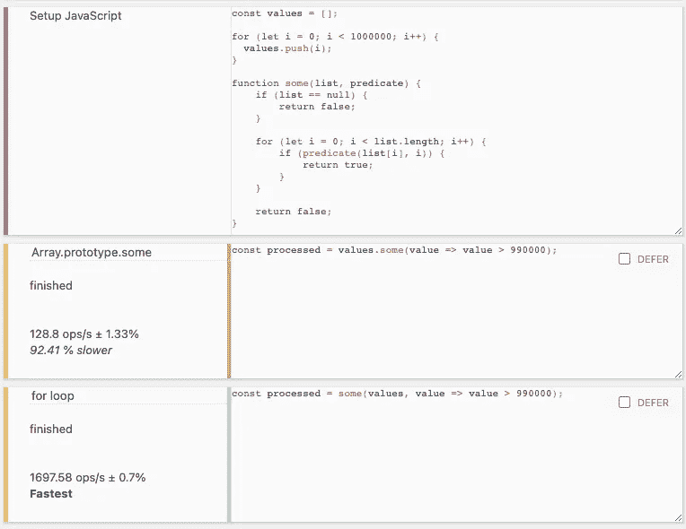
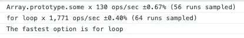

# 使用 Benchmark.js 测试 JavaScript 性能

> 原文：<https://javascript.plainenglish.io/testing-javascript-performance-with-benchmark-js-3d3f4e4b9fc2?source=collection_archive---------5----------------------->

每当我们想要提高代码的性能时，重要的是首先要有度量标准来测量和比较，以确保我们的更改达到预期的效果。 [Benchmark.js](https://benchmarkjs.com/) 是一个常用的工具，用于测量 JavaScript 代码的执行时间，支持高分辨率的计时器以提高测量精度，并确保返回具有统计意义的结果。


Photo by [Veri Ivanova](https://unsplash.com/@veri_ivanova?utm_source=medium&utm_medium=referral) on [Unsplash](https://unsplash.com?utm_source=medium&utm_medium=referral)

许多 web 工具都基于 Benchmark.js，允许您快速创建测试套件，然后在浏览器中运行。虽然 [jsPerf](https://jsperf.com/) 直接隶属于 Benchmark.js，但它往往不可靠(在撰写本文时，它已经因“402: Payment required”错误而关闭了几天)，所以我个人最喜欢的是 [JSBench。Me](https://jsbench.me/) ，它允许您创建一个帐户来保存您的测试套件，并与他人共享它们。

例如，这个测试套件展示了基于在一个`for`循环中遍历数组的手写等价函数`Array.prototype.some`的性能。我们可以将不同的测试用例放入不同的盒子中，并添加尽可能多的测试用例进行比较。任何设置逻辑都应该放入 *Setup JavaScript* 字段，以确保测试用例完全专注于运行我们实际想要测试的代码。当我们准备好了，我们只需点击*运行*按钮和 JSBench。Me 将在后台配置 Benchmark.js 来运行我们的代码并比较结果，清晰地呈现不同选项之间的性能差异。



An example test run from JSBench.Me

如你所见，手写版本的性能明显更好，JSBench 也是如此。Me 强调这个测试用例是最快的，并确定其他每个测试用例慢多少。

虽然在线工具对于快速比较代码片段非常有用，但是您可能还希望将 Benchmark.js 集成到您自己的应用程序中，例如在 CI 管道中包括性能测试，以帮助防止回归。

入门容易；只需通过运行以下命令来安装 Benchmark.js:

```
npm i --save-dev benchmark
```

然后创建一个新文件(例如`bench.js`)来包含你的基准套件。您需要导入基准库:

```
const Benchmark = require('benchmark');
```

创建`Suite`对象，如果您喜欢，可以给它起个名字:

```
const suite = new Benchmark.Suite('My performance test');
```

然后您需要配置测试套件，它具有一个漂亮流畅的界面。您可以向套件中添加测试和运行它的调用:

```
suite
    .add('RegExp#test', () => /o/.test('Hello World!'))
    .add('String#indexOf', () => 'Hello World!'.indexOf('o') > -1)
    .run();
```

现在，您可以通过执行文件来运行套件，例如运行:

```
node bench.js
```

这样做，您将看到脚本需要一些时间来运行，然后…不返回任何内容。不幸的是，我们需要采取一些额外的步骤来实际获得一些结果！

Benchmark.js 在运行时发布了许多事件，我们在配置测试套件时为这些事件添加了监听器:

```
suite.on('complete', event => {
  const suite = event.currentTarget;
  const fastestOption = suite.filter('fastest').map('name'); console.log(`The fastest option is ${fastestOption}`));
});
```

事件上的`currentTarget`是完整的`Suite`对象。运行该套件现在将输出以下内容:

```
The fastest option is String#indexOf
```

现在我们知道`String#indexOf`测试用例以最快的速度运行。如果我们还想随着测试套件的进展获得更多的输出，我们可以监听`cycle`事件:

```
suite.on('cycle', event => {
  const benchmark = event.target; console.log(benchmark.toString());
});
```

事件上的`target`是最后一次运行基准。现在，我们的输出将类似于以下内容:

```
RegExp#test x 48,985,511 ops/sec ±0.73% (90 runs sampled)
String#indexOf x 819,109,711 ops/sec ±0.77% (92 runs sampled)
The fastest option is String#index
```

我们现在有了更多关于不同选项运行速度的信息，以及这些结果的差异。幸运的是，这里有一个明显的赢家，`indexOf`方法快了一个数量级，低方差让我们对结果有很高的信心。

Benchmark.js 提供了比我们在本文中提到的更多的选项:您可以在他们的 [API 文档](https://benchmarkjs.com/docs)中找到更多信息。

最后，这里是我们最初在 JSBench 中运行的相同测试。Me 但是直接用 Benchmark.js 写的:

输出:

```
Array.prototype.some x 111 ops/sec ±1.33% (78 runs sampled)
for loop x 1,687 ops/sec ±2.01% (91 runs sampled)
The fastest option is for loop
```

您也可以在浏览器中运行该套件，方法是将其封装在一个简单的 HTML 页面中:

```
<!DOCTYPE html>
<html>
    <head>
        <title>Benchmark.js test</title>
        <meta charset="utf-8">
    </head>
    <body>
        <script src="https://cdn.jsdelivr.net/npm/lodash@4.17.21/lodash.min.js"></script>
        <script src="https://cdn.jsdelivr.net/npm/benchmark@2.1.4/benchmark.min.js"></script>
        <script src="bench.js"></script>
    </body>
</html>
```

并在开发人员工具控制台中查看输出:



Output from benchmark suite in browser

> 注意:您必须从`bench.js`中移除`require`以避免浏览器出错；`Benchmark`对象将在全球范围内可用

既然您已经了解了使用 Benchmark.js 的基本知识，那么您就可以开始对代码的性能做出量化的决定，并证明您何时在进行改进。前进，让你的代码更快！

或者，在此之前，先了解一下如何使用剧作家跨不同的浏览器运行 Benchmark.js 测试

*更多内容请看*[***plain English . io***](http://plainenglish.io/)