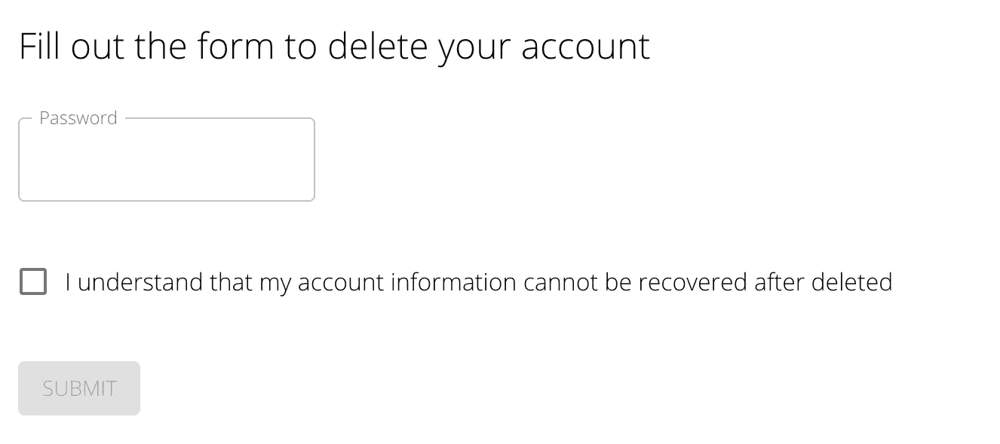
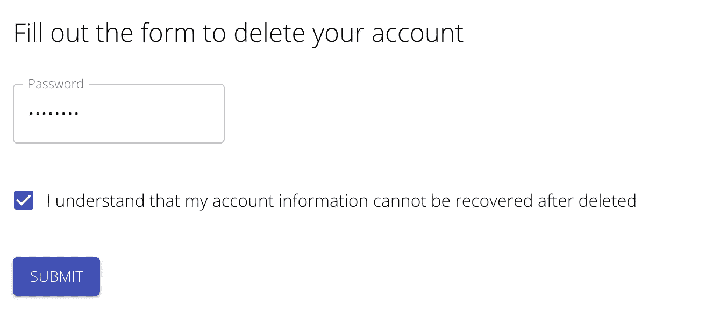
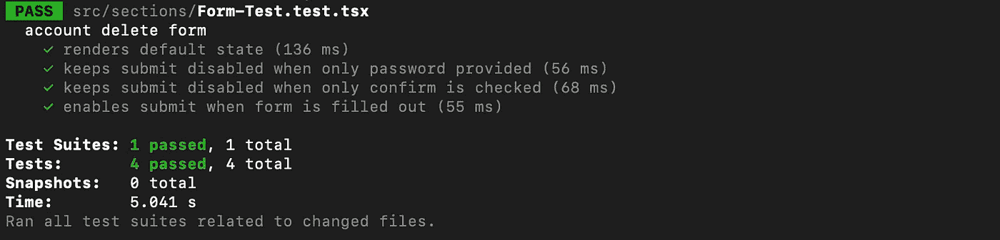

# 使用 React-Testing-Library 测试材料 UI 表单

> 原文：<https://javascript.plainenglish.io/testing-material-ui-forms-with-react-testing-library-50a9d4d300f2?source=collection_archive---------2----------------------->


在处理表单时，测试用例可能很难编写。我发现这对于我喜欢的 UI 库:Material UI 来说尤其困难。我喜欢它的组件、设计，以及它与 React 的无缝结合，但在测试时会很困难。

下面我将展示一个我最近创建的账户删除请求表单的例子，以及我是如何编写测试用例的。

我在测试堆栈中使用了[jest](https://jestjs.io/)+[react-testing-library](https://testing-library.com/docs/react-testing-library/intro/)。

## 第一，形式

表格本身很简单。文本栏、复选框和提交按钮。

当表单加载时，文本字段为空，复选框未选中。

当文本字段为空或复选框未选中时，提交按钮被禁用。



我的目标是为 UI 可能处于的不同状态编写测试

1.  密码为空，复选框未选中，按钮禁用
2.  密码已填写，复选框未选中，按钮已禁用
3.  密码为空，复选框被选中，按钮被禁用
4.  密码已填写，复选框已选中，按钮已启用

表单的代码版本:

## 需要指出几件事

*   我的文本字段在 inputProps 对象上设置了 data-testid，而不是外部的文本字段。这将允许我更容易地操纵文本字段的值。
*   我正在导入 extended-expect 依赖项，这样我就可以使用`toHaveClass`检查。

```
**import** "@testing-library/jest-dom/extend-expect"expect(submit).toHaveClass("Mui-disabled");
```

我发现类检查是测试一些 UI 元素状态的最简单的方法。

下面是表单的完整测试套件。我将在本文的剩余部分讨论每个 it 模块。

## 默认视图

我喜欢包含测试，以确保组件第一次呈现时一切都如我所愿。

## 仅密码

接下来，当只有密码字段有值时，我确保按钮被禁用。

## 仅确认

现在，我对空密码和选中的复选框做同样的操作。

## 启用提交

最后，当密码和复选框都被填写时，我检查按钮是否被启用。

一旦我所有的测试都通过了，我就可以进入下一个特性了。



[*更多内容看 plainenglish.io*](http://plainenglish.io/)