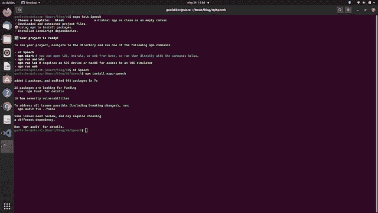

# 使用 React Native Expo 进行文本到语音转换(Android 和 IOS)

> 原文：<https://javascript.plainenglish.io/text-to-speech-conversion-using-react-native-expo-android-ios-f68f3e3ac5d9?source=collection_archive---------15----------------------->

你好，德夫斯！

制作一个功能丰富的移动应用程序并不容易，对吗？作为一名开发人员，你只是想给你的应用程序添加一些额外的功能，以便这些功能可以增强移动应用程序的使用。用户也会喜欢这个特性。

假设您正在构建一个移动应用程序，允许用户阅读不同的故事、引文或其他内容。但是您还想添加一些功能来读出故事的所有文本。基本上，您希望在移动应用程序项目中为语音功能添加文本。它允许用户在旅行、慢跑等时听你的故事。因此，让我们使用 React Native Expo 制作一个将文本转换为语音的移动应用程序。不，我们没有使用任何类型的机器学习功能。React Native Expo 拥有支持您的超酷套装。抓住你的座位，喝杯咖啡，让我们开始吧。


Photo by [Caspar Camille Rubin](https://unsplash.com/@casparrubin?utm_source=medium&utm_medium=referral) on [Unsplash](https://unsplash.com?utm_source=medium&utm_medium=referral)

如果您正在寻找视频教程，那么它就在这里:

# 设置和安装

> 1.创建一个目录并导航到它。
> 2。在这个目录下打开终端或者命令提示符，运行命令:`**expo init Speech**`
> 3 .选择空白模板并继续下载。
> 4。导航到文件夹“语音”
> 5。在终端或命令提示符下运行命令:`**npm install expo-speech**`



完成所有 5 个步骤后，您将在终端窗口上看到类似这样的内容。我们完成了安装，现在让我们编码。

# 文本到语音的编码

在您最喜欢的文本编辑器中打开项目，并验证一次已安装的包。打开 **App.js** 文件，编写如下所示的代码。

```
import * as React from 'react';
import { View, StyleSheet, Button, Text } from 'react-native';
import * as Speech from 'expo-speech';export default function App() {
  const thingToSay = "I am beginning to feel like a Rap God, Rap God All my 
    people from the front to the back nod, back nod Now, who thinks their arms 
    are long enough To slap box, slap box? They said I rap like a robot, so call 
    me Rap-bot";
  const speak = () => {
    Speech.speak(thingToSay);
  };return (
    <View style={styles.container}>
      <Text style={styles.Texts}>{thingToSay}</Text>
      <Button title="Start listening" onPress={speak} />
    </View>
  );
}const styles = StyleSheet.create({
  container: {
    flex: 1,
    justifyContent: 'center',
    backgroundColor: '#ecf0f1',
    padding: 8,
  },
  Texts: {
    marginTop: 10,
    color: 'black',
    padding:10,
  }
```

首先，导入我们将在这个项目中使用的所有必需的库。在那之后，我们做了一个持续的“thingToSay ”,在那里我们指定了我们将要听的内容。您可以相应地更改它们。确保将它们排成一行。然后我们在 speak 函数中添加了这个常量，导入的库包将在这个函数中完成它的工作。现在只需返回这个主应用程序函数，并相应地定制 UI。为了简单起见，我们只显示文本和开始收听按钮。你也可以从 firebase 数据库导入文本，它也可以顺利工作。这就是了。

现在在您的终端或命令提示符窗口中运行服务器，使用命令: `**npm start**`

从您的 IOS 或 Android 设备扫描二维码。因为文本到语音转换在两种操作系统上都可以很好地工作。

看着你的手机屏幕，按下按钮听显示的文字。
类似这样的东西。


text to speech in React Native

我希望现在清楚了。这些是简单的 JavaScript 代码。如果你面临任何困难，请在评论区告诉我。

谢谢大家！

*更多内容看* [*说白了. io*](http://plainenglish.io/) *。在这里注册我们的* [*免费周报*](http://newsletter.plainenglish.io/) *。*