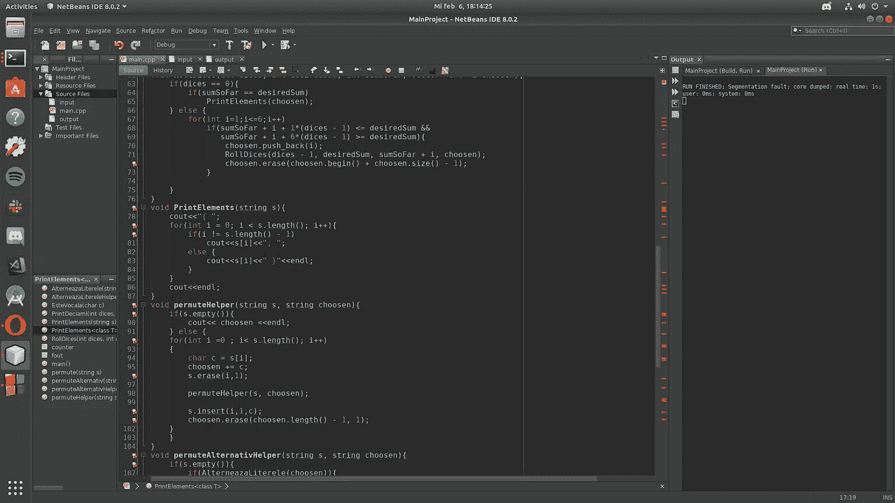
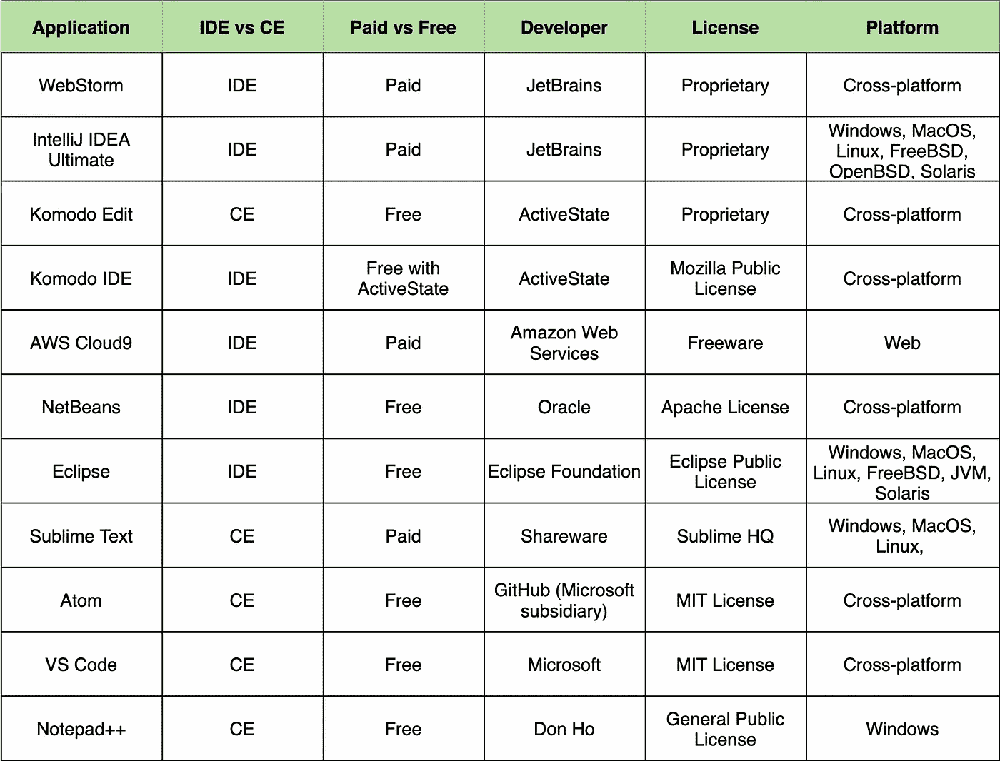

# 2022 年十大最佳 JavaScript IDEs 和代码编辑器

> 原文：<https://javascript.plainenglish.io/the-10-best-javascript-ides-and-code-editors-for-2022-bac97a86d565?source=collection_archive---------1----------------------->

作为万维网的核心语言之一，如果没有 JavaScript，互联网将完全不同。JavaScript 是一种用于前端和后端 web 开发的高级编程语言。您可以使用 JavaScript 创建动态 web 内容和应用程序。如果你是一名 web 开发人员或者从事与 web 开发相关的工作，你将通过学习 JavaScript 获得竞争优势。

在本文中，我们将分享我们对 2022 年 10 个最佳 JavaScript IDEs 和代码编辑器的看法。虽然 2021 年 Adobe 的开源代码编辑器 Brackets 停止使用，但仍有大量应用程序可以帮助 JavaScript 开发人员简化他们的工作流程。

**下面是我们将要讲述的内容**:

*   什么是 ide 和代码编辑器？
*   选择 IDE 或代码编辑器时需要考虑的事项
*   2022 年十大最佳 JavaScript IDEs 和代码编辑器
*   网络风暴(IDE)
*   IntelliJ (IDE)
*   Komodo Edit (CE)和 Komodo IDE
*   AWS 云 9 (IDE)
*   NetBeans (IDE)
*   Eclipse (IDE)
*   崇高的文本
*   原子
*   Visual Studio 代码(CE)
*   记事本++ (CE)
*   结论和对比图

# 什么是 ide 和代码编辑器？

集成开发环境(ide)和代码编辑器(CEs)是用于编写和编辑代码的软件应用程序。从技术上讲，我们可以在纯文本编辑器中编写代码，但是 ide 和 CEs 提供了旨在简化编码过程的附加功能。

IDE 通常比代码编辑器有更多的功能，但是一些代码编辑器可以被定制成具有与 IDE 相似的功能。代码编辑器通常带有一些功能，如语法突出显示、自动完成和大括号匹配。ide 在单一的图形用户界面中结合了多种开发工具。至少，这些工具通常由代码编辑器、编译器或解释器以及调试器组成。

# 选择 IDE 或代码编辑器时需要考虑的事项

谈到 ide 和代码编辑器，每个程序员都有自己的偏好。在找到合适的之前，你可以尝试几个应用程序。

以下是评估你的选择时要考虑的一些标准:

*   **费用:**有免费和付费两种应用可供选择。确定你的预算，并考虑到在找到合适的之前你可能会尝试几种应用程序。如果你对付费选项持开放态度，许多应用程序都提供免费试用期。
*   **学习曲线:**适应一个新的界面和记忆键盘快捷键需要时间。虽然每个用户的学习曲线都是独特的，但已知有些应用程序的初学者学习曲线更陡。如果你选择这些应用程序中的一个，给自己一些时间来适应和开发一个高效的工作流程。
*   **功能性和可定制性:**应用程序有各种各样的功能，所以知道你在寻找什么功能是有帮助的。一些流行的功能包括多语言支持、自动完成以及 Git 和 GitHub 集成。如果 IDE 或代码编辑器没有提供某种功能，看看是否可以通过插件或扩展来获得。
*   **速度:**你既要考虑应用程序在速度方面的声誉，也要考虑你的机器或设备是否足够强大来承载应用程序。
*   **机器需求:**您的机器规格会影响应用程序的性能。如果你用一个沉重的程序使你的设备的处理能力和内存过载，你会体验到速度变慢。虽然这条规则肯定有例外，但代码编辑器通常是比 IDE 更轻量级的应用程序。
*   操作系统兼容性:一些 ide 和代码编辑器并不总是提供跨平台的功能。审查选项时，请注意操作系统兼容性。
*   **用户支持:**一个老牌软件公司的应用程序可能比一个不太受欢迎的应用程序拥有更强大的用户支持。如果你是一个初学者，前面还有一段学习曲线，你可能想要寻找有客户支持和活跃用户社区的应用程序。
*   **可访问性**:不幸的是，在提高可访问性方面，ide 和代码编辑器还有很多不足之处。虽然许多工具提供了支持视觉障碍程序员的功能，如屏幕阅读器或字体调整，但这些工具都有缺点。例如，屏幕阅读器不能传达一些最有帮助的特性的视觉指示，比如语法高亮和重构建议。

# 10 个最好的 JavaScript IDEs 和代码编辑器

# 网络风暴(IDE)

WebStorm 是一个专门研究 JavaScript 和 TypeScript 的集成开发环境。很多 web 开发者使用 WebStorm 进行后端和前端开发。WebStorm 是 JetBrains 的产品。支持 Node.js、Angular.js、React 等 JavaScript 框架。它的特性包括 GitHub 集成、智能自动完成和跨所有项目文件的代码重构。

**优点**:

*   可靠的更新和用户支持
*   可定制插件
*   在 Windows、Linux 和 macOS 上可用
*   对学生和开源项目免费

**缺点**:

*   会消耗设备内存
*   偶尔缓慢加载时间

**用例**:您是一名多语言 web 开发人员，正在寻找一个支持复杂项目的 IDE。

**价格**:个人用户每月 12.90 美元。学生和非商业开源项目可以使用免费版本。

# IntelliJ IDEA 终极版(IDE)

IntelliJ IDEA Ultimate 是一个以 Java 为中心的 IDE，在 JavaScript 开发中也很流行。在 2001 年第一次发布时，IntelliJ 是第一批集成了代码导航和代码重构等功能的 Java IDEs 之一。幸运的是，IntelliJ 现在有了更多的功能，包括编码帮助和对 Node.js 等 JavaScript 框架的支持。

IntelliJ 是 JetBrains 的产品。如果你选择 IntelliJ，给自己时间去适应，因为一些用户报告学习曲线很陡。IntelliJ 有一个免费和开源的对等物，IntelliJ IDEA Community，但不幸的是它不支持 JavaScript。

**优点**:

*   直观的用户界面
*   基于 DOM 模型的精确自动补全
*   辅助功能包括屏幕阅读器

**缺点**:

*   索引可能会很慢
*   更陡峭的学习曲线
*   昂贵的
*   免费版不支持 JavaScript

**用例**:你是一名专业人士，需要为你的项目提供广泛的功能。

**价格**:个人用户每月 49.90 美元。

# Komodo Edit (CE)和 Komodo IDE

由 ActiveState 开发的 Komodo Edit 和 Komodo IDE 是用于动态编程语言的应用程序。Komodo Edit 是一个免费的开源代码编辑器。它的商业对应物 Komodo IDE 是一个具有扩展功能的 IDE。Komodo IDE 现在作为 ActiveState 平台的一部分是免费的。

初学者可能会发现从 Komodo Edit 开始更容易，因为一些用户报告说 Komodo IDE 的学习曲线很陡。Komodo Edit 提供了一个内置的 FTP 客户端，自动完成，代码折叠和智能语法高亮。更高级的功能，比如调试和单元测试，是为 Komodo IDE 保留的。两者都可以用插件和宏来定制。

**优点**:

*   宏定制
*   Komodo IDE 功能包括实时预览、Git 集成、版本控制和远程协作
*   定期维护和改进
*   跨平台

**缺点**:

*   初学者的学习曲线更陡
*   为 Komodo IDE 保留的高级功能
*   Python 的开发者不支持或维护 Komodo IDE

**用例**:你想要一个极简的编码环境。你正在积极地设计和展示网站。

**价格**:科莫多编辑免费。Komodo IDE 作为开源 ActiveState 平台的一部分是免费的。

# AWS 云 9 (IDE)

AWS Cloud9 是一个托管在云上的 IDE。任何拥有稳定互联网连接和 AWS 帐户的人都可以访问这个在线 IDE 的强大功能。这对于那些负担不起在设备上安装大型 IDE 的人来说尤其有益。

AWS Cloud9 的功能包括实时语言分析和语法突出显示。AWS Cloud9 还允许您与合作者实时共享和编辑代码。IDE 可以通过插件进一步定制。

**优点**:

*   直观的用户界面
*   实时协作防止合并冲突和覆盖
*   功能包括 Kube 工具和集成外壳
*   不需要本地安装

**缺点**:

*   需要稳定的互联网接入
*   不自由
*   需要 AWS 帐户

**用例**:你需要一个 IDE 的功能，但是没钱在你的机器上安装一个。你需要团队协作工具。您对无服务器开发感兴趣，并且想要一个预先配置好的开发环境来支持它。

**价格** : AWS Cloud 9 采用按价值付费的计费模式定价。

# NetBeans (IDE)

NetBeans 是 Java 程序员熟知的免费 IDE。虽然 NetBeans 最常用于 Java，但它支持多种语言，包括 JavaScript、HTML5 和 CSS3。NetBeans JavaScript 编辑器附带了语法突出显示和自动完成功能，以及内置的 jQuery 支持。NetBeans 支持 Angular、Express、Vue、React 和 Mocha 等 JavaScript 框架。

许多程序员喜欢 NetBeans 直观且可定制的界面。它开箱即用，具有许多功能，因此您可以在安装后立即投入使用。但是，众所周知，NetBeans 对资源的要求很高。如果您的设备规格较低，它可能无法顺利运行。

**优点**:

*   特性包括调试器、内置 Git 支持和代码折叠
*   用户界面易于定制
*   在 Windows、Mac OS 和 Linux 上可用

**缺点**:

*   难以与其他工具集成
*   最小附加功能
*   对资源的需求
*   即使对于小型前端项目也可能很慢

**用例**:您是一名 Java 或多语言开发人员，拥有一台可以处理重量级应用程序的设备。

**价格**:免费。

# Eclipse (IDE)

Eclipse 是 2004 年首次发布的开源 IDE。它的重点是 Java 开发，但也支持 JavaScript 和其他编程语言。Eclipse 有一个基本的工作空间，可以用插件定制以扩展功能。因此，您需要考虑额外的设置时间。例如，需要安装 JavaScript 开发工具。

**优点**:

*   高度可定制
*   庞大的用户群和社区构建的插件
*   使用 Emacs 键绑定

**缺点**:

*   有限的支持
*   对资源的需求
*   许多人认为 UI 违反直觉

**用例**:你更喜欢开源软件，不介意花时间定制。你喜欢别人认为的老派界面。

**价格**:免费。

# 崇高的文本

Sublime Text 是编程语言和标记语言的源代码编辑器。许多开发人员被 Sublime Text 的速度和多功能性所吸引。这是一个高度可定制的代码编辑器，有大量用户构建的插件包可供选择。

**优点**:

*   快速、轻量且可定制
*   特性包括颜色编码、多重选择、可定制热键和 Git 集成
*   在 Windows、macOS 和 Linux 上可用

**缺点**:

*   缺少智能代码完成
*   需要时间来设置
*   更陡峭的学习曲线
*   工作环境缺乏特色

**用例** :
您优先考虑应用程序速度，并且经常处理大文件。您是自由职业者或为小型企业工作，不需要强大的工作环境功能。

**价格**:个人用户每年 99 美元。

# 原子

Atom 是 GitHub 的免费开源代码编辑器。它有一些默认的特性，比如智能代码完成和一个内置的包管理器。它被称为“可破解的”文本编辑器，可以通过插件高度定制。Atom 基于 Electron 框架，非常适合使用 Chromium 和 Node.js 构建跨平台桌面应用程序。

Atom 以其简单的用户界面和可定制性著称。另一方面，许多用户都经历过程序错误、死机和崩溃。这是一个较大的应用程序，如果您的机器性能较弱，它可能会降低您的速度。

**优点**:

*   高度可定制的用户界面和功能
*   特性包括 GitHub 集成、APM 集成包管理器和多个窗格
*   开源，有一个大的支持社区

**缺点**:

*   超过 100MB 的大型应用程序
*   加载时间长，偶尔崩溃和冻结
*   如果通过插件扩展功能，设置时间会更长

**用例**:你喜欢可定制性、直观的界面和强大的在线社区。您的设备不会丧失信心，可以处理大型应用程序。

**价格**:免费。

# Visual Studio 代码(CE)

Visual Studio Code (VS Code)是微软开发的免费代码编辑器。作为代码编辑器，它缺乏内置的工具和测试功能。但是，这些功能可以通过插件和扩展来安装。VS Code 拥有庞大的社区和强大的技术支持。

VS 代码有一个对应的 IDE，Visual Studio。Visual Studio 尤其被推崇为 C、C++和 C Sharp 的集成开发环境。然而，它不是免费的，初学 JavaScript 的开发者可能会发现它不必要的复杂。只要你不介意安装插件来扩展 VS Code 的功能，我们认为 VS Code 为 JavaScript 开发提供了足够多的功能。

**优点**:

*   支持 JavaScript 框架，包括 React 和 Node.js
*   特性包括代码折叠、git 集成、调试和智能感知(微软的代码完成实现)
*   辅助功能的屏幕阅读器

**缺点**:

*   更陡峭的学习曲线
*   安装扩展和插件需要很长的设置时间

**用例**:你是企业界的一名开发人员。您需要一个能够处理复杂项目的多功能工具。

**价格**:免费。

# 记事本++ (CE)

Notepad++是一款面向 Windows 用户的免费源代码编辑器。这是一个非常轻量级的应用程序，非常适合那些设备规格有限的人。它开箱即用，具有代码折叠和语法突出显示等特性。它还支持额外定制的宏和插件。

**优点**:

*   易于安装和使用
*   最轻量级的应用
*   支持插件和宏定制

**缺点**:

*   仅在 Windows 上可用
*   缺少智能代码完成和语法检查

**用例**:你是一名 Windows 用户，需要为你的设备开发一个轻量级的应用程序。您希望在不安装和自定义复杂 IDE 的情况下练习基本项目。

**价格**:免费。

# 结论和对比图

虽然这个列表并不全面，但我们希望它能帮助您找到适合您的 JavaScript 之旅的 IDE 或代码编辑器。编码快乐！

*更多内容请看*[***plain English . io***](http://plainenglish.io/)