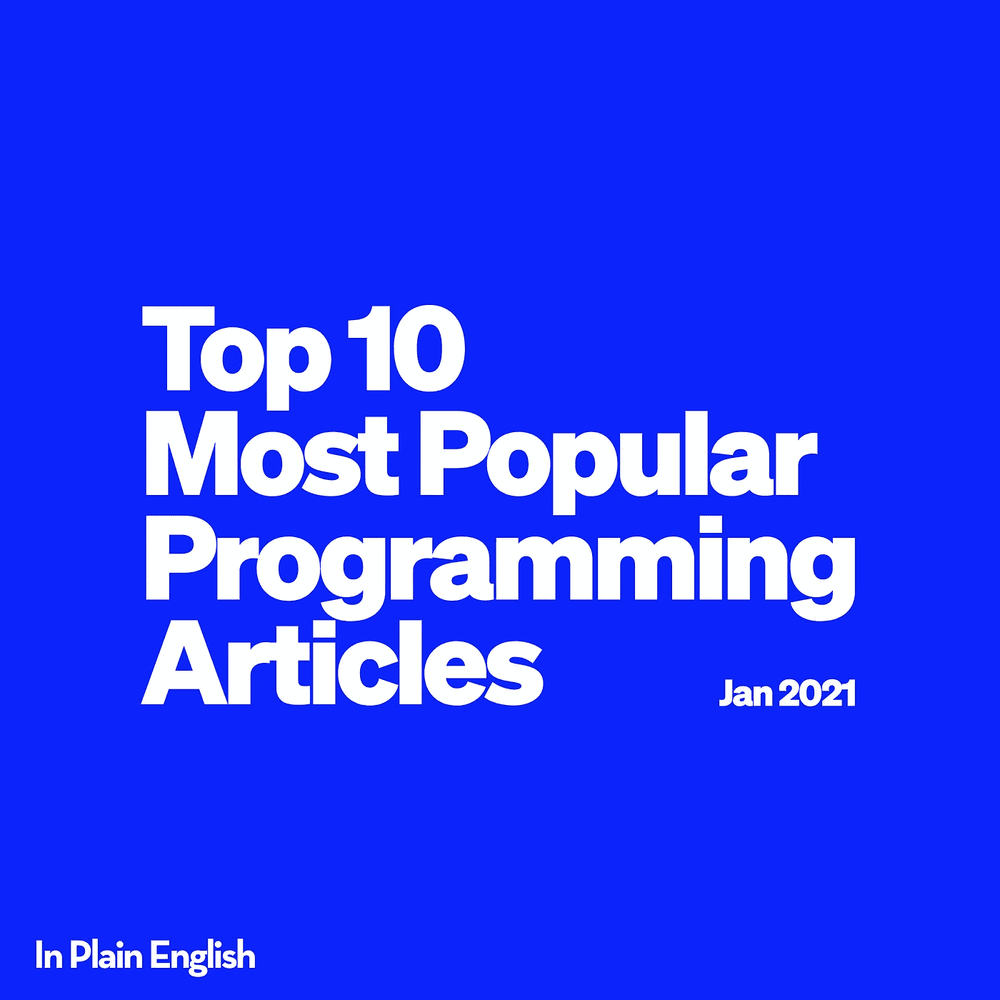

# 10 篇最受欢迎的编程文章(2021 年 1 月)

> 原文：<https://javascript.plainenglish.io/the-10-most-popular-programming-articles-january-2021-4e896dc15cf6?source=collection_archive---------7----------------------->

## 以下是 10 篇最受欢迎的浅显英语 JavaScript 文章。需要为你的下一篇文章寻找灵感——别再找了！

以下文章是按照获得的掌声数量排列的。这意味着根据浏览量可能会有不同的顺序，尽管掌声通常是一篇文章受欢迎程度/表现如何的良好晴雨表。

## 1.[编程让你心情愉快的迷因](https://medium.com/javascript-in-plain-english/30-programming-memes-that-will-lighten-your-mood-265b4fe50229)

 [## 30 个编程迷因会减轻你的情绪

### 每天我们都会遇到很多情况，我们会非常努力地解决所有问题。我们应该放松一下…

medium.com](https://medium.com/javascript-in-plain-english/30-programming-memes-that-will-lighten-your-mood-265b4fe50229) 

由 [Atit](https://medium.com/u/795bd33d705?source=post_page-----4e896dc15cf6--------------------------------)

*喜欢:2.7k*

## 2.[2021 年要知道的 JavaScript 优化技术](https://medium.com/javascript-in-plain-english/34-javascript-optimization-techniques-to-know-in-2021-d561afdf73c3)

 [## 2021 年要知道的 34 种 JavaScript 优化技术

### 使用现代速记技术、技巧和诀窍优化您的 JavaScript 代码

medium.com](https://medium.com/javascript-in-plain-english/34-javascript-optimization-techniques-to-know-in-2021-d561afdf73c3) 

由 [Atit](https://medium.com/u/795bd33d705?source=post_page-----4e896dc15cf6--------------------------------)

*喜欢:1.5k*

## 3. [CSS 属性没人在说](https://medium.com/javascript-in-plain-english/6-css-properties-nobody-is-talking-about-e6cab5138d02)

 [## 6 没有人谈论的 CSS 属性

### 许多人从未听说过的有趣特性。

medium.com](https://medium.com/javascript-in-plain-english/6-css-properties-nobody-is-talking-about-e6cab5138d02) 

作者[阿努拉格·卡努里亚](https://medium.com/u/eea6e41ec675?source=post_page-----4e896dc15cf6--------------------------------)

*喜欢:1.2k*

## 4.作为一名 JavaScript 开发人员，我犯过的错误(也很后悔)

 [## 作为 JavaScript 开发人员，我犯过(并且后悔)的 7 个错误

### 如果你想要一份薪水更高的工作，那就不要再犯我曾经犯过的错误

medium.com](https://medium.com/javascript-in-plain-english/7-mistakes-i-made-and-regret-as-javascript-developer-a7e80098e363) 

阿里·海德尔

*喜欢:1.2k*

## 5.[当程序员把他们的一生都投入到编程中时，你可以知道的方法](https://medium.com/javascript-in-plain-english/20-funny-images-will-prove-to-you-that-programmers-have-no-life-360a3e7c80e0)

 [## 你可以用 20 种方式来判断程序员什么时候会献身于编程

### 有趣和搞笑的方式

medium.com](https://medium.com/javascript-in-plain-english/20-funny-images-will-prove-to-you-that-programmers-have-no-life-360a3e7c80e0) 

约瑟夫·克鲁兹

*喜欢:1k*

## 6. [**为什么永远不要在 CI/CD 管道中使用‘NPM install’**](https://medium.com/javascript-in-plain-english/why-you-should-never-use-npm-install-in-your-ci-cd-pipelines-da0b89346d8d)

 [## 为什么永远不应该在 CI/CD 管道中使用“npm install”

### 用非常简单的术语解释何时使用“npm ci”和“npm 安装”。

medium.com](https://medium.com/javascript-in-plain-english/why-you-should-never-use-npm-install-in-your-ci-cd-pipelines-da0b89346d8d) 

帕斯卡尔·兹维基施

*点赞数:770*

## 7. [**如何创建一个牛逼的 Github 简介自述**](https://medium.com/javascript-in-plain-english/how-to-create-an-awesome-github-profile-readme-a474d5b45645)

 [## 如何创建一个出色的 Github 简介自述文件

### 最佳 GitHub README 存储库工具

medium.com](https://medium.com/javascript-in-plain-english/how-to-create-an-awesome-github-profile-readme-a474d5b45645) 

作者[加普尔·卡西姆](https://medium.com/u/bf97e5a35e12?source=post_page-----4e896dc15cf6--------------------------------)

*点赞数:590*

## 8.[**React 2021 年学习路线图**](https://medium.com/javascript-in-plain-english/react-learning-roadmap-for-2021-a1c0f7456186)

 [## react 2021 年学习路线图

### 学习的路线图 React 我希望我知道

medium.com](https://medium.com/javascript-in-plain-english/react-learning-roadmap-for-2021-a1c0f7456186) 

由[莫希特](https://medium.com/u/da968086e185?source=post_page-----4e896dc15cf6--------------------------------)

*喜欢数:550*

## 9. [**用这个简单的技巧让你的 React 编码速度翻倍**](https://medium.com/javascript-in-plain-english/double-your-react-coding-speed-with-this-simple-trick-ca2e47d1bf97)

 [## 用这个简单的技巧让你的反应编码速度翻倍

### 我们将看一个 React 组件，它是由像您这样的开发人员编写的，并一步一步地将其重构为…

medium.com](https://medium.com/javascript-in-plain-english/double-your-react-coding-speed-with-this-simple-trick-ca2e47d1bf97) 

作者[阿列克谢·科金](https://medium.com/u/fe0595d8c134?source=post_page-----4e896dc15cf6--------------------------------)

*点赞数:480*

## 10. [**CSS Flexbox 举例说明**](https://medium.com/javascript-in-plain-english/css-flexbox-explained-with-examples-85efa38e4770)

 [## CSS Flexbox 举例说明

### 通过实例了解 CSS flexbox。

medium.com](https://medium.com/javascript-in-plain-english/css-flexbox-explained-with-examples-85efa38e4770) 

由[迈赫迪·奥西德](https://medium.com/u/3e9a7f5d2e89?source=post_page-----4e896dc15cf6--------------------------------)

*点赞数:480*

# 结论

我们做到了！上个月 JavaScript 用简单英语发布的 10 篇最受欢迎的文章。恭喜那些上榜的人！🎉非常感谢你们每一个关注我们出版物并参与其中的人！

非常爱你！ ❤️

*你愿意用简单英语为 2021 年做贡献吗？* [***点击这里了解***](https://medium.com/javascript-in-plain-english/https-medium-com-javascript-in-plain-english-join-our-team-b0854ead7d14) ***！***