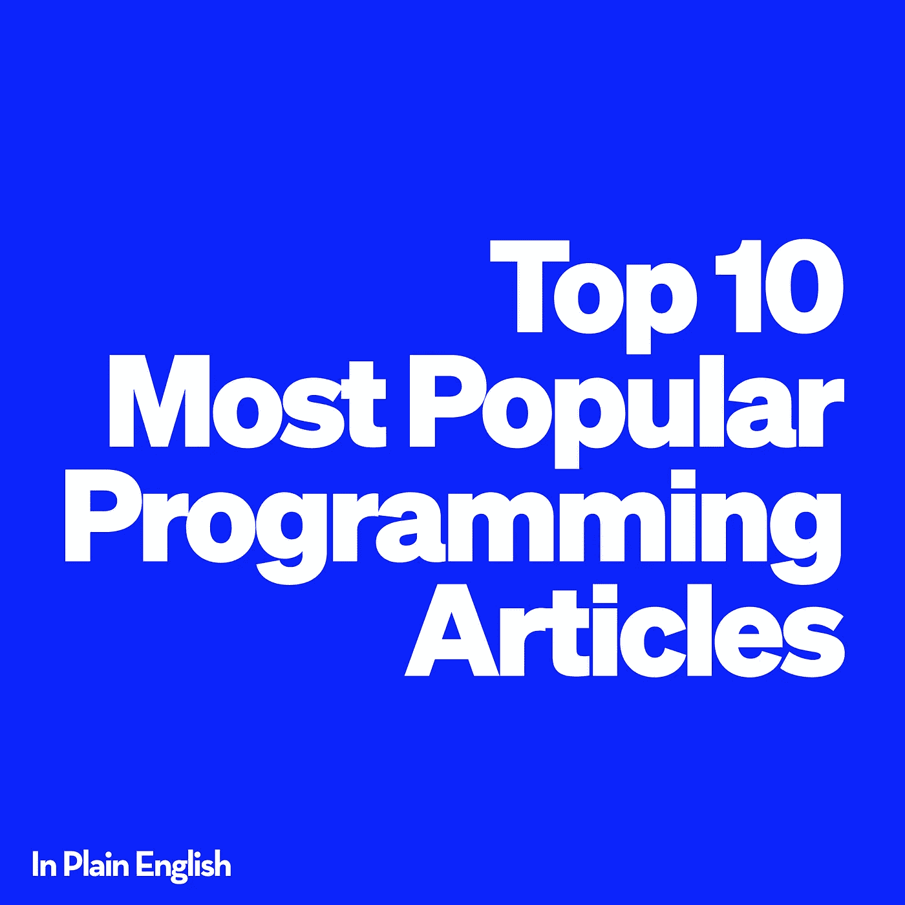
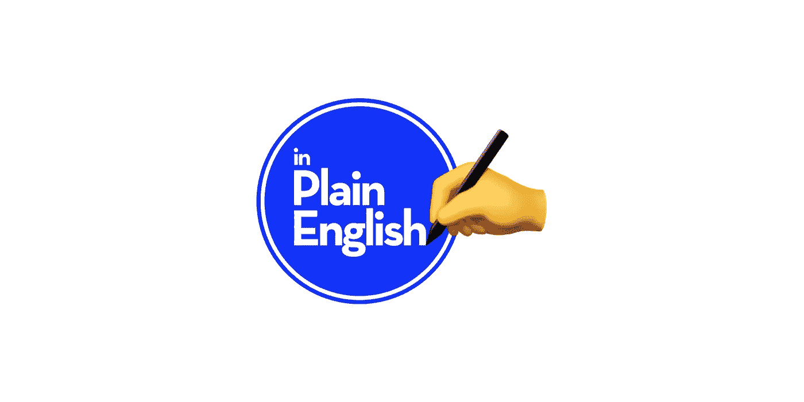

# 10 篇最受欢迎的编程文章(2021 年 3 月)

> 原文：<https://javascript.plainenglish.io/the-10-most-popular-programming-articles-march-2021-a8de02bf8058?source=collection_archive---------5----------------------->

## 以下是 10 篇最受欢迎的浅显英语 JavaScript 文章。需要为你的下一篇文章寻找灵感——别再找了！

以下文章是按照获得的掌声数量排列的。这意味着根据浏览量可能会有不同的顺序，尽管掌声通常是一篇文章受欢迎程度/表现如何的良好晴雨表。

## 1. [14 个有用的工具，我用它们来更快更容易地开发网站](/14-useful-tools-for-faster-and-easier-web-development-9fd0ebc1f3f8)

 [## 14 个有用的工具，我用它们来更快更容易地进行 Web 开发

### 您喜欢使用的有用的在线开发工具。

javascript.plainenglish.io](/14-useful-tools-for-faster-and-easier-web-development-9fd0ebc1f3f8) 

作者[约瑟夫·克鲁兹](https://medium.com/u/d446e1b4a70b?source=post_page-----a8de02bf8058--------------------------------)

*喜欢:2k*

## 2.[我不知道前端需要回购](/7-repos-i-didnt-know-i-needed-for-front-end-389bf498afaa)

 [## 我不知道前端需要 7 个回购

### 很少有人谈论将帮助您更快地构建更好的东西的存储库。

javascript.plainenglish.io](/7-repos-i-didnt-know-i-needed-for-front-end-389bf498afaa) 

由[阿努拉格·卡诺里亚](https://medium.com/u/eea6e41ec675?source=post_page-----a8de02bf8058--------------------------------)

*喜欢:1.8k*

## 3.[你的 PWA 要在 2021 年 8 月破了](/your-pwa-is-going-to-break-in-august-2021-34982f329f40)

 [## 你的 PWA 要在 2021 年 8 月破了

### 谷歌的信条是 PWA 永远不应该显示 Chrome 的默认离线屏幕。相反，所有 pwa 都应该…

javascript.plainenglish.io](/your-pwa-is-going-to-break-in-august-2021-34982f329f40) 

凯文·巴塞特

*喜欢:1.4k*

## 4.[2021 年使用的顶级 Node.js 框架](/top-node-js-frameworks-to-use-in-2021-4951ee5940b8)

[https://JavaScript . plain English . io/top-node-js-frameworks-to-use-in-2021-4951 ee 5940 b 8](/top-node-js-frameworks-to-use-in-2021-4951ee5940b8)

由[罗纳克·帕特尔](https://medium.com/u/b0e77d842ece?source=post_page-----a8de02bf8058--------------------------------)

*点赞:900*

## 5.[用类型脚本清除 API](/a-cleaner-api-for-react-ts-components-47d0704a508c)

 [## 用于反应 TS 组件的更干净的 API

### 用 TypeScript 构建干净 React 组件

javascript.plainenglish.io](/a-cleaner-api-for-react-ts-components-47d0704a508c) 

阿兰·珀卡兹

*点赞数:700*

## 6.[作为 JavaScript 开发人员你应该知道的概念](/7-concepts-you-should-know-as-a-javascript-developer-f406597319ab)

 [## JavaScript 开发人员应该知道的 7 个概念

### 在下一个 JavaScript 项目中使用的基本概念

javascript.plainenglish.io](/7-concepts-you-should-know-as-a-javascript-developer-f406597319ab) 

由[莫希特](https://medium.com/u/da968086e185?source=post_page-----a8de02bf8058--------------------------------)

*点赞数:620*

## 7.[停止使用余量，使用垫片组件代替](/stop-using-margin-use-spacer-component-instead-953d9b2dbacc)

 [## 停止使用边距，改用间隔组件！

### React 中处理组件间距的更好方法

javascript.plainenglish.io](/stop-using-margin-use-spacer-component-instead-953d9b2dbacc) 

由[雷神陈](https://medium.com/u/fd88f9a939f3?source=post_page-----a8de02bf8058--------------------------------)

*点赞:400*

## 8.[入门级 React 面试问题](/10-entry-level-react-interview-questions-5a8ea74e2130)

 [## 10 个入门级 React 面试问题

### 面试是获得一份工作的直接途径，其方式比你想象的要多。你可能会问不止一种方法？是的…

javascript.plainenglish.io](/10-entry-level-react-interview-questions-5a8ea74e2130) 

由[瓦赫唐·诺达泽](https://medium.com/u/8735a8d263a?source=post_page-----a8de02bf8058--------------------------------)

*点赞数:570*

## 9.[对网络开发者有用的网络应用](/9-useful-web-apps-for-web-developers-4cd9a0ea9a2f)

 [## 对网络开发者有用的 9 个网络应用

### 应用程序将帮助你在工作中更有效率。

javascript.plainenglish.io](/9-useful-web-apps-for-web-developers-4cd9a0ea9a2f) 

约瑟夫·克鲁兹

*点赞数:460*

## 10.编写自文档化代码的终极指南

 [## 编写自文档化代码的终极指南

### 厌倦了在代码中写注释吗？我们停止这样做，而是编写自文档化的代码

javascript.plainenglish.io](/the-ultimate-guide-to-writing-self-documenting-code-998ea9a38bd3) 

由[雷内壶](https://medium.com/u/1c0c4af59252?source=post_page-----a8de02bf8058--------------------------------)

*点赞数:210*

# 结论

我们做到了！上个月 JavaScript 用简单英语发表的最受欢迎的 10 篇文章。恭喜那些上榜的人！🎉非常感谢你们每一个关注我们出版物并参与其中的人！

如果你喜欢我们的 JavaScript 内容，一定要访问并关注我们的 [**AWS**](https://aws.plainenglish.io) 和 [**Python**](https://python.plainenglish.io) 出版物！

**多爱！** ❤️

*你愿意用简单英语为 2021 年做贡献吗？如果有，* [***点击此处了解详情！***](/https-medium-com-javascript-in-plain-english-join-our-team-b0854ead7d14)

Join the team!