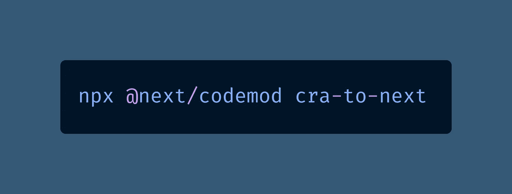
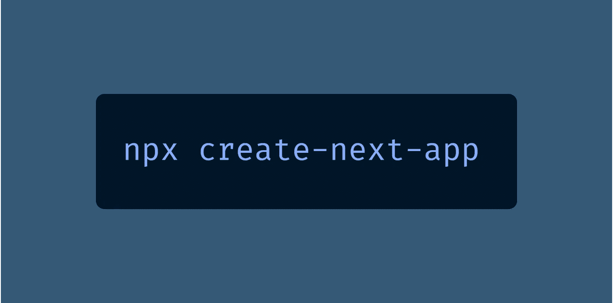
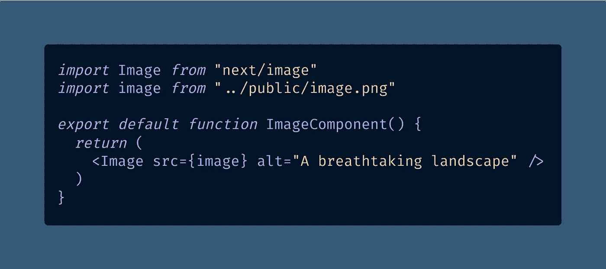
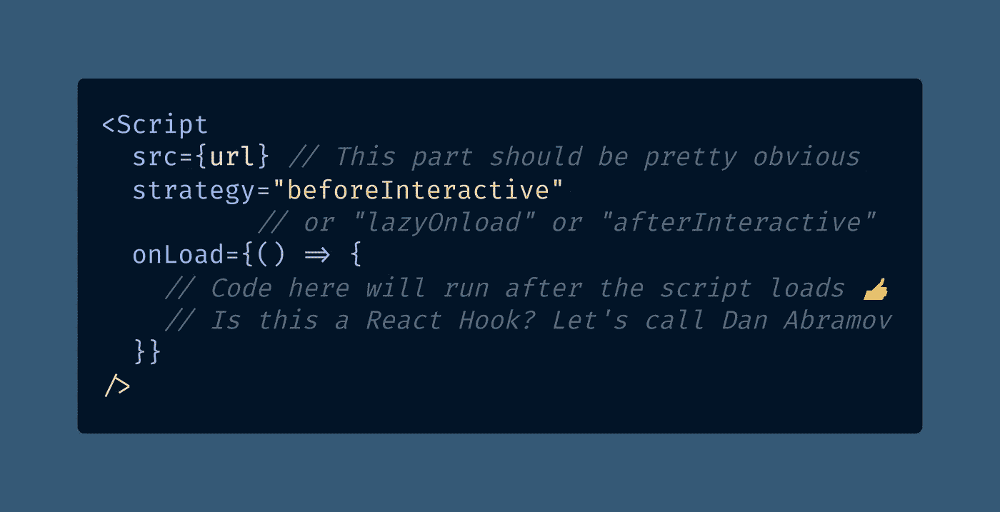
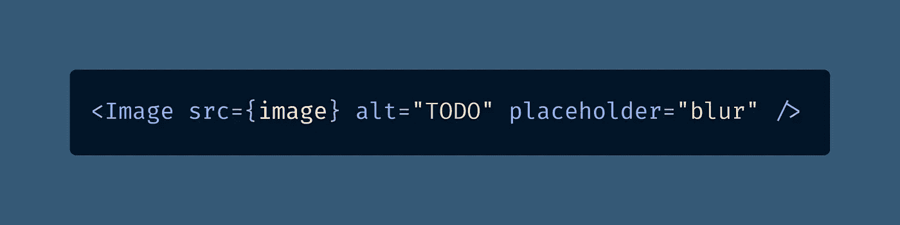
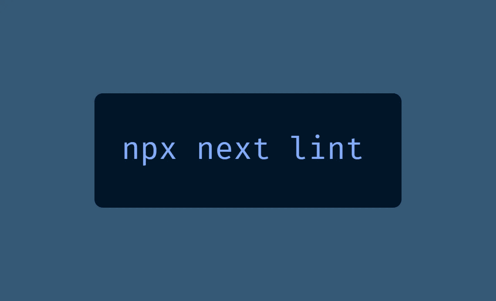
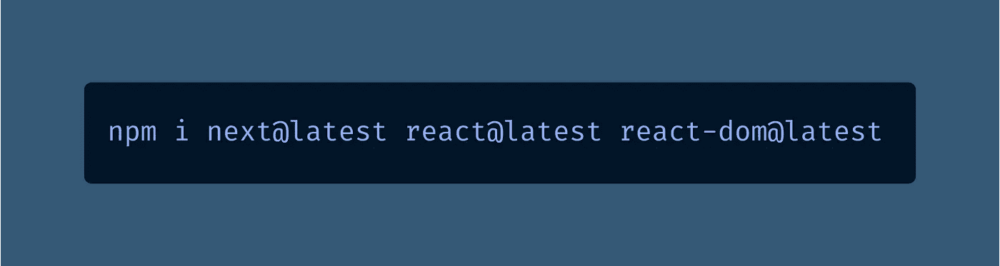

# 您需要从 Next.js Conf 了解的 10 个下一个 11.0.0 特性

> 原文：<https://javascript.plainenglish.io/the-10-next-11-0-0-features-you-need-to-know-about-from-next-js-conf-ac31d795accd?source=collection_archive---------5----------------------->

## 是时候承认 JavaScript 框架比普通的老式 JavaScript 编程有一些优势了吗？

Props if you can remember the actual Next.js logo after seeing this photo by [Viktor Forgacs](https://unsplash.com/@sonance?utm_source=medium&utm_medium=referral) on [Unsplash](https://unsplash.com?utm_source=medium&utm_medium=referral)

Next.js 11 昨天以一个主要语义版本更新的形式在周二早上发布，好像你这周没有其他工作要做。

产品发布会在 Next.js Conf 上举行，这与其说是一场会议，不如说是一段 24 分钟的 YouTube 视频。

与 [Jamstack Conf](https://medium.com/coding-at-dawn/10-lessons-from-jamstack-conf-2020-96fcd48b8f3f) 不同，它是一个在 HopIn 平台上举办的虚拟会议，包括大量有趣的网络和供应商展位，Next.js Conf 更像是参加一个短片的放映，然后是一个关于 Discord 的 [hang 会议](https://www.youtube.com/watch?v=ANikp1R8zX8)。

哦，还有，Vercel 放弃了有利于编码女性的独家商品，因为没有什么比花 50 美元买一件 t 恤更能让你不考虑换回盖茨比。

由于聪明的钱是跳过事件，以两倍的速度观看重播，并希望[next . js11 breaking changes](https://github.com/vercel/next.js/blob/canary/docs/upgrading.md)不会毁了你的整个一周，让我重述一下你需要知道的。

# 1 — React v17.0.2 是一项要求

我不确定你为什么还没有升级到 React 17 ，因为你可以从你所有的文件中删除下面一行代码:

拜托，有什么不喜欢的？这应该是旧闻了，但是 Next.js 11 要求 v17.0.2 作为 React 新的最低版本。

# 2-您可以从创建 React 应用程序迁移

我是编码模板和主题的爱好者，这就是为什么我帮助维护牛逼的 Timothy Lin 的博客。

我在 [JamstackThemes.dev](https://jamstackthemes.dev/theme/nextjs-tailwind-starter-blog/) 找到了 Tim 的模板，它可以让你使用 [Stackbit](/what-makes-jamstack-service-pricing-worth-it-for-web-developers-5ca3aed3d133) 轻松启动 [Jamstack](https://medium.com/derek-develops/public-service-announcement-jamstack-is-now-officially-jamstack-593043a34d71) 站点，但并不是每个人都喜欢主题。

许多 React [软件工程师](https://blog.devgenius.io/why-you-cant-just-be-a-software-engineer-689e56eacef3?gi=131d2cde8799)更喜欢[创建 React 应用](https://reactjs.org/docs/create-a-new-react-app.html)，这是一个你在命令行上运行的模板，因此给你街头信誉。

现在，你可以使用一个实验性的功能将你的网站从`[create-react-app](https://github.com/facebook/create-react-app)`(或者酷孩子称之为 [CRA](https://www.urbandictionary.com/define.php?term=OMG%20LOL%20CRA%20CRA) )迁移到 Next.js:

不过不用担心，你还是可以直接从命令行用 [Create Next App](https://nextjs.org/docs/api-reference/create-next-app) ( `[create-next-app](https://github.com/vercel/create-next-app)`，不是 [CNA](https://www.urbandictionary.com/define.php?term=CNA) )启动一个 Next.js 项目:

我自己没有理由去尝试实验性的代码迁移特性，所以如果你想的话，请在下面的回复中告诉我！

# 3 — Webpack 5 现在是默认版本

根据 Malcolm L 的说法， [Webpack 5](https://frontend-digest.com/whats-new-in-webpack-5-ef619bb74fae) 拥有“更快的构建和持久的缓存，更小的包大小，更好的长期缓存，模块联合，和突破性的改变[导致]更好更快的构建系统。”

除了一些奇怪的 [Tailwind CSS“实时”(JIT)引擎错误](https://github.com/tailwindlabs/tailwindcss/issues/4081)与 Webpack 5 一起，我们中的一些人已经经历了一段时间，你可能已经在使用 Webpack 5 了。

再说一次，我非常相信你应该尽可能升级你所有的包，因为为什么语义版本的变化会发生，除非 bug 得到修复？嗯？嗯？

我也是这么想的。因此，使用由 Google、Vercel 和 Gatsby 赞助的 Webpack 5 享受更快的构建体验吧。

# 4 —自动图像尺寸检测

喔，现在，我们进入正题了。曾经被试图在 VS 代码中打开图像来计算它们的宽度和高度所困扰吗？

使用 Next.js 11，您现在可以将图像直接导入到代码中，这将让 Next.js 自动确定宽度和高度。

以前这是行不通的；你必须将`src`指定为一个字符串，并赋予`width`和`height`属性以防止出错。

无论如何，Next.js `[<Image />](https://nextjs.org/docs/api-reference/next/image)`组件是让我切换到该平台的原因，因为 [web 性能现在很重要](https://bettermarketing.pub/googles-pass-fail-core-web-vitals-make-performance-matter-for-seo-b8490a5ca5ec)和`` [糟透了](https://nextjs.org/blog/next-10#images-on-the-web)。

# 5 —用于加载脚本的新组件

如果你曾经试图探索如何在不影响性能的情况下使用 Next.js 加载第三方脚本，[你并不孤单](https://stackoverflow.com/questions/54067291/next-js-loads-script-tags-but-it-doesnt-execute-them)。

我想出的最好的办法是使用 React 的 Effect Hook ( `[useEffect](https://reactjs.org/docs/hooks-effect.html)`)在一些组件渲染后加载第三方脚本。

这感觉像一个黑客，但至少我的谷歌灯塔的分数是好的，我是对的吗？无论如何，我猜 Vercel 意识到互联网上的每一个网站都使用第三方脚本进行分析、广告、天气和采矿。

新的`[<Script />](https://nextjs.org/blog/next-11#script-optimization)`组件让你在页面默认变成交互式后加载脚本，保持你的[核心网页活力](https://bettermarketing.pub/googles-pass-fail-core-web-vitals-make-performance-matter-for-seo-b8490a5ca5ec)新鲜。

据我所知，你可以将`<Script />`放入任何其他 React 组件中，我不得不说这会导致一些令人捧腹的 PRs。

“我的新组件是对我们旧导航菜单的渐进式改进，具有更好的移动显示和更多的 Monero 挖掘。”😂

# 6-next . js 只是简单地更快

根据 [the Next.js 11 发布公告](https://nextjs.org/blog/next-11#improved-performance)，从事 Next.js 工作的 1600 名开发者可能过于重视开发者体验。这可能会成为一种彻头彻尾的困扰！

> “自 Next.js 10 以来，我们一直致力于进一步改善 Next.js 的开发人员体验。在 [10.1](https://nextjs.org/blog/next-10-1) 和 [10.2](https://nextjs.org/blog/next-10-2) 中，我们通过 React 快速刷新将启动时间提高了**24%**并减少了 **40%的处理时间**。只要保持 Next.js 更新，你就能获得惊人的速度提升。”— [Next.js 11 公告](https://nextjs.org/blog/next-11#improved-performance)由[蒂姆](https://medium.com/u/291aeebdd465?source=post_page-----ac31d795accd--------------------------------)(诺特肯斯)[托拜厄斯·科珀斯](https://medium.com/u/cccc522e775a?source=post_page-----ac31d795accd--------------------------------)[JJ·卡斯珀](https://medium.com/u/a82b360075ab?source=post_page-----ac31d795accd--------------------------------)[舒丁](https://medium.com/u/559f549ff99e?source=post_page-----ac31d795accd--------------------------------)[戴尔·布斯塔德](http://twitter.com/divmain)

我不得不说我很期待《我的奇怪嗜好》的重拍，在那里开发者们只是为 React 的快速刷新时间而流汗。

# 7-图像模糊，不需要眼镜

你是否讨厌浏览一个网站，那里的图片突然出现，就像它们试图吓你一跳一样？

我也是！即使在没有疯狂的[累积布局转移](https://bettermarketing.pub/googles-pass-fail-core-web-vitals-make-performance-matter-for-seo-b8490a5ca5ec)(对粤语开发者或那些喜欢字母汤的人来说)的网站上，懒惰加载图像也不总是最好的用户体验。

无与伦比的肯特·c·多兹(真的，无与伦比——我敢打赌你会模仿他)在他的博客上使用怪异的多边形占位符图片，但至少比你滚动时感觉图片在攻击要好。

首选的用户体验是通过模糊图像让你的用户认为他们有[老花眼](https://www.merriam-webster.com/dictionary/presbyopia)(远视)，然后你说:“开个玩笑！”并加载一个闪亮的高分辨率图像。

这就像[当一个主题公园公布等待时间过长](https://touringplans.com/blog/the-alternate-reality-of-disney-worlds-posted-wait-times-short-wonkish/#comment-497818)时，当你的实际等待时间变短时，你会感到宽慰。神奇！

Next.js 将这些有趣的模糊占位符添加到了令人敬畏的组件中，我对此非常感兴趣。

我郑重声明，我不建议把`TODO`写成你的替代文本，[你也不应该写](https://twitter.com/AskDoctorDerek/status/1405234338069991433) `[alt="Picture of something"](https://twitter.com/AskDoctorDerek/status/1405234338069991433)`，因为``已经被屏幕阅读器宣布为“图像”你知道的越多！

# 8 — Next.js Live 是“Live”(作为预览版)

如果你想试用果酱棒已经有一段时间了，但是不想给他们钱来试用这个工具，我有东西给你。

Jam Wand 是一个工具，它可以让你在 Jamstack 网站上毫不费力地与你的整个团队合作，而不需要接触代码。 [Next.js Live](https://nextjs.org/live) 就像 Jam Wand 一样的东西，除了内置在 Next.js 里。

我本来希望透露一些细节，但当我注册这项服务时，我刚刚收到了来自 Vercel 的客户经理 [Trey Knowles](https://medium.com/u/50e6b99f9753?source=post_page-----ac31d795accd--------------------------------) 的自动回复，让我知道我很快就可以访问测试版了。

好吧，我还是会在今天下午的销售电话中表现得好像我可以使用它一样，所以我希望价格更接近“免费”，而不是“我不会买那个”

除了价格之外，在产品发布视频中仍然有很多问题没有得到解答，比如他们是如何知道网站的性能提高了？他们打开灯塔了吗？

我想我也应该对 Next.js 11 完全在浏览器中运行以支持这项技术感到兴奋，但当他们说“ [WebSockets](https://developer.mozilla.org/en-US/docs/Web/API/WebSocket) ”时，我有点不听了，当他们说“[更快](https://www.urbandictionary.com/define.php?term=Faster)”时，我又开始听了

# 9 —大问题:一致性

你有没有想过 Google 如何在内部处理 web 性能、安全性和可访问性的最佳实践？不要再想了！

有了[一致性](https://web.dev/conformance/)(不是[一致性](https://www.urbandictionary.com/define.php?term=Conformity))，你可以像一个网络性能专家一样打球，而实际上不需要阅读博客或学习东西！哇！

你所要做的就是借用谷歌关于最佳实践的深厚的机构知识(代号为 [Aurora](http://web.dev/aurora) )，只需一行代码:

结果，您会收到一条消息，说“我们创建了。eslintrc 文件，并包括基本的 Next.js ESLint 配置。哦耶！！！

自从… …呃，自从尼古拉斯·c·扎卡斯首先发明了所有的规则以来，我从来没有对一个 ESLint 规则如此兴奋过！

如果说`[<Image />](https://nextjs.org/docs/basic-features/image-optimization)`是 Next.js 10 中让我改变的杀手级特性，那么一致性就是 Next.js 11 中的杀手级特性，它将让新开发人员更喜欢学习框架，而不是“只学习 JavaScript”。

当我们拥有 React、Tailwind CSS、Emmet、appelliter、ESLint、Git / Git Hooks、TypeScript 等令人惊叹的工具时，假装某人[转行到技术行业](https://medium.com/about-me-stories/how-i-went-from-physical-therapist-to-seo-website-performance-expert-8dbfd557150)只需要 HTML、CSS 和对 JavaScript 事件处理程序的深刻理解就可以轻松过关，这已经有点假了。

选择你的毒药，但事实是，今天没有一个现代开发人员像我在 2000 年开始专业编码时那样与 HTML、CSS 和普通 JavaScript 混在一起。

(实际上，我早在 1998 年就学习了 HTML，并在 1999 年带领我的中学队参加了全国比赛，但我并不真正理解电子邮件，并设法没有提交我们的最终项目供审议，因为那是 1999 年。)

看看 Kent C. Dodds 的这条推文，然后记住 1)他是独一无二的，2)作为一名工程师，他非常成功，因为他写了干净、可靠的代码，3)我敢说你会模仿他，就这么做！！！！

是的，你在堆栈中看到了很多普通的 JavaScript？啊？啊？我也没看到什么 Next.js，不过这不是重点。一致性是会议上的第一颗钉子，它把“HTML/CSS/JS”教得好像它很高级。

*你不同意吗？在 Twitter 上随意@我(是*[*@ AskDoctorDerek*](https://twitter.com/AskDoctorDerek)*)，这样我们就可以进行亲切、礼貌的对话，平等地看待彼此(众所周知，这当然是对所有 Twitter 用户的法律要求)。*

我明白了，自从 2030 年 Svelte 超越 React 成为最好的框架，我们都转向 Sext.js 以来，框架部落主义已经过时了。

*哎呦，不好意思，我在那里时空穿梭了一下。*

每个人[都喜欢/讨厌](https://www.urbandictionary.com/define.php?term=Love%2FHate%20relationship)支持他们喜欢的框架(React、Angular、Vue)、框架对框架(Next、Angular Universla、Nuxt)或语言上标(只是 JavaScript、TypeScript、CoffeeScript)。

老实说，这很愚蠢，我明白——使用任何让你成为更好的开发人员的工具，尽可能保持你的[代码合理简单](https://medium.com/better-programming/why-you-should-make-your-code-as-simple-as-possible-3b35e89f137)。

但是有些问题，像延迟加载图像和其他一百万的网络性能、安全和可访问性问题最好由专业开发的框架来处理，对吗[杰森·奈特](https://medium.com/u/37f0bc4e5b3f?source=post_page-----ac31d795accd--------------------------------)？

我是在开玩笑，但只是开玩笑，不可思议的程序员 Jason 会同意这种说法，因为他只喜欢 JavaScript。

至少对我来说，我从来不知道如何在不使用我用`npm`安装的东西的情况下惰性加载一个图像，我对此完全没有意见。

Next.js 11 启动一致性是下一步，以确保我可以继续交付高性能的用户界面和 web 应用，而不需要仔细阅读所有的 MDN 文档，[只是其中的一部分](https://developer.mozilla.org/en-US/docs/Web/API/HTMLImageElement/srcset)。

# 10 —从 10.0 开始的所有其他内容

如果你错过了，Next.js 已经放弃了:

*   [自动网页字体优化](https://nextjs.org/blog/next-10-2#automatic-webfont-optimization)通过内联字体 CSS 来提高性能，您无需担心，
*   [刷新速度快 3 倍](https://nextjs.org/blog/next-10-1)(即快 200 毫秒)因为我们都爱[热重装](https://nextjs.org/docs/basic-features/fast-refresh)，
*   `[<Image />](https://nextjs.org/blog/next-10-1#nextimage-improvements)` [改进](https://nextjs.org/blog/next-10-1#nextimage-improvements)，以及一
*   [Next.js Shopify 整合](https://nextjs.org/blog/next-10-1#nextjs-commerce-shopify-integration)我不得不想象，这会让从事电子商务的代理开发者赚大钱。

继续努力，Vercel / Google /所有致力于这个神奇产品的人！我现在要升级了。

Next.js 11 中的[突破性变化实在不值得一提，但如果你感到紧张，这里有官方的](https://github.com/vercel/next.js/blob/canary/docs/upgrading.md)[迁移指南](https://nextjs.org/blog/next-11#upgrade-guide)。

# 结论——感谢 Next 11 的开发者

我有点希望 Next.js Conf 会有 5 个小时长，但它仍然只是一个 YouTube 视频。它将从常规的 24 分钟视频开始，然后他们会读出为 Next.js 11 的发布做出贡献的所有 1600 名开发人员的名字。所以，向辛勤工作的开源社区大声喊出来，是他们给你带来了这个神奇的产品。

作为我表示感谢的方式，我想通过标记所有在 Next.js 11 发布公告中被标记的开发人员来结束这篇文章。

我不知道你们中的任何人做了什么，但是，还是谢谢你们。我真诚地感谢你让 web 开发比以前更快、更好、更容易。感谢提高软件工程领域。

“这个版本是由以下人员的贡献带给你的:[卡琳娜·桑多斯](https://medium.com/u/6789b0929251?source=post_page-----ac31d795accd--------------------------------)、[、](http://twitter.com/ljosberinn)[李·罗宾逊](https://medium.com/u/c729ed050916?source=post_page-----ac31d795accd--------------------------------)、[阿尔特姆·扎哈尔琴科](https://medium.com/u/8f663dc4cb90?source=post_page-----ac31d795accd--------------------------------)、[、【托马斯博伊】、](http://twitter.com/thomasboyt)[侯赛因·法克鲁丁](https://medium.com/u/28786697e396?source=post_page-----ac31d795accd--------------------------------)、[斯蒂弗尔](https://medium.com/u/3e147995dafb?source=post_page-----ac31d795accd--------------------------------)、[杰拉尔德·摩纳哥](https://medium.com/u/7261dc6f120d?source=post_page-----ac31d795accd--------------------------------)、[柳伊伊](https://medium.com/u/5fefdc92bfe2?source=post_page-----ac31d795accd--------------------------------)、[蒂姆](https://medium.com/u/291aeebdd465?source=post_page-----ac31d795accd--------------------------------)  [JJ·卡斯帕](https://medium.com/u/a82b360075ab?source=post_page-----ac31d795accd--------------------------------)、[、@hiramhuang](http://twitter.com/hiramhuang) 、[、@达库 10](http://twitter.com/daku10) 、[亚历克斯·卡斯尔](https://medium.com/u/832c6c0de949?source=post_page-----ac31d795accd--------------------------------)、[、@马塔玛塔诺](http://twitter.com/matamatanot)、[、@佩尔哈格](http://twitter.com/pelhage)、[、@卢卡佐维奇](http://twitter.com/Lukazovic)、[阿卜杜拉·姆扎因](https://medium.com/u/bd86d6e5baa4?source=post_page-----ac31d795accd--------------------------------)、[丹尼斯·格莱希](https://medium.com/u/b0fb4c25cbde?source=post_page-----ac31d795accd--------------------------------)、[格山·马南达尔](https://medium.com/u/aebbb8050203?source=post_page-----ac31d795accd--------------------------------) [帕维尔·米涅耶夫](https://medium.com/u/357af7270bd3?source=post_page-----ac31d795accd--------------------------------)、[托拜厄斯·科珀斯](https://medium.com/u/cccc522e775a?source=post_page-----ac31d795accd--------------------------------)、[约翰·贾戈纳尔](https://medium.com/u/a799680f5e83?source=post_page-----ac31d795accd--------------------------------)、[稀有开发者](https://medium.com/u/cc86129e413a?source=post_page-----ac31d795accd--------------------------------)、[萨纳特·库马尔](https://medium.com/u/8aac96cda764?source=post_page-----ac31d795accd--------------------------------)、[马尔科·瓦尔塞奇](https://medium.com/u/ce4bd56a598f?source=post_page-----ac31d795accd--------------------------------)、[@萨姆·罗宾斯 85](http://twitter.com/samrobbins85) 、[萨姆·维舒尔伦](https://medium.com/u/a27341c03b91?source=post_page-----ac31d795accd--------------------------------)、[阿德姆·伊尔特姆](https://medium.com/u/45dcfb1f832c?source=post_page-----ac31d795accd--------------------------------) [@fabianishere](http://twitter.com/fabianishere) 、 [@rokinsky](http://twitter.com/rokinsky) 、 [@msidqi](http://twitter.com/msidqi) 、 [@rubensdemelo](http://twitter.com/rubensdemelo) 、 [Ondrej Chrastina](https://medium.com/u/a229da8ed5ea?source=post_page-----ac31d795accd--------------------------------) 、 [Brad](https://medium.com/u/c9e4afe6f4f6?source=post_page-----ac31d795accd--------------------------------) 、 [Vladislav Tarasov](https://medium.com/u/dc6a18165797?source=post_page-----ac31d795accd--------------------------------) 、 [@rgabs](http://twitter.com/rgabs) 、 [Darsh Patel](https://medium.com/u/cc4244360504?source=post_page-----ac31d795accd--------------------------------) 、 [Erfanmirzapour](https://medium.com/u/9275df64a365?source=post_page-----ac31d795accd--------------------------------) ， [Tom](https://medium.com/u/7ccecb31807a?source=post_page-----ac31d795accd--------------------------------) ， [@frontendtony](http://twitter.com/frontendtony) ， [Eric Burel](https://medium.com/u/bec1907151e3?source=post_page-----ac31d795accd--------------------------------) ， [Iker Barriocanal](https://medium.com/u/9d04eb94ab9c?source=post_page-----ac31d795accd--------------------------------) ， [eps1lon](https://medium.com/u/e1b46d9c2d8c?source=post_page-----ac31d795accd--------------------------------) ，[gigigiz](https://medium.com/u/f30e017b080d?source=post_page-----ac31d795accd--------------------------------)， [Mike Plis](https://medium.com/u/6b5e2979f21b?source=post_page-----ac31d795accd--------------------------------) ， [HaNdTriX 【T153 感谢您所做的一切，下次再见。js 12！](https://medium.com/u/b21961f8a169?source=post_page-----ac31d795accd--------------------------------)

**编码快乐！**🏌️‍

【Derek Austin 博士是《T4*职业规划:如何在 6 个月内成为一名成功的 6 位数程序员】* 的作者，该书现在可以在亚马逊上找到。