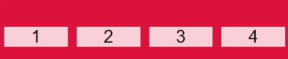

# 你应该知道的 3 个强大的 CSS 网格函数

> 原文：<https://javascript.plainenglish.io/the-3-powerful-css-grid-functions-that-you-should-know-26748fbe0694?source=collection_archive---------10----------------------->

## 3 个强大的 CSS 网格函数，用例子说明。


Photo by [HalGatewood.com](https://unsplash.com/@halacious?utm_source=medium&utm_medium=referral) on [Unsplash](https://unsplash.com?utm_source=medium&utm_medium=referral)

在本文中，我们将学习三个 CSS 函数，如果你正在使用 CSS 网格特性，你应该知道这三个函数。让我们开始吧。

# 1.重复功能

函数`repeat()`用于重复网格布局中的列数和行数。

这个函数可以在 CSS 网格属性`grid-template-columns`和`grid-template-rows`中使用。它还可以嵌套其他功能，如`minmax()`和`fit-content`。

如果你不熟悉 CSS 网格，你可以看看我下面的文章:

[](https://medium.com/javascript-in-plain-english/css-grid-explained-with-examples-d64cf241e1cf) [## 用例子解释 CSS 网格

### 通过实例了解 CSS 网格。

medium.com](https://medium.com/javascript-in-plain-english/css-grid-explained-with-examples-d64cf241e1cf) 

函数`repeat()`还允许以更紧凑的形式写入大量的列和行。它需要两个参数:重复的次数*和要重复的列大小或行大小*。**

假设您想要创建一个有 6 列的网格布局，您可以使用下面的语法片段来实现:

```
div{
 display: grid;
 **grid-template-columns: 1fr 1fr 1fr 1fr 1fr 1fr;
}**
```

如你所见，代码看起来很难看，也更难写。我们可以通过使用函数`repeat()`来解决这个问题。

这里有一个例子:

```
div{
 display: grid;
 grid-template-columns: **repeat(6, 1fr)**;
}
```

*输出:*


6 columns grid layout.

这就好写多了。例如，如果我们想要创建 4 行 50px 大小的数据，我们可以再次使用 repeat 函数:

```
div{
 display: grid;
 grid-template-rows: **repeat(4, 50px)**;
}
```

*输出:*


4 rows(50px).

# 2.最小值-最大值函数

功能`minmax()`定义了最小尺寸和最大尺寸之间的尺寸范围。如果您调整手机的屏幕大小，内容将缩小，直到达到最小尺寸，然后停止。如果您调整桌面的屏幕大小，内容将拉伸，直到达到最大尺寸，然后停止。

```
minmax(200px, 1fr);
minmax(400px, 50%);
minmax(30%, 300px);
```

这个函数也用于 CSS 网格属性`grid-template-columns`和`grid-template-rows`。它有两个参数:最小尺寸和最大尺寸。

假设您想要制作一个包含 4 列的网格布局，并且您还想要使用函数`minmax()`来扩展内容并使所有内容都有响应。移动屏幕最低 50px，桌面屏幕最高 380px。

看看下面的例子:

```
.container {
 display: grid;
 grid-template-columns: repeat(4, **minmax(50px, 380px)**);
}
```

正如你在上面看到的，我们使用函数`repeat()`重复函数`minmax()` 4 次，因为我们需要 4 列。`minmax()`嵌套在`reapeat()`内。

*小屏幕输出:*



Small screen.

*大屏幕输出:*


Bigger screen.

因此，函数`minmax()`允许根据屏幕尺寸拉伸和收缩内容。

# 3.适合内容函数

函数`fit-content`接受一个绝对长度或百分比的参数。它用于根据列和行中的内容自动更改列和行的大小。

功能`fit-content`根据以下公式将给定尺寸夹紧到可用尺寸:

```
min(maximum size, max(minimum size, argument))/* The formula above is equivalent to: */
fit-content(argument)
```

它还被用作 CSS 网格属性中的轨迹。

这里有一个例子:

```
.container {
 display: grid;
 grid-template-columns: **fit-content(300px) fit-content(300px)**;
}
```

*输出:*


content-fit.

*添加一些 HTML 内容:*


content-fit.

如果你觉得难以理解，你也可以在 [MDN 文档](https://developer.mozilla.org/en-US/docs/Web/CSS/fit-content())上查看一下。

# 结论

如你所见，如果你使用 CSS grid，这些是你应该知道的函数。这种语言有一个惊人的扩展列表。你需要学习更多有用的函数。我鼓励你用自己的方式练习这些功能，因为这是变得更好的最好方法。

感谢您阅读这篇文章。希望你觉得有用。

# 更多阅读

*如果你对 JavaScript 和 web 开发相关的更有用的内容感兴趣，也可以* [*订阅*](https://mehdiouss.ck.page/) *我的快讯。*

*这是另一篇有用的文章，请点击下面的链接查看:*

[](https://medium.com/javascript-in-plain-english/basic-javascript-algorithm-confirm-the-ending-d4243eeea239) [## 基本 JavaScript 算法:确认结尾

### 让我们使用 JavaScript 来解决一个基本算法，这将允许我们练习解决问题的技能。

medium.com](https://medium.com/javascript-in-plain-english/basic-javascript-algorithm-confirm-the-ending-d4243eeea239)