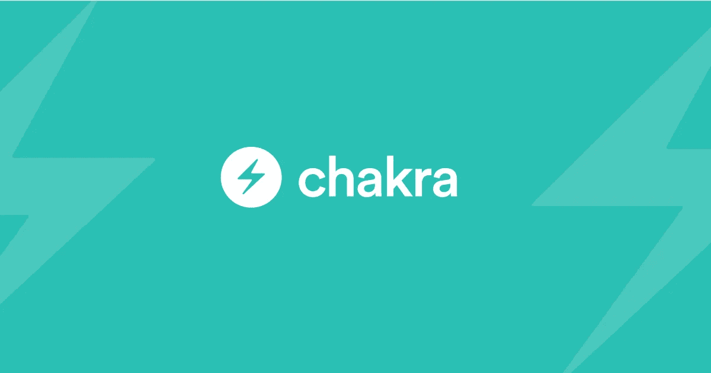

# 3 个最漂亮的 React 用户界面库

> 原文：<https://javascript.plainenglish.io/the-3-prettiest-react-ui-libraries-7cfa71d91c69?source=collection_archive---------9----------------------->

构建自己的 UI 可能是一项令人烦恼的任务。你需要接受各种各样的任务和主题，比如可访问性、响应性，当然，它需要看起来很漂亮。😉

幸运的是，你可以找到一大堆的库来帮你摆脱这个麻烦！让我们一起来看看最漂亮的三个吧！

Photo by [Hal Gatewood](https://unsplash.com/@halacious?utm_source=medium&utm_medium=referral) on [Unsplash](https://unsplash.com?utm_source=medium&utm_medium=referral)

# [查克拉 UI](https://chakra-ui.com/)

Chakra 是 React 的可访问、主题化和现代化的 UI 套件。凭借其庞大而友好的开发人员社区，没有什么是 Chakra 不能解决的。他们易于使用的 API 不需要很长时间就可以掌握，而且他们可以非常容易地在现有组件的基础上添加您自己的样式。这样，你用 Chakra 创建的每一个 UI 都可以是它自己定制的！

如果你想看看查克拉有什么可能，那么你应该看看查克拉专业版。如果你想买的话，可以买一套预制组件。所有这些组件和页面都是使用 Chakra UI 构建的，所以正如你所见，天空才是真正的极限！

 [## 查克拉 UI 专业版

### 细节、专业知识、理论和真正的工艺水平令人难以置信。很好…

pro.chakra-ui.com](https://pro.chakra-ui.com/) 

Just be freaking kind, a webshop that builds using Chakra UI

# [艾斯特](https://github.com/geist-org/react)

当您开始浏览艾斯特文档和示例页面时。你可能会有这种奇怪的感觉，你已经在某个地方见过它了。这不会错，因为虽然艾斯特不属于 Vercel 的团队，但他们的 UI 套件显然是为了类似 Vercel 使用的设计而构建的。

你必须给他们，它看起来非常时尚和现代。它的简约风格和黑白配色方案防止混乱，并确保正确的组件得到应有的关注！

你甚至可以找到用艾斯特翻拍的经典 Vercel 仪表盘！【https://react-dashboard-design.vercel.app/】点击这里查看:

A remake of the Vercel dashboard using Geist

# [超级用户界面](https://github.com/supabase/ui)

虽然你可能不知道 Supabase 的设计资源，但由于他们的开源商业模式，整个 UI 套件可供你使用。你可以在他们的 GitHub 组织中找到它。

虽然 UI 套件仍然是一项正在进行中的工作，但我已经迫不及待地想看看他们会把它带到哪里。它已经包括了基本的工具，如卡片和按钮，还有更多令人兴奋的功能即将推出！自述文件包含路线图中所有组件的列表。

你需要的关于你可以用 Supabase UI 工具包构建的唯一例子是 [https://supabase.io](https://supabase.io) ！

The Supabase design style

过一个充满设计感的一天！🧡

*更多内容看*[***plain English . io***](http://plainenglish.io/)