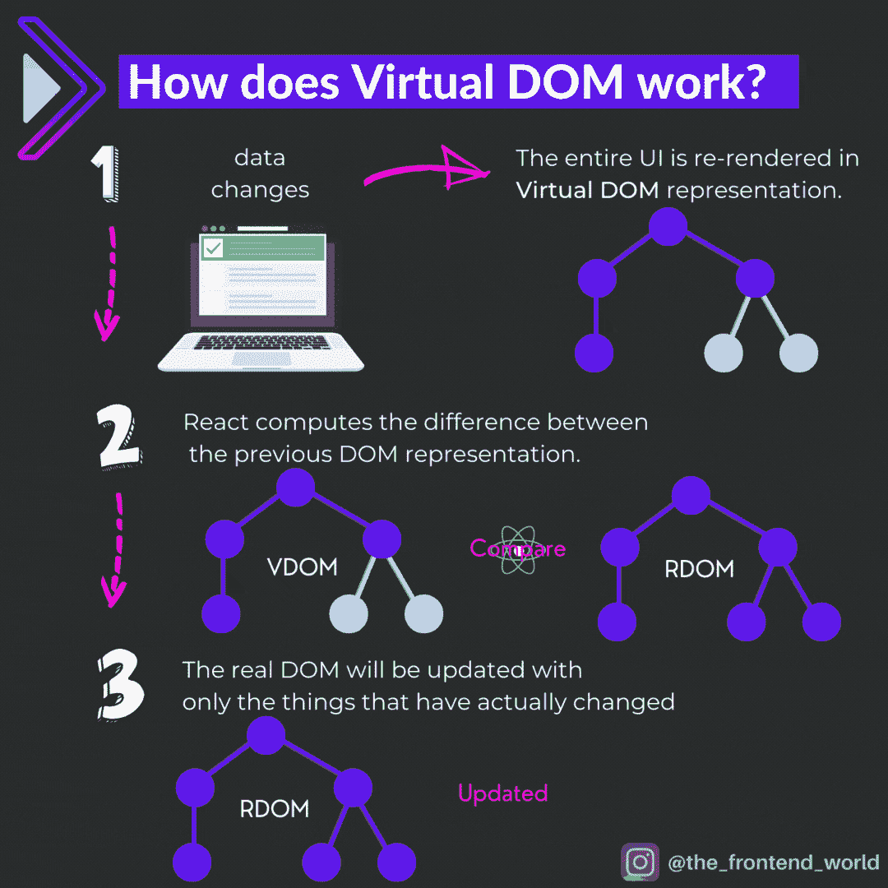
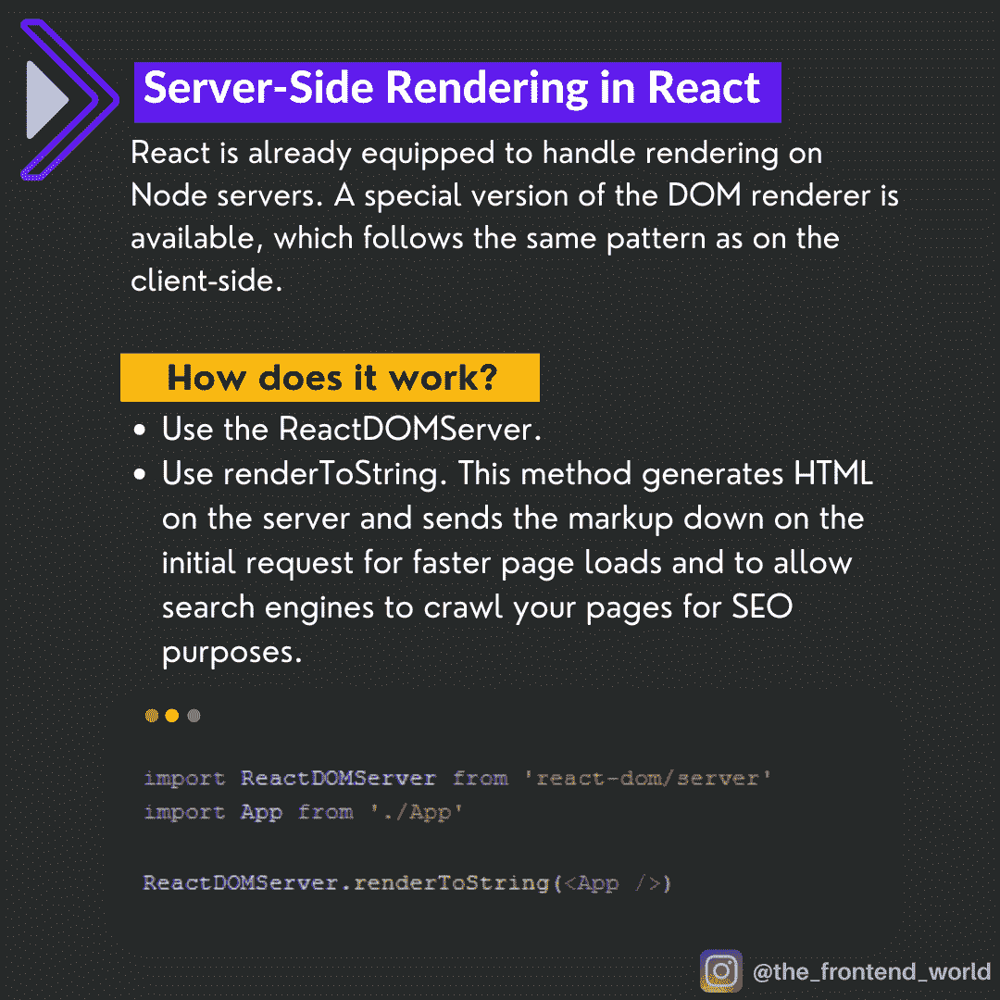

# 每个 React 开发人员都应该知道的 4 个关键特性

> 原文：<https://javascript.plainenglish.io/the-4-key-features-every-react-developer-should-know-bdd2cfa0a7c8?source=collection_archive---------5----------------------->

## 在本文中，我将介绍每个 React 开发人员都应该知道的 4 个关键特性。


By FAM

如果你是 React 新手或者正在寻找 React 开发人员的工作，你应该知道 React 的特别之处以及它与其他 UI 库和框架的区别。在本文中，我将介绍每个 React 开发人员都应该知道的 4 个关键特性。

## **计划如下:**

*   **虚拟 DOM**
*   **服务器端渲染支持**
*   **单向数据流或数据绑定**
*   **可重用的 UI 组件**

准备好了吗？让我们开始吧！

# 特性#1:虚拟 DOM

现代 web 应用面临的挑战是用户体验和响应时间。没有用户愿意在浏览网页时等待，对吗？React 创建了自己的概念和[算法](https://grfia.dlsi.ua.es/ml/algorithms/references/editsurvey_bille.pdf)来应对这一挑战。这个概念叫做 ***虚拟 DOM*** 。这是使 React 在开发者和公司中出名的概念之一，也使它成为他们首选的 UI 库。

## VDOM 是如何工作的？



React Virtual DOM

有关此过程的更多详细信息，请查看本文:

[](https://levelup.gitconnected.com/what-is-the-use-of-the-virtual-dom-in-react-62a2ad61bb88) [## React 中的虚拟 DOM 有什么用？

### React 的虚拟 DOM 哲学。

levelup.gitconnected.com](https://levelup.gitconnected.com/what-is-the-use-of-the-virtual-dom-in-react-62a2ad61bb88) 

# 特性#2:服务器端渲染支持

与基于浏览器下载最小 HTML 页面的客户端呈现不同，**服务器** - **端呈现(SSR)** **在**服务器上呈现**组件。**这里的好处是 React 已经支持服务器端渲染。

## 如何实施 SSR？

由于 React 已经可以在 Node.js 服务器上处理服务器端渲染，这可以通过一行代码来完成，这要感谢`ReactDOMServer`:

*   首先，让我们导入这个`ReactDOMServer`:

```
// ES modules way
**import ReactDOMServer from 'react-dom/server';**
// CommonJS way
**var ReactDOMServer = require('react-dom/server');**
```

*   根据您的需要进行渲染:

```
// Dynamic page
ReactDOMServer.[renderToString()](https://reactjs.org/docs/react-dom-server.html#rendertostring)// static page
ReactDOMServer.[renderToStaticMarkup()](https://reactjs.org/docs/react-dom-server.html#rendertostaticmarkup)
```



SSR in React

# 特征#3:单向数据流

与 Angular 不同，React 数据流只有一个方向，因此调试很容易。`Props`是对组件的输入。它们是单个值或对象，包含一组在创建时使用类似于 HTML 标记属性的命名约定传递给组件的值。它们是从父组件传递到子组件的数据。

## React 中的数据流是如何工作的？


Data flow in React

# 特性#4:可组合的组件

这个特性在现代 web UI 库和框架中很常见。但是，提一提，记在心里，超级重要。可重用组件对 web 开发有很多好处。最多的是:

*   更多的控制和更低的维护成本。
*   更快的开发以节省时间和增加收入。
*   加速应用程序的创建和交付。
*   更多的应用，更高的质量，更少的时间。

## 如何在 React 中创建组件？


Components in React

# 概述

我希望这是有用的。谢谢大家！

# 亲爱的读者，我希望这是清晰和有用的

无论你在哪里，我都希望你和你的家人平安。坚持住。明天会更好！

**联系一下** [**中**](https://medium.com/@famzil/)**[**Linkedin**](https://www.linkedin.com/in/fatima-amzil-9031ba95/)**[**脸书**](https://www.facebook.com/The-Front-End-World)**[**insta gram**](https://www.instagram.com/the_frontend_world/)**，或者**[**Twitter**](https://twitter.com/FatimaAMZIL9)**。********

******FAM******

 ****[## 前面

### 欢迎来到❤家庭前线

www.fam-front.com](http://www.fam-front.com/)**** 

*****更多内容请看*[*plain English . io*](http://plainenglish.io/)****