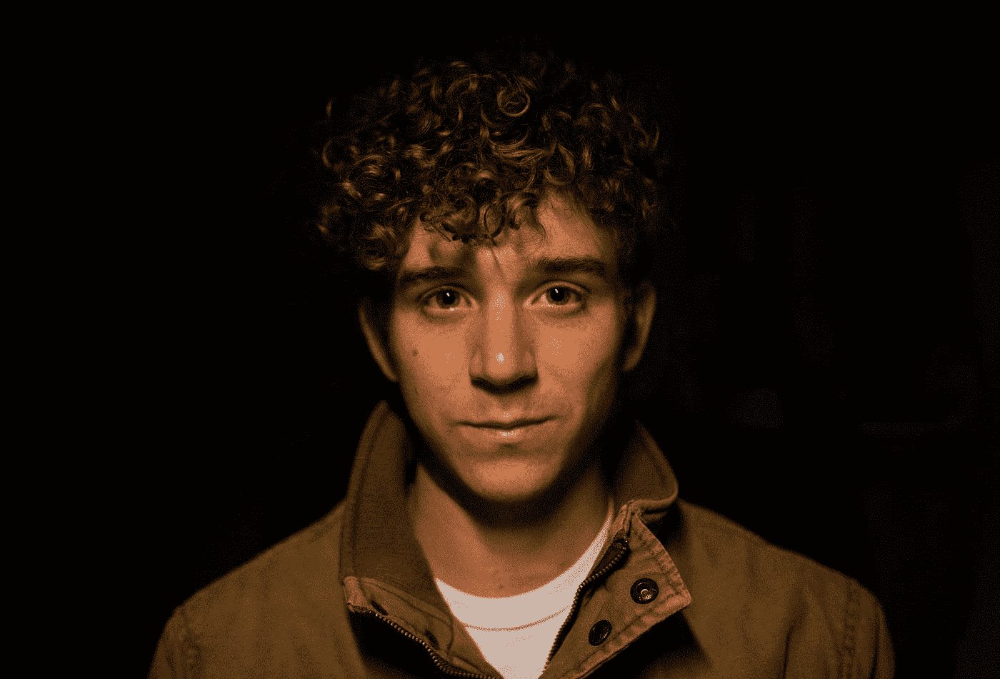

# 孤独程序员的 4 个最明显的迹象

> 原文：<https://javascript.plainenglish.io/the-4-most-telltale-signs-of-a-lonely-programmer-94c4a6fa475b?source=collection_archive---------5----------------------->

## # 2.他们没有高质量的睡眠

Photo by [Austin Human](https://unsplash.com/@xohumanox?utm_source=medium&utm_medium=referral) on [Unsplash](https://unsplash.com?utm_source=medium&utm_medium=referral)

> “不，你不懒，
> 
> 你是孤独的”。

八个月前，这是我导师的原话。在过去的几个月里，我每天工作十个小时，一周工作七天。我要求他给我更多的工作。

他拒绝给我更多的工作。他说:

> “过去几个月。你一直在努力工作。
> 
> 你应该休息一段时间，和你的朋友出去玩，玩得开心。"

我说:

> “我很懒，不想和朋友出去。我不想找乐子。”

他说:“不，你不懒。你一个人。”

这些话深深地打动了我。事实上，他说的是实话。在过去的十个月里，我没有和任何人出去过。我没有和我的任何朋友见过面或说过话。

事实是我独自一人。每当我的朋友和家人邀请我和他们一起出去，我都会告诉他们:

> “我有工作要完成。”

从我的经历来看，我可以分享一些孤独程序员的标志。我曾经是一个孤独的人，我知道孤独是什么样的。

# 1.他们只是希望能有更好的朋友聊天

一些程序员很难与工作场所的朋友分享个人信息。他们不想与办公室同事分享他们的好奇心。

他们觉得办公室的朋友不会在更深的层次上与他们的想法联系起来。

还有，他们不想让同事知道更多他们的私生活。他们觉得有必要与同事保持职业关系。

因此，他们无法与同事建立更深层次的联系。

当他们不能和办公室的朋友建立更私人的联系时。他们感到孤独，开始希望有更多的朋友。与他们分享个人故事和更深层次的联系。

的确，随着年龄的增长，你会越来越投入到工作中，和老朋友在一起的时间越来越少。你和一些老朋友失去了联系，在工作场所结交了新朋友。

你的大多数新朋友在同一个办公室工作，你谈论与工作有关的事情。职场上的朋友对别人的私生活了解较少。

但是一个孤独的程序员需要明白，只是想交新朋友并不会让他们成为新朋友。他们需要以某种方式暴露自己。

如果他们不愿意走出自己的舒适区，他们就永远交不到新朋友。他们将继续孤独。

当你参加会议、参与讨论或帮助他人时，大多数人际关系网和友谊就会建立起来。只是希望你不会交新朋友。

# 2.他们没有高质量的睡眠

他们总是很累，因为他们没有睡好。孤独会影响一个人的睡眠模式。孤独在夜里唤醒他们的次数更多。他们的睡眠支离破碎。

根据一项研究，孤独的人比那些与他人联系更多的人经历了更多的睡眠分裂。

这项研究表明，如果你有一个更好的社会环境，你会有一个更宁静的夜晚睡眠。如果你增加一个单位的孤独感，你将有 8%的机会增加睡眠碎片。

孤独的程序员不想和任何人说话，感觉与整个世界脱节。于是，他们有了一个支离破碎的梦。这意味着他们在晚上不断醒来。

他们保持清醒的时间有时非常少，以至于他们甚至没有注意到这一点。但是第二天，当他们开始写代码的时候，他们就觉得累了。

他们感到困倦是因为睡眠碎片阻止他们完成一个完整的睡眠周期。

# 3.他们洗很长时间的热水澡

热水澡有助于改善一个人的精神和情感健康。洗澡有助于人们睡得好，也有助于我们适当地冥想。洗澡对我们的身心有很多好处。

但你有没有想过，长时间洗热水澡可能表明你是一个孤独的人？

[在 51 名大学生的帮助下进行的研究](https://www.ncbi.nlm.nih.gov/pmc/articles/PMC3406601/)得出结论，一些学生用身体的热量来替代社会的寒冷。社交冷淡是因为孤独。

我不是说洗热水澡是错的。这对程序员来说可能是有益的。他们可以用热水淋浴来减轻焦虑和压力。

但是如果你用热水洗澡，并且在水下呆的时间更长。这表明你很孤独，需要为此做点什么。长期孤独是抑郁的原因。

# 4.他们害怕不断被评判

我一生都在恐惧中度过。我一生中从来没有走一条常规的道路。当我在大学期间开始学习编程时，我的朋友们常常对我评头论足。

当我开始在网上写作的时候，我害怕我的家人会评价我。每当我在生活中做了一些非传统的事情，我知道有人会对我评头论足。

有时我甚至觉得我的朋友和家人不理解我。

久而久之，这种对被评判的恐惧与日俱增。这是我开始减少与朋友和家人互动的原因之一。这是我孤独的原因之一。

我曾经这样问自己:

> “我不明白如何经营一家企业。我够好吗？”
> 
> “我不知道冲击市场的新技术。我将如何回答其他问题？”
> 
> “我不知道 ruby on rails。面试的时候我会怎么做？”

从我个人的经验来看，我可以告诉你，孤独的程序员害怕被评判。当他们不害怕被评判时，他们会开诚布公地与他人交谈。

如果你是一个害怕被评判的程序员。你需要采取一些措施来克服它。你应该停止假设人们会根据你的工作来评判你。

你必须停止以任何可能的方式追求人们的认可。

如果你真的相信你的工作对社会很重要。即使有人对你的工作品头论足，你也不会很难与人交谈。当你在公共场合分享你的作品时，你会觉得少了一些评判。

有了这些技巧，我能够减少对被评判的恐惧。

# 摘要

1.  他们只是希望有更多的朋友。
2.  他们总是有支离破碎的睡眠。
3.  他们洗了很长时间的热水澡。
4.  他们害怕被评判。

# 想联系作者？

加入一个人人社区，欣赏与科技相关的文章。我们讨论最新的技术和独特的见解。

*更多内容看**[***说白了. io***](http://plainenglish.io/)*