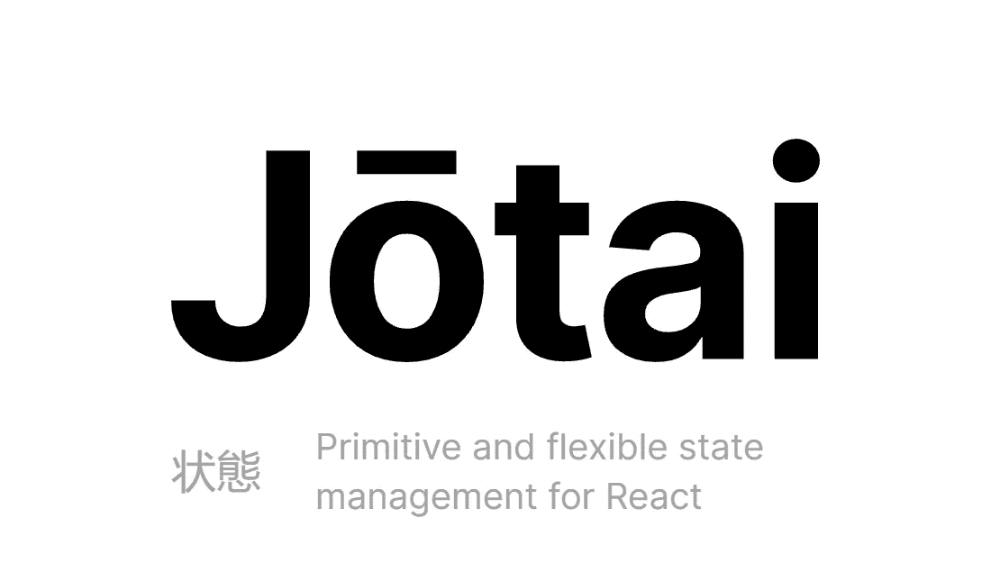
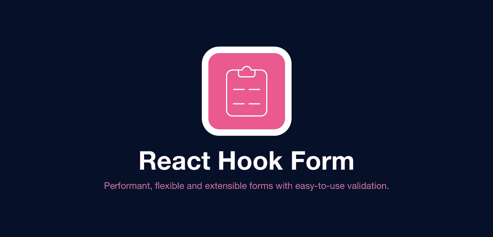

# 5 个最热门的 React 库

> 原文：<https://javascript.plainenglish.io/the-5-hottest-react-libraries-out-there-287f2b8c3029?source=collection_archive---------2----------------------->

React 是最好的前端开发库之一。
这部分归功于了不起的开发人员社区，他们构建了与现有功能挂钩的了不起的库。

这里有一个你应该完全知道的列表！

# [反应过来的热吐司](https://react-hot-toast.com/)

看看那些冒着烟的热吐司通知！

这些**易于使用的**、**可访问的**和**完全可定制的吐司通知**值得在任何应用中占有一席之地。

在实现用户反馈时，它们是额外细节的绝佳选择！

A simple React-Hot-Toast example

你甚至可以在网站上现场试用它们:[https://react-hot-toast.com/](https://react-hot-toast.com/)

# [约泰](https://jotai.pmnd.rs/)

Jotai 的开心鬼是你**原始灵活状态管理**的伴侣。这个不可思议的软件也很小，只有 6kb，你几乎不会注意到它的存在！

A simple Jotai example

使用 Jotai，你可以创建微小的状态容器，我们称之为**原子**。这些原子可以在应用程序的其余部分被读取和设置。因为您在整个应用程序中使用相同的 atom，所以一切都是最新的。不用再为一个过时的状态而挣扎了！

# [成帧器动作](https://www.framer.com/motion/)

令人惊叹的动画图书馆是由 Framer 的团队创造的。它使你能够创建运行**非常流畅**的动画。最棒的是。你**甚至不需要 CSS** 来写它们！

无论多么激烈的动画，不知何故帧运动总是设法运行它没有任何斗争！由于它们简单的 API 和很棒的文档，你很快就能上手。

Example from [https://www.framer.com/docs/examples/](https://www.framer.com/docs/examples/)

由于它们的`AnimatePresence`实用程序，你甚至可以**动画显示组件的进入和退出**。如果您是 React 开发人员，您就会知道，这可能是一场真正的斗争！

Example from [https://www.framer.com/docs/animate-presence/](https://www.framer.com/docs/animate-presence/)

# [反应钩形](https://react-hook-form.com/)

当您必须处理和验证用户输入时，这将为您节省大量时间。React-hook-form 直接挂钩到模式验证库，并随时验证用户的输入。确保只有当所有正确的数据都存在时表单才被提交的完美方法！

Example from [https://react-hook-form.com/](https://react-hook-form.com/)

React-hook-form 的主要目标是**减少你需要写的代码量**来让它工作。而且说实话，谁不梦想少写点代码呢？

# [脉轮-UI](https://chakra-ui.com/)

查克拉是**简单而现代的组件套件**，可以让你在几分钟内创建一个前端！他们的预制组件**完全可以接近**并且看起来**非常干净**。

Example from [https://chakra-ui.com/](https://chakra-ui.com/)

他们直观的 API 也使得添加你自己的风格变得非常容易，真正创造出独一无二的作品！由于你一直重复使用 Chakra 提供的相同组件，你的 UI 在整个应用程序中看起来将是连贯和干净的！

祝你有创意的一天！💙

*更多内容请看*[***plain English . io***](http://plainenglish.io/)