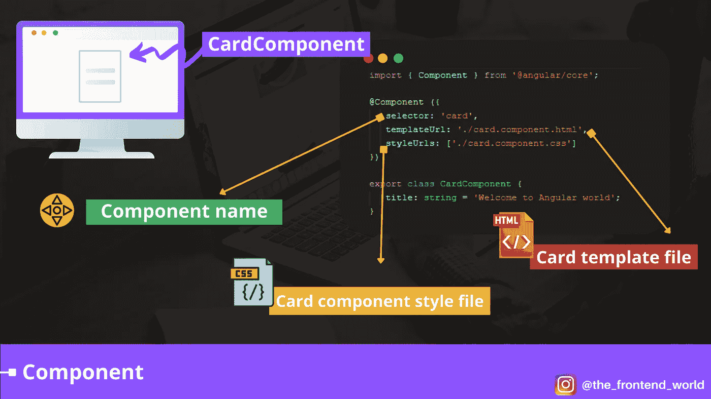
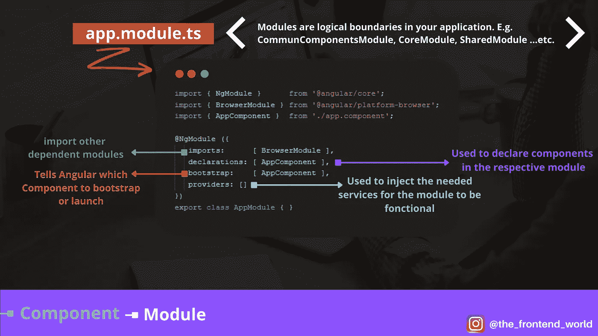
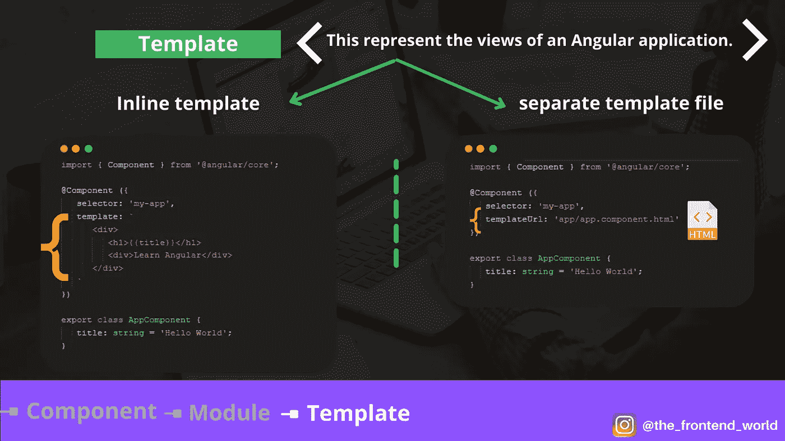
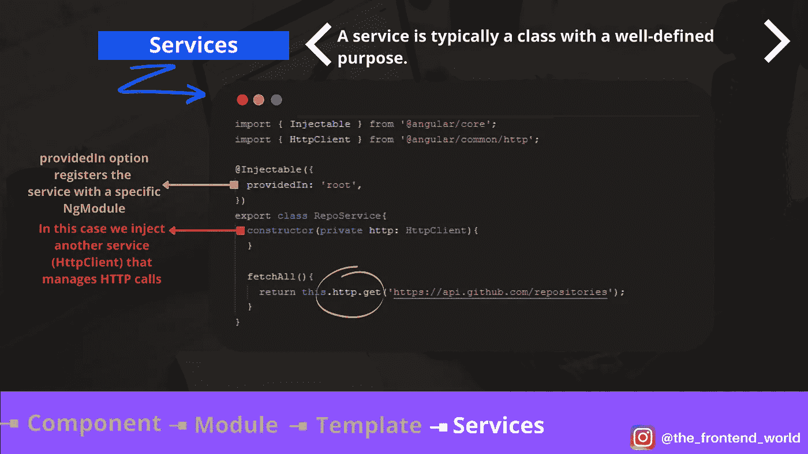
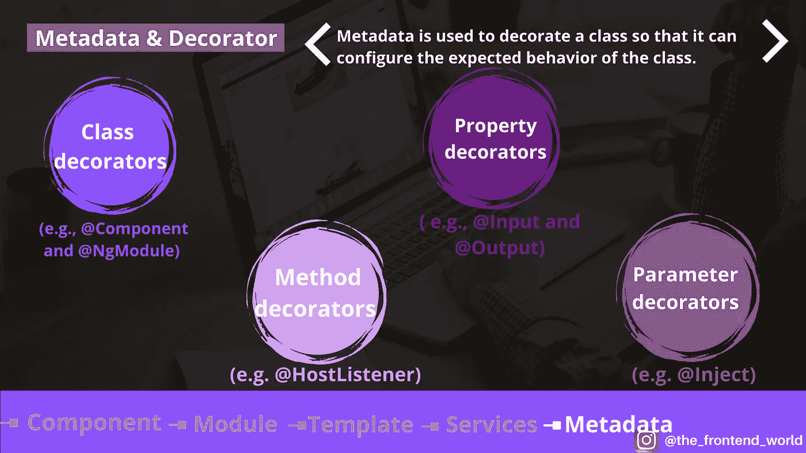

# 每个 Angular 开发者都应该知道的 5 个关键要素

> 原文：<https://javascript.plainenglish.io/the-5-key-components-that-every-angular-developer-should-know-bc4ad3739e88?source=collection_archive---------2----------------------->

了解角度的 5 个关键组成部分。


在 Angular 开发人员的面试中，被问得最多的问题之一就是这个框架的主要组成部分。如果你理解 Angular 所基于的核心概念，回答这个问题是很重要的。

在本文中，我将通过示例和您需要了解的每个组件的细节来介绍这些关键组件。

我们对这篇文章的计划是涵盖以下 5 个关键部分:

*   **组件**
*   **模块**
*   **模板**
*   **服务**
*   **元数据和装饰器**

准备好了，我们走！

# # 1-组件

组件是基本的 UI 构建块。我称之为一个有角度的应用程序的难题，它最终形成了一个有角度的组件树。组件总是有一个模板，模板中的每个元素只能实例化一个组件。让我们看一个简单的角分量例子。



By FAM

# # 2-模块

模块是应用程序中的逻辑边界。Angular 应用程序分为多个独立的模块。模块的主要工作或目标是分离应用程序的功能或逻辑。

*   **示例:**

最重要的 NgModule decorators 有:

1.  `imports`选项用于导入其他依赖模块。默认情况下，任何基于网络的角度应用程序都需要 ***浏览器模块*** 。这就是为什么我们在上面的例子中导入它。
2.  `declarations`选项用于定义相应模块中的组件。主要部件是`AppComponent`。
3.  `bootstrap`选项告诉 Angular 在应用中引导哪个组件。主要部件是`AppComponent`。
4.  `providers`选项用于配置该模块注射器中可用的一组可注射对象。
5.  `entryComponents`选项是一组动态加载到视图中的组件。



By FAM

# # 3-模板

模板是一个 HTML 视图，通过将控件绑定到角度组件的属性来显示数据。使用 template 属性定义模板，或者创建一个单独的 HTML 文件，然后将 templateUrl 属性设置为此文件的路径。

*   **方法 1:使用带有模板语法的内嵌模板**

*   **方法二:使用单独的模板文件如** `**app.component.html**`

**同模板文件:**



By FAM

了解有关类和模板之间的数据绑定的更多信息。这里有一篇很好的文章解释了它是如何工作的:

[](https://levelup.gitconnected.com/whats-data-binding-in-angular-faddb0f64e89) [## Angular 中的数据绑定是什么？

### 什么是插值？什么是属性绑定？什么是双向数据绑定？

levelup.gitconnected.com](https://levelup.gitconnected.com/whats-data-binding-in-angular-faddb0f64e89) 

我们可以在模板中做很多只有 Angular 才有可能做的事情。这个选项和功能的好处是，我们可以重构并创建一个可重用的高效组件:

[](https://levelup.gitconnected.com/a-trip-to-templates-world-in-angular-b3d40b4f0d8a) [## Angular 中的模板世界之旅

### 什么是 ng-template，ng-container，ngTemplateOutlet？+(附赠小抄)

levelup.gitconnected.com](https://levelup.gitconnected.com/a-trip-to-templates-world-in-angular-b3d40b4f0d8a) 

# # 4-服务

服务通常是一个定义明确的类。它应该做具体的事情，并且做好。它通常用于从服务器异步获取数据。假设您想要创建一个显示所有 Github 存储库的 Angular 应用程序。这意味着您将需要一个专门为您蚀刻存储库的服务，然后注入到将使用该服务的组件中。

*   **回购服务示例**

如果您注意到，服务本身使用了另一个服务，即 HTTP 服务。它的工作是检索和发出 HTTP 请求。

> ***/！\*** *顺便说一下，我用的是旧版本的最新版本，我们从不同的包中导入 Http 服务*:

```
import { Http } from '**@angular/http**';
...constructor(**private http: Http**){
}
```



By FAM

要了解更多关于依赖注入的知识，这是 Angular 中的主要概念之一，这里有一篇文章解释了它:

[](https://levelup.gitconnected.com/dependency-injection-di-angular-21172d932f4f) [## 依赖注入(DI) —角度

### 它是什么，它是如何工作的？+具体例子

levelup.gitconnected.com](https://levelup.gitconnected.com/dependency-injection-di-angular-21172d932f4f) 

# # 5-元数据和装饰者

元数据用于修饰一个类，以便它可以配置该类的预期行为。TypeScript Decorator 定义了它。它是一种特殊的声明，可以附加到类修饰上，类修饰可以附加到类声明、方法、访问器、属性或参数上。以下是每种方法的示例:

*   **类装饰者(**如***@组件*** 和 ***@NgModule*** )

*   **属性装饰者(**如***@输入*** 和***@输出*** )

*   **方法装饰者(**例如***@ host listener***)

*   **参数装饰器(**如***@注入*** )



By FAM

你可能想知道整个事情是如何在 Angular。如果是这样的话，我们可以给你一个清晰的概念:

[](https://levelup.gitconnected.com/how-does-an-angular-application-work-8c4fac523a02) [## 角度应用程序是如何工作的？

### 你有没有好奇过一个有角 app 的幕后发生了什么？

levelup.gitconnected.com](https://levelup.gitconnected.com/how-does-an-angular-application-work-8c4fac523a02) 

如果你有兴趣自己学习更多关于 Angular 的知识，这里有一些步骤可以让你的旅程变得快速有效:

[](https://medium.com/geekculture/the-5-steps-to-becoming-a-self-taught-angular-developer-8f887c72884f) [## 成为自学成才的角度开发者的 5 个步骤

### 如何成为一个有角的开发者？

medium.com](https://medium.com/geekculture/the-5-steps-to-becoming-a-self-taught-angular-developer-8f887c72884f) 

# 回顾一下？

享受❤

## 亲爱的读者，我希望这是明确和有用的。

我希望你和你的家人无论在哪里都平安无事！坚持住。明天会更好！

***让我们联系上*** [***中***](https://medium.com/@famzil/)*[***领英***](https://www.linkedin.com/in/fatima-amzil-9031ba95/)*[***脸书***](https://www.facebook.com/The-Front-End-World)*[******](https://www.instagram.com/the_frontend_world/)***

 ***[## 前面

### 欢迎来到❤家庭前线

www.fam-front.com](http://www.fam-front.com/)*** 

*****FAM*****

****更多内容请看*[*plain English . io*](http://plainenglish.io/)***