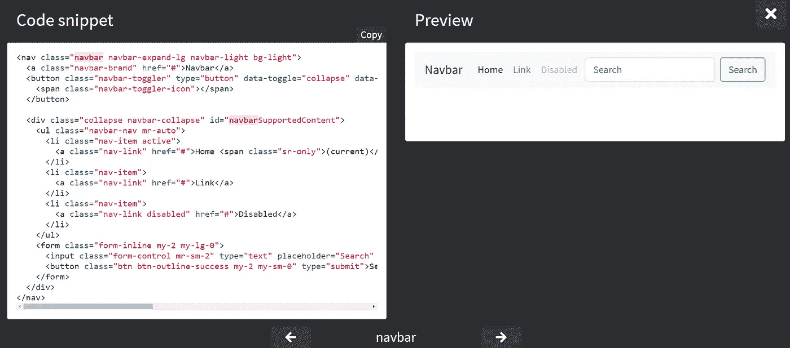
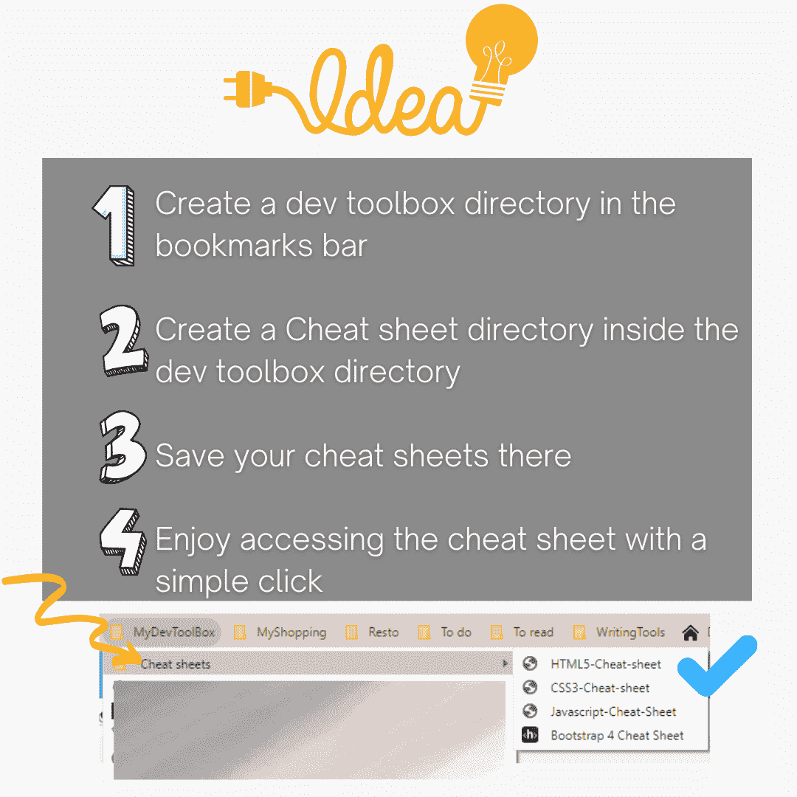

# 每个网络开发人员都应该知道的 5 个备忘单

> 原文：<https://javascript.plainenglish.io/the-5-top-cheat-sheet-every-web-developer-should-know-75bda9bcb296?source=collection_archive---------9----------------------->

## 让你的生活更轻松，让你的日子更有效率！

By FAM

谁不想要一份由有才华的人制作的完全牛逼的小抄，让生活变得更轻松、更有效率呢？开发人员不需要记住语法，他或她需要知道这个领域中重要事物的存在，并在他/她需要它们时寻找它们！

# 1.JavaScript 备忘单

 [## 2021 年的 JavaScript 备忘单(。包含 PDF 版本)|网站设置

### 您可以在下面的。pdf 以及在文本中。让我们从基础开始-如何…

websitesetup.org](https://websitesetup.org/javascript-cheat-sheet/) 

这是你工具箱里的 PDF 版本:[链接](https://websitesetup.org/wp-content/uploads/2020/09/Javascript-Cheat-Sheet.pdf)

# 2.HTML 备忘单

 [## HTML 5 备忘单-包括免费的 PDF 下载-使一个网站枢纽

### 小抄；你不爱他们吗？我爱他们，因为他们为我提供了一个简单的方法来回忆软件程序或帮助…

makeawebsitehub.com](https://makeawebsitehub.com/the-html-5-mega-cheat-sheet/) 

下载整个备忘单并保存在您的开发工具箱目录中:[链接](https://makeawebsitehub.com/wp-content/uploads/2015/06/HTML5-mega-cheat-sheet.jpg)

# 3.CSS 备忘单

 [## 大型 CSS3 备忘单信息图-打造网站中心

### 上个月我们发布了一个巨大的 HTML5 备忘单，列出了所有当前支持的 HTML 5 标签，它们的…

makeawebsitehub.com](https://makeawebsitehub.com/css3-mega-cheat-sheet/) 

下载整个备忘单并保存在您的开发工具箱目录中:[链接](https://makeawebsitehub.com/wp-content/uploads/2015/10/css3-mega-cheat-sheet.jpg)

# 4.自举备忘单

 [## Bootstrap 4 备忘单-Bootstrap 类的最终列表

### 在这个交互式自举备忘单上快速找到你的自举类。它包括代码样本和生活…

hackerthemes.com](https://hackerthemes.com/bootstrap-cheatsheet/) 

这是迄今为止我见过的最好的小抄。Hackerthemes 提供了一个引导类列表，做得非常好。单击每个类，您会看到如下代码片段和预览示例:

navbar code snippet by hackerthemes

# 5.jQuery 备忘单

 [## jQuery 超级备忘单——打造网站中心

### 作为我们庞大的备忘单系列的一部分，帮助创意人员和 web 开发人员加快他们的日常任务和花费…

makeawebsitehub.com](https://makeawebsitehub.com/jquery-mega-cheat-sheet/) 

同样，您可以下载备忘单并保存在您的工具箱中:[链接](https://makeawebsitehub.com/wp-content/uploads/2015/09/jquery-mega-cheat-sheet-20152.jpg)

By FAM

其中一些备忘单的不便之处在于它们是图像，不是 PDF 格式，所以用简单的 Ctrl+F 搜索是不可能的，但至少你可以在学习的时候花一些时间了解内容，并知道在哪里搜索。

这是我的个人开发工具箱备忘单中我最喜欢的列表，我每天都在我的 web 开发任务中使用。

如果你有其他的，请分享给我们！

**尽情享受吧！**

**联系一下** [**中**](https://medium.com/@famzil/)**[**Linkedin**](https://www.linkedin.com/in/fatima-amzil-9031ba95/)**[**脸书**](https://www.facebook.com/The-Front-End-World)**[**insta gram**](https://www.instagram.com/the_frontend_world/)**，或者**[**Twitter**](https://twitter.com/FatimaAMZIL9)**。**[www.fam-front.com](http://www.fam-front.com/)******

*****更多内容请看*[***plain English . io***](http://plainenglish.io)****