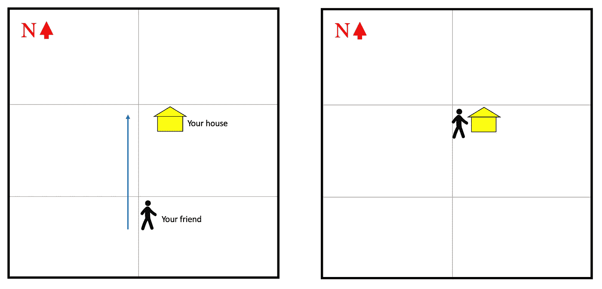
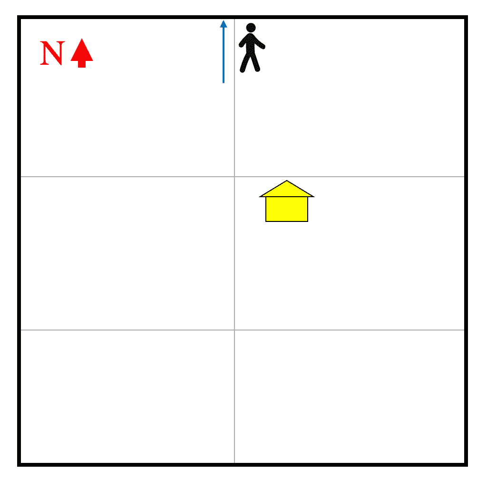
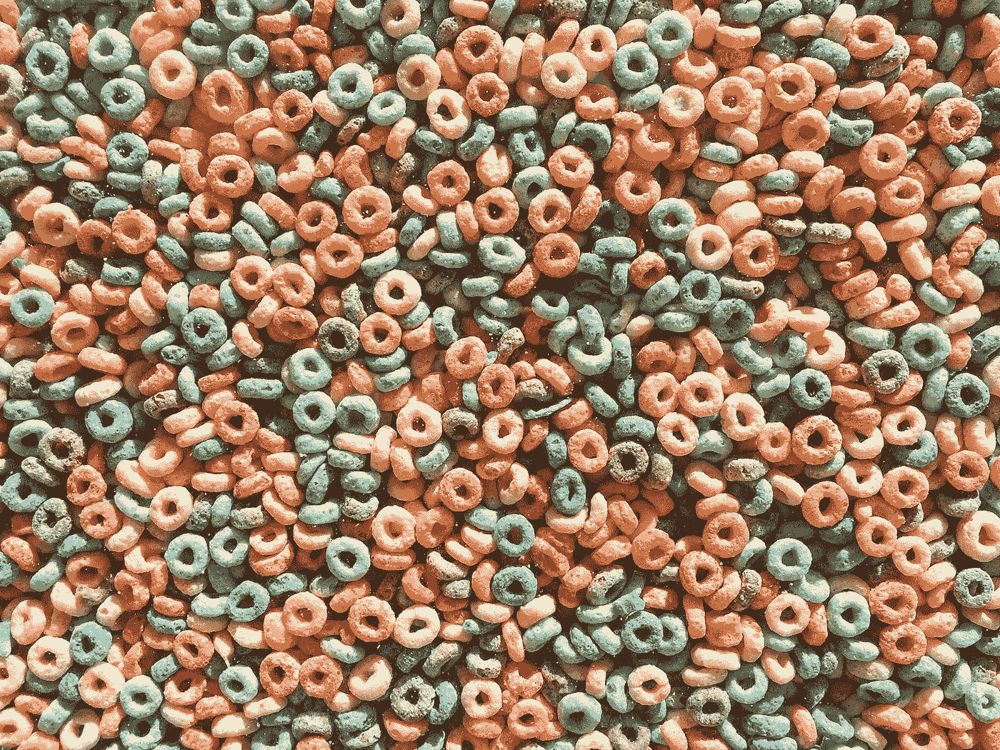

# JavaScript 中的 5 种循环

> 原文：<https://javascript.plainenglish.io/the-5-types-of-loop-in-javascript-8bdb8f8fc1e9?source=collection_archive---------3----------------------->

## 它们是什么以及何时使用它们

循环告诉你的程序重复做某个动作。您的程序应该执行该操作的次数取决于您设置的条件。

用非编程术语来说，假设你正在给你的朋友指路到你家。他们打电话给你，说他们在你的街道上，但他们不知道哪栋房子是你的。你告诉他们，“继续向北走，直到你到达拐角处的黄色房子”。在这个陈述中，“直到你到达拐角处的黄色房子”是你为你的朋友设置的条件。他们将继续向北*走，直到*他们到达那栋房子，在那里他们将*停止*行走。



Your friend walks north toward your house until they reach your house

如果不给朋友条件会怎么样？换句话说，如果你只是对你的朋友说，“继续向北走”，会发生什么？你的朋友永远不知道什么时候该停下来。他们会一直向北走过你的房子。你不能责怪你的朋友没有找到你的房子，因为你从来没有告诉他们什么时候停下来。



Your friend has walked past your house, and they are still going north

这个非编程的例子说明了人们在使用循环时遇到的最常见的问题之一:无限循环。如果你不告诉你的循环什么时候停止，这个循环将永远继续下去。重要的是，如果你告诉你的循环什么时候停止，但是实际上永远不会到达那个停止点，这也是一个无限循环。用同样的例子，假设你告诉你的朋友“继续向北走，直到你到达拐角处的粉红色房子”。你的朋友一直向北走，但是无论他们走多远，他们都没有在拐角处找到一栋粉红色的房子。即使你给了你的朋友一个终点，他们也永远无法到达那个终点，所以他们(理论上)会一直走下去。

当处理循环时，你说什么时候循环应该停止运行，并且实际上可以到达终点，这是非常重要的。



Photo by [Etienne Girardet](https://unsplash.com/@etiennegirardet?utm_source=medium&utm_medium=referral) on [Unsplash](https://unsplash.com?utm_source=medium&utm_medium=referral)

## 1.While 循环

最流行的循环之一是 **while 循环**。一个`while`循环的结构如下:

```
while (condition) {
  statement
}
```

在执行语句之前，`condition`被测试。如果计算结果为`true`，则执行该语句。只要`condition`是`true`，语句就继续执行。当`condition`变为`false`时，语句停止执行。

例如，假设你有一个名为`e`的变量，它从等于`0`开始。只要`e`小于`4`，您就希望`e`保持*增加*(或增加 1)。

```
let e = 0;
while (e < 4) {
 e++;
}
```

下面的表格对上述循环中发生的情况进行了细分:

只要`e < 4`是`true`，循环就执行。当它变成`false`时，它不执行。

使用“while”循环时，很容易意外地写出无限循环。例如，如果上例中的条件是`e >= 0`，那么循环将无限执行。`e`从`0`开始，这意味着条件是`true`，并且不断变大，这意味着条件将总是评估为`true`:

```
//Infinite loop
let e = 0;
while (e >= 0) {
 e++;
}
```

## 2.对于循环

另一个被广泛使用的循环是循环的**。`for`循环的结构如下:**

```
for (initialExpression; conditionExpression; incrementExpression) {
 statement
}
```

第一个运行的是`initialExpression`。在这个表达式中创建的任何变量都在循环的范围内(意味着你不能在循环之外引用这个变量)。`initialExpression`通常是计数器初始化的地方。

然后评估`conditionExpression`是`true`还是`false`。如果是`true`，则执行该语句。如果是`false`，则该语句不执行，并且`for`循环终止。如果没有列出`conditionExpression`，则条件自动为`true`。

`incrementExpression`在语句执行后运行*。正如`initialExpression`通常在`for`循环中初始化一个计数器一样，`incrementExpression`通常递增那个计数器。然而，该表达式也可以使计数器的值*递减*(或减 1)。此时，再次评估`conditionExpression`，如果仍然是`true`，则`for`循环继续执行。*

例如，让我们创建一个`for`循环，将短语“我可以数到 X”记录到控制台上，其中`X`是从`1`开始到`5`的数字。我们从用`let i = 1`初始化`initialExpression`中的一个变量开始。然后，我们将`conditionExpression`设置为`i <= 5`。这意味着只要`i`小于或等于`5`，该语句就会继续运行。最后，我们希望每次循环执行时`i`增加 1，所以`incrementExpression`就是`i++`。**注意:**重要的是每个表达式用分号(`;`)隔开。

```
for (let i = 1; i <= 5; i++) {
 console.log(“I can count to “ + i)
}
```

下面是一个表格，对上述循环中发生的情况进行了细分:

`for`循环也会出现无限循环。无限循环的一个例子是使用上面相同的例子，但是将第三个表达式改为`i — -`。`i — -`表示`i`不断减小，所以`i`从`1`开始，然后变成`0`，然后是`-1`等等。始终，`i <=5`将继续评估为`true`，因为`i`始终小于或等于`5`。

```
//Infinite loop
for (let i = 1; i <= 5; i — ) {
 console.log(“I can count to “ + i)
}
```

## 3.做…当循环时

**do…while loop** 与`while` loop 非常相似。`do...while`回路的结构如下:

```
do {
  statement
} while (condition);
```

这个循环中发生的第一件事是语句被执行。一旦发生这种情况，将检查`condition`。如果`condition`的计算结果为`true`，则该语句再次执行。该语句一直执行，直到`condition`评估为`false`。`do...while`循环和`while`循环的主要区别在于语句总是被执行**至少一次**。

例如，让我们将一个名为`booksRead`的变量初始化为等于`10`。我们想将“今年我读了 X 本书”记录到控制台，其中`X`是`booksRead`的值。然后我们将条件设置为`booksRead < 14`。**注意:**在下面的例子中，当控制台记录今年阅读的书籍数量时，我使用*字符串插值*。字符串插值是通过使用 JavaScript 中的[模板文字](https://developer.mozilla.org/en-US/docs/Web/JavaScript/Reference/Template_literals)来完成的。

```
let booksRead = 10;
do {
 console.log(`I read ${booksRead} books this year`);
 booksRead++;
} while (booksRead < 14);
```

下面的表格对上述循环中发生的情况进行了细分:

使用`do…while`循环时，你可以创建一个无限循环的一种方法是不增加你在条件中检查的变量。使用与上面相同的示例，如果您从不递增`booksRead`，那么`booksRead`将永远停留在`10`，这意味着条件`booksRead < 14`将始终为`true`。

```
//Infinite loop
let booksRead = 10;
do {
 console.log(`I read ${booksRead} books this year`);
} while (booksRead < 14);
```

## 4.对于…循环

循环中的**用于 JavaScript 中的对象。它的结构如下:**

```
for (variable in object) {
 statement
}
```

一个`for…in`循环在对象的每个属性(或键)上迭代一个变量。对于每个属性，都执行该语句。循环使您能够在不知道属性名称的情况下访问对象的每个属性。` for…in '循环以任意顺序迭代对象的属性。因此，根据 [MDN 文档](https://developer.mozilla.org/en-US/docs/Web/JavaScript/Reference/Statements/for...in)，“最好**不要在迭代期间添加、修改或删除对象的属性**，除了当前正在访问的属性”。你也不应该在数组循环中使用 for……

例如，假设您有一个对象，它列出了您当天吃的每一顿饭，您希望控制台记录您吃的每一顿饭。这个物体叫做`foodIAte`。使用一个`for…in`循环，你可以列出每顿饭的名称，以及你在那顿饭里吃了什么。

```
const foodIAte = {
 breakfast: ‘eggs’,
 lunch: ‘salad’,
 dinner: ‘pizza’
};for(const meal in foodIAte) {
 console.log(`For ${meal}, I ate ${foodIAte[meal]}.`);
};
```

下面的表格对上述循环中发生的情况进行了细分:

## 5.对于…的循环

最后一个循环是循环的**。`for…of`循环可以和*可迭代对象*一起使用，包括数组、映射、集合、字符串、[等等](https://developer.mozilla.org/en-US/docs/Web/JavaScript/Reference/Iteration_protocols)。它的结构如下:**

```
for (variable of iterableObject) {
 statement
}
```

`for…of`循环遍历`iterableObject`，并为`iterableObject`中的每个属性值执行一条语句。当`for…in`循环遍历属性*名称*时，`for…of`循环遍历属性*值*。

例如，假设您有一个数组，并希望控制台记录数组的每个值:

```
const array = [5, 10, 15];
for (const value of array) {
 console.log(value);
}
```

上面的循环将控制台日志`5`、`10`、`15`。

假设您有一个字符串，并希望控制台记录该字符串的每个值:

```
const string = “cat”;
for (const value of string) {
 console.log(value);
}
```

上面的循环将控制台日志`c`、`a`、`t`。

这里有一个由苏尼尔·桑德胡制作的视频，也包含了这 5 个循环的例子:

如果你对 JavaScript 中的循环有任何问题或其他想法，请在评论中告诉我。

**资源** -[https://developer . Mozilla . org/en-US/docs/Web/JavaScript/Guide/Loops _ and _ iteration](https://developer.mozilla.org/en-US/docs/Web/JavaScript/Guide/Loops_and_iteration)
-[https://developer . Mozilla . org/en-US/docs/Web/JavaScript/Reference/Statements/for...](https://developer.mozilla.org/en-US/docs/Web/JavaScript/Reference/Statements/for...of)
-[https://developer . Mozilla . org/en-US/docs/Web/JavaScript/Reference/Statements/for...在](https://developer.mozilla.org/en-US/docs/Web/JavaScript/Reference/Statements/for...in)
-[https://developer . Mozilla . org/en-US/docs/Web/JavaScript/Reference/Iteration _ protocols](https://developer.mozilla.org/en-US/docs/Web/JavaScript/Reference/Iteration_protocols)
-[https://www.w3schools.com/js/js_loop_for.asp](https://www.w3schools.com/js/js_loop_for.asp)
-[https://www . freecodecamp . org/news/JavaScript-loops-explained-for-loop-for/](https://www.freecodecamp.org/news/javascript-loops-explained-for-loop-for/)
-[https://www.javascripttutorial.net/javascript-for-in/](https://www.javascripttutorial.net/javascript-for-in/)