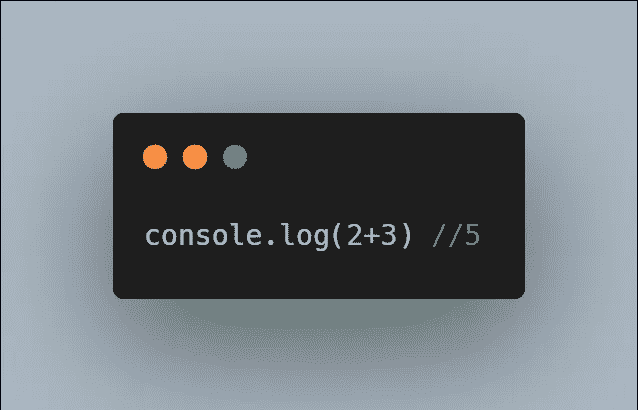

# 您需要了解的 6 个 JavaScript 算术运算符

> 原文：<https://javascript.plainenglish.io/the-6-javascript-arithmetic-operators-you-need-to-know-about-4255ae8f2502?source=collection_archive---------10----------------------->

## JavaScript 中的数学不一定是可怕的…

Photo by [Ashkan Forouzani](https://unsplash.com/@ashkfor121?utm_source=medium&utm_medium=referral) on [Unsplash](https://unsplash.com?utm_source=medium&utm_medium=referral)

在你的编码项目中，迟早你会需要做一些数学计算。

这只是你无法避免的事情。

这就是我来帮你的原因。

今天，我将告诉你(并给出例子)成为一名合格的 JavaScript 开发者需要知道的 6 个算术运算符。

我说的不是分别代表加、减、除、乘的标准+、-、/和*运算符。

相反，我说的是现在众所周知的操作符，但是每个 JavaScript 开发者*都需要*知道。

这些运算符将允许您进行更复杂的数学计算。

现在，让我们直入主题吧。

# 什么是运营商？

在我开始列出所有的操作符之前，我们必须首先理解 JavaScript 中的操作符*是什么。*

JavaScript 中的操作符是可以操作某个值(或多个值)的任何东西。

运算符通常用于执行某种形式的数学计算。

这方面的一个例子是，如果您要用以下代码在 JavaScript 中添加 2 + 3:

Example of using an Arithmetic Operator

在这种情况下，运算符将是+号，因为它是*操作*2 和 3 的值(也称为操作数)并将它们相加得到总数 5。

到目前为止，您应该对算术运算符有了更好的理解。现在是时候向你展示你需要知道的 10 个算术运算符了。

# 1.剩余物

列表中的第一个操作符是*余数*操作符。

*余数*运算符返回两个操作数相除后的余数。

例如，通过对操作数(值)10 和 3 使用*余数*运算符，返回值 1。这是因为 10 除以 3 后，剩余的数是 1。

如下所示:

Remainder Operator in Action, 10 and 3 are the operands in this case

*注意:如果你在理解剩余部分时有困难，这篇文章可能会帮助你* [*链接*](https://www.cuemath.com/numbers/remainder/)

# 2.增量

如果你曾经在 JavaScript 中使用过 for 循环，你肯定会遇到下面的算术运算符,**增量运算符。**

增量运算符是一元运算符，这意味着它只作用于一个操作数。

增量运算符很容易理解，因为它所做的只是给操作数加 1。

例如，在下面的代码中，您可以看到我是如何使用 increment 运算符将 num 的值加 1，从而得到 4。

The Increment Operator in Action

*注意:关于增量运算符，需要注意的一点是它可以用作前缀或后缀运算符。这意味着运算符可以放在它所操作的操作数之前或之后。*

# 3.减量

下一个操作符，减量操作符，与前一个操作符非常相似。

像递增运算符一样，递减运算符将其操作数的值改变 1。唯一的区别是减量运算符*从操作数中移除*1，而不是*将*加 1。

正在运行的减量操作符如下所示:

The Decrement Operator in Action

*注意:和递增运算符一样，递减运算符可以用在前缀或后缀中。*

# 4.一元否定

下一个操作数，一元求反运算符，听起来可能有点吓人，但是很容易理解。

一元求反运算符所做的只是返回一个操作数的相反符号的数字。

例如，如果您要对值 3 使用一元否定，则返回值-3，反之亦然。如下所示:

Using the Unary Negation operator on both positive and negative numbers

# 5.一元加号

我们的下一个操作符，一元加操作符，很有趣，因为它是唯一改变操作数的*类型*的算术操作符。

当其他算术运算符试图实现某种形式的数学计算时，一元加运算符试图将其操作数*转换为一个数字*。

例如，如果给定字符串“4 ”,一元加号运算符会将其变为数字*4。*

但是，当一元加号用于非数字时，例如，包含字符“a”的字符串，将返回 NaN。

这都显示如下:

Notice how Unary Plus only works on Strings containing Numbers

# 6.指数运算符

最后一个运算符是取幂运算符。

取幂运算符所做的只是将左操作数提升到右操作数的幂。

这方面的一个例子如下:

The Exponential Operator in Action

# 结论

感谢您阅读完我关于**的文章，这是您需要了解的关于**的 6 个 JavaScript 算术运算符。我希望你有美好的一天。以下是我的一些进一步的文章供你阅读:

 [## 你绝对需要了解的 8 个 React 原生库

### 当谈到使用 React Native 创建应用程序时，找到正确的库可以使开发过程变得更加…

JavaScript.plainenglish.io](/8-react-native-libraries-you-absolutely-need-to-know-about-28f6038d0b76)  [## 如何在 React 和 React Native 中以正确的方式实现条件呈现

### 在 Web 和移动应用中使用动态用户界面

javascript.plainenglish.io](/how-to-implement-conditional-rendering-in-react-and-react-native-the-right-way-f00e2fa7a730)  [## 作为一名网络开发者，你需要 7 个 Chrome 扩展

### 让你的开发者生活更美好的扩展。

JavaScript.plainenglish.io](/7-chrome-extensions-you-need-as-a-web-developer-b5521025fb90) 

*更多内容请看*[*plain English . io*](http://plainenglish.io/)*。报名参加我们的* [*免费周报在这里*](http://newsletter.plainenglish.io/) *。*