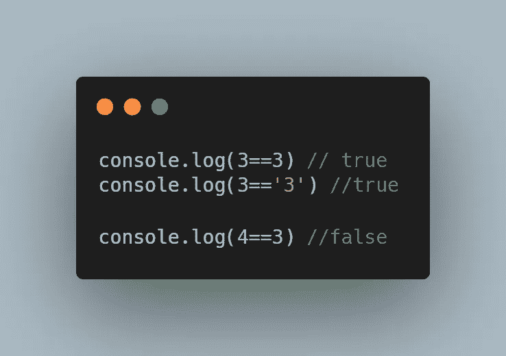
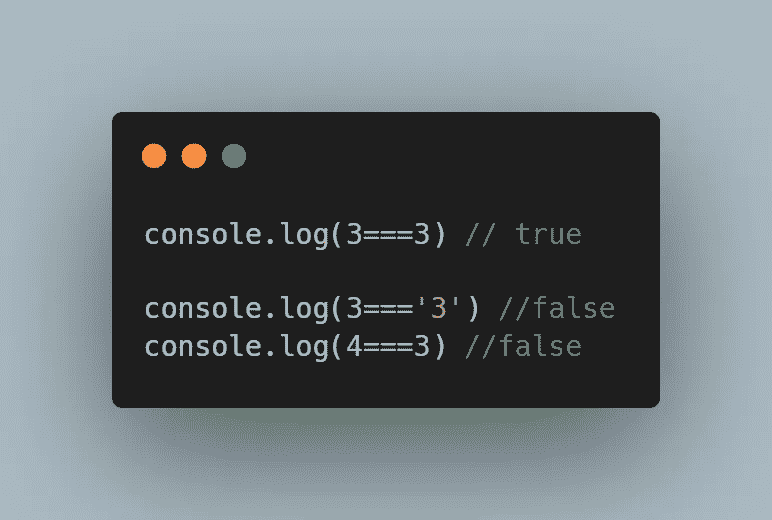
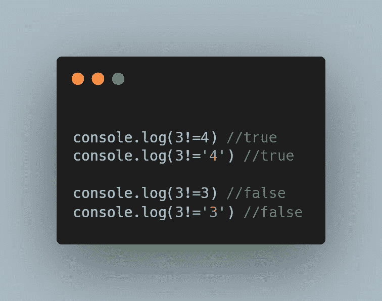
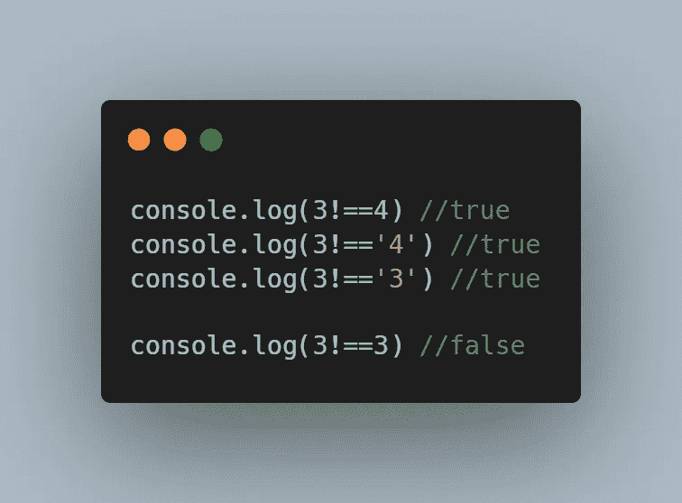
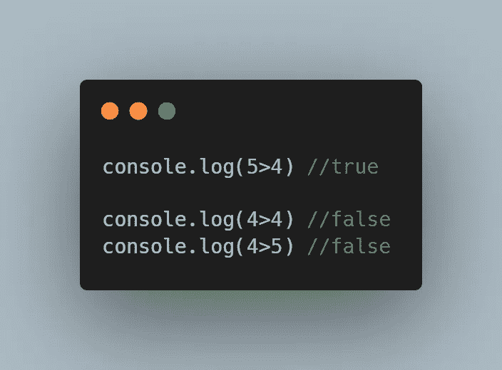
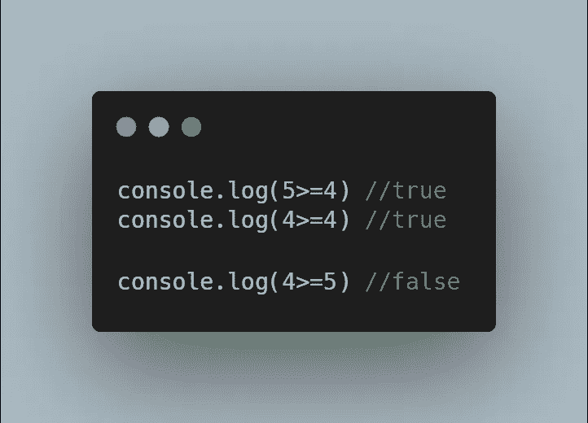
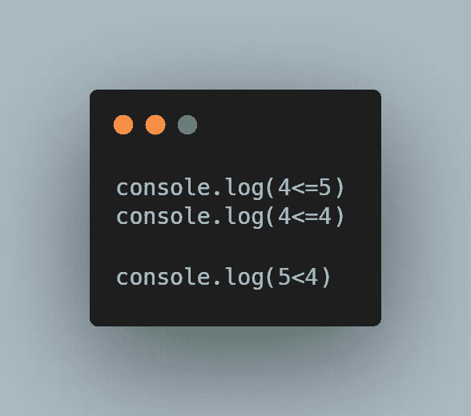

# 您需要知道的 8 个 JavaScript 比较运算符

> 原文：<https://javascript.plainenglish.io/the-8-javascript-comparison-operators-you-need-to-know-cb952090d087?source=collection_archive---------21----------------------->

## JavaScript 中比较运算符的完整指南

Photo by [Mohammad Rahmani](https://unsplash.com/@afgprogrammer?utm_source=medium&utm_medium=referral) on [Unsplash](https://unsplash.com?utm_source=medium&utm_medium=referral)

# 1.平等的

我们要看的第一个比较运算符是**等于**比较运算符**。**

等号运算符很容易理解，因为它只是检查两个变量是否有相同的值。

需要注意的一件重要事情是，在执行等式检查时，变量的类型**与**无关。

以下面的代码为例:

Example of Equal Comparison Operator

注意数字 3 和字符串“3”如何计算为真？

# 2.严格相等

我们的下一个比较操作符**严格等于**，类似于我们之前的操作符。

不过有一个明显的区别。

与等号运算符不同，严格等号运算符检查它的两个操作数是否具有相同的值**和**类型。

就拿我们之前的例子做参考吧。如果我们用严格的等号运算符(===)替换等号运算符，我们会注意到不同的结果。

不同之处在于，计算 3 和“3”这次实际上会返回 false！

其原因是，虽然 3 和“3”具有相同的值，但它们属于不同的类型。

这方面的代码如下:

Example of Strict Equal Comparison Operator

# 3.不相等

我们的第三个操作符，不等于比较操作符，与我们的第一个比较操作符正好相反。

而相等比较运算符如果其两个操作数的值相同，则计算结果为 true。如果不等操作数的两个操作数的值**不是**相同，则不等操作数提升为真。

需要注意的一点是，在提升不等于表达式时，操作数的类型并不重要。

下面的代码展示了这一点:

Example of Not Equal Comparison Operator

# 4.严格不等于

严格的不等于运算符类似于不等于运算符。

唯一的区别是类型**和**值必须相同，它才能评估为假。

下面的代码显示了严格的不等于运算符的作用:

Example of Strict Not Equal Comparison Operator

# 5.大于

如果左边的操作数大于右边的操作数，那么大于运算符只返回 true。

这意味着如果左边的操作数小于右边的操作数，或者与右边的操作数相同，则表达式将返回 false。

下面的代码展示了这一点:

Example of Greater Than Comparison Operator

# 6.大于或等于

“大于或等于”运算符的功能与前面的运算符完全一样。唯一的区别是，如果两个操作数的值相同，它也会提升为 true。

这方面的代码如下:

Example of Greater Than or Equal ToComparison Operator

# 7.不到

小于运算符通过比较右边的操作数和左边的操作数来提升表达式。

只有当右边的运算符大于左边的操作数时，表达式才会提升为 true。

下面的代码演示了这一点:

Example of Greater Than or Equal ToComparison Operator

# 8.小于或等于

小于或等于运算符的功能与小于运算符完全相同。唯一的区别是，如果两个操作数的值相同，它也会提升为 true。

下面的代码演示了这一点:

Example of Greater Than or Equal ToComparison Operator

# 结论

感谢您阅读完我关于**的文章，这是您需要了解的 8 个 JavaScript 比较运算符**。如果你有任何问题，请随意提问，我会尽快回答。

我希望你有美好的一天。如果你刚接触媒体，你可以点击这里的[链接加入。](https://bookeraziz.medium.com/membership)

 [## 如何在 React Native 中获取设备的尺寸

### 如何让你的应用适应多种设备尺寸？

javascript.plainenglish.io](/how-to-get-a-devices-dimensions-in-react-native-bcc2a5c26663)  [## 你绝对需要了解的 8 个 React 原生库

### 当谈到使用 React Native 创建应用程序时，找到正确的库可以使开发过程变得更加…

javascript.plainenglish.io](/8-react-native-libraries-you-absolutely-need-to-know-about-28f6038d0b76) 

*更多内容看* [***说白了就是***](http://plainenglish.io/) ***。*** *报名参加我们的* [***免费每周简讯点击这里***](http://newsletter.plainenglish.io/) ***。***