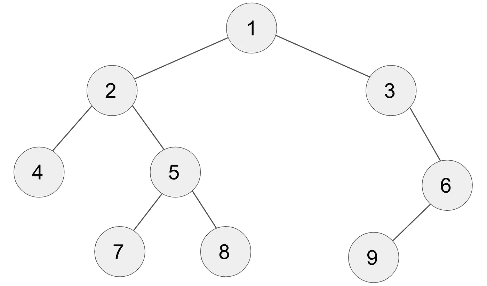
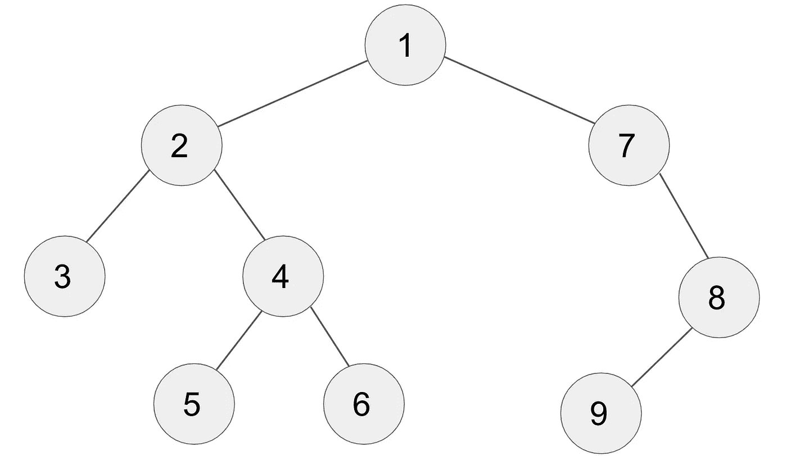
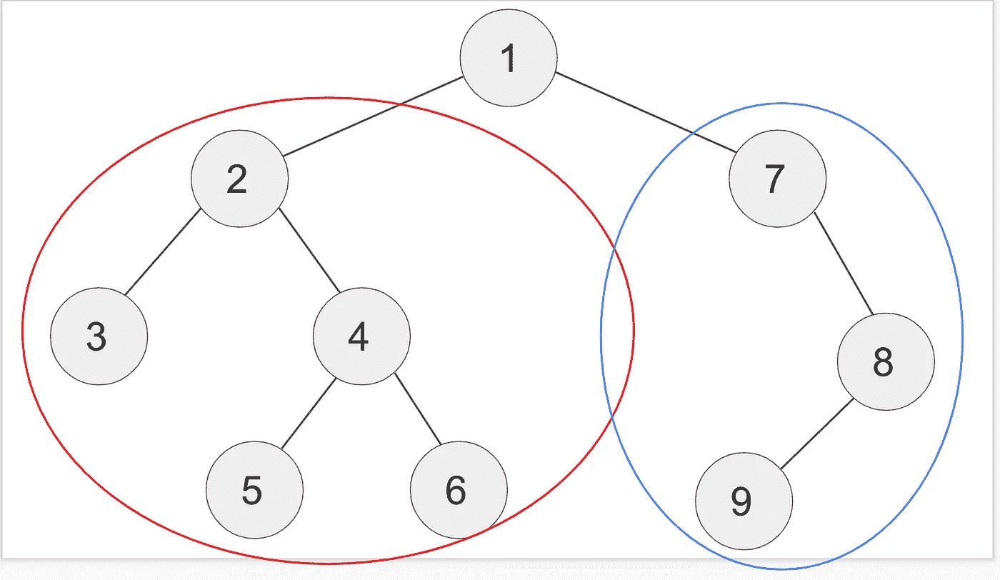
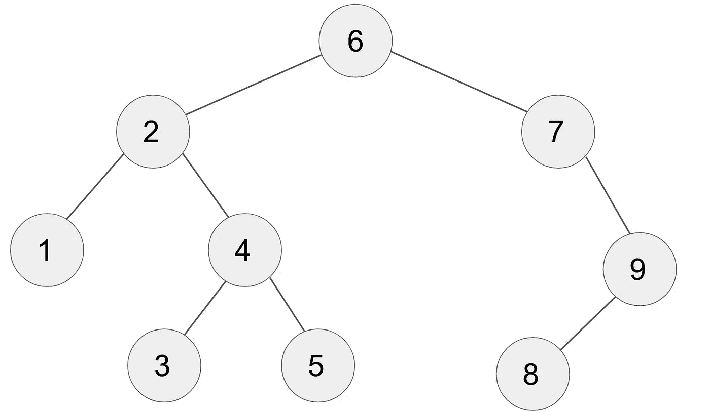
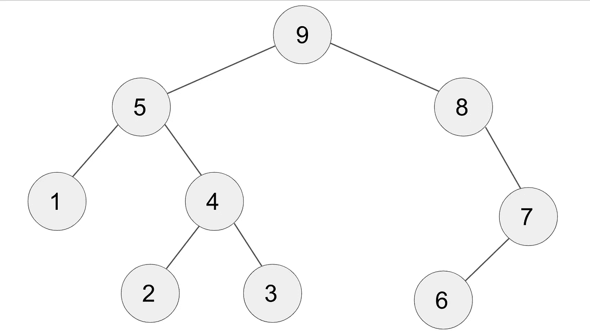

# 算法壁龛:二叉树遍历

> 原文：<https://javascript.plainenglish.io/the-algo-alcove-binary-tree-traversal-af0e8f7ce55e?source=collection_archive---------17----------------------->


Photo by [veeterzy](https://unsplash.com/@veeterzy?utm_source=medium&utm_medium=referral) on [Unsplash](https://unsplash.com?utm_source=medium&utm_medium=referral)

欢迎回到 Algo Alcove 的另一个版本，在这里我们将关注一个对许多 LeetCode 问题都很重要的共同概念:二叉树遍历(也许我应该把这个叫做“数据结构书房”？？).

二叉树就是**树**结构，它的建立是为了确保每个**节点**最多只有两个子节点，一个**在左边，**和一个**在右边。**

如果你需要复习什么是树，可以看看我的博客[中的](/from-zero-to-dijkstra-the-shortest-path-to-the-shortest-path-algorithm-f070e224f99e)，我在那里谈到了二进制堆(另一种类型的**树**结构)。

**遍历**一棵树就是在给定**根**节点的情况下，访问树的每个节点的术语。如何处理收集的数据取决于您自己，但是遍历每个节点本身就是一项技术，因此了解一些方法会有所帮助。

# 广度优先搜索(BFS)



Binary Search Tree

这里是一个标准的**二叉查找树。**我们可以看到，每个节点最多有两个子节点(一左一右)，有些节点有 1 个或者没有。在这个图中我们还可以看到，它们是按照**级**或者从节点到**根**(顶层节点)的距离来组织的。

我们看到[2，3]在同一层上，[4，5，6]和[7，8，9]也分组在一起。在广度优先搜索中，我们寻找**广度、**并一层一层地遍历，直到用尽所有选项。为此，我们可以实现一个**队列**结构。

队列很容易理解。它遵循先进先出( **FIFO** )的顺序。就像在熟食店排队一样，如果你是第一个拿到号码的人，你的号码将是第一个被叫到的。

我们的队列将跟踪哪些节点我们还没有**访问**(“访问”在这个上下文中意味着将我们的值推送到一个数组中，该数组最终将保存所有 9 个节点的值)当您访问一个节点时，您可以执行任意数量的操作，但是因为我们只是展示如何遍历每个节点，所以我们将在一个数组中保存所有的值。

以下是搜索操作的伪代码:

*   创建一个队列。**入队**根。
*   创建一个循环，当队列不为空时运行**。**
*   **出列。**访问‘那个节点’。(推入数组)。
*   将该节点的左子节点排入队列(如果存在)。
*   将该节点的右子节点排入队列(如果存在)。

就是这样！现在我们来看看它是如何写出来的。

```
function BFS(root) {
    let queue = [root];
    let result = [];

    while (queue.length) {
        let node = queue.shift();
        result.push(node.val); if (node.left) queue.push(node.left);
        if (node.right) queue.push(node.right);
    }
    return result;
```

如果我们在示例树上运行这个，结果数组将看起来像`[1,2,3,4,5,6,7,8,9]`

很简单，对吧？现在，我们先来看看**深度搜索**。DFS 有三种主要类型:**前序、后序和按序。**

# 深度优先搜索

# 预购



Another Tree!

前序、中序、后序都很像，不用怕。它们是深度优先搜索的例子，我们可以使用**递归**来使我们的生活更加简单。

深度优先搜索遍历整个树，在返回之前一直向下到一个叶节点(考虑垂直而不是水平)。我们也可以使用递归来帮助我们，因为它利用了树的一个有趣的属性:从技术上讲，每个节点都是另一个子树的“根”。



Subtrees

你可以看到高亮部分实际上是他们自己的二分搜索法树。这意味着它们可以成为递归函数中的参数。

你可能记得递归函数有一个**基础用例**和一个**递归调用**。我们正在进行**预先排序**深度优先搜索，这意味着我们将在调用子树上的递归函数之前“访问”我们的节点。我们来看伪代码。

*   设置一个**结果**数组。
*   创建一个助手函数(递归):
*   1.基本情况:如果节点为空，则返回。
*   2.访问当前节点。
*   3.递归调用左边**子树上的函数。**
*   4.递归调用右边子树上的函数。

```
function DFSPreOrder(root) {
    let results = [];

    function traverse(node) {
        if (node === null) return;

        results.push(node.val); traverse(node.left);
        traverse(node.right);
    }
    traverse(root);
    return results;
}
```

就是这样。如果我们回头看我们的图片，我们会看到我们的结果数组将按照数字的顺序输出`[1,2,3,4,5,6,7,8,9]`

# 按顺序

In order 与 Pre-order 相同，除了您想要递归地调用左边的树和右边的树来“访问”您的中间节点**。这样，在移动到子树的“根”之前，您总是先访问最左边的节点，最后访问右边的节点。**

下面是代码，请注意，除了两行交换之外，它们完全相同。

```
function DFSInOrder(root) {
    let results = [];

    function traverse(node) {
        if (node === null) return; traverse(node.left);    //This line
        results.push(node.val); // Swapped with this line
        traverse(node.right);
    }
    traverse(root);
    return results;
}
```

这里有一个更新的树来精确显示节点将被访问的顺序。从 1-9 开始跟着走。



In-Order Traversal

你可以看到我们一直调用左边的子树，然后是那个子树的根，然后是右边的子树。

# 后期订单

你大概能猜到最后一个要去哪里，所以我闭嘴给你看代码:

```
function DFSPostOrder(root) {
    let results = [];

    function traverse(node) {
        if (node === null) return; traverse(node.left);
        traverse(node.right);    //This line
        results.push(node.val); // Swapped with this line
    }
    traverse(root);
    return results;
}
```

这是它的样子。从 1–9 开始跟进:



Post-Order Traversal

那就是树遍历！在回答算法问题时，了解这些不同的技术非常有帮助。有时，您可能必须找到一棵树的最小深度(广度优先搜索)，或者可能沿着垂直轴反转一棵树(DFS 预排序)。不管你在做什么，记住这些基本原则是非常有帮助的。

我希望你喜欢学习更多关于奇妙的树木世界的知识(Lorax 会感到非常自豪)。非常感谢您的阅读，下次再见！

*更多内容看*[***plain English . io***](http://plainenglish.io/)