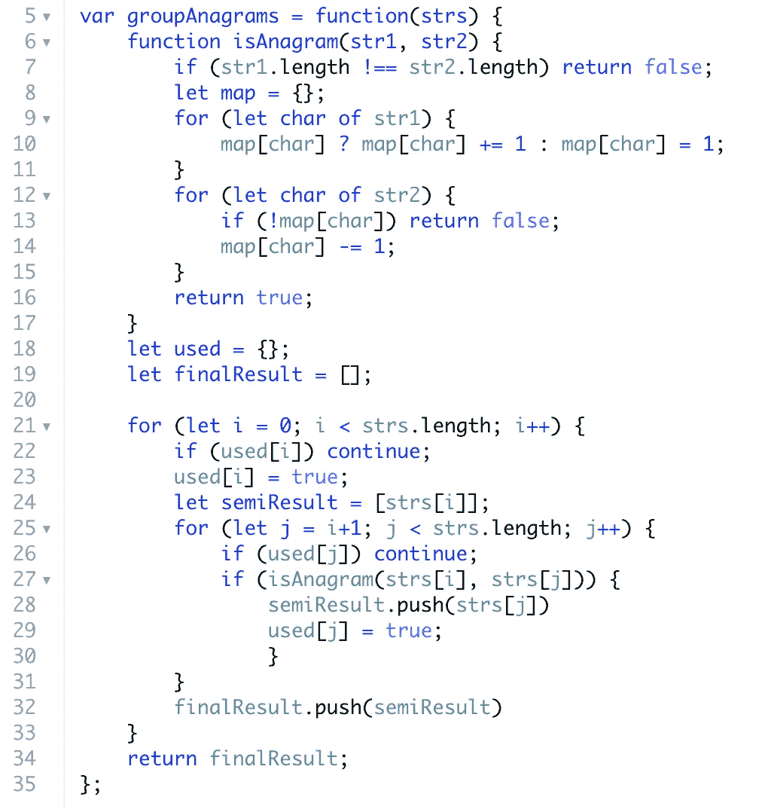
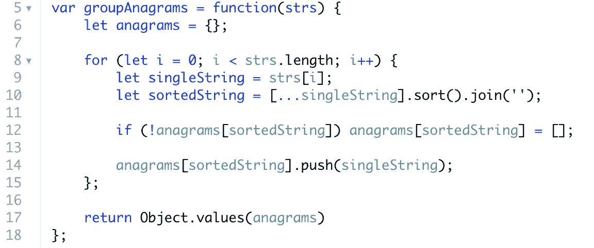

# Algo 壁龛:分组字谜

> 原文：<https://javascript.plainenglish.io/the-algo-alcove-group-anagrams-7b2ae5a7f5fc?source=collection_archive---------20----------------------->


Photo by [Piotr Łaskawski](https://unsplash.com/@tot87?utm_source=medium&utm_medium=referral) on [Unsplash](https://unsplash.com?utm_source=medium&utm_medium=referral)

欢迎回到 Algo Alcove，这是一个可以把脚抬起来、喝一杯啤酒(必须到达鲍尔默峰)并准备好投入算法的时髦地方。

今天我们将学习“小组字谜”。这是 [Leetcode](https://leetcode.com/problems/group-anagrams/) 上的一个中等问题，解决方案相当巧妙。

本着增长和透明的精神，我想先给你们看一张我的原始解决方案的截图。我自己在计时，所以我知道它不会被优化，但我想向您展示一个未经优化和优化的解决方案是多么的不同。

# 这个问题

> 给定一个字符串数组`strs`，将字谜组合在一起**。可以在**任意顺序**返回答案。**
> 
> **变位词**是通过重新排列不同单词或短语的字母形成的单词或短语，通常使用所有原始字母一次。

## 例子

```
**Input:** strs = ["eat","tea","tan","ate","nat","bat"]
**Output:** [["bat"],["nat","tan"],["ate","eat","tea"]]
```

现在，让我给你看看我的初步解决方案。请不要取笑我！



That’s some hefty code!

你可以看到我做的第一件事是定义一个帮助函数来检查任何两个单词是否是彼此的变位词。我通过创建一个**散列图**并计算 **string1 中的所有字母来做到这一点。**然后，我循环遍历 **string2** ，将这些字母与我在哈希映射中的计数进行比较。

这是解决一个简单问题的常用方法，也就是*创建一个函数来判断两个单词是否是彼此的变位词。*

在那之后，我创建了一个名为**的结构，使用**来跟踪所有添加到我的 **finalResult** 数组中的单词的索引号。然后，我遍历每个单词(如果它不存在于 **used** 对象中),并使用我的 **isAnagram()** 辅助函数将它与数组中的所有其他单词进行核对。

如果它们是字谜，我会将它们全部推入一个名为 **semiResult** 的子数组，在循环迭代结束时，我将 **semiResult** 推入 **finalResult。**最后，所有的变位词分组(或者孤独的、未分组的单词)都将在 **finalResult** 数组中，我可以返回它。

听起来工作量很大！而且它第二次循环用的是 O(n)时间，调皮捣蛋！更不用说，如果不匹配，你必须多次检查同一个单词的变位词。非常低效。

既然我们已经看到了看待事物的幼稚方式，让我们试着找出一个更好的解决方案。

# 优化解决方案

想出最佳解决方案的第一个技巧源于一个关于字谜的简单事实:当按字母顺序排序时，所有的单词看起来都一样。

想一想:`['ate', 'eat', 'tea']`都是字谜，但是按字母顺序放进去就成了`['aet', 'aet', 'aet']`。这样比较起来就容易多了！

那么，让我们从我们最喜欢的部分开始:变量声明！

```
const groupAnagrams = (strs) => {
    const anagrams = {};

    for (let i = 0; i < strs.length; i++) {
        const singleString = strs[i];
        const sortedString = [...singleString].sort().join('');.........................................
```

我们初始化一个**字谜**对象来保存我们排序后的字符串`['aet', 'aet', 'aet']`。然后我们循环遍历字符串数组**输入**并使用`strs[i]`拉出单个字符串。下一行看起来有点奇怪，但让我们一条一条地看。

`[...singleString]`正在使用**扩展操作符**，这是一种 **ES6** 语法，允许我们打开可迭代对象(如数组或字符串)并将其他数据放入其中。它把`'eat'`变成了`['e', 'a', 't']`。

由于 **singleString** 已经被声明并具有一个字符串的值，我们可以声明另一个数组并将 **array.push()** 我们的 **singleString** 放入其中。但是这种方式看起来更干净，占用内存更少。

接下来，我们使用 **Array.sort()** 方法对数组中的字母进行排序。最后，我们**。join()** 将它们连接在一起，将它们变回一个单独的字符串(从技术上来说，我们不必这样做，因为数组可以是对象中的键，但是按照哈希的工作方式，我相信这将花费相同的时间)。

```
............................................... if (!anagrams[sortedString]) anagrams[sortedString] = []; anagrams[sorted].push(singleString)
    } return Object.values(anagrams);}
```

最后，我们检查对象中的键(所有键都是排序后的字符串，因为它们对于每个变位词都是相同的)是否存在。如果没有，我们就把这个值作为一个空数组。然后，我们将原始的**单字符串**放入我们创建的数组中。

最后，我们返回`Object.values(anagrams)`，这是一个为我们对象中的所有**值**创建数组的方法，而不是键。这将使我们的数组看起来像我们的成品`[[“bat”],[“nat”,”tan”],[“ate”,”eat”,”tea”]]`

以下是完整的代码:



Much cleaner!

今天到此为止。我希望这能让你明白，解决一个问题往往不止一种方法。有时候，回顾你的代码并找到优化它的方法会很有帮助。其他时候，它有助于从一个新的角度看问题，看看你能从问题或给出的输入中获得什么普遍真理。

非常感谢您的阅读。像往常一样，如果你喜欢这篇文章，请留下评论或赞。下次在海湾见！

*更多内容看*[***plain English . io***](http://plainenglish.io)