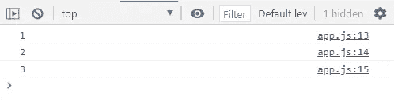
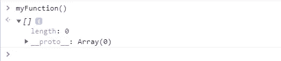

# 举例说明 JavaScript 中的 Arguments 对象

> 原文：<https://javascript.plainenglish.io/the-arguments-object-in-javascript-explained-with-examples-34197acb68a5?source=collection_archive---------10----------------------->

## 通过实例了解 arguments 对象。


Photo by [James Harrison](https://unsplash.com/@jstrippa?utm_source=medium&utm_medium=referral) on [Unsplash](https://unsplash.com?utm_source=medium&utm_medium=referral)

# 介绍

JavaScript 中的 arguments 对象是一个类似数组的对象，可以在包含传递给该函数的参数值的函数内部访问。当我们想要访问或知道传递给函数的参数数量时，这非常有用。

在本文中，我们将通过一些实例来了解 JavaScript 中的这个`arguments`对象。让我们开始吧。

# 参数对象

对象`arguments`是一个在所有函数中都可用的局部变量。你可以通过使用`arguments`对象在函数中引用函数的参数。该对象包含传递给函数的每个参数的条目，这将帮助我们知道这些参数的数量，并使用 arguments 对象来访问它们。

正如我们所说，对象`arguments`是一个类似数组的对象，这是因为它有一个长度属性。所以我们可以使用数组索引符号`arguments[i]`来访问单个值。但是它没有内置的数组方法，比如`forEach`、`reduce`、`filter`和`map`。

下面是一个我们如何用对象`arguments`访问函数参数的例子:

```
function myFunction(a, b, c){
 console.log(**arguments[0]**);   // expected output: 1
 console.log(**arguments[1]**);   // expected output: 2
 console.log(**arguments[2]**);   // expected output: 3
}myFunction(**1,2,3**);
```

*控制台输出:*



Console output.

正如你所看到的，通过像处理数组一样使用括号符号，我们可以访问传递给函数的参数。

如果我们愿意，我们也可以给这些论点赋予新的价值。

```
**arguments[1] = 'new value';**
```

# 将`arguments`对象转换成数组

对象`arguments`不是`Array`。它类似于一个`Array`，但是除了`length`之外没有任何`Array`属性。但是，可以使用`Array.prototype.slice`将其转换为真实数组。

这里有一个例子:

```
function myFunction() {
  return **Array.prototype.slice.call(arguments)**;
}
myFunction(); // Returns an array.
```

*控制台输出:*



Console output.

通过调用函数，我们得到一个空数组(长度:0)。

# 其余参数

对象`**arguments**` 对 ES6 箭头功能不起作用。

看看下面的例子:

```
function one() {
  return arguments;
}
const two = function () {
  return arguments;
}
const three = function three() {
  return arguments;
}

const four = () => arguments;

four(); // Throws an error  - arguments is not defined
```

当我们调用函数`four`时，它抛出一个错误。但是，我们可以使用*静止参数*来解决这个问题。

这里有一个例子:

```
const four = (**...args**) => args;
four(1,2,3);
// Returns: [1,2,3]
```

如您所见，这将所有参数值自动放入一个数组中。

# 结论

在 JavaScript 中，了解对象`arguments`非常有用，也非常重要。它还有其他属性可以使用，如果你感兴趣的话，可以查看一下 [MDN](https://developer.mozilla.org/ca/docs/Web/JavaScript/Reference/Functions/arguments#properties) 文档。

感谢您阅读本文，希望您觉得有用。

# 更多阅读

*如果您对 JavaScript 和 web 开发相关的更多有用内容感兴趣，还可以* [*订阅*](https://exciting-musician-9042.ck.page/60477323b8) *我们的简讯。我们不会用电子邮件打扰你。只是对你有用的内容。*

[](https://medium.com/javascript-in-plain-english/10-developer-tools-that-you-probably-need-to-use-1772982d3ad7) [## 你可能需要使用的 10 个开发工具

### 有用的开发工具，让您的生活更轻松。

medium.com](https://medium.com/javascript-in-plain-english/10-developer-tools-that-you-probably-need-to-use-1772982d3ad7)